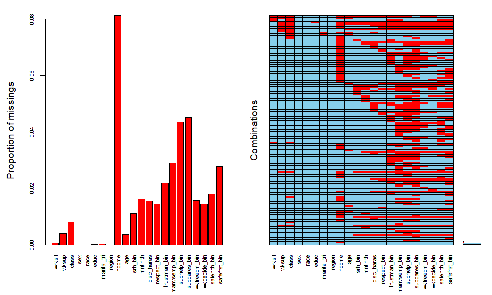
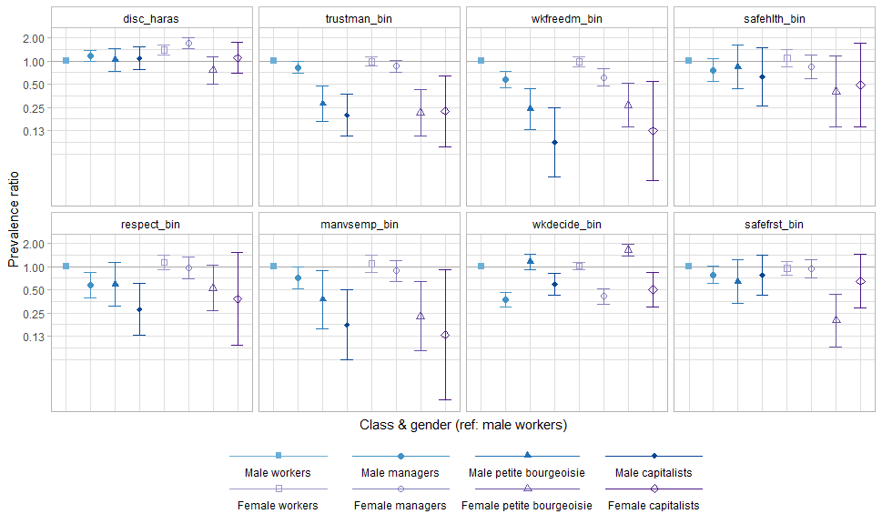
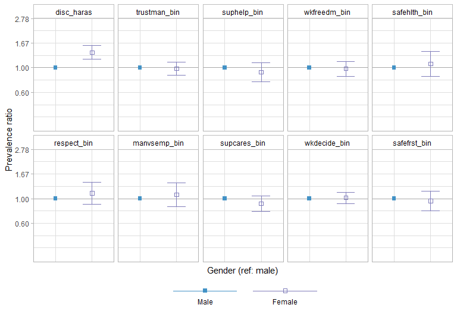
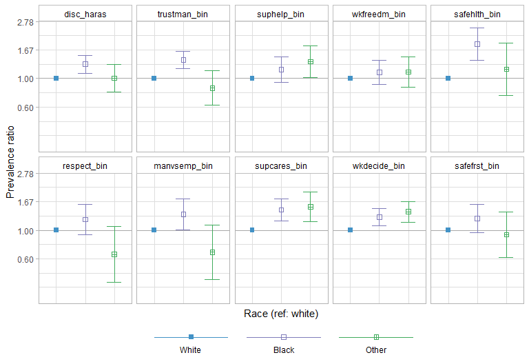
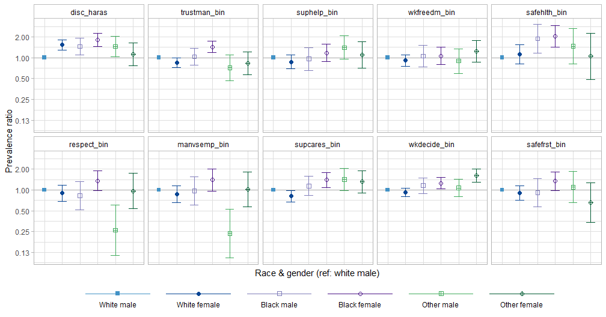
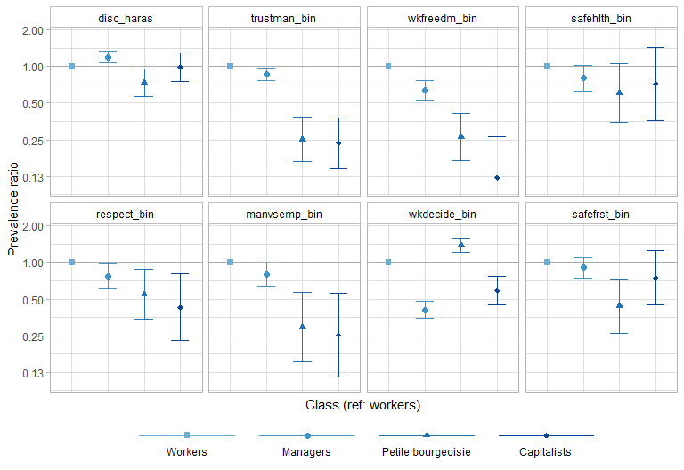
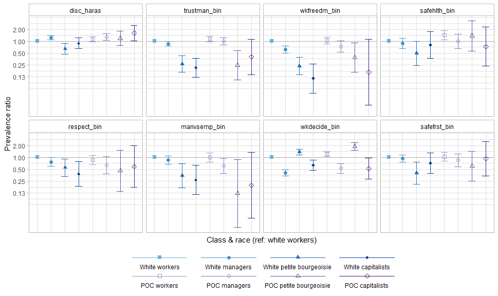
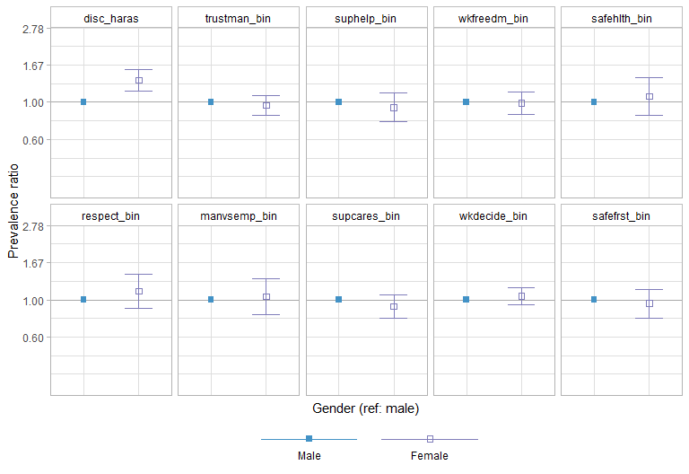
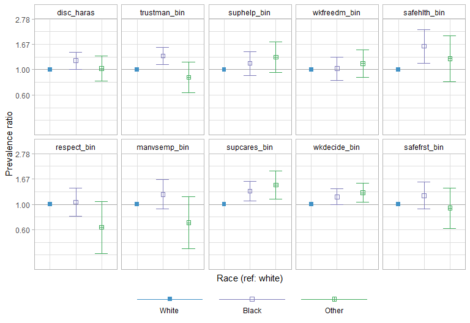
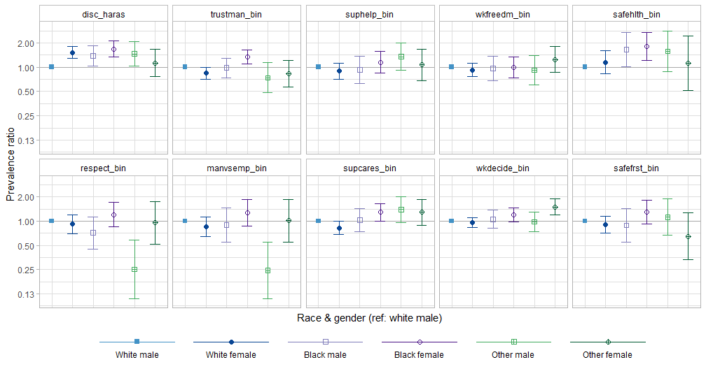

**To do**

* Decide on the final variables we want to analyze

* Do multiple imputation

**General notes**

* I think including ethnicity in the race variable makes the cell sizes too small - for example, there are only 1000 Hispanics total and only 36 Hispanic capitalists of any race.

* Note that "mntlhlth" wasn't asked of ballot A in 2018.

* I made the QWL variables binary for the regression analyses for simplicity and stability.

**Reminder**

* Make sure the column indices for the regression functions are correct, since they can change if the data changes.

**Codebook for non-self-explanatory variables**

* Class variables:
    + explained in IJHS (2020) paper

* Health variables:
    + srh_bin: poor/fair vs good/vgood/excellent self-rated health
    + depress: whether respondent has ever been diagnosed by a healthcare professional with depression
    + mntlhlth: days of poor mental health in past 30 days

* Potentially relevant QWL variables:
    + mustwork: Mandatory to work extra hours
    + chngtme: How often r allowed change schedule
    + famwkoff: How hard to take time off
    + wkvsfam: How often job interferes fam life
    + secondwk: R has job other than main
    + learnnew: Job requires r to learn new things
    + workfast: Job requires r to work fast
    + wrktime: R has enough time to get the job done
    + workdiff: R does numerous things on job
    + toofewwk: How often not enough staff
    + overwork: R has too much work to do well
    + myskills: Job allows r use of skills
    + trainops: R have the training opportunities
    + opdevel: Opportunity to develop my abilities
    + respect: R treated with respect at work
    + trustman: R trust management at work
    + manvsemp: Relations bw management and employees
    + suphelp: Supervisor helpful to r in getting job done
    + supcares: Supervisor concerned about welfare
    + wkfreedm: A lot of freedom to decide how to do job
    + lotofsay: R has lot of say in job
    + wkdecide: How often r take part in decisions
    + satjob1: 	Job satisfaction in general
    + fairearn: How fair is what r earn on the job
    + fringeok: Fringe benefits are good
    + rincblls: Income alone is enough
    + laidoff: R was laid off main job last year
    + jobsecok: The job security is good
    + any_disc_haras: Any discrimination or harassment on job (created by me from several more specific variables focused separately on racism, sexism, etc.)
    + safetywk: Worker safety priority at work
    + safehlth: Safety and health condition good at work
    + safefrst: No shortcuts on worker safety
    

```r
library(readstata13)
library(foreign)
library(tidyr)
library(dplyr)
library(survival)
library(knitr)
library(ggplot2)
library(kableExtra)
library(survey)
library(tableone)
library(RColorBrewer)
library(survey)
library(VIM)
library(mice)
library(parallel)
library(mitools)
library(viridis)
library(survminer)
library(gridExtra)
library(stringr)
library(rms)
library(patchwork) 
library(spatstat)
library(purrr)

#########load data, which is a subsetted version of the GSS cumulative file available at the GSS website that I converted from .dta to .csv using Stata 
#####
#
#drop survey-ballot d, which was a ballot in 2006 that lacked responses to QWL variables
#remove those who were not employed, as only employed respondents were asked the QWL variables - also remove those with NA wrkstat (n=9), since they weren't asked the QWL variables 
#remove ballot b in 2002, as class variables weren't asked of that ballot in that year
#remove 421 respondents who still have IAP in 2006 and 2014 for QWL variables, even after making appropriate sample restrictions - according to GSS helpdesk, they weren't administered the questions/didn't complete the survey ('breakoffs')
read.csv('GSS_02_06_10_14_18.csv') %>% 
  filter(ballot != "ballot d") %>%
  filter(wrkstat=="working fulltime" | wrkstat=="working parttime" | wrkstat=="temp not working") %>%
  filter(!(year==2002 & ballot=="ballot b")) %>%
  mutate_all(funs(ifelse(.=="DK" | .=="NO ANSWER" | .=="DONT KNOW" | .=="Not asked" | .=="IAP,DK,NA,uncodeable", NA, .))) %>%
  filter(is.na(respect) | respect!="IAP") -> dat #removing those with IAP for respect is sufficient since IAPs are the same across other QWL variables

########potential variables of interest (dataset already subsetted, but useful if we need to do again and add some variables)
#####
#

#vars <- c("ballot", "id", "year", "wrkstat", "wrkslf", "wrkgovt", "health1", "health", "mntlhlth", 
#          "occ10", "indus10", "marital", "spwrkslf", "age", "degree", "padeg", "madeg", "spdeg", 
#          "wksup", "wksups", "union", "prestg10", "prestg105plus", "sex", "race", "income", "rincome",
#          "coninc", "conrinc", "region", "hispanic", "sample", "wtssall", "vstrat", "vpsu", #QWL vars start on next line
#          'cowrkint', 'laidoff', 'jobfind1', 'trynewjb', 'wkageism', 'wkracism', 'wksexism', 'wkharsex', 
#          'wkharoth', 'health1', 'rincblls', 'fairearn', 'wkbonus', 'jobsecok', 'suphelp', 'wrktime',
#          'cowrkhlp', 'trainops', 'manvsemp', 'hvylift', 'handmove', 'wkpraise', 'physhlth', 'mntlhlth',
#          'hyperten', 'depress', 'misswork', 'usetech', 'knowschd', 'satjob1', 'hlthdays', 'usedup',
#          'backpain', 'painarms', 'hurtatwk', 'spvtrfair', 'strredpg', 'phyeffrt', 'slpprblm', 'promtefr',
#          'year', 'famvswk', 'hrsrelax', 'secondwk', 'learnnew', 'workfast', 'workdiff', 'lotofsay', 'wktopsat', 
#          'overwork', 'wkvsfam', 'famwkoff', 'whywkhme', 'wrktype', 'yearsjob', 'waypaid', 'wrksched', 
#          'moredays', 'mustwork', 'chngtme', 'wrkhome', 'knowwhat', 'myskills', 'setthngs',
#          'toofewwk', 'promteok', 'opdevel', 'hlpequip', 'haveinfo', 'wkfreedm', 'fringeok', 'supcares',
#          'wkdecide', 'partteam', 'trdunion', 'respect', 'trustman', 'safetywk', 'safefrst', 'teamsafe',
#          'safehlth', 'proudemp', 'prodctiv', 'wksmooth', 'condemnd')

#subset of QWL variables we'll focus on for now
#qwl_vars <- c("mustwork", "chngtme", "famwkoff", "wkvsfam", "secondwk", "learnnew", "workfast",
#              "wrktime", "workdiff", "toofewwk", "overwork", "myskills", "trainops",  "opdevel",
#              "respect", "trustman", "manvsemp", "suphelp", "supcares", "wkfreedm", "lotofsay", "wkdecide",  "satjob1", 
#              "fairearn", "fringeok", "rincblls", "laidoff", "jobsecok", "any_disc_haras", "safetywk", "safehlth", "safefrst")

#########make variables
######
#

dat %>% 
  mutate(educ = factor(ifelse(degree == "bachelor" | degree == "graduate", "College +", 
                              ifelse(degree== "high school", "HS", 
                                     ifelse(degree == "junior college", "JuCo", 
                                            ifelse(degree == "lt high school", "<HS", NA)))),
                       levels=c("<HS", "HS", "JuCo", "College +")), 
         age=ifelse(age=="89 or older", 89, as.numeric(as.character(age))),
         mntlhlth=as.numeric(as.character(mntlhlth)),
         region = factor(ifelse(region == "new england" | region == "middle atlantic", "Northeast",
                                   ifelse(region == "e. sou. central" | region == "south atlantic" | region == "w. sou. central", "South",
                                          ifelse(region == "e. nor. central" | region == "w. nor. central", "Midwest", "West")))),
         marital_tri=ifelse(marital=="married", "married",
                            ifelse(marital=="never married", "never married",
                                   ifelse(marital=="widowed" | marital=="divorced" | marital=="separated", "wid/div/sep", marital))),
         srh_bin=ifelse(health1 == "fair" | health1 == "poor", "poor/fair", "good/vgood/exc"), 
         race_poc=ifelse(race=="white", "white", 
                         ifelse(race=="black" | race=="other", "poc", NA)),
         race=factor(race, levels=c("white", "black", "other")),
         disc_haras=ifelse(wkageism=="yes" | wkracism=="yes" | wksexism=="yes" | wkharsex=="yes" | wkharoth=="yes", 1, 0),
         respect_bin=ifelse(respect=="disagree" | respect=="strongly disagree", 1, 0),
         trustman_bin=ifelse(trustman=="disagree" | trustman=="strongly disagree", 1, 0),
         manvsemp_bin=ifelse(manvsemp=="quite bad" | manvsemp=="very bad", 1, 0),
         suphelp_bin=ifelse(suphelp=="not too true" | suphelp=="not at all true", 1, 0),
         supcares_bin=ifelse(supcares=="not too true" | supcares=="not at all true", 1, 0),
         wkfreedm_bin=ifelse(wkfreedm=="not too true" | wkfreedm=="not at all true", 1, 0),
         wkdecide_bin=ifelse(wkdecide=="rarely" | wkdecide=="never", 1, 0),
         safehlth_bin=ifelse(safehlth=="disagree" | safehlth=="strongly disagree", 1, 0),
         safefrst_bin=ifelse(safefrst=="disagree" | safefrst=="strongly disagree", 1, 0),
         income=as.numeric(as.character(coninc)) * 251.1 / 172.2, #adjust income to 2018 dollars from 2000 dollars
         prestg10_bin=ifelse(prestg10 < weighted.median(prestg10, w=wtssall, na.rm=T), "low prestige", "high prestige"),  #prestige below median
         #we could also create the class variable using numemps (number of employees employed by the self-employed), but it's not available in 2002 
         class=factor(ifelse((wksup == "yes" & wrkslf == "self-employed") | (wksup == "yes" & wrkslf == "someone else" & occ10 == "chief executives"), "Capitalists", 
                              ifelse((wksup == "no" & wrkslf == "self-employed") | (wksup == "no" & wrkslf == "someone else" & occ10 == "chief executives"), "Petit bourgeoisie", 
                                                 ifelse(wksup == "yes" & wrkslf == "someone else" & occ10 != "chief executives", "Managers", 
                                                        ifelse(wksup == "no" & wrkslf ==  "someone else" & occ10 != "chief executives", "Workers", NA)))), 
                                   levels=c("Workers", "Managers", "Petit bourgeoisie", "Capitalists")),
         class_gender=factor(ifelse(class=="Workers" & sex=="male", "Male workers",
                                    ifelse(class=="Workers" & sex=="female", "Female workers",
                                           ifelse(class=="Managers" & sex=="male", "Male managers",
                                                  ifelse(class=="Managers" & sex=="female", "Female managers",
                                                         ifelse(class=="Petit bourgeoisie" & sex=="male", "Male petit bourgeoisie",
                                                                ifelse(class=="Petit bourgeoisie" & sex=="female", "Female petit bourgeoisie",
                                                                       ifelse(class=="Capitalists" & sex=="male", "Male capitalists",
                                                                              ifelse(class=="Capitalists" & sex=="female", "Female capitalists", NA)))))))),
                             levels=c("Male workers", "Male managers", "Male petit bourgeoisie", "Male capitalists",
                                      "Female workers", "Female managers", "Female petit bourgeoisie", "Female capitalists")),
         class_poc=factor(ifelse(class=="Workers" & race_poc=="white", "white workers",
                                    ifelse(class=="Workers" & race_poc=="poc", "poc workers",
                                           ifelse(class=="Managers" & race_poc=="white", "white managers",
                                                  ifelse(class=="Managers" & race_poc=="poc", "poc managers",
                                                         ifelse(class=="Petit bourgeoisie" & race_poc=="white", "white petit bourgeoisie",
                                                                ifelse(class=="Petit bourgeoisie" & race_poc=="poc", "poc petit bourgeoisie",
                                                                       ifelse(class=="Capitalists" & race_poc=="white", "white capitalists",
                                                                              ifelse(class=="Capitalists" & race_poc=="poc", "poc capitalists", NA)))))))),
                             levels=c("white workers", "white managers", "white petit bourgeoisie", "white capitalists",
                                      "poc workers", "poc managers", "poc petit bourgeoisie", "poc capitalists")),
         class_race=factor(ifelse(class=="Workers" & race=="white", "white workers",
                                    ifelse(class=="Workers" & race=="black", "black workers",
                                           ifelse(class=="Workers" & race=="other", "other workers",
                                                  ifelse(class=="Managers" & race=="white", "white managers",
                                                         ifelse(class=="Managers" & race=="black", "black managers",
                                                                ifelse(class=="Managers" & race=="other", "other managers",
                                                         ifelse(class=="Petit bourgeoisie" & race=="white", "white petit bourgeoisie",
                                                                ifelse(class=="Petit bourgeoisie" & race=="black", "black petit bourgeoisie",
                                                                       ifelse(class=="Petit bourgeoisie" & race=="other", "other petit bourgeoisie",
                                                                       ifelse(class=="Capitalists" & race=="white", "white capitalists",
                                                                              ifelse(class=="Capitalists" & race=="black", "black capitalists", 
                                                                                     ifelse(class=="Capitalists" & race=="other", "other capitalists", NA)))))))))))),
                             levels=c("white workers", "white managers", "white petit bourgeoisie", "white capitalists",
                                      "black workers", "black managers", "black petit bourgeoisie", "black capitalists",
                                      "other workers", "other managers", "other petit bourgeoisie", "other capitalists")),
         race_gender=factor(ifelse(race=="white" & sex=="male", "white male",
                                   ifelse(race=="white" & sex=="female", "white female",
                                          ifelse(race=="black" & sex=="male", "black male",
                                                 ifelse(race=="black" & sex=="female", "black female",
                                                        ifelse(race=="other" & sex=="male", "other male",
                                                               ifelse(race=="other" & sex=="female", "other female", NA)))))),
                            levels=c("white male", "white female", "black male", "black female", "other male", "other female"))) -> dat
```

# Confirming that class, race, and gender variables are coded correctly


```r
#class variable 
kable(table(dat$class, dat$wrkslf, dat$wksup, dat$occ10=="chief executives"), caption="Class by self employed by supervisor by chief executive", col.names=c("Class", "Self-employed", "Supervisor", "Chief executive", "Count")) %>%
  kable_styling("striped") %>%
  scroll_box(width = "100%", height = "250px")
```

<div style="border: 1px solid #ddd; padding: 0px; overflow-y: scroll; height:250px; overflow-x: scroll; width:100%; "><table class="table table-striped" style="margin-left: auto; margin-right: auto;">
<caption>Class by self employed by supervisor by chief executive</caption>
 <thead>
  <tr>
   <th style="text-align:left;position: sticky; top:0; background-color: #FFFFFF;"> Class </th>
   <th style="text-align:left;position: sticky; top:0; background-color: #FFFFFF;"> Self-employed </th>
   <th style="text-align:left;position: sticky; top:0; background-color: #FFFFFF;"> Supervisor </th>
   <th style="text-align:left;position: sticky; top:0; background-color: #FFFFFF;"> Chief executive </th>
   <th style="text-align:right;position: sticky; top:0; background-color: #FFFFFF;"> Count </th>
  </tr>
 </thead>
<tbody>
  <tr>
   <td style="text-align:left;"> Workers </td>
   <td style="text-align:left;"> self-employed </td>
   <td style="text-align:left;"> no </td>
   <td style="text-align:left;"> FALSE </td>
   <td style="text-align:right;"> 0 </td>
  </tr>
  <tr>
   <td style="text-align:left;"> Managers </td>
   <td style="text-align:left;"> self-employed </td>
   <td style="text-align:left;"> no </td>
   <td style="text-align:left;"> FALSE </td>
   <td style="text-align:right;"> 0 </td>
  </tr>
  <tr>
   <td style="text-align:left;"> Petit bourgeoisie </td>
   <td style="text-align:left;"> self-employed </td>
   <td style="text-align:left;"> no </td>
   <td style="text-align:left;"> FALSE </td>
   <td style="text-align:right;"> 523 </td>
  </tr>
  <tr>
   <td style="text-align:left;"> Capitalists </td>
   <td style="text-align:left;"> self-employed </td>
   <td style="text-align:left;"> no </td>
   <td style="text-align:left;"> FALSE </td>
   <td style="text-align:right;"> 0 </td>
  </tr>
  <tr>
   <td style="text-align:left;"> Workers </td>
   <td style="text-align:left;"> someone else </td>
   <td style="text-align:left;"> no </td>
   <td style="text-align:left;"> FALSE </td>
   <td style="text-align:right;"> 3737 </td>
  </tr>
  <tr>
   <td style="text-align:left;"> Managers </td>
   <td style="text-align:left;"> someone else </td>
   <td style="text-align:left;"> no </td>
   <td style="text-align:left;"> FALSE </td>
   <td style="text-align:right;"> 0 </td>
  </tr>
  <tr>
   <td style="text-align:left;"> Petit bourgeoisie </td>
   <td style="text-align:left;"> someone else </td>
   <td style="text-align:left;"> no </td>
   <td style="text-align:left;"> FALSE </td>
   <td style="text-align:right;"> 0 </td>
  </tr>
  <tr>
   <td style="text-align:left;"> Capitalists </td>
   <td style="text-align:left;"> someone else </td>
   <td style="text-align:left;"> no </td>
   <td style="text-align:left;"> FALSE </td>
   <td style="text-align:right;"> 0 </td>
  </tr>
  <tr>
   <td style="text-align:left;"> Workers </td>
   <td style="text-align:left;"> self-employed </td>
   <td style="text-align:left;"> yes </td>
   <td style="text-align:left;"> FALSE </td>
   <td style="text-align:right;"> 0 </td>
  </tr>
  <tr>
   <td style="text-align:left;"> Managers </td>
   <td style="text-align:left;"> self-employed </td>
   <td style="text-align:left;"> yes </td>
   <td style="text-align:left;"> FALSE </td>
   <td style="text-align:right;"> 0 </td>
  </tr>
  <tr>
   <td style="text-align:left;"> Petit bourgeoisie </td>
   <td style="text-align:left;"> self-employed </td>
   <td style="text-align:left;"> yes </td>
   <td style="text-align:left;"> FALSE </td>
   <td style="text-align:right;"> 0 </td>
  </tr>
  <tr>
   <td style="text-align:left;"> Capitalists </td>
   <td style="text-align:left;"> self-employed </td>
   <td style="text-align:left;"> yes </td>
   <td style="text-align:left;"> FALSE </td>
   <td style="text-align:right;"> 358 </td>
  </tr>
  <tr>
   <td style="text-align:left;"> Workers </td>
   <td style="text-align:left;"> someone else </td>
   <td style="text-align:left;"> yes </td>
   <td style="text-align:left;"> FALSE </td>
   <td style="text-align:right;"> 0 </td>
  </tr>
  <tr>
   <td style="text-align:left;"> Managers </td>
   <td style="text-align:left;"> someone else </td>
   <td style="text-align:left;"> yes </td>
   <td style="text-align:left;"> FALSE </td>
   <td style="text-align:right;"> 2084 </td>
  </tr>
  <tr>
   <td style="text-align:left;"> Petit bourgeoisie </td>
   <td style="text-align:left;"> someone else </td>
   <td style="text-align:left;"> yes </td>
   <td style="text-align:left;"> FALSE </td>
   <td style="text-align:right;"> 0 </td>
  </tr>
  <tr>
   <td style="text-align:left;"> Capitalists </td>
   <td style="text-align:left;"> someone else </td>
   <td style="text-align:left;"> yes </td>
   <td style="text-align:left;"> FALSE </td>
   <td style="text-align:right;"> 0 </td>
  </tr>
  <tr>
   <td style="text-align:left;"> Workers </td>
   <td style="text-align:left;"> self-employed </td>
   <td style="text-align:left;"> no </td>
   <td style="text-align:left;"> TRUE </td>
   <td style="text-align:right;"> 0 </td>
  </tr>
  <tr>
   <td style="text-align:left;"> Managers </td>
   <td style="text-align:left;"> self-employed </td>
   <td style="text-align:left;"> no </td>
   <td style="text-align:left;"> TRUE </td>
   <td style="text-align:right;"> 0 </td>
  </tr>
  <tr>
   <td style="text-align:left;"> Petit bourgeoisie </td>
   <td style="text-align:left;"> self-employed </td>
   <td style="text-align:left;"> no </td>
   <td style="text-align:left;"> TRUE </td>
   <td style="text-align:right;"> 3 </td>
  </tr>
  <tr>
   <td style="text-align:left;"> Capitalists </td>
   <td style="text-align:left;"> self-employed </td>
   <td style="text-align:left;"> no </td>
   <td style="text-align:left;"> TRUE </td>
   <td style="text-align:right;"> 0 </td>
  </tr>
  <tr>
   <td style="text-align:left;"> Workers </td>
   <td style="text-align:left;"> someone else </td>
   <td style="text-align:left;"> no </td>
   <td style="text-align:left;"> TRUE </td>
   <td style="text-align:right;"> 0 </td>
  </tr>
  <tr>
   <td style="text-align:left;"> Managers </td>
   <td style="text-align:left;"> someone else </td>
   <td style="text-align:left;"> no </td>
   <td style="text-align:left;"> TRUE </td>
   <td style="text-align:right;"> 0 </td>
  </tr>
  <tr>
   <td style="text-align:left;"> Petit bourgeoisie </td>
   <td style="text-align:left;"> someone else </td>
   <td style="text-align:left;"> no </td>
   <td style="text-align:left;"> TRUE </td>
   <td style="text-align:right;"> 3 </td>
  </tr>
  <tr>
   <td style="text-align:left;"> Capitalists </td>
   <td style="text-align:left;"> someone else </td>
   <td style="text-align:left;"> no </td>
   <td style="text-align:left;"> TRUE </td>
   <td style="text-align:right;"> 0 </td>
  </tr>
  <tr>
   <td style="text-align:left;"> Workers </td>
   <td style="text-align:left;"> self-employed </td>
   <td style="text-align:left;"> yes </td>
   <td style="text-align:left;"> TRUE </td>
   <td style="text-align:right;"> 0 </td>
  </tr>
  <tr>
   <td style="text-align:left;"> Managers </td>
   <td style="text-align:left;"> self-employed </td>
   <td style="text-align:left;"> yes </td>
   <td style="text-align:left;"> TRUE </td>
   <td style="text-align:right;"> 0 </td>
  </tr>
  <tr>
   <td style="text-align:left;"> Petit bourgeoisie </td>
   <td style="text-align:left;"> self-employed </td>
   <td style="text-align:left;"> yes </td>
   <td style="text-align:left;"> TRUE </td>
   <td style="text-align:right;"> 0 </td>
  </tr>
  <tr>
   <td style="text-align:left;"> Capitalists </td>
   <td style="text-align:left;"> self-employed </td>
   <td style="text-align:left;"> yes </td>
   <td style="text-align:left;"> TRUE </td>
   <td style="text-align:right;"> 11 </td>
  </tr>
  <tr>
   <td style="text-align:left;"> Workers </td>
   <td style="text-align:left;"> someone else </td>
   <td style="text-align:left;"> yes </td>
   <td style="text-align:left;"> TRUE </td>
   <td style="text-align:right;"> 0 </td>
  </tr>
  <tr>
   <td style="text-align:left;"> Managers </td>
   <td style="text-align:left;"> someone else </td>
   <td style="text-align:left;"> yes </td>
   <td style="text-align:left;"> TRUE </td>
   <td style="text-align:right;"> 0 </td>
  </tr>
  <tr>
   <td style="text-align:left;"> Petit bourgeoisie </td>
   <td style="text-align:left;"> someone else </td>
   <td style="text-align:left;"> yes </td>
   <td style="text-align:left;"> TRUE </td>
   <td style="text-align:right;"> 0 </td>
  </tr>
  <tr>
   <td style="text-align:left;"> Capitalists </td>
   <td style="text-align:left;"> someone else </td>
   <td style="text-align:left;"> yes </td>
   <td style="text-align:left;"> TRUE </td>
   <td style="text-align:right;"> 27 </td>
  </tr>
</tbody>
</table></div>

```r
#class-gender variable 
kable(table(dat$class_gender, dat$sex), caption="Class-gender by gender", col.names=c("Class-gender", "Gender")) %>%
  kable_styling("striped") %>%
  scroll_box(width = "100%", height = "250px")
```

<div style="border: 1px solid #ddd; padding: 0px; overflow-y: scroll; height:250px; overflow-x: scroll; width:100%; "><table class="table table-striped" style="margin-left: auto; margin-right: auto;">
<caption>Class-gender by gender</caption>
 <thead>
  <tr>
   <th style="text-align:left;position: sticky; top:0; background-color: #FFFFFF;">   </th>
   <th style="text-align:right;position: sticky; top:0; background-color: #FFFFFF;"> Class-gender </th>
   <th style="text-align:right;position: sticky; top:0; background-color: #FFFFFF;"> Gender </th>
  </tr>
 </thead>
<tbody>
  <tr>
   <td style="text-align:left;"> Male workers </td>
   <td style="text-align:right;"> 0 </td>
   <td style="text-align:right;"> 1630 </td>
  </tr>
  <tr>
   <td style="text-align:left;"> Male managers </td>
   <td style="text-align:right;"> 0 </td>
   <td style="text-align:right;"> 1060 </td>
  </tr>
  <tr>
   <td style="text-align:left;"> Male petit bourgeoisie </td>
   <td style="text-align:right;"> 0 </td>
   <td style="text-align:right;"> 272 </td>
  </tr>
  <tr>
   <td style="text-align:left;"> Male capitalists </td>
   <td style="text-align:right;"> 0 </td>
   <td style="text-align:right;"> 293 </td>
  </tr>
  <tr>
   <td style="text-align:left;"> Female workers </td>
   <td style="text-align:right;"> 2107 </td>
   <td style="text-align:right;"> 0 </td>
  </tr>
  <tr>
   <td style="text-align:left;"> Female managers </td>
   <td style="text-align:right;"> 1024 </td>
   <td style="text-align:right;"> 0 </td>
  </tr>
  <tr>
   <td style="text-align:left;"> Female petit bourgeoisie </td>
   <td style="text-align:right;"> 261 </td>
   <td style="text-align:right;"> 0 </td>
  </tr>
  <tr>
   <td style="text-align:left;"> Female capitalists </td>
   <td style="text-align:right;"> 104 </td>
   <td style="text-align:right;"> 0 </td>
  </tr>
</tbody>
</table></div>

```r
#class-POC variable
kable(table(dat$class_poc, dat$race_poc), caption="Class-POC by POC") %>%
  kable_styling("striped") %>%
  scroll_box(width = "100%", height = "250px")
```

<div style="border: 1px solid #ddd; padding: 0px; overflow-y: scroll; height:250px; overflow-x: scroll; width:100%; "><table class="table table-striped" style="margin-left: auto; margin-right: auto;">
<caption>Class-POC by POC</caption>
 <thead>
  <tr>
   <th style="text-align:left;position: sticky; top:0; background-color: #FFFFFF;">   </th>
   <th style="text-align:right;position: sticky; top:0; background-color: #FFFFFF;"> poc </th>
   <th style="text-align:right;position: sticky; top:0; background-color: #FFFFFF;"> white </th>
  </tr>
 </thead>
<tbody>
  <tr>
   <td style="text-align:left;"> white workers </td>
   <td style="text-align:right;"> 0 </td>
   <td style="text-align:right;"> 2709 </td>
  </tr>
  <tr>
   <td style="text-align:left;"> white managers </td>
   <td style="text-align:right;"> 0 </td>
   <td style="text-align:right;"> 1580 </td>
  </tr>
  <tr>
   <td style="text-align:left;"> white petit bourgeoisie </td>
   <td style="text-align:right;"> 0 </td>
   <td style="text-align:right;"> 434 </td>
  </tr>
  <tr>
   <td style="text-align:left;"> white capitalists </td>
   <td style="text-align:right;"> 0 </td>
   <td style="text-align:right;"> 335 </td>
  </tr>
  <tr>
   <td style="text-align:left;"> poc workers </td>
   <td style="text-align:right;"> 1028 </td>
   <td style="text-align:right;"> 0 </td>
  </tr>
  <tr>
   <td style="text-align:left;"> poc managers </td>
   <td style="text-align:right;"> 504 </td>
   <td style="text-align:right;"> 0 </td>
  </tr>
  <tr>
   <td style="text-align:left;"> poc petit bourgeoisie </td>
   <td style="text-align:right;"> 99 </td>
   <td style="text-align:right;"> 0 </td>
  </tr>
  <tr>
   <td style="text-align:left;"> poc capitalists </td>
   <td style="text-align:right;"> 62 </td>
   <td style="text-align:right;"> 0 </td>
  </tr>
</tbody>
</table></div>

```r
#class-race variable
kable(table(dat$class_race, dat$race), caption="Class-race by race") %>%
  kable_styling("striped") %>%
  scroll_box(width = "100%", height = "250px")
```

<div style="border: 1px solid #ddd; padding: 0px; overflow-y: scroll; height:250px; overflow-x: scroll; width:100%; "><table class="table table-striped" style="margin-left: auto; margin-right: auto;">
<caption>Class-race by race</caption>
 <thead>
  <tr>
   <th style="text-align:left;position: sticky; top:0; background-color: #FFFFFF;">   </th>
   <th style="text-align:right;position: sticky; top:0; background-color: #FFFFFF;"> white </th>
   <th style="text-align:right;position: sticky; top:0; background-color: #FFFFFF;"> black </th>
   <th style="text-align:right;position: sticky; top:0; background-color: #FFFFFF;"> other </th>
  </tr>
 </thead>
<tbody>
  <tr>
   <td style="text-align:left;"> white workers </td>
   <td style="text-align:right;"> 2709 </td>
   <td style="text-align:right;"> 0 </td>
   <td style="text-align:right;"> 0 </td>
  </tr>
  <tr>
   <td style="text-align:left;"> white managers </td>
   <td style="text-align:right;"> 1580 </td>
   <td style="text-align:right;"> 0 </td>
   <td style="text-align:right;"> 0 </td>
  </tr>
  <tr>
   <td style="text-align:left;"> white petit bourgeoisie </td>
   <td style="text-align:right;"> 434 </td>
   <td style="text-align:right;"> 0 </td>
   <td style="text-align:right;"> 0 </td>
  </tr>
  <tr>
   <td style="text-align:left;"> white capitalists </td>
   <td style="text-align:right;"> 335 </td>
   <td style="text-align:right;"> 0 </td>
   <td style="text-align:right;"> 0 </td>
  </tr>
  <tr>
   <td style="text-align:left;"> black workers </td>
   <td style="text-align:right;"> 0 </td>
   <td style="text-align:right;"> 660 </td>
   <td style="text-align:right;"> 0 </td>
  </tr>
  <tr>
   <td style="text-align:left;"> black managers </td>
   <td style="text-align:right;"> 0 </td>
   <td style="text-align:right;"> 292 </td>
   <td style="text-align:right;"> 0 </td>
  </tr>
  <tr>
   <td style="text-align:left;"> black petit bourgeoisie </td>
   <td style="text-align:right;"> 0 </td>
   <td style="text-align:right;"> 45 </td>
   <td style="text-align:right;"> 0 </td>
  </tr>
  <tr>
   <td style="text-align:left;"> black capitalists </td>
   <td style="text-align:right;"> 0 </td>
   <td style="text-align:right;"> 26 </td>
   <td style="text-align:right;"> 0 </td>
  </tr>
  <tr>
   <td style="text-align:left;"> other workers </td>
   <td style="text-align:right;"> 0 </td>
   <td style="text-align:right;"> 0 </td>
   <td style="text-align:right;"> 368 </td>
  </tr>
  <tr>
   <td style="text-align:left;"> other managers </td>
   <td style="text-align:right;"> 0 </td>
   <td style="text-align:right;"> 0 </td>
   <td style="text-align:right;"> 212 </td>
  </tr>
  <tr>
   <td style="text-align:left;"> other petit bourgeoisie </td>
   <td style="text-align:right;"> 0 </td>
   <td style="text-align:right;"> 0 </td>
   <td style="text-align:right;"> 54 </td>
  </tr>
  <tr>
   <td style="text-align:left;"> other capitalists </td>
   <td style="text-align:right;"> 0 </td>
   <td style="text-align:right;"> 0 </td>
   <td style="text-align:right;"> 36 </td>
  </tr>
</tbody>
</table></div>

```r
#race-gender variable
kable(table(dat$race_gender, dat$race, dat$sex), caption="Race-gender by race and gender", col.names=c("Race-gender", "Race", "Gender", "Count")) %>%
  kable_styling("striped") %>%
  scroll_box(width = "100%", height = "250px")
```

<div style="border: 1px solid #ddd; padding: 0px; overflow-y: scroll; height:250px; overflow-x: scroll; width:100%; "><table class="table table-striped" style="margin-left: auto; margin-right: auto;">
<caption>Race-gender by race and gender</caption>
 <thead>
  <tr>
   <th style="text-align:left;position: sticky; top:0; background-color: #FFFFFF;"> Race-gender </th>
   <th style="text-align:left;position: sticky; top:0; background-color: #FFFFFF;"> Race </th>
   <th style="text-align:left;position: sticky; top:0; background-color: #FFFFFF;"> Gender </th>
   <th style="text-align:right;position: sticky; top:0; background-color: #FFFFFF;"> Count </th>
  </tr>
 </thead>
<tbody>
  <tr>
   <td style="text-align:left;"> white male </td>
   <td style="text-align:left;"> white </td>
   <td style="text-align:left;"> female </td>
   <td style="text-align:right;"> 0 </td>
  </tr>
  <tr>
   <td style="text-align:left;"> white female </td>
   <td style="text-align:left;"> white </td>
   <td style="text-align:left;"> female </td>
   <td style="text-align:right;"> 2569 </td>
  </tr>
  <tr>
   <td style="text-align:left;"> black male </td>
   <td style="text-align:left;"> white </td>
   <td style="text-align:left;"> female </td>
   <td style="text-align:right;"> 0 </td>
  </tr>
  <tr>
   <td style="text-align:left;"> black female </td>
   <td style="text-align:left;"> white </td>
   <td style="text-align:left;"> female </td>
   <td style="text-align:right;"> 0 </td>
  </tr>
  <tr>
   <td style="text-align:left;"> other male </td>
   <td style="text-align:left;"> white </td>
   <td style="text-align:left;"> female </td>
   <td style="text-align:right;"> 0 </td>
  </tr>
  <tr>
   <td style="text-align:left;"> other female </td>
   <td style="text-align:left;"> white </td>
   <td style="text-align:left;"> female </td>
   <td style="text-align:right;"> 0 </td>
  </tr>
  <tr>
   <td style="text-align:left;"> white male </td>
   <td style="text-align:left;"> black </td>
   <td style="text-align:left;"> female </td>
   <td style="text-align:right;"> 0 </td>
  </tr>
  <tr>
   <td style="text-align:left;"> white female </td>
   <td style="text-align:left;"> black </td>
   <td style="text-align:left;"> female </td>
   <td style="text-align:right;"> 0 </td>
  </tr>
  <tr>
   <td style="text-align:left;"> black male </td>
   <td style="text-align:left;"> black </td>
   <td style="text-align:left;"> female </td>
   <td style="text-align:right;"> 0 </td>
  </tr>
  <tr>
   <td style="text-align:left;"> black female </td>
   <td style="text-align:left;"> black </td>
   <td style="text-align:left;"> female </td>
   <td style="text-align:right;"> 642 </td>
  </tr>
  <tr>
   <td style="text-align:left;"> other male </td>
   <td style="text-align:left;"> black </td>
   <td style="text-align:left;"> female </td>
   <td style="text-align:right;"> 0 </td>
  </tr>
  <tr>
   <td style="text-align:left;"> other female </td>
   <td style="text-align:left;"> black </td>
   <td style="text-align:left;"> female </td>
   <td style="text-align:right;"> 0 </td>
  </tr>
  <tr>
   <td style="text-align:left;"> white male </td>
   <td style="text-align:left;"> other </td>
   <td style="text-align:left;"> female </td>
   <td style="text-align:right;"> 0 </td>
  </tr>
  <tr>
   <td style="text-align:left;"> white female </td>
   <td style="text-align:left;"> other </td>
   <td style="text-align:left;"> female </td>
   <td style="text-align:right;"> 0 </td>
  </tr>
  <tr>
   <td style="text-align:left;"> black male </td>
   <td style="text-align:left;"> other </td>
   <td style="text-align:left;"> female </td>
   <td style="text-align:right;"> 0 </td>
  </tr>
  <tr>
   <td style="text-align:left;"> black female </td>
   <td style="text-align:left;"> other </td>
   <td style="text-align:left;"> female </td>
   <td style="text-align:right;"> 0 </td>
  </tr>
  <tr>
   <td style="text-align:left;"> other male </td>
   <td style="text-align:left;"> other </td>
   <td style="text-align:left;"> female </td>
   <td style="text-align:right;"> 0 </td>
  </tr>
  <tr>
   <td style="text-align:left;"> other female </td>
   <td style="text-align:left;"> other </td>
   <td style="text-align:left;"> female </td>
   <td style="text-align:right;"> 314 </td>
  </tr>
  <tr>
   <td style="text-align:left;"> white male </td>
   <td style="text-align:left;"> white </td>
   <td style="text-align:left;"> male </td>
   <td style="text-align:right;"> 2531 </td>
  </tr>
  <tr>
   <td style="text-align:left;"> white female </td>
   <td style="text-align:left;"> white </td>
   <td style="text-align:left;"> male </td>
   <td style="text-align:right;"> 0 </td>
  </tr>
  <tr>
   <td style="text-align:left;"> black male </td>
   <td style="text-align:left;"> white </td>
   <td style="text-align:left;"> male </td>
   <td style="text-align:right;"> 0 </td>
  </tr>
  <tr>
   <td style="text-align:left;"> black female </td>
   <td style="text-align:left;"> white </td>
   <td style="text-align:left;"> male </td>
   <td style="text-align:right;"> 0 </td>
  </tr>
  <tr>
   <td style="text-align:left;"> other male </td>
   <td style="text-align:left;"> white </td>
   <td style="text-align:left;"> male </td>
   <td style="text-align:right;"> 0 </td>
  </tr>
  <tr>
   <td style="text-align:left;"> other female </td>
   <td style="text-align:left;"> white </td>
   <td style="text-align:left;"> male </td>
   <td style="text-align:right;"> 0 </td>
  </tr>
  <tr>
   <td style="text-align:left;"> white male </td>
   <td style="text-align:left;"> black </td>
   <td style="text-align:left;"> male </td>
   <td style="text-align:right;"> 0 </td>
  </tr>
  <tr>
   <td style="text-align:left;"> white female </td>
   <td style="text-align:left;"> black </td>
   <td style="text-align:left;"> male </td>
   <td style="text-align:right;"> 0 </td>
  </tr>
  <tr>
   <td style="text-align:left;"> black male </td>
   <td style="text-align:left;"> black </td>
   <td style="text-align:left;"> male </td>
   <td style="text-align:right;"> 391 </td>
  </tr>
  <tr>
   <td style="text-align:left;"> black female </td>
   <td style="text-align:left;"> black </td>
   <td style="text-align:left;"> male </td>
   <td style="text-align:right;"> 0 </td>
  </tr>
  <tr>
   <td style="text-align:left;"> other male </td>
   <td style="text-align:left;"> black </td>
   <td style="text-align:left;"> male </td>
   <td style="text-align:right;"> 0 </td>
  </tr>
  <tr>
   <td style="text-align:left;"> other female </td>
   <td style="text-align:left;"> black </td>
   <td style="text-align:left;"> male </td>
   <td style="text-align:right;"> 0 </td>
  </tr>
  <tr>
   <td style="text-align:left;"> white male </td>
   <td style="text-align:left;"> other </td>
   <td style="text-align:left;"> male </td>
   <td style="text-align:right;"> 0 </td>
  </tr>
  <tr>
   <td style="text-align:left;"> white female </td>
   <td style="text-align:left;"> other </td>
   <td style="text-align:left;"> male </td>
   <td style="text-align:right;"> 0 </td>
  </tr>
  <tr>
   <td style="text-align:left;"> black male </td>
   <td style="text-align:left;"> other </td>
   <td style="text-align:left;"> male </td>
   <td style="text-align:right;"> 0 </td>
  </tr>
  <tr>
   <td style="text-align:left;"> black female </td>
   <td style="text-align:left;"> other </td>
   <td style="text-align:left;"> male </td>
   <td style="text-align:right;"> 0 </td>
  </tr>
  <tr>
   <td style="text-align:left;"> other male </td>
   <td style="text-align:left;"> other </td>
   <td style="text-align:left;"> male </td>
   <td style="text-align:right;"> 359 </td>
  </tr>
  <tr>
   <td style="text-align:left;"> other female </td>
   <td style="text-align:left;"> other </td>
   <td style="text-align:left;"> male </td>
   <td style="text-align:right;"> 0 </td>
  </tr>
</tbody>
</table></div>

# Handling missing data

## Missingness patterns


```r
aggr(dat[,c("wrkslf", "wksup", "class", 'sex', 'race', 'educ', 'marital_tri', 'region', 'income', 'age', "srh_bin", "mntlhlth", "disc_haras", "respect_bin", "trustman_bin", "manvsemp_bin", "suphelp_bin", "supcares_bin", "wkfreedm_bin", "wkdecide_bin", "safehlth_bin", "safefrst_bin")], cex.axis = 0.7, numbers=FALSE, prop=TRUE)
```

<!-- -->

## Multiple imputation

**TBD**


```r
#make imputation dataset
data_mice <- dat[,c("capital_chief_exec", "capital_det_skill_chief_exec", "wksup", "wksups", "wrkslf", 'wrkstat', 'prestg10', 'income', 'region', 'race', "non_white", 'age', 'sex', 'educ', 'year', 'decade', 'vpsu', 'vstrat', 'wtssall', 'srh_bin', "age90", "death", "yeardeath", "duration", "capital_chief_exec_non_white")]

##do imputation
initialize <- mice(data_mice, max=0, print=FALSE) # this creates an empty imputation object that you can manipulate and set options

method <- initialize$method #this creates an object that will contain the imputation method for each variable. let mice choose defaults based on variable class

method[c( "region", "race", "sex", "year", 'decade', "vpsu", 'vstrat', 'wtssall',  'srh_bin', "age90", "death", "yeardeath", "duration")] <- "" # this code tells mice not to impute these variables. not imputing variables with complete data or any of the outcome variables

method["capital_chief_exec_non_white"] <- "~I(as.numeric(capital_chief_exec)*as.numeric(non_white))" #passive imputation of variable that's a combo of other variables

prediction <- initialize$predictorMatrix  #this creates an object that will indicate which variables we actually want to include in predicting missing variables. 

prediction[,c("capital_det_skill_chief_exec", "capital_chief_exec_non_white", 'non_white', 'decade', 'srh_bin',  "age90", "death", "yeardeath", "duration", 'vstrat', 'vpsu')] <- 0 # don't use collinear variables, SRH, or death as predictors (don't use latter two variables because the class variables, SRH, and death are available in different years and on different ballots - to use them, I think we'd have to make three separate sets of imputed datasets, one for the descriptive analyses, one for the SRH analyses, and one for the mortality analyses). Also don't use vstrat, since it has too many levels (models won't fit) and vpsu because it's IAP until 1976 (plus the trace plots for imputations that included VPSU don't look as good as the trace plots for imputations that excluded VPSU)

cores_2_use <- 4 #4 cores times 5 imputations per core = 20 imputations
cl <- makeCluster(cores_2_use)
clusterSetRNGStream(cl, 9956)
clusterExport(cl, list("data_mice", "method", "prediction"), envir=environment())
clusterEvalQ(cl, library(mice))
imp_pars <- 
  parLapply(cl = cl, X = 1:cores_2_use, fun = function(no){
    mice(data_mice, m=5, meth=method, pred=prediction, print=FALSE, maxit = 20) #no seed because we don't want imputations to be identical across reps
  })
stopCluster(cl)

#combine the smaller imputation objects from each core into one imputation object
imp_merged <- imp_pars[[1]]
for (n in 2:length(imp_pars)){
  imp_merged <- 
    ibind(imp_merged,
          imp_pars[[n]])
}

#put data into useable format for survey package
imp.list <- lapply(1:20, function(x) mice::complete(imp_merged, x))
dat_mi <- imputationList(imp.list)
```

# Survey set the data


```r
#center data for the single-PSU stratum at the sample grand mean rather than the stratum mean (conservative)
options(survey.lonely.psu="adjust")

#survey set imputed data
#svy <- svydesign(ids = ~ vpsu,
#                 strata = ~ vstrat, 
#                 weights = ~ wtssall,
#                 nest=TRUE, 
#                 data=dat_mi)

#survey-set unimputed data for descriptives
svy_dat <- svydesign(ids = ~ vpsu,
                     strata = ~ vstrat,
                     weights = ~ wtssall, 
                     nest=TRUE, 
                     data=dat)
```

# Survey-weighted, unimputed descriptives

## Demographics and health stratifed by class 


```r
#vars of interest
vars <- c('sex', 'race', 'educ', 'marital_tri', 'region', 'income', 'age', "srh_bin", "mntlhlth")
nonorm <- c('income', 'age')

x <- svyCreateTableOne(data = svy_dat, vars = vars, strata='class')
x <- print(x, printToggle=FALSE, noSpaces=TRUE, nonnormal=nonorm)
kable(x[,1:4]) %>%
  kable_styling(c("striped", "condensed"))
```

<table class="table table-striped table-condensed" style="margin-left: auto; margin-right: auto;">
 <thead>
  <tr>
   <th style="text-align:left;">   </th>
   <th style="text-align:left;"> Workers </th>
   <th style="text-align:left;"> Managers </th>
   <th style="text-align:left;"> Petit bourgeoisie </th>
   <th style="text-align:left;"> Capitalists </th>
  </tr>
 </thead>
<tbody>
  <tr>
   <td style="text-align:left;"> n </td>
   <td style="text-align:left;"> 3821.8 </td>
   <td style="text-align:left;"> 2128.6 </td>
   <td style="text-align:left;"> 544.2 </td>
   <td style="text-align:left;"> 423.8 </td>
  </tr>
  <tr>
   <td style="text-align:left;"> sex = male (%) </td>
   <td style="text-align:left;"> 1703.1 (44.6) </td>
   <td style="text-align:left;"> 1097.2 (51.5) </td>
   <td style="text-align:left;"> 278.4 (51.2) </td>
   <td style="text-align:left;"> 324.9 (76.7) </td>
  </tr>
  <tr>
   <td style="text-align:left;"> race (%) </td>
   <td style="text-align:left;">  </td>
   <td style="text-align:left;">  </td>
   <td style="text-align:left;">  </td>
   <td style="text-align:left;">  </td>
  </tr>
  <tr>
   <td style="text-align:left;"> white </td>
   <td style="text-align:left;"> 2780.2 (72.7) </td>
   <td style="text-align:left;"> 1636.3 (76.9) </td>
   <td style="text-align:left;"> 431.3 (79.2) </td>
   <td style="text-align:left;"> 352.6 (83.2) </td>
  </tr>
  <tr>
   <td style="text-align:left;"> black </td>
   <td style="text-align:left;"> 618.7 (16.2) </td>
   <td style="text-align:left;"> 266.4 (12.5) </td>
   <td style="text-align:left;"> 40.8 (7.5) </td>
   <td style="text-align:left;"> 25.6 (6.0) </td>
  </tr>
  <tr>
   <td style="text-align:left;"> other </td>
   <td style="text-align:left;"> 422.9 (11.1) </td>
   <td style="text-align:left;"> 225.8 (10.6) </td>
   <td style="text-align:left;"> 72.1 (13.3) </td>
   <td style="text-align:left;"> 45.6 (10.8) </td>
  </tr>
  <tr>
   <td style="text-align:left;"> educ (%) </td>
   <td style="text-align:left;">  </td>
   <td style="text-align:left;">  </td>
   <td style="text-align:left;">  </td>
   <td style="text-align:left;">  </td>
  </tr>
  <tr>
   <td style="text-align:left;"> &lt;HS </td>
   <td style="text-align:left;"> 359.4 (9.4) </td>
   <td style="text-align:left;"> 158.1 (7.4) </td>
   <td style="text-align:left;"> 65.0 (11.9) </td>
   <td style="text-align:left;"> 33.4 (7.9) </td>
  </tr>
  <tr>
   <td style="text-align:left;"> HS </td>
   <td style="text-align:left;"> 2111.2 (55.2) </td>
   <td style="text-align:left;"> 927.3 (43.6) </td>
   <td style="text-align:left;"> 259.7 (47.7) </td>
   <td style="text-align:left;"> 170.7 (40.3) </td>
  </tr>
  <tr>
   <td style="text-align:left;"> JuCo </td>
   <td style="text-align:left;"> 345.7 (9.0) </td>
   <td style="text-align:left;"> 227.7 (10.7) </td>
   <td style="text-align:left;"> 50.0 (9.2) </td>
   <td style="text-align:left;"> 31.1 (7.3) </td>
  </tr>
  <tr>
   <td style="text-align:left;"> College + </td>
   <td style="text-align:left;"> 1005.5 (26.3) </td>
   <td style="text-align:left;"> 815.5 (38.3) </td>
   <td style="text-align:left;"> 169.5 (31.1) </td>
   <td style="text-align:left;"> 188.7 (44.5) </td>
  </tr>
  <tr>
   <td style="text-align:left;"> marital_tri (%) </td>
   <td style="text-align:left;">  </td>
   <td style="text-align:left;">  </td>
   <td style="text-align:left;">  </td>
   <td style="text-align:left;">  </td>
  </tr>
  <tr>
   <td style="text-align:left;"> married </td>
   <td style="text-align:left;"> 1950.2 (51.0) </td>
   <td style="text-align:left;"> 1190.8 (55.9) </td>
   <td style="text-align:left;"> 327.5 (60.2) </td>
   <td style="text-align:left;"> 301.5 (71.1) </td>
  </tr>
  <tr>
   <td style="text-align:left;"> never married </td>
   <td style="text-align:left;"> 1192.5 (31.2) </td>
   <td style="text-align:left;"> 565.9 (26.6) </td>
   <td style="text-align:left;"> 106.1 (19.5) </td>
   <td style="text-align:left;"> 41.6 (9.8) </td>
  </tr>
  <tr>
   <td style="text-align:left;"> wid/div/sep </td>
   <td style="text-align:left;"> 679.1 (17.8) </td>
   <td style="text-align:left;"> 371.8 (17.5) </td>
   <td style="text-align:left;"> 110.6 (20.3) </td>
   <td style="text-align:left;"> 80.7 (19.0) </td>
  </tr>
  <tr>
   <td style="text-align:left;"> region (%) </td>
   <td style="text-align:left;">  </td>
   <td style="text-align:left;">  </td>
   <td style="text-align:left;">  </td>
   <td style="text-align:left;">  </td>
  </tr>
  <tr>
   <td style="text-align:left;"> Midwest </td>
   <td style="text-align:left;"> 932.2 (24.4) </td>
   <td style="text-align:left;"> 475.6 (22.3) </td>
   <td style="text-align:left;"> 99.9 (18.4) </td>
   <td style="text-align:left;"> 87.7 (20.7) </td>
  </tr>
  <tr>
   <td style="text-align:left;"> Northeast </td>
   <td style="text-align:left;"> 630.1 (16.5) </td>
   <td style="text-align:left;"> 395.9 (18.6) </td>
   <td style="text-align:left;"> 87.4 (16.1) </td>
   <td style="text-align:left;"> 57.2 (13.5) </td>
  </tr>
  <tr>
   <td style="text-align:left;"> South </td>
   <td style="text-align:left;"> 1485.9 (38.9) </td>
   <td style="text-align:left;"> 745.6 (35.0) </td>
   <td style="text-align:left;"> 197.7 (36.3) </td>
   <td style="text-align:left;"> 150.2 (35.4) </td>
  </tr>
  <tr>
   <td style="text-align:left;"> West </td>
   <td style="text-align:left;"> 773.6 (20.2) </td>
   <td style="text-align:left;"> 511.5 (24.0) </td>
   <td style="text-align:left;"> 159.1 (29.2) </td>
   <td style="text-align:left;"> 128.6 (30.3) </td>
  </tr>
  <tr>
   <td style="text-align:left;"> income (median [IQR]) </td>
   <td style="text-align:left;"> 63838.02 [35022.03, 102218.99] </td>
   <td style="text-align:left;"> 84330.67 [48492.05, 128628.24] </td>
   <td style="text-align:left;"> 63838.02 [32196.43, 122662.79] </td>
   <td style="text-align:left;"> 122662.79 [69724.29, 230688.05] </td>
  </tr>
  <tr>
   <td style="text-align:left;"> age (median [IQR]) </td>
   <td style="text-align:left;"> 40.00 [29.00, 51.00] </td>
   <td style="text-align:left;"> 42.00 [31.00, 51.00] </td>
   <td style="text-align:left;"> 49.00 [37.00, 58.00] </td>
   <td style="text-align:left;"> 50.00 [40.00, 58.00] </td>
  </tr>
  <tr>
   <td style="text-align:left;"> srh_bin = poor/fair (%) </td>
   <td style="text-align:left;"> 579.3 (15.2) </td>
   <td style="text-align:left;"> 271.1 (12.9) </td>
   <td style="text-align:left;"> 83.4 (15.6) </td>
   <td style="text-align:left;"> 43.4 (10.4) </td>
  </tr>
  <tr>
   <td style="text-align:left;"> mntlhlth (mean (SD)) </td>
   <td style="text-align:left;"> 3.55 (7.14) </td>
   <td style="text-align:left;"> 3.34 (6.83) </td>
   <td style="text-align:left;"> 2.55 (6.13) </td>
   <td style="text-align:left;"> 2.98 (6.99) </td>
  </tr>
</tbody>
</table>

## QWL variables stratified by class 

Unadjusted prevalence of bad category of each binary QWL variable among each class.


```r
#vars of interest
qwl_vars <- c("disc_haras", "respect_bin", "trustman_bin", "manvsemp_bin", "suphelp_bin", "supcares_bin", "wkfreedm_bin", "wkdecide_bin", "safehlth_bin", "safefrst_bin")

x <- svyCreateTableOne(data = svy_dat, vars = qwl_vars, factorVars=qwl_vars, strata='class')
x <- print(x, printToggle=FALSE, noSpaces=TRUE)
kable(x[,1:4]) %>%
  kable_styling(c("striped", "condensed"))
```

<table class="table table-striped table-condensed" style="margin-left: auto; margin-right: auto;">
 <thead>
  <tr>
   <th style="text-align:left;">   </th>
   <th style="text-align:left;"> Workers </th>
   <th style="text-align:left;"> Managers </th>
   <th style="text-align:left;"> Petit bourgeoisie </th>
   <th style="text-align:left;"> Capitalists </th>
  </tr>
 </thead>
<tbody>
  <tr>
   <td style="text-align:left;"> n </td>
   <td style="text-align:left;"> 3821.8 </td>
   <td style="text-align:left;"> 2128.6 </td>
   <td style="text-align:left;"> 544.2 </td>
   <td style="text-align:left;"> 423.8 </td>
  </tr>
  <tr>
   <td style="text-align:left;"> disc_haras = 1 (%) </td>
   <td style="text-align:left;"> 789.4 (20.8) </td>
   <td style="text-align:left;"> 499.3 (23.8) </td>
   <td style="text-align:left;"> 72.6 (13.8) </td>
   <td style="text-align:left;"> 67.9 (16.6) </td>
  </tr>
  <tr>
   <td style="text-align:left;"> respect_bin = 1 (%) </td>
   <td style="text-align:left;"> 334.9 (8.8) </td>
   <td style="text-align:left;"> 131.3 (6.2) </td>
   <td style="text-align:left;"> 22.4 (4.2) </td>
   <td style="text-align:left;"> 11.6 (2.8) </td>
  </tr>
  <tr>
   <td style="text-align:left;"> trustman_bin = 1 (%) </td>
   <td style="text-align:left;"> 833.9 (22.0) </td>
   <td style="text-align:left;"> 398.0 (19.0) </td>
   <td style="text-align:left;"> 26.4 (5.1) </td>
   <td style="text-align:left;"> 18.9 (4.7) </td>
  </tr>
  <tr>
   <td style="text-align:left;"> manvsemp_bin = 1 (%) </td>
   <td style="text-align:left;"> 318.6 (8.4) </td>
   <td style="text-align:left;"> 138.5 (6.6) </td>
   <td style="text-align:left;"> 10.2 (2.3) </td>
   <td style="text-align:left;"> 7.6 (1.9) </td>
  </tr>
  <tr>
   <td style="text-align:left;"> suphelp_bin = 1 (%) </td>
   <td style="text-align:left;"> 548.2 (14.5) </td>
   <td style="text-align:left;"> 302.3 (14.5) </td>
   <td style="text-align:left;"> 77.6 (18.1) </td>
   <td style="text-align:left;"> 36.9 (11.1) </td>
  </tr>
  <tr>
   <td style="text-align:left;"> supcares_bin = 1 (%) </td>
   <td style="text-align:left;"> 609.7 (16.2) </td>
   <td style="text-align:left;"> 297.0 (14.2) </td>
   <td style="text-align:left;"> 90.8 (21.6) </td>
   <td style="text-align:left;"> 45.0 (13.2) </td>
  </tr>
  <tr>
   <td style="text-align:left;"> wkfreedm_bin = 1 (%) </td>
   <td style="text-align:left;"> 613.8 (16.2) </td>
   <td style="text-align:left;"> 201.3 (9.6) </td>
   <td style="text-align:left;"> 19.5 (3.7) </td>
   <td style="text-align:left;"> 6.4 (1.6) </td>
  </tr>
  <tr>
   <td style="text-align:left;"> wkdecide_bin = 1 (%) </td>
   <td style="text-align:left;"> 1081.6 (28.5) </td>
   <td style="text-align:left;"> 231.1 (11.0) </td>
   <td style="text-align:left;"> 211.6 (40.2) </td>
   <td style="text-align:left;"> 62.7 (15.4) </td>
  </tr>
  <tr>
   <td style="text-align:left;"> safehlth_bin = 1 (%) </td>
   <td style="text-align:left;"> 258.2 (6.8) </td>
   <td style="text-align:left;"> 110.3 (5.2) </td>
   <td style="text-align:left;"> 19.7 (3.8) </td>
   <td style="text-align:left;"> 17.0 (4.2) </td>
  </tr>
  <tr>
   <td style="text-align:left;"> safefrst_bin = 1 (%) </td>
   <td style="text-align:left;"> 387.8 (10.3) </td>
   <td style="text-align:left;"> 188.7 (9.0) </td>
   <td style="text-align:left;"> 20.4 (4.1) </td>
   <td style="text-align:left;"> 27.0 (6.7) </td>
  </tr>
</tbody>
</table>

# Survey-weighted associations between QWL variables and class from Poisson regressions

Restricted to intrinsically relational variables with potentially interesting differences across classes or races.

## Functions


```r
#regression function
mysvy <- function(data, columns, adjvars, ...) {
  model <- lapply(as.list(columns), function(x) {
    svyglm(as.formula(paste0(names(data)[x], adjvars)), 
           data = data, family=poisson(), ...)
  })
  return(model)
}

#regression matrix function
matrix_func <- function(nums, coefs, cols){
  regs_less = NULL
  for(i in 1:nums){
    cbind(exp(less_adj[[i]]$coefficients[2:coefs]), exp(confint(less_adj[[i]])[2:coefs,])) -> bind
    rbind(regs_less, cbind(bind, names(dat)[c(cols)][i])) -> regs_less
  }
  return(regs_less)
}

#format matrix function
formatted <- function(classvec, rows, qwlvec, dummy, facvec){
  as.data.frame(regs_less) %>%
  mutate(Class=rep(classvec, rows),
         PR=as.numeric(V1),
         Lower=as.numeric(`2.5 %`),
         Upper=as.numeric(`97.5 %`)) %>%
  bind_rows(data.frame(V4=qwlvec, 
             Class=rep(dummy, rows), PR=rep(1, rows), Lower=rep(NA, rows), Upper=rep(NA, rows))) %>% #worker dummy row
  mutate(Class=factor(Class, levels=facvec),
         V4=factor(V4, levels=qwlvec)) -> binded
  return(binded)
}

#plot function
plotted <- function(xaxis, limitsvec, breaksvec, cols, shapes, xlabbed, nrow=1){
  xaxis <- enquo(xaxis)
  ggplot(binded, aes(x=!!xaxis, y=PR, ymin=Lower, ymax=Upper, shape=!!xaxis, color=!!xaxis)) +
    geom_hline(yintercept=1, lty=1, col='darkgrey') +
    geom_errorbar(width=0.5) +
    geom_point(size=2) +
    facet_wrap(.~V4, nrow=2) +
    scale_y_continuous(trans="log", limits=limitsvec, breaks=breaksvec, labels=scales::number_format(accuracy=0.01)) +
    theme_light() + 
    scale_color_manual(values=cols) +
    scale_shape_manual(values=shapes) +
    xlab(xlabbed) +
    ylab("Prevalence ratio") +
    theme(strip.background = element_rect(fill=NA, color='grey'), strip.text = element_text(colour = "black"), 
          legend.position='bottom', legend.title=element_blank(), axis.text.x = element_blank(), axis.ticks.x=element_blank()) +
    guides(color=guide_legend(nrow=nrow, byrow=T, label.position="bottom", keywidth=7, keyheight=0.5)) 
}

#kable function
tabled <- function(rows, captioned){
  kable(binded[rows,4:8], digits=2, col.names=c("QWL variable", "Class", "PR", "Lower", "Upper"), caption=captioned) %>%
  kable_styling("striped") %>%
  scroll_box(width = "100%", height = "250px")
}
```

## Class and QWL 

Prevalence of bad category of each binary QWL variable among each class relative to the prevalence among (all, white, or male) workers adjusted for age and year with restricted cubic splines.

Excluded 'suphelp_bin' and 'supcares_bin'  for these regressions since PBs and caps shouldn't have supervisors (at least in theory).

### No interaction


```r
#run regression
less_adj <- mysvy(dat, c(125:128,131:134), "~class + rcs(age, 3) + rcs(year, 3)", design = svy_dat)

#pull into matrix
regs_less <- matrix_func(8, 4, c(125:128, 131:134))

#format matrix
binded <- formatted(c("Managers", "Petite bourgeoisie", "Capitalists"), 8,
                    c("disc_haras", "trustman_bin", "wkfreedm_bin", "safehlth_bin", "respect_bin", "manvsemp_bin", "wkdecide_bin", "safefrst_bin"), 
                    "Workers",
                    c("Workers", "Managers", "Petite bourgeoisie", "Capitalists"))

#plot of estimates
plotted(xaxis=Class, limitsvec=c(0.041, 1.81), breaksvec=c(0.125, 0.25, 0.5, 1, 2), 
        cols=brewer.pal(8, "Blues")[c(5,6,7,8)], 
        shapes=c(15,16,17,18), xlabbed="Class (ref: workers)")
```

<!-- -->

```r
#table of estimates
tabled(1:24, "Ref: workers")
```

<div style="border: 1px solid #ddd; padding: 0px; overflow-y: scroll; height:250px; overflow-x: scroll; width:100%; "><table class="table table-striped" style="margin-left: auto; margin-right: auto;">
<caption>Ref: workers</caption>
 <thead>
  <tr>
   <th style="text-align:left;position: sticky; top:0; background-color: #FFFFFF;"> QWL variable </th>
   <th style="text-align:left;position: sticky; top:0; background-color: #FFFFFF;"> Class </th>
   <th style="text-align:right;position: sticky; top:0; background-color: #FFFFFF;"> PR </th>
   <th style="text-align:right;position: sticky; top:0; background-color: #FFFFFF;"> Lower </th>
   <th style="text-align:right;position: sticky; top:0; background-color: #FFFFFF;"> Upper </th>
  </tr>
 </thead>
<tbody>
  <tr>
   <td style="text-align:left;"> disc_haras </td>
   <td style="text-align:left;"> Managers </td>
   <td style="text-align:right;"> 1.17 </td>
   <td style="text-align:right;"> 1.04 </td>
   <td style="text-align:right;"> 1.31 </td>
  </tr>
  <tr>
   <td style="text-align:left;"> disc_haras </td>
   <td style="text-align:left;"> Petite bourgeoisie </td>
   <td style="text-align:right;"> 0.72 </td>
   <td style="text-align:right;"> 0.56 </td>
   <td style="text-align:right;"> 0.93 </td>
  </tr>
  <tr>
   <td style="text-align:left;"> disc_haras </td>
   <td style="text-align:left;"> Capitalists </td>
   <td style="text-align:right;"> 0.88 </td>
   <td style="text-align:right;"> 0.68 </td>
   <td style="text-align:right;"> 1.15 </td>
  </tr>
  <tr>
   <td style="text-align:left;"> respect_bin </td>
   <td style="text-align:left;"> Managers </td>
   <td style="text-align:right;"> 0.71 </td>
   <td style="text-align:right;"> 0.56 </td>
   <td style="text-align:right;"> 0.91 </td>
  </tr>
  <tr>
   <td style="text-align:left;"> respect_bin </td>
   <td style="text-align:left;"> Petite bourgeoisie </td>
   <td style="text-align:right;"> 0.52 </td>
   <td style="text-align:right;"> 0.32 </td>
   <td style="text-align:right;"> 0.83 </td>
  </tr>
  <tr>
   <td style="text-align:left;"> respect_bin </td>
   <td style="text-align:left;"> Capitalists </td>
   <td style="text-align:right;"> 0.35 </td>
   <td style="text-align:right;"> 0.19 </td>
   <td style="text-align:right;"> 0.65 </td>
  </tr>
  <tr>
   <td style="text-align:left;"> trustman_bin </td>
   <td style="text-align:left;"> Managers </td>
   <td style="text-align:right;"> 0.85 </td>
   <td style="text-align:right;"> 0.75 </td>
   <td style="text-align:right;"> 0.96 </td>
  </tr>
  <tr>
   <td style="text-align:left;"> trustman_bin </td>
   <td style="text-align:left;"> Petite bourgeoisie </td>
   <td style="text-align:right;"> 0.25 </td>
   <td style="text-align:right;"> 0.16 </td>
   <td style="text-align:right;"> 0.37 </td>
  </tr>
  <tr>
   <td style="text-align:left;"> trustman_bin </td>
   <td style="text-align:left;"> Capitalists </td>
   <td style="text-align:right;"> 0.23 </td>
   <td style="text-align:right;"> 0.14 </td>
   <td style="text-align:right;"> 0.36 </td>
  </tr>
  <tr>
   <td style="text-align:left;"> manvsemp_bin </td>
   <td style="text-align:left;"> Managers </td>
   <td style="text-align:right;"> 0.77 </td>
   <td style="text-align:right;"> 0.62 </td>
   <td style="text-align:right;"> 0.95 </td>
  </tr>
  <tr>
   <td style="text-align:left;"> manvsemp_bin </td>
   <td style="text-align:left;"> Petite bourgeoisie </td>
   <td style="text-align:right;"> 0.28 </td>
   <td style="text-align:right;"> 0.15 </td>
   <td style="text-align:right;"> 0.54 </td>
  </tr>
  <tr>
   <td style="text-align:left;"> manvsemp_bin </td>
   <td style="text-align:left;"> Capitalists </td>
   <td style="text-align:right;"> 0.23 </td>
   <td style="text-align:right;"> 0.11 </td>
   <td style="text-align:right;"> 0.51 </td>
  </tr>
  <tr>
   <td style="text-align:left;"> wkfreedm_bin </td>
   <td style="text-align:left;"> Managers </td>
   <td style="text-align:right;"> 0.60 </td>
   <td style="text-align:right;"> 0.51 </td>
   <td style="text-align:right;"> 0.72 </td>
  </tr>
  <tr>
   <td style="text-align:left;"> wkfreedm_bin </td>
   <td style="text-align:left;"> Petite bourgeoisie </td>
   <td style="text-align:right;"> 0.25 </td>
   <td style="text-align:right;"> 0.16 </td>
   <td style="text-align:right;"> 0.40 </td>
  </tr>
  <tr>
   <td style="text-align:left;"> wkfreedm_bin </td>
   <td style="text-align:left;"> Capitalists </td>
   <td style="text-align:right;"> 0.11 </td>
   <td style="text-align:right;"> 0.05 </td>
   <td style="text-align:right;"> 0.24 </td>
  </tr>
  <tr>
   <td style="text-align:left;"> wkdecide_bin </td>
   <td style="text-align:left;"> Managers </td>
   <td style="text-align:right;"> 0.39 </td>
   <td style="text-align:right;"> 0.33 </td>
   <td style="text-align:right;"> 0.45 </td>
  </tr>
  <tr>
   <td style="text-align:left;"> wkdecide_bin </td>
   <td style="text-align:left;"> Petite bourgeoisie </td>
   <td style="text-align:right;"> 1.38 </td>
   <td style="text-align:right;"> 1.19 </td>
   <td style="text-align:right;"> 1.59 </td>
  </tr>
  <tr>
   <td style="text-align:left;"> wkdecide_bin </td>
   <td style="text-align:left;"> Capitalists </td>
   <td style="text-align:right;"> 0.52 </td>
   <td style="text-align:right;"> 0.40 </td>
   <td style="text-align:right;"> 0.68 </td>
  </tr>
  <tr>
   <td style="text-align:left;"> safehlth_bin </td>
   <td style="text-align:left;"> Managers </td>
   <td style="text-align:right;"> 0.76 </td>
   <td style="text-align:right;"> 0.59 </td>
   <td style="text-align:right;"> 0.98 </td>
  </tr>
  <tr>
   <td style="text-align:left;"> safehlth_bin </td>
   <td style="text-align:left;"> Petite bourgeoisie </td>
   <td style="text-align:right;"> 0.59 </td>
   <td style="text-align:right;"> 0.34 </td>
   <td style="text-align:right;"> 1.02 </td>
  </tr>
  <tr>
   <td style="text-align:left;"> safehlth_bin </td>
   <td style="text-align:left;"> Capitalists </td>
   <td style="text-align:right;"> 0.63 </td>
   <td style="text-align:right;"> 0.32 </td>
   <td style="text-align:right;"> 1.27 </td>
  </tr>
  <tr>
   <td style="text-align:left;"> safefrst_bin </td>
   <td style="text-align:left;"> Managers </td>
   <td style="text-align:right;"> 0.88 </td>
   <td style="text-align:right;"> 0.72 </td>
   <td style="text-align:right;"> 1.06 </td>
  </tr>
  <tr>
   <td style="text-align:left;"> safefrst_bin </td>
   <td style="text-align:left;"> Petite bourgeoisie </td>
   <td style="text-align:right;"> 0.42 </td>
   <td style="text-align:right;"> 0.25 </td>
   <td style="text-align:right;"> 0.71 </td>
  </tr>
  <tr>
   <td style="text-align:left;"> safefrst_bin </td>
   <td style="text-align:left;"> Capitalists </td>
   <td style="text-align:right;"> 0.70 </td>
   <td style="text-align:right;"> 0.42 </td>
   <td style="text-align:right;"> 1.17 </td>
  </tr>
</tbody>
</table></div>

### Gender interaction


```r
#run regression
less_adj <- mysvy(dat, c(125:128,131:134), "~class_gender + rcs(age, 3) + rcs(year, 3)", design = svy_dat)

#pull into matrix
regs_less <- matrix_func(8, 8, c(125:128, 131:134))

#format matrix
binded <- formatted(c("Male managers", "Male petite bourgeoisie", "Male capitalists", "Female workers", "Female managers", "Female petite bourgeoisie", "Female capitalists"), 8, 
                    c("disc_haras", "trustman_bin", "wkfreedm_bin", "safehlth_bin", "respect_bin", "manvsemp_bin", "wkdecide_bin", "safefrst_bin"), 
                    "Male workers",
                    c("Male workers", "Male managers", "Male petite bourgeoisie", "Male capitalists","Female workers", "Female managers", "Female petite bourgeoisie", "Female capitalists"))

#plot of estimates
plotted(xaxis=Class, limitsvec=c(0.017, 2.1), breaksvec=c(0.125, 0.25, 0.5, 1, 2), 
        cols=c(brewer.pal(8, "Blues")[c(5,6,7,8)], brewer.pal(8, "Purples")[c(5,6,7,8)]), 
        shapes=c(15,16,17,18,0,1,2,5), xlabbed="Class & gender (ref: male workers)", nrow=2)
```

<!-- -->

```r
#table of estimates
tabled(1:56, "Ref: male workers")
```

<div style="border: 1px solid #ddd; padding: 0px; overflow-y: scroll; height:250px; overflow-x: scroll; width:100%; "><table class="table table-striped" style="margin-left: auto; margin-right: auto;">
<caption>Ref: male workers</caption>
 <thead>
  <tr>
   <th style="text-align:left;position: sticky; top:0; background-color: #FFFFFF;"> QWL variable </th>
   <th style="text-align:left;position: sticky; top:0; background-color: #FFFFFF;"> Class </th>
   <th style="text-align:right;position: sticky; top:0; background-color: #FFFFFF;"> PR </th>
   <th style="text-align:right;position: sticky; top:0; background-color: #FFFFFF;"> Lower </th>
   <th style="text-align:right;position: sticky; top:0; background-color: #FFFFFF;"> Upper </th>
  </tr>
 </thead>
<tbody>
  <tr>
   <td style="text-align:left;"> disc_haras </td>
   <td style="text-align:left;"> Male managers </td>
   <td style="text-align:right;"> 1.17 </td>
   <td style="text-align:right;"> 0.98 </td>
   <td style="text-align:right;"> 1.38 </td>
  </tr>
  <tr>
   <td style="text-align:left;"> disc_haras </td>
   <td style="text-align:left;"> Male petite bourgeoisie </td>
   <td style="text-align:right;"> 1.00 </td>
   <td style="text-align:right;"> 0.71 </td>
   <td style="text-align:right;"> 1.40 </td>
  </tr>
  <tr>
   <td style="text-align:left;"> disc_haras </td>
   <td style="text-align:left;"> Male capitalists </td>
   <td style="text-align:right;"> 1.03 </td>
   <td style="text-align:right;"> 0.73 </td>
   <td style="text-align:right;"> 1.44 </td>
  </tr>
  <tr>
   <td style="text-align:left;"> disc_haras </td>
   <td style="text-align:left;"> Female workers </td>
   <td style="text-align:right;"> 1.38 </td>
   <td style="text-align:right;"> 1.20 </td>
   <td style="text-align:right;"> 1.59 </td>
  </tr>
  <tr>
   <td style="text-align:left;"> disc_haras </td>
   <td style="text-align:left;"> Female managers </td>
   <td style="text-align:right;"> 1.69 </td>
   <td style="text-align:right;"> 1.44 </td>
   <td style="text-align:right;"> 1.99 </td>
  </tr>
  <tr>
   <td style="text-align:left;"> disc_haras </td>
   <td style="text-align:left;"> Female petite bourgeoisie </td>
   <td style="text-align:right;"> 0.76 </td>
   <td style="text-align:right;"> 0.51 </td>
   <td style="text-align:right;"> 1.13 </td>
  </tr>
  <tr>
   <td style="text-align:left;"> disc_haras </td>
   <td style="text-align:left;"> Female capitalists </td>
   <td style="text-align:right;"> 1.21 </td>
   <td style="text-align:right;"> 0.78 </td>
   <td style="text-align:right;"> 1.87 </td>
  </tr>
  <tr>
   <td style="text-align:left;"> respect_bin </td>
   <td style="text-align:left;"> Male managers </td>
   <td style="text-align:right;"> 0.58 </td>
   <td style="text-align:right;"> 0.39 </td>
   <td style="text-align:right;"> 0.85 </td>
  </tr>
  <tr>
   <td style="text-align:left;"> respect_bin </td>
   <td style="text-align:left;"> Male petite bourgeoisie </td>
   <td style="text-align:right;"> 0.59 </td>
   <td style="text-align:right;"> 0.30 </td>
   <td style="text-align:right;"> 1.13 </td>
  </tr>
  <tr>
   <td style="text-align:left;"> respect_bin </td>
   <td style="text-align:left;"> Male capitalists </td>
   <td style="text-align:right;"> 0.38 </td>
   <td style="text-align:right;"> 0.19 </td>
   <td style="text-align:right;"> 0.77 </td>
  </tr>
  <tr>
   <td style="text-align:left;"> respect_bin </td>
   <td style="text-align:left;"> Female workers </td>
   <td style="text-align:right;"> 1.14 </td>
   <td style="text-align:right;"> 0.90 </td>
   <td style="text-align:right;"> 1.43 </td>
  </tr>
  <tr>
   <td style="text-align:left;"> respect_bin </td>
   <td style="text-align:left;"> Female managers </td>
   <td style="text-align:right;"> 0.97 </td>
   <td style="text-align:right;"> 0.71 </td>
   <td style="text-align:right;"> 1.32 </td>
  </tr>
  <tr>
   <td style="text-align:left;"> respect_bin </td>
   <td style="text-align:left;"> Female petite bourgeoisie </td>
   <td style="text-align:right;"> 0.53 </td>
   <td style="text-align:right;"> 0.27 </td>
   <td style="text-align:right;"> 1.04 </td>
  </tr>
  <tr>
   <td style="text-align:left;"> respect_bin </td>
   <td style="text-align:left;"> Female capitalists </td>
   <td style="text-align:right;"> 0.35 </td>
   <td style="text-align:right;"> 0.09 </td>
   <td style="text-align:right;"> 1.40 </td>
  </tr>
  <tr>
   <td style="text-align:left;"> trustman_bin </td>
   <td style="text-align:left;"> Male managers </td>
   <td style="text-align:right;"> 0.83 </td>
   <td style="text-align:right;"> 0.69 </td>
   <td style="text-align:right;"> 1.00 </td>
  </tr>
  <tr>
   <td style="text-align:left;"> trustman_bin </td>
   <td style="text-align:left;"> Male petite bourgeoisie </td>
   <td style="text-align:right;"> 0.27 </td>
   <td style="text-align:right;"> 0.16 </td>
   <td style="text-align:right;"> 0.46 </td>
  </tr>
  <tr>
   <td style="text-align:left;"> trustman_bin </td>
   <td style="text-align:left;"> Male capitalists </td>
   <td style="text-align:right;"> 0.23 </td>
   <td style="text-align:right;"> 0.13 </td>
   <td style="text-align:right;"> 0.39 </td>
  </tr>
  <tr>
   <td style="text-align:left;"> trustman_bin </td>
   <td style="text-align:left;"> Female workers </td>
   <td style="text-align:right;"> 0.98 </td>
   <td style="text-align:right;"> 0.86 </td>
   <td style="text-align:right;"> 1.13 </td>
  </tr>
  <tr>
   <td style="text-align:left;"> trustman_bin </td>
   <td style="text-align:left;"> Female managers </td>
   <td style="text-align:right;"> 0.85 </td>
   <td style="text-align:right;"> 0.72 </td>
   <td style="text-align:right;"> 1.02 </td>
  </tr>
  <tr>
   <td style="text-align:left;"> trustman_bin </td>
   <td style="text-align:left;"> Female petite bourgeoisie </td>
   <td style="text-align:right;"> 0.21 </td>
   <td style="text-align:right;"> 0.11 </td>
   <td style="text-align:right;"> 0.43 </td>
  </tr>
  <tr>
   <td style="text-align:left;"> trustman_bin </td>
   <td style="text-align:left;"> Female capitalists </td>
   <td style="text-align:right;"> 0.21 </td>
   <td style="text-align:right;"> 0.07 </td>
   <td style="text-align:right;"> 0.60 </td>
  </tr>
  <tr>
   <td style="text-align:left;"> manvsemp_bin </td>
   <td style="text-align:left;"> Male managers </td>
   <td style="text-align:right;"> 0.73 </td>
   <td style="text-align:right;"> 0.53 </td>
   <td style="text-align:right;"> 1.02 </td>
  </tr>
  <tr>
   <td style="text-align:left;"> manvsemp_bin </td>
   <td style="text-align:left;"> Male petite bourgeoisie </td>
   <td style="text-align:right;"> 0.37 </td>
   <td style="text-align:right;"> 0.15 </td>
   <td style="text-align:right;"> 0.88 </td>
  </tr>
  <tr>
   <td style="text-align:left;"> manvsemp_bin </td>
   <td style="text-align:left;"> Male capitalists </td>
   <td style="text-align:right;"> 0.28 </td>
   <td style="text-align:right;"> 0.12 </td>
   <td style="text-align:right;"> 0.67 </td>
  </tr>
  <tr>
   <td style="text-align:left;"> manvsemp_bin </td>
   <td style="text-align:left;"> Female workers </td>
   <td style="text-align:right;"> 1.09 </td>
   <td style="text-align:right;"> 0.84 </td>
   <td style="text-align:right;"> 1.40 </td>
  </tr>
  <tr>
   <td style="text-align:left;"> manvsemp_bin </td>
   <td style="text-align:left;"> Female managers </td>
   <td style="text-align:right;"> 0.88 </td>
   <td style="text-align:right;"> 0.64 </td>
   <td style="text-align:right;"> 1.19 </td>
  </tr>
  <tr>
   <td style="text-align:left;"> manvsemp_bin </td>
   <td style="text-align:left;"> Female petite bourgeoisie </td>
   <td style="text-align:right;"> 0.23 </td>
   <td style="text-align:right;"> 0.08 </td>
   <td style="text-align:right;"> 0.63 </td>
  </tr>
  <tr>
   <td style="text-align:left;"> manvsemp_bin </td>
   <td style="text-align:left;"> Female capitalists </td>
   <td style="text-align:right;"> 0.12 </td>
   <td style="text-align:right;"> 0.02 </td>
   <td style="text-align:right;"> 0.83 </td>
  </tr>
  <tr>
   <td style="text-align:left;"> wkfreedm_bin </td>
   <td style="text-align:left;"> Male managers </td>
   <td style="text-align:right;"> 0.59 </td>
   <td style="text-align:right;"> 0.46 </td>
   <td style="text-align:right;"> 0.76 </td>
  </tr>
  <tr>
   <td style="text-align:left;"> wkfreedm_bin </td>
   <td style="text-align:left;"> Male petite bourgeoisie </td>
   <td style="text-align:right;"> 0.24 </td>
   <td style="text-align:right;"> 0.13 </td>
   <td style="text-align:right;"> 0.43 </td>
  </tr>
  <tr>
   <td style="text-align:left;"> wkfreedm_bin </td>
   <td style="text-align:left;"> Male capitalists </td>
   <td style="text-align:right;"> 0.11 </td>
   <td style="text-align:right;"> 0.04 </td>
   <td style="text-align:right;"> 0.27 </td>
  </tr>
  <tr>
   <td style="text-align:left;"> wkfreedm_bin </td>
   <td style="text-align:left;"> Female workers </td>
   <td style="text-align:right;"> 0.99 </td>
   <td style="text-align:right;"> 0.85 </td>
   <td style="text-align:right;"> 1.16 </td>
  </tr>
  <tr>
   <td style="text-align:left;"> wkfreedm_bin </td>
   <td style="text-align:left;"> Female managers </td>
   <td style="text-align:right;"> 0.62 </td>
   <td style="text-align:right;"> 0.48 </td>
   <td style="text-align:right;"> 0.79 </td>
  </tr>
  <tr>
   <td style="text-align:left;"> wkfreedm_bin </td>
   <td style="text-align:left;"> Female petite bourgeoisie </td>
   <td style="text-align:right;"> 0.27 </td>
   <td style="text-align:right;"> 0.14 </td>
   <td style="text-align:right;"> 0.52 </td>
  </tr>
  <tr>
   <td style="text-align:left;"> wkfreedm_bin </td>
   <td style="text-align:left;"> Female capitalists </td>
   <td style="text-align:right;"> 0.11 </td>
   <td style="text-align:right;"> 0.03 </td>
   <td style="text-align:right;"> 0.51 </td>
  </tr>
  <tr>
   <td style="text-align:left;"> wkdecide_bin </td>
   <td style="text-align:left;"> Male managers </td>
   <td style="text-align:right;"> 0.37 </td>
   <td style="text-align:right;"> 0.30 </td>
   <td style="text-align:right;"> 0.46 </td>
  </tr>
  <tr>
   <td style="text-align:left;"> wkdecide_bin </td>
   <td style="text-align:left;"> Male petite bourgeoisie </td>
   <td style="text-align:right;"> 1.14 </td>
   <td style="text-align:right;"> 0.91 </td>
   <td style="text-align:right;"> 1.43 </td>
  </tr>
  <tr>
   <td style="text-align:left;"> wkdecide_bin </td>
   <td style="text-align:left;"> Male capitalists </td>
   <td style="text-align:right;"> 0.55 </td>
   <td style="text-align:right;"> 0.40 </td>
   <td style="text-align:right;"> 0.76 </td>
  </tr>
  <tr>
   <td style="text-align:left;"> wkdecide_bin </td>
   <td style="text-align:left;"> Female workers </td>
   <td style="text-align:right;"> 1.02 </td>
   <td style="text-align:right;"> 0.91 </td>
   <td style="text-align:right;"> 1.15 </td>
  </tr>
  <tr>
   <td style="text-align:left;"> wkdecide_bin </td>
   <td style="text-align:left;"> Female managers </td>
   <td style="text-align:right;"> 0.41 </td>
   <td style="text-align:right;"> 0.33 </td>
   <td style="text-align:right;"> 0.52 </td>
  </tr>
  <tr>
   <td style="text-align:left;"> wkdecide_bin </td>
   <td style="text-align:left;"> Female petite bourgeoisie </td>
   <td style="text-align:right;"> 1.65 </td>
   <td style="text-align:right;"> 1.38 </td>
   <td style="text-align:right;"> 1.98 </td>
  </tr>
  <tr>
   <td style="text-align:left;"> wkdecide_bin </td>
   <td style="text-align:left;"> Female capitalists </td>
   <td style="text-align:right;"> 0.46 </td>
   <td style="text-align:right;"> 0.27 </td>
   <td style="text-align:right;"> 0.78 </td>
  </tr>
  <tr>
   <td style="text-align:left;"> safehlth_bin </td>
   <td style="text-align:left;"> Male managers </td>
   <td style="text-align:right;"> 0.76 </td>
   <td style="text-align:right;"> 0.54 </td>
   <td style="text-align:right;"> 1.07 </td>
  </tr>
  <tr>
   <td style="text-align:left;"> safehlth_bin </td>
   <td style="text-align:left;"> Male petite bourgeoisie </td>
   <td style="text-align:right;"> 0.83 </td>
   <td style="text-align:right;"> 0.43 </td>
   <td style="text-align:right;"> 1.62 </td>
  </tr>
  <tr>
   <td style="text-align:left;"> safehlth_bin </td>
   <td style="text-align:left;"> Male capitalists </td>
   <td style="text-align:right;"> 0.74 </td>
   <td style="text-align:right;"> 0.33 </td>
   <td style="text-align:right;"> 1.65 </td>
  </tr>
  <tr>
   <td style="text-align:left;"> safehlth_bin </td>
   <td style="text-align:left;"> Female workers </td>
   <td style="text-align:right;"> 1.10 </td>
   <td style="text-align:right;"> 0.85 </td>
   <td style="text-align:right;"> 1.42 </td>
  </tr>
  <tr>
   <td style="text-align:left;"> safehlth_bin </td>
   <td style="text-align:left;"> Female managers </td>
   <td style="text-align:right;"> 0.85 </td>
   <td style="text-align:right;"> 0.59 </td>
   <td style="text-align:right;"> 1.21 </td>
  </tr>
  <tr>
   <td style="text-align:left;"> safehlth_bin </td>
   <td style="text-align:left;"> Female petite bourgeoisie </td>
   <td style="text-align:right;"> 0.41 </td>
   <td style="text-align:right;"> 0.14 </td>
   <td style="text-align:right;"> 1.16 </td>
  </tr>
  <tr>
   <td style="text-align:left;"> safehlth_bin </td>
   <td style="text-align:left;"> Female capitalists </td>
   <td style="text-align:right;"> 0.45 </td>
   <td style="text-align:right;"> 0.13 </td>
   <td style="text-align:right;"> 1.58 </td>
  </tr>
  <tr>
   <td style="text-align:left;"> safefrst_bin </td>
   <td style="text-align:left;"> Male managers </td>
   <td style="text-align:right;"> 0.78 </td>
   <td style="text-align:right;"> 0.60 </td>
   <td style="text-align:right;"> 1.02 </td>
  </tr>
  <tr>
   <td style="text-align:left;"> safefrst_bin </td>
   <td style="text-align:left;"> Male petite bourgeoisie </td>
   <td style="text-align:right;"> 0.63 </td>
   <td style="text-align:right;"> 0.33 </td>
   <td style="text-align:right;"> 1.20 </td>
  </tr>
  <tr>
   <td style="text-align:left;"> safefrst_bin </td>
   <td style="text-align:left;"> Male capitalists </td>
   <td style="text-align:right;"> 0.71 </td>
   <td style="text-align:right;"> 0.39 </td>
   <td style="text-align:right;"> 1.29 </td>
  </tr>
  <tr>
   <td style="text-align:left;"> safefrst_bin </td>
   <td style="text-align:left;"> Female workers </td>
   <td style="text-align:right;"> 0.96 </td>
   <td style="text-align:right;"> 0.79 </td>
   <td style="text-align:right;"> 1.18 </td>
  </tr>
  <tr>
   <td style="text-align:left;"> safefrst_bin </td>
   <td style="text-align:left;"> Female managers </td>
   <td style="text-align:right;"> 0.94 </td>
   <td style="text-align:right;"> 0.72 </td>
   <td style="text-align:right;"> 1.23 </td>
  </tr>
  <tr>
   <td style="text-align:left;"> safefrst_bin </td>
   <td style="text-align:left;"> Female petite bourgeoisie </td>
   <td style="text-align:right;"> 0.20 </td>
   <td style="text-align:right;"> 0.09 </td>
   <td style="text-align:right;"> 0.44 </td>
  </tr>
  <tr>
   <td style="text-align:left;"> safefrst_bin </td>
   <td style="text-align:left;"> Female capitalists </td>
   <td style="text-align:right;"> 0.59 </td>
   <td style="text-align:right;"> 0.27 </td>
   <td style="text-align:right;"> 1.33 </td>
  </tr>
</tbody>
</table></div>

### Race interaction (white/POC)

Cell sizes too small among Black capitalists to divide up race variable even further. 


```r
#run regression
less_adj <- mysvy(dat, c(125:128,131:134), "~class_poc + rcs(age, 3) + rcs(year, 3)", design = svy_dat)

#pull into matrix
regs_less <- matrix_func(8, 8, c(125:128, 131:134))

#format matrix
binded <- formatted(c("White managers", "White petite bourgeoisie", "White capitalists", "POC workers", "POC managers", "POC petite bourgeoisie", "POC capitalists"), 8, 
                    c("disc_haras", "trustman_bin", "wkfreedm_bin", "safehlth_bin", "respect_bin", "manvsemp_bin", "wkdecide_bin", "safefrst_bin"), 
                    "White workers",
                    c("White workers", "White managers", "White petite bourgeoisie", "White capitalists", "POC workers", "POC managers", "POC petite bourgeoisie", "POC capitalists"))

#plot of estimates
plotted(xaxis=Class, limitsvec=c(0.0165, 3.35), breaksvec=c(0.125, 0.25, 0.5, 1, 2), 
        cols=c(brewer.pal(8, "Blues")[c(5,6,7,8)], brewer.pal(8, "Purples")[c(5,6,7,8)]),
        shapes=c(15,16,17,18,0,1,2,5), xlabbed="Class & race (ref: white workers)", nrow=2)
```

<!-- -->

```r
#table of estimates
tabled(1:56, "Ref: white workers")
```

<div style="border: 1px solid #ddd; padding: 0px; overflow-y: scroll; height:250px; overflow-x: scroll; width:100%; "><table class="table table-striped" style="margin-left: auto; margin-right: auto;">
<caption>Ref: white workers</caption>
 <thead>
  <tr>
   <th style="text-align:left;position: sticky; top:0; background-color: #FFFFFF;"> QWL variable </th>
   <th style="text-align:left;position: sticky; top:0; background-color: #FFFFFF;"> Class </th>
   <th style="text-align:right;position: sticky; top:0; background-color: #FFFFFF;"> PR </th>
   <th style="text-align:right;position: sticky; top:0; background-color: #FFFFFF;"> Lower </th>
   <th style="text-align:right;position: sticky; top:0; background-color: #FFFFFF;"> Upper </th>
  </tr>
 </thead>
<tbody>
  <tr>
   <td style="text-align:left;"> disc_haras </td>
   <td style="text-align:left;"> White managers </td>
   <td style="text-align:right;"> 1.19 </td>
   <td style="text-align:right;"> 1.04 </td>
   <td style="text-align:right;"> 1.35 </td>
  </tr>
  <tr>
   <td style="text-align:left;"> disc_haras </td>
   <td style="text-align:left;"> White petite bourgeoisie </td>
   <td style="text-align:right;"> 0.62 </td>
   <td style="text-align:right;"> 0.45 </td>
   <td style="text-align:right;"> 0.85 </td>
  </tr>
  <tr>
   <td style="text-align:left;"> disc_haras </td>
   <td style="text-align:left;"> White capitalists </td>
   <td style="text-align:right;"> 0.79 </td>
   <td style="text-align:right;"> 0.57 </td>
   <td style="text-align:right;"> 1.08 </td>
  </tr>
  <tr>
   <td style="text-align:left;"> disc_haras </td>
   <td style="text-align:left;"> POC workers </td>
   <td style="text-align:right;"> 1.15 </td>
   <td style="text-align:right;"> 0.99 </td>
   <td style="text-align:right;"> 1.34 </td>
  </tr>
  <tr>
   <td style="text-align:left;"> disc_haras </td>
   <td style="text-align:left;"> POC managers </td>
   <td style="text-align:right;"> 1.33 </td>
   <td style="text-align:right;"> 1.10 </td>
   <td style="text-align:right;"> 1.60 </td>
  </tr>
  <tr>
   <td style="text-align:left;"> disc_haras </td>
   <td style="text-align:left;"> POC petite bourgeoisie </td>
   <td style="text-align:right;"> 1.21 </td>
   <td style="text-align:right;"> 0.81 </td>
   <td style="text-align:right;"> 1.80 </td>
  </tr>
  <tr>
   <td style="text-align:left;"> disc_haras </td>
   <td style="text-align:left;"> POC capitalists </td>
   <td style="text-align:right;"> 1.50 </td>
   <td style="text-align:right;"> 0.96 </td>
   <td style="text-align:right;"> 2.33 </td>
  </tr>
  <tr>
   <td style="text-align:left;"> respect_bin </td>
   <td style="text-align:left;"> White managers </td>
   <td style="text-align:right;"> 0.72 </td>
   <td style="text-align:right;"> 0.56 </td>
   <td style="text-align:right;"> 0.93 </td>
  </tr>
  <tr>
   <td style="text-align:left;"> respect_bin </td>
   <td style="text-align:left;"> White petite bourgeoisie </td>
   <td style="text-align:right;"> 0.53 </td>
   <td style="text-align:right;"> 0.32 </td>
   <td style="text-align:right;"> 0.88 </td>
  </tr>
  <tr>
   <td style="text-align:left;"> respect_bin </td>
   <td style="text-align:left;"> White capitalists </td>
   <td style="text-align:right;"> 0.31 </td>
   <td style="text-align:right;"> 0.15 </td>
   <td style="text-align:right;"> 0.64 </td>
  </tr>
  <tr>
   <td style="text-align:left;"> respect_bin </td>
   <td style="text-align:left;"> POC workers </td>
   <td style="text-align:right;"> 0.95 </td>
   <td style="text-align:right;"> 0.74 </td>
   <td style="text-align:right;"> 1.24 </td>
  </tr>
  <tr>
   <td style="text-align:left;"> respect_bin </td>
   <td style="text-align:left;"> POC managers </td>
   <td style="text-align:right;"> 0.66 </td>
   <td style="text-align:right;"> 0.39 </td>
   <td style="text-align:right;"> 1.11 </td>
  </tr>
  <tr>
   <td style="text-align:left;"> respect_bin </td>
   <td style="text-align:left;"> POC petite bourgeoisie </td>
   <td style="text-align:right;"> 0.46 </td>
   <td style="text-align:right;"> 0.14 </td>
   <td style="text-align:right;"> 1.50 </td>
  </tr>
  <tr>
   <td style="text-align:left;"> respect_bin </td>
   <td style="text-align:left;"> POC capitalists </td>
   <td style="text-align:right;"> 0.49 </td>
   <td style="text-align:right;"> 0.15 </td>
   <td style="text-align:right;"> 1.64 </td>
  </tr>
  <tr>
   <td style="text-align:left;"> trustman_bin </td>
   <td style="text-align:left;"> White managers </td>
   <td style="text-align:right;"> 0.85 </td>
   <td style="text-align:right;"> 0.74 </td>
   <td style="text-align:right;"> 0.98 </td>
  </tr>
  <tr>
   <td style="text-align:left;"> trustman_bin </td>
   <td style="text-align:left;"> White petite bourgeoisie </td>
   <td style="text-align:right;"> 0.26 </td>
   <td style="text-align:right;"> 0.16 </td>
   <td style="text-align:right;"> 0.42 </td>
  </tr>
  <tr>
   <td style="text-align:left;"> trustman_bin </td>
   <td style="text-align:left;"> White capitalists </td>
   <td style="text-align:right;"> 0.21 </td>
   <td style="text-align:right;"> 0.12 </td>
   <td style="text-align:right;"> 0.36 </td>
  </tr>
  <tr>
   <td style="text-align:left;"> trustman_bin </td>
   <td style="text-align:left;"> POC workers </td>
   <td style="text-align:right;"> 1.16 </td>
   <td style="text-align:right;"> 1.00 </td>
   <td style="text-align:right;"> 1.36 </td>
  </tr>
  <tr>
   <td style="text-align:left;"> trustman_bin </td>
   <td style="text-align:left;"> POC managers </td>
   <td style="text-align:right;"> 1.00 </td>
   <td style="text-align:right;"> 0.81 </td>
   <td style="text-align:right;"> 1.25 </td>
  </tr>
  <tr>
   <td style="text-align:left;"> trustman_bin </td>
   <td style="text-align:left;"> POC petite bourgeoisie </td>
   <td style="text-align:right;"> 0.24 </td>
   <td style="text-align:right;"> 0.10 </td>
   <td style="text-align:right;"> 0.56 </td>
  </tr>
  <tr>
   <td style="text-align:left;"> trustman_bin </td>
   <td style="text-align:left;"> POC capitalists </td>
   <td style="text-align:right;"> 0.38 </td>
   <td style="text-align:right;"> 0.13 </td>
   <td style="text-align:right;"> 1.07 </td>
  </tr>
  <tr>
   <td style="text-align:left;"> manvsemp_bin </td>
   <td style="text-align:left;"> White managers </td>
   <td style="text-align:right;"> 0.83 </td>
   <td style="text-align:right;"> 0.65 </td>
   <td style="text-align:right;"> 1.05 </td>
  </tr>
  <tr>
   <td style="text-align:left;"> manvsemp_bin </td>
   <td style="text-align:left;"> White petite bourgeoisie </td>
   <td style="text-align:right;"> 0.33 </td>
   <td style="text-align:right;"> 0.16 </td>
   <td style="text-align:right;"> 0.67 </td>
  </tr>
  <tr>
   <td style="text-align:left;"> manvsemp_bin </td>
   <td style="text-align:left;"> White capitalists </td>
   <td style="text-align:right;"> 0.25 </td>
   <td style="text-align:right;"> 0.11 </td>
   <td style="text-align:right;"> 0.58 </td>
  </tr>
  <tr>
   <td style="text-align:left;"> manvsemp_bin </td>
   <td style="text-align:left;"> POC workers </td>
   <td style="text-align:right;"> 1.06 </td>
   <td style="text-align:right;"> 0.82 </td>
   <td style="text-align:right;"> 1.36 </td>
  </tr>
  <tr>
   <td style="text-align:left;"> manvsemp_bin </td>
   <td style="text-align:left;"> POC managers </td>
   <td style="text-align:right;"> 0.62 </td>
   <td style="text-align:right;"> 0.40 </td>
   <td style="text-align:right;"> 0.96 </td>
  </tr>
  <tr>
   <td style="text-align:left;"> manvsemp_bin </td>
   <td style="text-align:left;"> POC petite bourgeoisie </td>
   <td style="text-align:right;"> 0.12 </td>
   <td style="text-align:right;"> 0.02 </td>
   <td style="text-align:right;"> 0.86 </td>
  </tr>
  <tr>
   <td style="text-align:left;"> manvsemp_bin </td>
   <td style="text-align:left;"> POC capitalists </td>
   <td style="text-align:right;"> 0.17 </td>
   <td style="text-align:right;"> 0.03 </td>
   <td style="text-align:right;"> 1.16 </td>
  </tr>
  <tr>
   <td style="text-align:left;"> wkfreedm_bin </td>
   <td style="text-align:left;"> White managers </td>
   <td style="text-align:right;"> 0.59 </td>
   <td style="text-align:right;"> 0.48 </td>
   <td style="text-align:right;"> 0.72 </td>
  </tr>
  <tr>
   <td style="text-align:left;"> wkfreedm_bin </td>
   <td style="text-align:left;"> White petite bourgeoisie </td>
   <td style="text-align:right;"> 0.23 </td>
   <td style="text-align:right;"> 0.14 </td>
   <td style="text-align:right;"> 0.38 </td>
  </tr>
  <tr>
   <td style="text-align:left;"> wkfreedm_bin </td>
   <td style="text-align:left;"> White capitalists </td>
   <td style="text-align:right;"> 0.10 </td>
   <td style="text-align:right;"> 0.04 </td>
   <td style="text-align:right;"> 0.25 </td>
  </tr>
  <tr>
   <td style="text-align:left;"> wkfreedm_bin </td>
   <td style="text-align:left;"> POC workers </td>
   <td style="text-align:right;"> 1.10 </td>
   <td style="text-align:right;"> 0.91 </td>
   <td style="text-align:right;"> 1.33 </td>
  </tr>
  <tr>
   <td style="text-align:left;"> wkfreedm_bin </td>
   <td style="text-align:left;"> POC managers </td>
   <td style="text-align:right;"> 0.73 </td>
   <td style="text-align:right;"> 0.52 </td>
   <td style="text-align:right;"> 1.00 </td>
  </tr>
  <tr>
   <td style="text-align:left;"> wkfreedm_bin </td>
   <td style="text-align:left;"> POC petite bourgeoisie </td>
   <td style="text-align:right;"> 0.38 </td>
   <td style="text-align:right;"> 0.16 </td>
   <td style="text-align:right;"> 0.89 </td>
  </tr>
  <tr>
   <td style="text-align:left;"> wkfreedm_bin </td>
   <td style="text-align:left;"> POC capitalists </td>
   <td style="text-align:right;"> 0.15 </td>
   <td style="text-align:right;"> 0.02 </td>
   <td style="text-align:right;"> 1.02 </td>
  </tr>
  <tr>
   <td style="text-align:left;"> wkdecide_bin </td>
   <td style="text-align:left;"> White managers </td>
   <td style="text-align:right;"> 0.39 </td>
   <td style="text-align:right;"> 0.32 </td>
   <td style="text-align:right;"> 0.47 </td>
  </tr>
  <tr>
   <td style="text-align:left;"> wkdecide_bin </td>
   <td style="text-align:left;"> White petite bourgeoisie </td>
   <td style="text-align:right;"> 1.36 </td>
   <td style="text-align:right;"> 1.14 </td>
   <td style="text-align:right;"> 1.61 </td>
  </tr>
  <tr>
   <td style="text-align:left;"> wkdecide_bin </td>
   <td style="text-align:left;"> White capitalists </td>
   <td style="text-align:right;"> 0.57 </td>
   <td style="text-align:right;"> 0.43 </td>
   <td style="text-align:right;"> 0.76 </td>
  </tr>
  <tr>
   <td style="text-align:left;"> wkdecide_bin </td>
   <td style="text-align:left;"> POC workers </td>
   <td style="text-align:right;"> 1.31 </td>
   <td style="text-align:right;"> 1.14 </td>
   <td style="text-align:right;"> 1.49 </td>
  </tr>
  <tr>
   <td style="text-align:left;"> wkdecide_bin </td>
   <td style="text-align:left;"> POC managers </td>
   <td style="text-align:right;"> 0.53 </td>
   <td style="text-align:right;"> 0.40 </td>
   <td style="text-align:right;"> 0.70 </td>
  </tr>
  <tr>
   <td style="text-align:left;"> wkdecide_bin </td>
   <td style="text-align:left;"> POC petite bourgeoisie </td>
   <td style="text-align:right;"> 1.99 </td>
   <td style="text-align:right;"> 1.59 </td>
   <td style="text-align:right;"> 2.49 </td>
  </tr>
  <tr>
   <td style="text-align:left;"> wkdecide_bin </td>
   <td style="text-align:left;"> POC capitalists </td>
   <td style="text-align:right;"> 0.52 </td>
   <td style="text-align:right;"> 0.28 </td>
   <td style="text-align:right;"> 0.96 </td>
  </tr>
  <tr>
   <td style="text-align:left;"> safehlth_bin </td>
   <td style="text-align:left;"> White managers </td>
   <td style="text-align:right;"> 0.83 </td>
   <td style="text-align:right;"> 0.61 </td>
   <td style="text-align:right;"> 1.13 </td>
  </tr>
  <tr>
   <td style="text-align:left;"> safehlth_bin </td>
   <td style="text-align:left;"> White petite bourgeoisie </td>
   <td style="text-align:right;"> 0.48 </td>
   <td style="text-align:right;"> 0.23 </td>
   <td style="text-align:right;"> 0.98 </td>
  </tr>
  <tr>
   <td style="text-align:left;"> safehlth_bin </td>
   <td style="text-align:left;"> White capitalists </td>
   <td style="text-align:right;"> 0.73 </td>
   <td style="text-align:right;"> 0.33 </td>
   <td style="text-align:right;"> 1.61 </td>
  </tr>
  <tr>
   <td style="text-align:left;"> safehlth_bin </td>
   <td style="text-align:left;"> POC workers </td>
   <td style="text-align:right;"> 1.55 </td>
   <td style="text-align:right;"> 1.19 </td>
   <td style="text-align:right;"> 2.01 </td>
  </tr>
  <tr>
   <td style="text-align:left;"> safehlth_bin </td>
   <td style="text-align:left;"> POC managers </td>
   <td style="text-align:right;"> 1.01 </td>
   <td style="text-align:right;"> 0.66 </td>
   <td style="text-align:right;"> 1.54 </td>
  </tr>
  <tr>
   <td style="text-align:left;"> safehlth_bin </td>
   <td style="text-align:left;"> POC petite bourgeoisie </td>
   <td style="text-align:right;"> 1.39 </td>
   <td style="text-align:right;"> 0.58 </td>
   <td style="text-align:right;"> 3.33 </td>
  </tr>
  <tr>
   <td style="text-align:left;"> safehlth_bin </td>
   <td style="text-align:left;"> POC capitalists </td>
   <td style="text-align:right;"> 0.67 </td>
   <td style="text-align:right;"> 0.21 </td>
   <td style="text-align:right;"> 2.15 </td>
  </tr>
  <tr>
   <td style="text-align:left;"> safefrst_bin </td>
   <td style="text-align:left;"> White managers </td>
   <td style="text-align:right;"> 0.91 </td>
   <td style="text-align:right;"> 0.73 </td>
   <td style="text-align:right;"> 1.13 </td>
  </tr>
  <tr>
   <td style="text-align:left;"> safefrst_bin </td>
   <td style="text-align:left;"> White petite bourgeoisie </td>
   <td style="text-align:right;"> 0.39 </td>
   <td style="text-align:right;"> 0.20 </td>
   <td style="text-align:right;"> 0.74 </td>
  </tr>
  <tr>
   <td style="text-align:left;"> safefrst_bin </td>
   <td style="text-align:left;"> White capitalists </td>
   <td style="text-align:right;"> 0.69 </td>
   <td style="text-align:right;"> 0.38 </td>
   <td style="text-align:right;"> 1.24 </td>
  </tr>
  <tr>
   <td style="text-align:left;"> safefrst_bin </td>
   <td style="text-align:left;"> POC workers </td>
   <td style="text-align:right;"> 1.09 </td>
   <td style="text-align:right;"> 0.86 </td>
   <td style="text-align:right;"> 1.39 </td>
  </tr>
  <tr>
   <td style="text-align:left;"> safefrst_bin </td>
   <td style="text-align:left;"> POC managers </td>
   <td style="text-align:right;"> 0.86 </td>
   <td style="text-align:right;"> 0.59 </td>
   <td style="text-align:right;"> 1.25 </td>
  </tr>
  <tr>
   <td style="text-align:left;"> safefrst_bin </td>
   <td style="text-align:left;"> POC petite bourgeoisie </td>
   <td style="text-align:right;"> 0.59 </td>
   <td style="text-align:right;"> 0.25 </td>
   <td style="text-align:right;"> 1.40 </td>
  </tr>
  <tr>
   <td style="text-align:left;"> safefrst_bin </td>
   <td style="text-align:left;"> POC capitalists </td>
   <td style="text-align:right;"> 0.86 </td>
   <td style="text-align:right;"> 0.31 </td>
   <td style="text-align:right;"> 2.37 </td>
  </tr>
</tbody>
</table></div>

## Gender, race, and QWL among workers

Prevalence of bad category of each binary QWL variable among each minoritized gender, racial, or gender-racial group of workers relative to the prevalence among male, white, or white male workers adjusted for age and year with restricted cubic splines.

### Gender


```r
#run regression
less_adj <- mysvy(dat, 125:134, "~relevel(as.factor(sex), ref='male') + rcs(age, 3) + rcs(year, 3)", design = subset(svy_dat, class=="Workers"))

#pull into matrix
regs_less <- matrix_func(10, 3, c(125:134))

#for some reason function doesn't work properly when only extract one coefficient so we need to delete every other row from regs_les
nth.delete <- function(dataframe, n)dataframe[-(seq(n,to=nrow(dataframe),by=n)),]
regs_less <- nth.delete(regs_less, 2)
  
#format matrix
binded <- formatted(c("Female"), 10, 
                    c("disc_haras", "trustman_bin", "suphelp_bin", "wkfreedm_bin", "safehlth_bin", "respect_bin", "manvsemp_bin", "supcares_bin", "wkdecide_bin", "safefrst_bin"), 
                    "Male",
                    c("Male", "Female"))

#plot of estimates
plotted(xaxis=Class, limitsvec=c(0.3, 2.5), breaksvec=c(0.6, 1, 1.666667, 1.666667^2),
        cols=c(brewer.pal(8, "Blues")[c(6)], brewer.pal(8, "Purples")[c(6)]), 
        shapes=c(15, 0), xlabbed="Gender (ref: male)")
```

<!-- -->

```r
#table of estimates
tabled(1:20, "Ref: white")
```

<div style="border: 1px solid #ddd; padding: 0px; overflow-y: scroll; height:250px; overflow-x: scroll; width:100%; "><table class="table table-striped" style="margin-left: auto; margin-right: auto;">
<caption>Ref: white</caption>
 <thead>
  <tr>
   <th style="text-align:left;position: sticky; top:0; background-color: #FFFFFF;"> QWL variable </th>
   <th style="text-align:left;position: sticky; top:0; background-color: #FFFFFF;"> Class </th>
   <th style="text-align:right;position: sticky; top:0; background-color: #FFFFFF;"> PR </th>
   <th style="text-align:right;position: sticky; top:0; background-color: #FFFFFF;"> Lower </th>
   <th style="text-align:right;position: sticky; top:0; background-color: #FFFFFF;"> Upper </th>
  </tr>
 </thead>
<tbody>
  <tr>
   <td style="text-align:left;"> disc_haras </td>
   <td style="text-align:left;"> Female </td>
   <td style="text-align:right;"> 1.37 </td>
   <td style="text-align:right;"> 1.19 </td>
   <td style="text-align:right;"> 1.58 </td>
  </tr>
  <tr>
   <td style="text-align:left;"> respect_bin </td>
   <td style="text-align:left;"> Female </td>
   <td style="text-align:right;"> 1.12 </td>
   <td style="text-align:right;"> 0.89 </td>
   <td style="text-align:right;"> 1.40 </td>
  </tr>
  <tr>
   <td style="text-align:left;"> trustman_bin </td>
   <td style="text-align:left;"> Female </td>
   <td style="text-align:right;"> 0.98 </td>
   <td style="text-align:right;"> 0.86 </td>
   <td style="text-align:right;"> 1.12 </td>
  </tr>
  <tr>
   <td style="text-align:left;"> manvsemp_bin </td>
   <td style="text-align:left;"> Female </td>
   <td style="text-align:right;"> 1.08 </td>
   <td style="text-align:right;"> 0.84 </td>
   <td style="text-align:right;"> 1.39 </td>
  </tr>
  <tr>
   <td style="text-align:left;"> suphelp_bin </td>
   <td style="text-align:left;"> Female </td>
   <td style="text-align:right;"> 0.91 </td>
   <td style="text-align:right;"> 0.75 </td>
   <td style="text-align:right;"> 1.11 </td>
  </tr>
  <tr>
   <td style="text-align:left;"> supcares_bin </td>
   <td style="text-align:left;"> Female </td>
   <td style="text-align:right;"> 0.90 </td>
   <td style="text-align:right;"> 0.77 </td>
   <td style="text-align:right;"> 1.06 </td>
  </tr>
  <tr>
   <td style="text-align:left;"> wkfreedm_bin </td>
   <td style="text-align:left;"> Female </td>
   <td style="text-align:right;"> 0.98 </td>
   <td style="text-align:right;"> 0.84 </td>
   <td style="text-align:right;"> 1.14 </td>
  </tr>
  <tr>
   <td style="text-align:left;"> wkdecide_bin </td>
   <td style="text-align:left;"> Female </td>
   <td style="text-align:right;"> 1.02 </td>
   <td style="text-align:right;"> 0.91 </td>
   <td style="text-align:right;"> 1.14 </td>
  </tr>
  <tr>
   <td style="text-align:left;"> safehlth_bin </td>
   <td style="text-align:left;"> Female </td>
   <td style="text-align:right;"> 1.08 </td>
   <td style="text-align:right;"> 0.84 </td>
   <td style="text-align:right;"> 1.40 </td>
  </tr>
  <tr>
   <td style="text-align:left;"> safefrst_bin </td>
   <td style="text-align:left;"> Female </td>
   <td style="text-align:right;"> 0.95 </td>
   <td style="text-align:right;"> 0.78 </td>
   <td style="text-align:right;"> 1.17 </td>
  </tr>
  <tr>
   <td style="text-align:left;"> disc_haras </td>
   <td style="text-align:left;"> Male </td>
   <td style="text-align:right;"> 1.00 </td>
   <td style="text-align:right;"> NA </td>
   <td style="text-align:right;"> NA </td>
  </tr>
  <tr>
   <td style="text-align:left;"> trustman_bin </td>
   <td style="text-align:left;"> Male </td>
   <td style="text-align:right;"> 1.00 </td>
   <td style="text-align:right;"> NA </td>
   <td style="text-align:right;"> NA </td>
  </tr>
  <tr>
   <td style="text-align:left;"> suphelp_bin </td>
   <td style="text-align:left;"> Male </td>
   <td style="text-align:right;"> 1.00 </td>
   <td style="text-align:right;"> NA </td>
   <td style="text-align:right;"> NA </td>
  </tr>
  <tr>
   <td style="text-align:left;"> wkfreedm_bin </td>
   <td style="text-align:left;"> Male </td>
   <td style="text-align:right;"> 1.00 </td>
   <td style="text-align:right;"> NA </td>
   <td style="text-align:right;"> NA </td>
  </tr>
  <tr>
   <td style="text-align:left;"> safehlth_bin </td>
   <td style="text-align:left;"> Male </td>
   <td style="text-align:right;"> 1.00 </td>
   <td style="text-align:right;"> NA </td>
   <td style="text-align:right;"> NA </td>
  </tr>
  <tr>
   <td style="text-align:left;"> respect_bin </td>
   <td style="text-align:left;"> Male </td>
   <td style="text-align:right;"> 1.00 </td>
   <td style="text-align:right;"> NA </td>
   <td style="text-align:right;"> NA </td>
  </tr>
  <tr>
   <td style="text-align:left;"> manvsemp_bin </td>
   <td style="text-align:left;"> Male </td>
   <td style="text-align:right;"> 1.00 </td>
   <td style="text-align:right;"> NA </td>
   <td style="text-align:right;"> NA </td>
  </tr>
  <tr>
   <td style="text-align:left;"> supcares_bin </td>
   <td style="text-align:left;"> Male </td>
   <td style="text-align:right;"> 1.00 </td>
   <td style="text-align:right;"> NA </td>
   <td style="text-align:right;"> NA </td>
  </tr>
  <tr>
   <td style="text-align:left;"> wkdecide_bin </td>
   <td style="text-align:left;"> Male </td>
   <td style="text-align:right;"> 1.00 </td>
   <td style="text-align:right;"> NA </td>
   <td style="text-align:right;"> NA </td>
  </tr>
  <tr>
   <td style="text-align:left;"> safefrst_bin </td>
   <td style="text-align:left;"> Male </td>
   <td style="text-align:right;"> 1.00 </td>
   <td style="text-align:right;"> NA </td>
   <td style="text-align:right;"> NA </td>
  </tr>
</tbody>
</table></div>

### Race


```r
#run regression
less_adj <- mysvy(dat, 125:134, "~race + rcs(age, 3) + rcs(year, 3)", design = subset(svy_dat, class=="Workers"))

#pull into matrix
regs_less <- matrix_func(10, 3, c(125:134))
  
#format matrix
binded <- formatted(c("Black", "Other"), 10, 
                    c("disc_haras", "trustman_bin", "suphelp_bin", "wkfreedm_bin", "safehlth_bin", "respect_bin", "manvsemp_bin", "supcares_bin", "wkdecide_bin", "safefrst_bin"), 
                    "White",
                    c("White", "Black", "Other"))

#plot of estimates
plotted(xaxis=Class, limitsvec=c(0.3, 2.5), breaksvec=c(0.6, 1, 1.666667, 1.666667^2),
        cols=c(brewer.pal(8, "Blues")[c(6)], brewer.pal(8, "Purples")[c(6)], brewer.pal(8, "Greens")[c(6)]), 
        shapes=c(15, 0, 12), xlabbed="Race (ref: white)")
```

<!-- -->

```r
#table of estimates
tabled(1:20, "Ref: white")
```

<div style="border: 1px solid #ddd; padding: 0px; overflow-y: scroll; height:250px; overflow-x: scroll; width:100%; "><table class="table table-striped" style="margin-left: auto; margin-right: auto;">
<caption>Ref: white</caption>
 <thead>
  <tr>
   <th style="text-align:left;position: sticky; top:0; background-color: #FFFFFF;"> QWL variable </th>
   <th style="text-align:left;position: sticky; top:0; background-color: #FFFFFF;"> Class </th>
   <th style="text-align:right;position: sticky; top:0; background-color: #FFFFFF;"> PR </th>
   <th style="text-align:right;position: sticky; top:0; background-color: #FFFFFF;"> Lower </th>
   <th style="text-align:right;position: sticky; top:0; background-color: #FFFFFF;"> Upper </th>
  </tr>
 </thead>
<tbody>
  <tr>
   <td style="text-align:left;"> disc_haras </td>
   <td style="text-align:left;"> Black </td>
   <td style="text-align:right;"> 1.29 </td>
   <td style="text-align:right;"> 1.10 </td>
   <td style="text-align:right;"> 1.52 </td>
  </tr>
  <tr>
   <td style="text-align:left;"> disc_haras </td>
   <td style="text-align:left;"> Other </td>
   <td style="text-align:right;"> 1.00 </td>
   <td style="text-align:right;"> 0.79 </td>
   <td style="text-align:right;"> 1.28 </td>
  </tr>
  <tr>
   <td style="text-align:left;"> respect_bin </td>
   <td style="text-align:left;"> Black </td>
   <td style="text-align:right;"> 1.21 </td>
   <td style="text-align:right;"> 0.92 </td>
   <td style="text-align:right;"> 1.59 </td>
  </tr>
  <tr>
   <td style="text-align:left;"> respect_bin </td>
   <td style="text-align:left;"> Other </td>
   <td style="text-align:right;"> 0.65 </td>
   <td style="text-align:right;"> 0.39 </td>
   <td style="text-align:right;"> 1.07 </td>
  </tr>
  <tr>
   <td style="text-align:left;"> trustman_bin </td>
   <td style="text-align:left;"> Black </td>
   <td style="text-align:right;"> 1.39 </td>
   <td style="text-align:right;"> 1.19 </td>
   <td style="text-align:right;"> 1.63 </td>
  </tr>
  <tr>
   <td style="text-align:left;"> trustman_bin </td>
   <td style="text-align:left;"> Other </td>
   <td style="text-align:right;"> 0.84 </td>
   <td style="text-align:right;"> 0.62 </td>
   <td style="text-align:right;"> 1.14 </td>
  </tr>
  <tr>
   <td style="text-align:left;"> manvsemp_bin </td>
   <td style="text-align:left;"> Black </td>
   <td style="text-align:right;"> 1.32 </td>
   <td style="text-align:right;"> 1.00 </td>
   <td style="text-align:right;"> 1.75 </td>
  </tr>
  <tr>
   <td style="text-align:left;"> manvsemp_bin </td>
   <td style="text-align:left;"> Other </td>
   <td style="text-align:right;"> 0.68 </td>
   <td style="text-align:right;"> 0.41 </td>
   <td style="text-align:right;"> 1.10 </td>
  </tr>
  <tr>
   <td style="text-align:left;"> suphelp_bin </td>
   <td style="text-align:left;"> Black </td>
   <td style="text-align:right;"> 1.17 </td>
   <td style="text-align:right;"> 0.94 </td>
   <td style="text-align:right;"> 1.47 </td>
  </tr>
  <tr>
   <td style="text-align:left;"> suphelp_bin </td>
   <td style="text-align:left;"> Other </td>
   <td style="text-align:right;"> 1.35 </td>
   <td style="text-align:right;"> 1.01 </td>
   <td style="text-align:right;"> 1.80 </td>
  </tr>
  <tr>
   <td style="text-align:left;"> supcares_bin </td>
   <td style="text-align:left;"> Black </td>
   <td style="text-align:right;"> 1.44 </td>
   <td style="text-align:right;"> 1.18 </td>
   <td style="text-align:right;"> 1.75 </td>
  </tr>
  <tr>
   <td style="text-align:left;"> supcares_bin </td>
   <td style="text-align:left;"> Other </td>
   <td style="text-align:right;"> 1.52 </td>
   <td style="text-align:right;"> 1.16 </td>
   <td style="text-align:right;"> 1.99 </td>
  </tr>
  <tr>
   <td style="text-align:left;"> wkfreedm_bin </td>
   <td style="text-align:left;"> Black </td>
   <td style="text-align:right;"> 1.12 </td>
   <td style="text-align:right;"> 0.90 </td>
   <td style="text-align:right;"> 1.39 </td>
  </tr>
  <tr>
   <td style="text-align:left;"> wkfreedm_bin </td>
   <td style="text-align:left;"> Other </td>
   <td style="text-align:right;"> 1.12 </td>
   <td style="text-align:right;"> 0.86 </td>
   <td style="text-align:right;"> 1.47 </td>
  </tr>
  <tr>
   <td style="text-align:left;"> wkdecide_bin </td>
   <td style="text-align:left;"> Black </td>
   <td style="text-align:right;"> 1.26 </td>
   <td style="text-align:right;"> 1.08 </td>
   <td style="text-align:right;"> 1.48 </td>
  </tr>
  <tr>
   <td style="text-align:left;"> wkdecide_bin </td>
   <td style="text-align:left;"> Other </td>
   <td style="text-align:right;"> 1.39 </td>
   <td style="text-align:right;"> 1.16 </td>
   <td style="text-align:right;"> 1.67 </td>
  </tr>
  <tr>
   <td style="text-align:left;"> safehlth_bin </td>
   <td style="text-align:left;"> Black </td>
   <td style="text-align:right;"> 1.85 </td>
   <td style="text-align:right;"> 1.39 </td>
   <td style="text-align:right;"> 2.47 </td>
  </tr>
  <tr>
   <td style="text-align:left;"> safehlth_bin </td>
   <td style="text-align:left;"> Other </td>
   <td style="text-align:right;"> 1.18 </td>
   <td style="text-align:right;"> 0.74 </td>
   <td style="text-align:right;"> 1.88 </td>
  </tr>
  <tr>
   <td style="text-align:left;"> safefrst_bin </td>
   <td style="text-align:left;"> Black </td>
   <td style="text-align:right;"> 1.23 </td>
   <td style="text-align:right;"> 0.95 </td>
   <td style="text-align:right;"> 1.59 </td>
  </tr>
  <tr>
   <td style="text-align:left;"> safefrst_bin </td>
   <td style="text-align:left;"> Other </td>
   <td style="text-align:right;"> 0.92 </td>
   <td style="text-align:right;"> 0.62 </td>
   <td style="text-align:right;"> 1.38 </td>
  </tr>
</tbody>
</table></div>

### Gender-race interaction


```r
#run regression
less_adj <- mysvy(dat, 125:134, "~race_gender + rcs(age, 3) + rcs(year, 3)", design = subset(svy_dat, class=="Workers"))

#pull into matrix
regs_less <- matrix_func(10, 6, c(125:134))

#format matrix
binded <- formatted(c("White female", "Black male", "Black female", "Other male", "Other female"), 10, 
                    c("disc_haras", "trustman_bin", "suphelp_bin", "wkfreedm_bin", "safehlth_bin", "respect_bin", "manvsemp_bin", "supcares_bin", "wkdecide_bin", "safefrst_bin"), 
                    "White male",
                    c("White male", "White female", "Black male", "Black female", "Other male", "Other female"))

#plot
plotted(xaxis=Class, limitsvec=c(0.1, 3.1), breaksvec=c(0.125, 0.25, 0.5, 1, 2), 
        cols=c(brewer.pal(8, "Blues")[c(6,8)], brewer.pal(8, "Purples")[c(6,8)], brewer.pal(8, "Greens")[c(6,8)]), 
        shapes=c(15, 16, 0, 1, 12, 10), xlabbed="Race & gender (ref: white male)", nrow=1)
```

<!-- -->

```r
#table of estimates
tabled(1:20, "Ref: white male")
```

<div style="border: 1px solid #ddd; padding: 0px; overflow-y: scroll; height:250px; overflow-x: scroll; width:100%; "><table class="table table-striped" style="margin-left: auto; margin-right: auto;">
<caption>Ref: white male</caption>
 <thead>
  <tr>
   <th style="text-align:left;position: sticky; top:0; background-color: #FFFFFF;"> QWL variable </th>
   <th style="text-align:left;position: sticky; top:0; background-color: #FFFFFF;"> Class </th>
   <th style="text-align:right;position: sticky; top:0; background-color: #FFFFFF;"> PR </th>
   <th style="text-align:right;position: sticky; top:0; background-color: #FFFFFF;"> Lower </th>
   <th style="text-align:right;position: sticky; top:0; background-color: #FFFFFF;"> Upper </th>
  </tr>
 </thead>
<tbody>
  <tr>
   <td style="text-align:left;"> disc_haras </td>
   <td style="text-align:left;"> White female </td>
   <td style="text-align:right;"> 1.53 </td>
   <td style="text-align:right;"> 1.29 </td>
   <td style="text-align:right;"> 1.81 </td>
  </tr>
  <tr>
   <td style="text-align:left;"> disc_haras </td>
   <td style="text-align:left;"> Black male </td>
   <td style="text-align:right;"> 1.45 </td>
   <td style="text-align:right;"> 1.10 </td>
   <td style="text-align:right;"> 1.92 </td>
  </tr>
  <tr>
   <td style="text-align:left;"> disc_haras </td>
   <td style="text-align:left;"> Black female </td>
   <td style="text-align:right;"> 1.81 </td>
   <td style="text-align:right;"> 1.45 </td>
   <td style="text-align:right;"> 2.26 </td>
  </tr>
  <tr>
   <td style="text-align:left;"> disc_haras </td>
   <td style="text-align:left;"> Other male </td>
   <td style="text-align:right;"> 1.45 </td>
   <td style="text-align:right;"> 1.03 </td>
   <td style="text-align:right;"> 2.06 </td>
  </tr>
  <tr>
   <td style="text-align:left;"> disc_haras </td>
   <td style="text-align:left;"> Other female </td>
   <td style="text-align:right;"> 1.12 </td>
   <td style="text-align:right;"> 0.77 </td>
   <td style="text-align:right;"> 1.64 </td>
  </tr>
  <tr>
   <td style="text-align:left;"> respect_bin </td>
   <td style="text-align:left;"> White female </td>
   <td style="text-align:right;"> 0.90 </td>
   <td style="text-align:right;"> 0.69 </td>
   <td style="text-align:right;"> 1.17 </td>
  </tr>
  <tr>
   <td style="text-align:left;"> respect_bin </td>
   <td style="text-align:left;"> Black male </td>
   <td style="text-align:right;"> 0.82 </td>
   <td style="text-align:right;"> 0.52 </td>
   <td style="text-align:right;"> 1.32 </td>
  </tr>
  <tr>
   <td style="text-align:left;"> respect_bin </td>
   <td style="text-align:left;"> Black female </td>
   <td style="text-align:right;"> 1.35 </td>
   <td style="text-align:right;"> 0.97 </td>
   <td style="text-align:right;"> 1.89 </td>
  </tr>
  <tr>
   <td style="text-align:left;"> respect_bin </td>
   <td style="text-align:left;"> Other male </td>
   <td style="text-align:right;"> 0.26 </td>
   <td style="text-align:right;"> 0.11 </td>
   <td style="text-align:right;"> 0.60 </td>
  </tr>
  <tr>
   <td style="text-align:left;"> respect_bin </td>
   <td style="text-align:left;"> Other female </td>
   <td style="text-align:right;"> 0.97 </td>
   <td style="text-align:right;"> 0.53 </td>
   <td style="text-align:right;"> 1.75 </td>
  </tr>
  <tr>
   <td style="text-align:left;"> trustman_bin </td>
   <td style="text-align:left;"> White female </td>
   <td style="text-align:right;"> 0.85 </td>
   <td style="text-align:right;"> 0.72 </td>
   <td style="text-align:right;"> 1.00 </td>
  </tr>
  <tr>
   <td style="text-align:left;"> trustman_bin </td>
   <td style="text-align:left;"> Black male </td>
   <td style="text-align:right;"> 1.04 </td>
   <td style="text-align:right;"> 0.79 </td>
   <td style="text-align:right;"> 1.37 </td>
  </tr>
  <tr>
   <td style="text-align:left;"> trustman_bin </td>
   <td style="text-align:left;"> Black female </td>
   <td style="text-align:right;"> 1.43 </td>
   <td style="text-align:right;"> 1.19 </td>
   <td style="text-align:right;"> 1.73 </td>
  </tr>
  <tr>
   <td style="text-align:left;"> trustman_bin </td>
   <td style="text-align:left;"> Other male </td>
   <td style="text-align:right;"> 0.72 </td>
   <td style="text-align:right;"> 0.46 </td>
   <td style="text-align:right;"> 1.11 </td>
  </tr>
  <tr>
   <td style="text-align:left;"> trustman_bin </td>
   <td style="text-align:left;"> Other female </td>
   <td style="text-align:right;"> 0.83 </td>
   <td style="text-align:right;"> 0.57 </td>
   <td style="text-align:right;"> 1.21 </td>
  </tr>
  <tr>
   <td style="text-align:left;"> manvsemp_bin </td>
   <td style="text-align:left;"> White female </td>
   <td style="text-align:right;"> 0.86 </td>
   <td style="text-align:right;"> 0.65 </td>
   <td style="text-align:right;"> 1.15 </td>
  </tr>
  <tr>
   <td style="text-align:left;"> manvsemp_bin </td>
   <td style="text-align:left;"> Black male </td>
   <td style="text-align:right;"> 0.97 </td>
   <td style="text-align:right;"> 0.60 </td>
   <td style="text-align:right;"> 1.55 </td>
  </tr>
  <tr>
   <td style="text-align:left;"> manvsemp_bin </td>
   <td style="text-align:left;"> Black female </td>
   <td style="text-align:right;"> 1.40 </td>
   <td style="text-align:right;"> 0.97 </td>
   <td style="text-align:right;"> 2.02 </td>
  </tr>
  <tr>
   <td style="text-align:left;"> manvsemp_bin </td>
   <td style="text-align:left;"> Other male </td>
   <td style="text-align:right;"> 0.24 </td>
   <td style="text-align:right;"> 0.11 </td>
   <td style="text-align:right;"> 0.53 </td>
  </tr>
  <tr>
   <td style="text-align:left;"> manvsemp_bin </td>
   <td style="text-align:left;"> Other female </td>
   <td style="text-align:right;"> 1.02 </td>
   <td style="text-align:right;"> 0.57 </td>
   <td style="text-align:right;"> 1.82 </td>
  </tr>
</tbody>
</table></div>

# Appendix

## How many employees do PBs and capitalists typically identify as having? 

Note that the numemps variable wasn't asked in 2002, which is why we aren't using it for our primary analyses. Note also that numemps was only asked of people who identified as self-employed, which further supports our use of the self-employed variable to identify owners.


```r
dat %>%
  filter(year !=2002 & c(class=="Capitalists" | class=="Petit bourgeoisie")) %>%
  group_by(class) %>%
  summarise(mean_emps=round(mean(as.numeric(numemps), na.rm=T),1), 
            median_emps=round(median(as.numeric(numemps), na.rm=T),1),
            lower_IQR=round(quantile(as.numeric(numemps), 0.25, na.rm=T),1),
            upper_IQR=round(quantile(as.numeric(numemps), 0.75, na.rm=T),1)) %>%
  kable() %>%
  kable_styling("striped") %>%
  scroll_box(width = "100%", height = "250px")
```

<div style="border: 1px solid #ddd; padding: 0px; overflow-y: scroll; height:250px; overflow-x: scroll; width:100%; "><table class="table table-striped" style="margin-left: auto; margin-right: auto;">
 <thead>
  <tr>
   <th style="text-align:left;position: sticky; top:0; background-color: #FFFFFF;"> class </th>
   <th style="text-align:right;position: sticky; top:0; background-color: #FFFFFF;"> mean_emps </th>
   <th style="text-align:right;position: sticky; top:0; background-color: #FFFFFF;"> median_emps </th>
   <th style="text-align:right;position: sticky; top:0; background-color: #FFFFFF;"> lower_IQR </th>
   <th style="text-align:right;position: sticky; top:0; background-color: #FFFFFF;"> upper_IQR </th>
  </tr>
 </thead>
<tbody>
  <tr>
   <td style="text-align:left;"> Petit bourgeoisie </td>
   <td style="text-align:right;"> 0.2 </td>
   <td style="text-align:right;"> 0 </td>
   <td style="text-align:right;"> 0 </td>
   <td style="text-align:right;"> 0 </td>
  </tr>
  <tr>
   <td style="text-align:left;"> Capitalists </td>
   <td style="text-align:right;"> 6.0 </td>
   <td style="text-align:right;"> 2 </td>
   <td style="text-align:right;"> 0 </td>
   <td style="text-align:right;"> 6 </td>
  </tr>
</tbody>
</table></div>

## How do more-adjusted regressions compare to less-adjusted regressions?

Models adjusted for age, year, gender, race, education, region, and marital status

### Class and QWL 

Prevalence of bad category of each binary QWL variable among each class relative to the prevalence among (all, white, or male) workers adjusted for age and year with restricted cubic splines.

Excluded 'suphelp_bin' and 'supcares_bin'  for these regressions since PBs and caps shouldn't have supervisors (at least in theory).

#### No interaction


```r
#run regression
less_adj <- mysvy(dat, c(125:128,131:134), "~class + rcs(age, 3) + rcs(year, 3) + sex + educ + region + marital_tri", design = svy_dat)

#pull into matrix
regs_less <- matrix_func(8, 4, c(125:128, 131:134))

#format matrix
binded <- formatted(c("Managers", "Petite bourgeoisie", "Capitalists"), 8,
                    c("disc_haras", "trustman_bin", "wkfreedm_bin", "safehlth_bin", "respect_bin", "manvsemp_bin", "wkdecide_bin", "safefrst_bin"), 
                    "Workers",
                    c("Workers", "Managers", "Petite bourgeoisie", "Capitalists"))

#plot of estimates
plotted(xaxis=Class, limitsvec=c(0.1, 1.81), breaksvec=c(0.125, 0.25, 0.5, 1, 2), 
        cols=brewer.pal(8, "Blues")[c(5,6,7,8)], 
        shapes=c(15,16,17,18), xlabbed="Class (ref: workers)")
```

<!-- -->

```r
#table of estimates
tabled(1:24, "Ref: workers")
```

<div style="border: 1px solid #ddd; padding: 0px; overflow-y: scroll; height:250px; overflow-x: scroll; width:100%; "><table class="table table-striped" style="margin-left: auto; margin-right: auto;">
<caption>Ref: workers</caption>
 <thead>
  <tr>
   <th style="text-align:left;position: sticky; top:0; background-color: #FFFFFF;"> QWL variable </th>
   <th style="text-align:left;position: sticky; top:0; background-color: #FFFFFF;"> Class </th>
   <th style="text-align:right;position: sticky; top:0; background-color: #FFFFFF;"> PR </th>
   <th style="text-align:right;position: sticky; top:0; background-color: #FFFFFF;"> Lower </th>
   <th style="text-align:right;position: sticky; top:0; background-color: #FFFFFF;"> Upper </th>
  </tr>
 </thead>
<tbody>
  <tr>
   <td style="text-align:left;"> disc_haras </td>
   <td style="text-align:left;"> Managers </td>
   <td style="text-align:right;"> 1.20 </td>
   <td style="text-align:right;"> 1.07 </td>
   <td style="text-align:right;"> 1.34 </td>
  </tr>
  <tr>
   <td style="text-align:left;"> disc_haras </td>
   <td style="text-align:left;"> Petite bourgeoisie </td>
   <td style="text-align:right;"> 0.74 </td>
   <td style="text-align:right;"> 0.57 </td>
   <td style="text-align:right;"> 0.95 </td>
  </tr>
  <tr>
   <td style="text-align:left;"> disc_haras </td>
   <td style="text-align:left;"> Capitalists </td>
   <td style="text-align:right;"> 0.99 </td>
   <td style="text-align:right;"> 0.76 </td>
   <td style="text-align:right;"> 1.29 </td>
  </tr>
  <tr>
   <td style="text-align:left;"> respect_bin </td>
   <td style="text-align:left;"> Managers </td>
   <td style="text-align:right;"> 0.77 </td>
   <td style="text-align:right;"> 0.61 </td>
   <td style="text-align:right;"> 0.97 </td>
  </tr>
  <tr>
   <td style="text-align:left;"> respect_bin </td>
   <td style="text-align:left;"> Petite bourgeoisie </td>
   <td style="text-align:right;"> 0.55 </td>
   <td style="text-align:right;"> 0.34 </td>
   <td style="text-align:right;"> 0.88 </td>
  </tr>
  <tr>
   <td style="text-align:left;"> respect_bin </td>
   <td style="text-align:left;"> Capitalists </td>
   <td style="text-align:right;"> 0.43 </td>
   <td style="text-align:right;"> 0.23 </td>
   <td style="text-align:right;"> 0.80 </td>
  </tr>
  <tr>
   <td style="text-align:left;"> trustman_bin </td>
   <td style="text-align:left;"> Managers </td>
   <td style="text-align:right;"> 0.87 </td>
   <td style="text-align:right;"> 0.77 </td>
   <td style="text-align:right;"> 0.98 </td>
  </tr>
  <tr>
   <td style="text-align:left;"> trustman_bin </td>
   <td style="text-align:left;"> Petite bourgeoisie </td>
   <td style="text-align:right;"> 0.25 </td>
   <td style="text-align:right;"> 0.17 </td>
   <td style="text-align:right;"> 0.38 </td>
  </tr>
  <tr>
   <td style="text-align:left;"> trustman_bin </td>
   <td style="text-align:left;"> Capitalists </td>
   <td style="text-align:right;"> 0.23 </td>
   <td style="text-align:right;"> 0.15 </td>
   <td style="text-align:right;"> 0.38 </td>
  </tr>
  <tr>
   <td style="text-align:left;"> manvsemp_bin </td>
   <td style="text-align:left;"> Managers </td>
   <td style="text-align:right;"> 0.79 </td>
   <td style="text-align:right;"> 0.64 </td>
   <td style="text-align:right;"> 0.98 </td>
  </tr>
  <tr>
   <td style="text-align:left;"> manvsemp_bin </td>
   <td style="text-align:left;"> Petite bourgeoisie </td>
   <td style="text-align:right;"> 0.29 </td>
   <td style="text-align:right;"> 0.15 </td>
   <td style="text-align:right;"> 0.57 </td>
  </tr>
  <tr>
   <td style="text-align:left;"> manvsemp_bin </td>
   <td style="text-align:left;"> Capitalists </td>
   <td style="text-align:right;"> 0.25 </td>
   <td style="text-align:right;"> 0.12 </td>
   <td style="text-align:right;"> 0.56 </td>
  </tr>
  <tr>
   <td style="text-align:left;"> wkfreedm_bin </td>
   <td style="text-align:left;"> Managers </td>
   <td style="text-align:right;"> 0.64 </td>
   <td style="text-align:right;"> 0.53 </td>
   <td style="text-align:right;"> 0.76 </td>
  </tr>
  <tr>
   <td style="text-align:left;"> wkfreedm_bin </td>
   <td style="text-align:left;"> Petite bourgeoisie </td>
   <td style="text-align:right;"> 0.26 </td>
   <td style="text-align:right;"> 0.17 </td>
   <td style="text-align:right;"> 0.41 </td>
  </tr>
  <tr>
   <td style="text-align:left;"> wkfreedm_bin </td>
   <td style="text-align:left;"> Capitalists </td>
   <td style="text-align:right;"> 0.12 </td>
   <td style="text-align:right;"> 0.06 </td>
   <td style="text-align:right;"> 0.27 </td>
  </tr>
  <tr>
   <td style="text-align:left;"> wkdecide_bin </td>
   <td style="text-align:left;"> Managers </td>
   <td style="text-align:right;"> 0.41 </td>
   <td style="text-align:right;"> 0.35 </td>
   <td style="text-align:right;"> 0.48 </td>
  </tr>
  <tr>
   <td style="text-align:left;"> wkdecide_bin </td>
   <td style="text-align:left;"> Petite bourgeoisie </td>
   <td style="text-align:right;"> 1.39 </td>
   <td style="text-align:right;"> 1.21 </td>
   <td style="text-align:right;"> 1.60 </td>
  </tr>
  <tr>
   <td style="text-align:left;"> wkdecide_bin </td>
   <td style="text-align:left;"> Capitalists </td>
   <td style="text-align:right;"> 0.59 </td>
   <td style="text-align:right;"> 0.45 </td>
   <td style="text-align:right;"> 0.77 </td>
  </tr>
  <tr>
   <td style="text-align:left;"> safehlth_bin </td>
   <td style="text-align:left;"> Managers </td>
   <td style="text-align:right;"> 0.81 </td>
   <td style="text-align:right;"> 0.63 </td>
   <td style="text-align:right;"> 1.03 </td>
  </tr>
  <tr>
   <td style="text-align:left;"> safehlth_bin </td>
   <td style="text-align:left;"> Petite bourgeoisie </td>
   <td style="text-align:right;"> 0.61 </td>
   <td style="text-align:right;"> 0.35 </td>
   <td style="text-align:right;"> 1.06 </td>
  </tr>
  <tr>
   <td style="text-align:left;"> safehlth_bin </td>
   <td style="text-align:left;"> Capitalists </td>
   <td style="text-align:right;"> 0.72 </td>
   <td style="text-align:right;"> 0.36 </td>
   <td style="text-align:right;"> 1.43 </td>
  </tr>
  <tr>
   <td style="text-align:left;"> safefrst_bin </td>
   <td style="text-align:left;"> Managers </td>
   <td style="text-align:right;"> 0.90 </td>
   <td style="text-align:right;"> 0.75 </td>
   <td style="text-align:right;"> 1.10 </td>
  </tr>
  <tr>
   <td style="text-align:left;"> safefrst_bin </td>
   <td style="text-align:left;"> Petite bourgeoisie </td>
   <td style="text-align:right;"> 0.44 </td>
   <td style="text-align:right;"> 0.26 </td>
   <td style="text-align:right;"> 0.73 </td>
  </tr>
  <tr>
   <td style="text-align:left;"> safefrst_bin </td>
   <td style="text-align:left;"> Capitalists </td>
   <td style="text-align:right;"> 0.75 </td>
   <td style="text-align:right;"> 0.45 </td>
   <td style="text-align:right;"> 1.26 </td>
  </tr>
</tbody>
</table></div>

#### Gender interaction


```r
#run regression
less_adj <- mysvy(dat, c(125:128,131:134), "~class_gender + rcs(age, 3) + rcs(year, 3) + educ + region + marital_tri", design = svy_dat)

#pull into matrix
regs_less <- matrix_func(8, 8, c(125:128, 131:134))

#format matrix
binded <- formatted(c("Male managers", "Male petite bourgeoisie", "Male capitalists", "Female workers", "Female managers", "Female petite bourgeoisie", "Female capitalists"), 8, 
                    c("disc_haras", "trustman_bin", "wkfreedm_bin", "safehlth_bin", "respect_bin", "manvsemp_bin", "wkdecide_bin", "safefrst_bin"), 
                    "Male workers",
                    c("Male workers", "Male managers", "Male petite bourgeoisie", "Male capitalists","Female workers", "Female managers", "Female petite bourgeoisie", "Female capitalists"))

#plot of estimates
plotted(xaxis=Class, limitsvec=c(0.017, 2.1), breaksvec=c(0.125, 0.25, 0.5, 1, 2), 
        cols=c(brewer.pal(8, "Blues")[c(5,6,7,8)], brewer.pal(8, "Purples")[c(5,6,7,8)]), 
        shapes=c(15,16,17,18,0,1,2,5), xlabbed="Class & gender (ref: male workers)", nrow=2)
```

<!-- -->

```r
#table of estimates
tabled(1:56, "Ref: male workers")
```

<div style="border: 1px solid #ddd; padding: 0px; overflow-y: scroll; height:250px; overflow-x: scroll; width:100%; "><table class="table table-striped" style="margin-left: auto; margin-right: auto;">
<caption>Ref: male workers</caption>
 <thead>
  <tr>
   <th style="text-align:left;position: sticky; top:0; background-color: #FFFFFF;"> QWL variable </th>
   <th style="text-align:left;position: sticky; top:0; background-color: #FFFFFF;"> Class </th>
   <th style="text-align:right;position: sticky; top:0; background-color: #FFFFFF;"> PR </th>
   <th style="text-align:right;position: sticky; top:0; background-color: #FFFFFF;"> Lower </th>
   <th style="text-align:right;position: sticky; top:0; background-color: #FFFFFF;"> Upper </th>
  </tr>
 </thead>
<tbody>
  <tr>
   <td style="text-align:left;"> disc_haras </td>
   <td style="text-align:left;"> Male managers </td>
   <td style="text-align:right;"> 1.17 </td>
   <td style="text-align:right;"> 0.99 </td>
   <td style="text-align:right;"> 1.39 </td>
  </tr>
  <tr>
   <td style="text-align:left;"> disc_haras </td>
   <td style="text-align:left;"> Male petite bourgeoisie </td>
   <td style="text-align:right;"> 0.98 </td>
   <td style="text-align:right;"> 0.70 </td>
   <td style="text-align:right;"> 1.38 </td>
  </tr>
  <tr>
   <td style="text-align:left;"> disc_haras </td>
   <td style="text-align:left;"> Male capitalists </td>
   <td style="text-align:right;"> 1.05 </td>
   <td style="text-align:right;"> 0.74 </td>
   <td style="text-align:right;"> 1.47 </td>
  </tr>
  <tr>
   <td style="text-align:left;"> disc_haras </td>
   <td style="text-align:left;"> Female workers </td>
   <td style="text-align:right;"> 1.38 </td>
   <td style="text-align:right;"> 1.20 </td>
   <td style="text-align:right;"> 1.59 </td>
  </tr>
  <tr>
   <td style="text-align:left;"> disc_haras </td>
   <td style="text-align:left;"> Female managers </td>
   <td style="text-align:right;"> 1.68 </td>
   <td style="text-align:right;"> 1.43 </td>
   <td style="text-align:right;"> 1.98 </td>
  </tr>
  <tr>
   <td style="text-align:left;"> disc_haras </td>
   <td style="text-align:left;"> Female petite bourgeoisie </td>
   <td style="text-align:right;"> 0.76 </td>
   <td style="text-align:right;"> 0.51 </td>
   <td style="text-align:right;"> 1.13 </td>
  </tr>
  <tr>
   <td style="text-align:left;"> disc_haras </td>
   <td style="text-align:left;"> Female capitalists </td>
   <td style="text-align:right;"> 1.23 </td>
   <td style="text-align:right;"> 0.80 </td>
   <td style="text-align:right;"> 1.89 </td>
  </tr>
  <tr>
   <td style="text-align:left;"> respect_bin </td>
   <td style="text-align:left;"> Male managers </td>
   <td style="text-align:right;"> 0.62 </td>
   <td style="text-align:right;"> 0.43 </td>
   <td style="text-align:right;"> 0.92 </td>
  </tr>
  <tr>
   <td style="text-align:left;"> respect_bin </td>
   <td style="text-align:left;"> Male petite bourgeoisie </td>
   <td style="text-align:right;"> 0.62 </td>
   <td style="text-align:right;"> 0.32 </td>
   <td style="text-align:right;"> 1.19 </td>
  </tr>
  <tr>
   <td style="text-align:left;"> respect_bin </td>
   <td style="text-align:left;"> Male capitalists </td>
   <td style="text-align:right;"> 0.44 </td>
   <td style="text-align:right;"> 0.22 </td>
   <td style="text-align:right;"> 0.89 </td>
  </tr>
  <tr>
   <td style="text-align:left;"> respect_bin </td>
   <td style="text-align:left;"> Female workers </td>
   <td style="text-align:right;"> 1.16 </td>
   <td style="text-align:right;"> 0.92 </td>
   <td style="text-align:right;"> 1.46 </td>
  </tr>
  <tr>
   <td style="text-align:left;"> respect_bin </td>
   <td style="text-align:left;"> Female managers </td>
   <td style="text-align:right;"> 1.04 </td>
   <td style="text-align:right;"> 0.76 </td>
   <td style="text-align:right;"> 1.42 </td>
  </tr>
  <tr>
   <td style="text-align:left;"> respect_bin </td>
   <td style="text-align:left;"> Female petite bourgeoisie </td>
   <td style="text-align:right;"> 0.56 </td>
   <td style="text-align:right;"> 0.29 </td>
   <td style="text-align:right;"> 1.11 </td>
  </tr>
  <tr>
   <td style="text-align:left;"> respect_bin </td>
   <td style="text-align:left;"> Female capitalists </td>
   <td style="text-align:right;"> 0.40 </td>
   <td style="text-align:right;"> 0.10 </td>
   <td style="text-align:right;"> 1.62 </td>
  </tr>
  <tr>
   <td style="text-align:left;"> trustman_bin </td>
   <td style="text-align:left;"> Male managers </td>
   <td style="text-align:right;"> 0.85 </td>
   <td style="text-align:right;"> 0.71 </td>
   <td style="text-align:right;"> 1.03 </td>
  </tr>
  <tr>
   <td style="text-align:left;"> trustman_bin </td>
   <td style="text-align:left;"> Male petite bourgeoisie </td>
   <td style="text-align:right;"> 0.28 </td>
   <td style="text-align:right;"> 0.17 </td>
   <td style="text-align:right;"> 0.47 </td>
  </tr>
  <tr>
   <td style="text-align:left;"> trustman_bin </td>
   <td style="text-align:left;"> Male capitalists </td>
   <td style="text-align:right;"> 0.24 </td>
   <td style="text-align:right;"> 0.14 </td>
   <td style="text-align:right;"> 0.42 </td>
  </tr>
  <tr>
   <td style="text-align:left;"> trustman_bin </td>
   <td style="text-align:left;"> Female workers </td>
   <td style="text-align:right;"> 0.97 </td>
   <td style="text-align:right;"> 0.85 </td>
   <td style="text-align:right;"> 1.11 </td>
  </tr>
  <tr>
   <td style="text-align:left;"> trustman_bin </td>
   <td style="text-align:left;"> Female managers </td>
   <td style="text-align:right;"> 0.86 </td>
   <td style="text-align:right;"> 0.72 </td>
   <td style="text-align:right;"> 1.02 </td>
  </tr>
  <tr>
   <td style="text-align:left;"> trustman_bin </td>
   <td style="text-align:left;"> Female petite bourgeoisie </td>
   <td style="text-align:right;"> 0.22 </td>
   <td style="text-align:right;"> 0.11 </td>
   <td style="text-align:right;"> 0.43 </td>
  </tr>
  <tr>
   <td style="text-align:left;"> trustman_bin </td>
   <td style="text-align:left;"> Female capitalists </td>
   <td style="text-align:right;"> 0.21 </td>
   <td style="text-align:right;"> 0.07 </td>
   <td style="text-align:right;"> 0.60 </td>
  </tr>
  <tr>
   <td style="text-align:left;"> manvsemp_bin </td>
   <td style="text-align:left;"> Male managers </td>
   <td style="text-align:right;"> 0.76 </td>
   <td style="text-align:right;"> 0.55 </td>
   <td style="text-align:right;"> 1.05 </td>
  </tr>
  <tr>
   <td style="text-align:left;"> manvsemp_bin </td>
   <td style="text-align:left;"> Male petite bourgeoisie </td>
   <td style="text-align:right;"> 0.38 </td>
   <td style="text-align:right;"> 0.16 </td>
   <td style="text-align:right;"> 0.91 </td>
  </tr>
  <tr>
   <td style="text-align:left;"> manvsemp_bin </td>
   <td style="text-align:left;"> Male capitalists </td>
   <td style="text-align:right;"> 0.30 </td>
   <td style="text-align:right;"> 0.13 </td>
   <td style="text-align:right;"> 0.72 </td>
  </tr>
  <tr>
   <td style="text-align:left;"> manvsemp_bin </td>
   <td style="text-align:left;"> Female workers </td>
   <td style="text-align:right;"> 1.06 </td>
   <td style="text-align:right;"> 0.83 </td>
   <td style="text-align:right;"> 1.36 </td>
  </tr>
  <tr>
   <td style="text-align:left;"> manvsemp_bin </td>
   <td style="text-align:left;"> Female managers </td>
   <td style="text-align:right;"> 0.87 </td>
   <td style="text-align:right;"> 0.64 </td>
   <td style="text-align:right;"> 1.18 </td>
  </tr>
  <tr>
   <td style="text-align:left;"> manvsemp_bin </td>
   <td style="text-align:left;"> Female petite bourgeoisie </td>
   <td style="text-align:right;"> 0.23 </td>
   <td style="text-align:right;"> 0.08 </td>
   <td style="text-align:right;"> 0.65 </td>
  </tr>
  <tr>
   <td style="text-align:left;"> manvsemp_bin </td>
   <td style="text-align:left;"> Female capitalists </td>
   <td style="text-align:right;"> 0.12 </td>
   <td style="text-align:right;"> 0.02 </td>
   <td style="text-align:right;"> 0.85 </td>
  </tr>
  <tr>
   <td style="text-align:left;"> wkfreedm_bin </td>
   <td style="text-align:left;"> Male managers </td>
   <td style="text-align:right;"> 0.62 </td>
   <td style="text-align:right;"> 0.49 </td>
   <td style="text-align:right;"> 0.80 </td>
  </tr>
  <tr>
   <td style="text-align:left;"> wkfreedm_bin </td>
   <td style="text-align:left;"> Male petite bourgeoisie </td>
   <td style="text-align:right;"> 0.25 </td>
   <td style="text-align:right;"> 0.14 </td>
   <td style="text-align:right;"> 0.46 </td>
  </tr>
  <tr>
   <td style="text-align:left;"> wkfreedm_bin </td>
   <td style="text-align:left;"> Male capitalists </td>
   <td style="text-align:right;"> 0.12 </td>
   <td style="text-align:right;"> 0.05 </td>
   <td style="text-align:right;"> 0.30 </td>
  </tr>
  <tr>
   <td style="text-align:left;"> wkfreedm_bin </td>
   <td style="text-align:left;"> Female workers </td>
   <td style="text-align:right;"> 1.01 </td>
   <td style="text-align:right;"> 0.86 </td>
   <td style="text-align:right;"> 1.18 </td>
  </tr>
  <tr>
   <td style="text-align:left;"> wkfreedm_bin </td>
   <td style="text-align:left;"> Female managers </td>
   <td style="text-align:right;"> 0.66 </td>
   <td style="text-align:right;"> 0.51 </td>
   <td style="text-align:right;"> 0.84 </td>
  </tr>
  <tr>
   <td style="text-align:left;"> wkfreedm_bin </td>
   <td style="text-align:left;"> Female petite bourgeoisie </td>
   <td style="text-align:right;"> 0.28 </td>
   <td style="text-align:right;"> 0.14 </td>
   <td style="text-align:right;"> 0.54 </td>
  </tr>
  <tr>
   <td style="text-align:left;"> wkfreedm_bin </td>
   <td style="text-align:left;"> Female capitalists </td>
   <td style="text-align:right;"> 0.12 </td>
   <td style="text-align:right;"> 0.03 </td>
   <td style="text-align:right;"> 0.54 </td>
  </tr>
  <tr>
   <td style="text-align:left;"> wkdecide_bin </td>
   <td style="text-align:left;"> Male managers </td>
   <td style="text-align:right;"> 0.39 </td>
   <td style="text-align:right;"> 0.31 </td>
   <td style="text-align:right;"> 0.49 </td>
  </tr>
  <tr>
   <td style="text-align:left;"> wkdecide_bin </td>
   <td style="text-align:left;"> Male petite bourgeoisie </td>
   <td style="text-align:right;"> 1.16 </td>
   <td style="text-align:right;"> 0.93 </td>
   <td style="text-align:right;"> 1.46 </td>
  </tr>
  <tr>
   <td style="text-align:left;"> wkdecide_bin </td>
   <td style="text-align:left;"> Male capitalists </td>
   <td style="text-align:right;"> 0.60 </td>
   <td style="text-align:right;"> 0.44 </td>
   <td style="text-align:right;"> 0.84 </td>
  </tr>
  <tr>
   <td style="text-align:left;"> wkdecide_bin </td>
   <td style="text-align:left;"> Female workers </td>
   <td style="text-align:right;"> 1.05 </td>
   <td style="text-align:right;"> 0.93 </td>
   <td style="text-align:right;"> 1.18 </td>
  </tr>
  <tr>
   <td style="text-align:left;"> wkdecide_bin </td>
   <td style="text-align:left;"> Female managers </td>
   <td style="text-align:right;"> 0.44 </td>
   <td style="text-align:right;"> 0.35 </td>
   <td style="text-align:right;"> 0.56 </td>
  </tr>
  <tr>
   <td style="text-align:left;"> wkdecide_bin </td>
   <td style="text-align:left;"> Female petite bourgeoisie </td>
   <td style="text-align:right;"> 1.69 </td>
   <td style="text-align:right;"> 1.42 </td>
   <td style="text-align:right;"> 2.02 </td>
  </tr>
  <tr>
   <td style="text-align:left;"> wkdecide_bin </td>
   <td style="text-align:left;"> Female capitalists </td>
   <td style="text-align:right;"> 0.51 </td>
   <td style="text-align:right;"> 0.30 </td>
   <td style="text-align:right;"> 0.86 </td>
  </tr>
  <tr>
   <td style="text-align:left;"> safehlth_bin </td>
   <td style="text-align:left;"> Male managers </td>
   <td style="text-align:right;"> 0.81 </td>
   <td style="text-align:right;"> 0.58 </td>
   <td style="text-align:right;"> 1.14 </td>
  </tr>
  <tr>
   <td style="text-align:left;"> safehlth_bin </td>
   <td style="text-align:left;"> Male petite bourgeoisie </td>
   <td style="text-align:right;"> 0.87 </td>
   <td style="text-align:right;"> 0.45 </td>
   <td style="text-align:right;"> 1.69 </td>
  </tr>
  <tr>
   <td style="text-align:left;"> safehlth_bin </td>
   <td style="text-align:left;"> Male capitalists </td>
   <td style="text-align:right;"> 0.83 </td>
   <td style="text-align:right;"> 0.37 </td>
   <td style="text-align:right;"> 1.83 </td>
  </tr>
  <tr>
   <td style="text-align:left;"> safehlth_bin </td>
   <td style="text-align:left;"> Female workers </td>
   <td style="text-align:right;"> 1.11 </td>
   <td style="text-align:right;"> 0.86 </td>
   <td style="text-align:right;"> 1.43 </td>
  </tr>
  <tr>
   <td style="text-align:left;"> safehlth_bin </td>
   <td style="text-align:left;"> Female managers </td>
   <td style="text-align:right;"> 0.90 </td>
   <td style="text-align:right;"> 0.63 </td>
   <td style="text-align:right;"> 1.28 </td>
  </tr>
  <tr>
   <td style="text-align:left;"> safehlth_bin </td>
   <td style="text-align:left;"> Female petite bourgeoisie </td>
   <td style="text-align:right;"> 0.42 </td>
   <td style="text-align:right;"> 0.15 </td>
   <td style="text-align:right;"> 1.20 </td>
  </tr>
  <tr>
   <td style="text-align:left;"> safehlth_bin </td>
   <td style="text-align:left;"> Female capitalists </td>
   <td style="text-align:right;"> 0.52 </td>
   <td style="text-align:right;"> 0.15 </td>
   <td style="text-align:right;"> 1.81 </td>
  </tr>
  <tr>
   <td style="text-align:left;"> safefrst_bin </td>
   <td style="text-align:left;"> Male managers </td>
   <td style="text-align:right;"> 0.81 </td>
   <td style="text-align:right;"> 0.62 </td>
   <td style="text-align:right;"> 1.06 </td>
  </tr>
  <tr>
   <td style="text-align:left;"> safefrst_bin </td>
   <td style="text-align:left;"> Male petite bourgeoisie </td>
   <td style="text-align:right;"> 0.65 </td>
   <td style="text-align:right;"> 0.34 </td>
   <td style="text-align:right;"> 1.24 </td>
  </tr>
  <tr>
   <td style="text-align:left;"> safefrst_bin </td>
   <td style="text-align:left;"> Male capitalists </td>
   <td style="text-align:right;"> 0.77 </td>
   <td style="text-align:right;"> 0.42 </td>
   <td style="text-align:right;"> 1.40 </td>
  </tr>
  <tr>
   <td style="text-align:left;"> safefrst_bin </td>
   <td style="text-align:left;"> Female workers </td>
   <td style="text-align:right;"> 0.96 </td>
   <td style="text-align:right;"> 0.78 </td>
   <td style="text-align:right;"> 1.17 </td>
  </tr>
  <tr>
   <td style="text-align:left;"> safefrst_bin </td>
   <td style="text-align:left;"> Female managers </td>
   <td style="text-align:right;"> 0.96 </td>
   <td style="text-align:right;"> 0.74 </td>
   <td style="text-align:right;"> 1.25 </td>
  </tr>
  <tr>
   <td style="text-align:left;"> safefrst_bin </td>
   <td style="text-align:left;"> Female petite bourgeoisie </td>
   <td style="text-align:right;"> 0.21 </td>
   <td style="text-align:right;"> 0.09 </td>
   <td style="text-align:right;"> 0.45 </td>
  </tr>
  <tr>
   <td style="text-align:left;"> safefrst_bin </td>
   <td style="text-align:left;"> Female capitalists </td>
   <td style="text-align:right;"> 0.62 </td>
   <td style="text-align:right;"> 0.28 </td>
   <td style="text-align:right;"> 1.41 </td>
  </tr>
</tbody>
</table></div>

#### Race interaction (white/POC)

Cell sizes too small among Black capitalists to divide up race variable even further. 


```r
#run regression
less_adj <- mysvy(dat, c(125:128,131:134), "~class_poc + rcs(age, 3) + rcs(year, 3) + sex + educ + region + marital_tri", design = svy_dat)

#pull into matrix
regs_less <- matrix_func(8, 8, c(125:128, 131:134))

#format matrix
binded <- formatted(c("White managers", "White petite bourgeoisie", "White capitalists", "POC workers", "POC managers", "POC petite bourgeoisie", "POC capitalists"), 8, 
                    c("disc_haras", "trustman_bin", "wkfreedm_bin", "safehlth_bin", "respect_bin", "manvsemp_bin", "wkdecide_bin", "safefrst_bin"), 
                    "White workers",
                    c("White workers", "White managers", "White petite bourgeoisie", "White capitalists", "POC workers", "POC managers", "POC petite bourgeoisie", "POC capitalists"))

#plot of estimates
plotted(xaxis=Class, limitsvec=c(0.0165, 3.35), breaksvec=c(0.125, 0.25, 0.5, 1, 2), 
        cols=c(brewer.pal(8, "Blues")[c(5,6,7,8)], brewer.pal(8, "Purples")[c(5,6,7,8)]),
        shapes=c(15,16,17,18,0,1,2,5), xlabbed="Class & race (ref: white workers)", nrow=2)
```

<!-- -->

```r
#table of estimates
tabled(1:56, "Ref: white workers")
```

<div style="border: 1px solid #ddd; padding: 0px; overflow-y: scroll; height:250px; overflow-x: scroll; width:100%; "><table class="table table-striped" style="margin-left: auto; margin-right: auto;">
<caption>Ref: white workers</caption>
 <thead>
  <tr>
   <th style="text-align:left;position: sticky; top:0; background-color: #FFFFFF;"> QWL variable </th>
   <th style="text-align:left;position: sticky; top:0; background-color: #FFFFFF;"> Class </th>
   <th style="text-align:right;position: sticky; top:0; background-color: #FFFFFF;"> PR </th>
   <th style="text-align:right;position: sticky; top:0; background-color: #FFFFFF;"> Lower </th>
   <th style="text-align:right;position: sticky; top:0; background-color: #FFFFFF;"> Upper </th>
  </tr>
 </thead>
<tbody>
  <tr>
   <td style="text-align:left;"> disc_haras </td>
   <td style="text-align:left;"> White managers </td>
   <td style="text-align:right;"> 1.22 </td>
   <td style="text-align:right;"> 1.07 </td>
   <td style="text-align:right;"> 1.40 </td>
  </tr>
  <tr>
   <td style="text-align:left;"> disc_haras </td>
   <td style="text-align:left;"> White petite bourgeoisie </td>
   <td style="text-align:right;"> 0.64 </td>
   <td style="text-align:right;"> 0.46 </td>
   <td style="text-align:right;"> 0.87 </td>
  </tr>
  <tr>
   <td style="text-align:left;"> disc_haras </td>
   <td style="text-align:left;"> White capitalists </td>
   <td style="text-align:right;"> 0.88 </td>
   <td style="text-align:right;"> 0.64 </td>
   <td style="text-align:right;"> 1.21 </td>
  </tr>
  <tr>
   <td style="text-align:left;"> disc_haras </td>
   <td style="text-align:left;"> POC workers </td>
   <td style="text-align:right;"> 1.11 </td>
   <td style="text-align:right;"> 0.96 </td>
   <td style="text-align:right;"> 1.29 </td>
  </tr>
  <tr>
   <td style="text-align:left;"> disc_haras </td>
   <td style="text-align:left;"> POC managers </td>
   <td style="text-align:right;"> 1.27 </td>
   <td style="text-align:right;"> 1.05 </td>
   <td style="text-align:right;"> 1.53 </td>
  </tr>
  <tr>
   <td style="text-align:left;"> disc_haras </td>
   <td style="text-align:left;"> POC petite bourgeoisie </td>
   <td style="text-align:right;"> 1.19 </td>
   <td style="text-align:right;"> 0.79 </td>
   <td style="text-align:right;"> 1.79 </td>
  </tr>
  <tr>
   <td style="text-align:left;"> disc_haras </td>
   <td style="text-align:left;"> POC capitalists </td>
   <td style="text-align:right;"> 1.60 </td>
   <td style="text-align:right;"> 1.02 </td>
   <td style="text-align:right;"> 2.52 </td>
  </tr>
  <tr>
   <td style="text-align:left;"> respect_bin </td>
   <td style="text-align:left;"> White managers </td>
   <td style="text-align:right;"> 0.77 </td>
   <td style="text-align:right;"> 0.59 </td>
   <td style="text-align:right;"> 0.99 </td>
  </tr>
  <tr>
   <td style="text-align:left;"> respect_bin </td>
   <td style="text-align:left;"> White petite bourgeoisie </td>
   <td style="text-align:right;"> 0.55 </td>
   <td style="text-align:right;"> 0.33 </td>
   <td style="text-align:right;"> 0.91 </td>
  </tr>
  <tr>
   <td style="text-align:left;"> respect_bin </td>
   <td style="text-align:left;"> White capitalists </td>
   <td style="text-align:right;"> 0.38 </td>
   <td style="text-align:right;"> 0.18 </td>
   <td style="text-align:right;"> 0.78 </td>
  </tr>
  <tr>
   <td style="text-align:left;"> respect_bin </td>
   <td style="text-align:left;"> POC workers </td>
   <td style="text-align:right;"> 0.85 </td>
   <td style="text-align:right;"> 0.65 </td>
   <td style="text-align:right;"> 1.11 </td>
  </tr>
  <tr>
   <td style="text-align:left;"> respect_bin </td>
   <td style="text-align:left;"> POC managers </td>
   <td style="text-align:right;"> 0.64 </td>
   <td style="text-align:right;"> 0.38 </td>
   <td style="text-align:right;"> 1.06 </td>
  </tr>
  <tr>
   <td style="text-align:left;"> respect_bin </td>
   <td style="text-align:left;"> POC petite bourgeoisie </td>
   <td style="text-align:right;"> 0.46 </td>
   <td style="text-align:right;"> 0.14 </td>
   <td style="text-align:right;"> 1.51 </td>
  </tr>
  <tr>
   <td style="text-align:left;"> respect_bin </td>
   <td style="text-align:left;"> POC capitalists </td>
   <td style="text-align:right;"> 0.58 </td>
   <td style="text-align:right;"> 0.18 </td>
   <td style="text-align:right;"> 1.95 </td>
  </tr>
  <tr>
   <td style="text-align:left;"> trustman_bin </td>
   <td style="text-align:left;"> White managers </td>
   <td style="text-align:right;"> 0.86 </td>
   <td style="text-align:right;"> 0.75 </td>
   <td style="text-align:right;"> 0.99 </td>
  </tr>
  <tr>
   <td style="text-align:left;"> trustman_bin </td>
   <td style="text-align:left;"> White petite bourgeoisie </td>
   <td style="text-align:right;"> 0.26 </td>
   <td style="text-align:right;"> 0.16 </td>
   <td style="text-align:right;"> 0.43 </td>
  </tr>
  <tr>
   <td style="text-align:left;"> trustman_bin </td>
   <td style="text-align:left;"> White capitalists </td>
   <td style="text-align:right;"> 0.21 </td>
   <td style="text-align:right;"> 0.12 </td>
   <td style="text-align:right;"> 0.37 </td>
  </tr>
  <tr>
   <td style="text-align:left;"> trustman_bin </td>
   <td style="text-align:left;"> POC workers </td>
   <td style="text-align:right;"> 1.13 </td>
   <td style="text-align:right;"> 0.96 </td>
   <td style="text-align:right;"> 1.32 </td>
  </tr>
  <tr>
   <td style="text-align:left;"> trustman_bin </td>
   <td style="text-align:left;"> POC managers </td>
   <td style="text-align:right;"> 1.00 </td>
   <td style="text-align:right;"> 0.81 </td>
   <td style="text-align:right;"> 1.23 </td>
  </tr>
  <tr>
   <td style="text-align:left;"> trustman_bin </td>
   <td style="text-align:left;"> POC petite bourgeoisie </td>
   <td style="text-align:right;"> 0.25 </td>
   <td style="text-align:right;"> 0.11 </td>
   <td style="text-align:right;"> 0.58 </td>
  </tr>
  <tr>
   <td style="text-align:left;"> trustman_bin </td>
   <td style="text-align:left;"> POC capitalists </td>
   <td style="text-align:right;"> 0.40 </td>
   <td style="text-align:right;"> 0.14 </td>
   <td style="text-align:right;"> 1.13 </td>
  </tr>
  <tr>
   <td style="text-align:left;"> manvsemp_bin </td>
   <td style="text-align:left;"> White managers </td>
   <td style="text-align:right;"> 0.85 </td>
   <td style="text-align:right;"> 0.67 </td>
   <td style="text-align:right;"> 1.08 </td>
  </tr>
  <tr>
   <td style="text-align:left;"> manvsemp_bin </td>
   <td style="text-align:left;"> White petite bourgeoisie </td>
   <td style="text-align:right;"> 0.34 </td>
   <td style="text-align:right;"> 0.17 </td>
   <td style="text-align:right;"> 0.69 </td>
  </tr>
  <tr>
   <td style="text-align:left;"> manvsemp_bin </td>
   <td style="text-align:left;"> White capitalists </td>
   <td style="text-align:right;"> 0.27 </td>
   <td style="text-align:right;"> 0.11 </td>
   <td style="text-align:right;"> 0.62 </td>
  </tr>
  <tr>
   <td style="text-align:left;"> manvsemp_bin </td>
   <td style="text-align:left;"> POC workers </td>
   <td style="text-align:right;"> 1.00 </td>
   <td style="text-align:right;"> 0.77 </td>
   <td style="text-align:right;"> 1.29 </td>
  </tr>
  <tr>
   <td style="text-align:left;"> manvsemp_bin </td>
   <td style="text-align:left;"> POC managers </td>
   <td style="text-align:right;"> 0.61 </td>
   <td style="text-align:right;"> 0.39 </td>
   <td style="text-align:right;"> 0.93 </td>
  </tr>
  <tr>
   <td style="text-align:left;"> manvsemp_bin </td>
   <td style="text-align:left;"> POC petite bourgeoisie </td>
   <td style="text-align:right;"> 0.12 </td>
   <td style="text-align:right;"> 0.02 </td>
   <td style="text-align:right;"> 0.88 </td>
  </tr>
  <tr>
   <td style="text-align:left;"> manvsemp_bin </td>
   <td style="text-align:left;"> POC capitalists </td>
   <td style="text-align:right;"> 0.20 </td>
   <td style="text-align:right;"> 0.03 </td>
   <td style="text-align:right;"> 1.32 </td>
  </tr>
  <tr>
   <td style="text-align:left;"> wkfreedm_bin </td>
   <td style="text-align:left;"> White managers </td>
   <td style="text-align:right;"> 0.61 </td>
   <td style="text-align:right;"> 0.50 </td>
   <td style="text-align:right;"> 0.75 </td>
  </tr>
  <tr>
   <td style="text-align:left;"> wkfreedm_bin </td>
   <td style="text-align:left;"> White petite bourgeoisie </td>
   <td style="text-align:right;"> 0.23 </td>
   <td style="text-align:right;"> 0.14 </td>
   <td style="text-align:right;"> 0.39 </td>
  </tr>
  <tr>
   <td style="text-align:left;"> wkfreedm_bin </td>
   <td style="text-align:left;"> White capitalists </td>
   <td style="text-align:right;"> 0.11 </td>
   <td style="text-align:right;"> 0.05 </td>
   <td style="text-align:right;"> 0.27 </td>
  </tr>
  <tr>
   <td style="text-align:left;"> wkfreedm_bin </td>
   <td style="text-align:left;"> POC workers </td>
   <td style="text-align:right;"> 1.03 </td>
   <td style="text-align:right;"> 0.85 </td>
   <td style="text-align:right;"> 1.26 </td>
  </tr>
  <tr>
   <td style="text-align:left;"> wkfreedm_bin </td>
   <td style="text-align:left;"> POC managers </td>
   <td style="text-align:right;"> 0.74 </td>
   <td style="text-align:right;"> 0.53 </td>
   <td style="text-align:right;"> 1.02 </td>
  </tr>
  <tr>
   <td style="text-align:left;"> wkfreedm_bin </td>
   <td style="text-align:left;"> POC petite bourgeoisie </td>
   <td style="text-align:right;"> 0.38 </td>
   <td style="text-align:right;"> 0.16 </td>
   <td style="text-align:right;"> 0.91 </td>
  </tr>
  <tr>
   <td style="text-align:left;"> wkfreedm_bin </td>
   <td style="text-align:left;"> POC capitalists </td>
   <td style="text-align:right;"> 0.17 </td>
   <td style="text-align:right;"> 0.02 </td>
   <td style="text-align:right;"> 1.12 </td>
  </tr>
  <tr>
   <td style="text-align:left;"> wkdecide_bin </td>
   <td style="text-align:left;"> White managers </td>
   <td style="text-align:right;"> 0.40 </td>
   <td style="text-align:right;"> 0.33 </td>
   <td style="text-align:right;"> 0.49 </td>
  </tr>
  <tr>
   <td style="text-align:left;"> wkdecide_bin </td>
   <td style="text-align:left;"> White petite bourgeoisie </td>
   <td style="text-align:right;"> 1.36 </td>
   <td style="text-align:right;"> 1.15 </td>
   <td style="text-align:right;"> 1.60 </td>
  </tr>
  <tr>
   <td style="text-align:left;"> wkdecide_bin </td>
   <td style="text-align:left;"> White capitalists </td>
   <td style="text-align:right;"> 0.63 </td>
   <td style="text-align:right;"> 0.47 </td>
   <td style="text-align:right;"> 0.85 </td>
  </tr>
  <tr>
   <td style="text-align:left;"> wkdecide_bin </td>
   <td style="text-align:left;"> POC workers </td>
   <td style="text-align:right;"> 1.21 </td>
   <td style="text-align:right;"> 1.06 </td>
   <td style="text-align:right;"> 1.38 </td>
  </tr>
  <tr>
   <td style="text-align:left;"> wkdecide_bin </td>
   <td style="text-align:left;"> POC managers </td>
   <td style="text-align:right;"> 0.52 </td>
   <td style="text-align:right;"> 0.40 </td>
   <td style="text-align:right;"> 0.68 </td>
  </tr>
  <tr>
   <td style="text-align:left;"> wkdecide_bin </td>
   <td style="text-align:left;"> POC petite bourgeoisie </td>
   <td style="text-align:right;"> 1.88 </td>
   <td style="text-align:right;"> 1.49 </td>
   <td style="text-align:right;"> 2.38 </td>
  </tr>
  <tr>
   <td style="text-align:left;"> wkdecide_bin </td>
   <td style="text-align:left;"> POC capitalists </td>
   <td style="text-align:right;"> 0.52 </td>
   <td style="text-align:right;"> 0.28 </td>
   <td style="text-align:right;"> 0.96 </td>
  </tr>
  <tr>
   <td style="text-align:left;"> safehlth_bin </td>
   <td style="text-align:left;"> White managers </td>
   <td style="text-align:right;"> 0.87 </td>
   <td style="text-align:right;"> 0.64 </td>
   <td style="text-align:right;"> 1.18 </td>
  </tr>
  <tr>
   <td style="text-align:left;"> safehlth_bin </td>
   <td style="text-align:left;"> White petite bourgeoisie </td>
   <td style="text-align:right;"> 0.49 </td>
   <td style="text-align:right;"> 0.24 </td>
   <td style="text-align:right;"> 1.00 </td>
  </tr>
  <tr>
   <td style="text-align:left;"> safehlth_bin </td>
   <td style="text-align:left;"> White capitalists </td>
   <td style="text-align:right;"> 0.80 </td>
   <td style="text-align:right;"> 0.37 </td>
   <td style="text-align:right;"> 1.76 </td>
  </tr>
  <tr>
   <td style="text-align:left;"> safehlth_bin </td>
   <td style="text-align:left;"> POC workers </td>
   <td style="text-align:right;"> 1.42 </td>
   <td style="text-align:right;"> 1.08 </td>
   <td style="text-align:right;"> 1.87 </td>
  </tr>
  <tr>
   <td style="text-align:left;"> safehlth_bin </td>
   <td style="text-align:left;"> POC managers </td>
   <td style="text-align:right;"> 0.99 </td>
   <td style="text-align:right;"> 0.64 </td>
   <td style="text-align:right;"> 1.51 </td>
  </tr>
  <tr>
   <td style="text-align:left;"> safehlth_bin </td>
   <td style="text-align:left;"> POC petite bourgeoisie </td>
   <td style="text-align:right;"> 1.37 </td>
   <td style="text-align:right;"> 0.57 </td>
   <td style="text-align:right;"> 3.33 </td>
  </tr>
  <tr>
   <td style="text-align:left;"> safehlth_bin </td>
   <td style="text-align:left;"> POC capitalists </td>
   <td style="text-align:right;"> 0.73 </td>
   <td style="text-align:right;"> 0.23 </td>
   <td style="text-align:right;"> 2.28 </td>
  </tr>
  <tr>
   <td style="text-align:left;"> safefrst_bin </td>
   <td style="text-align:left;"> White managers </td>
   <td style="text-align:right;"> 0.93 </td>
   <td style="text-align:right;"> 0.75 </td>
   <td style="text-align:right;"> 1.16 </td>
  </tr>
  <tr>
   <td style="text-align:left;"> safefrst_bin </td>
   <td style="text-align:left;"> White petite bourgeoisie </td>
   <td style="text-align:right;"> 0.40 </td>
   <td style="text-align:right;"> 0.21 </td>
   <td style="text-align:right;"> 0.76 </td>
  </tr>
  <tr>
   <td style="text-align:left;"> safefrst_bin </td>
   <td style="text-align:left;"> White capitalists </td>
   <td style="text-align:right;"> 0.72 </td>
   <td style="text-align:right;"> 0.40 </td>
   <td style="text-align:right;"> 1.31 </td>
  </tr>
  <tr>
   <td style="text-align:left;"> safefrst_bin </td>
   <td style="text-align:left;"> POC workers </td>
   <td style="text-align:right;"> 1.03 </td>
   <td style="text-align:right;"> 0.81 </td>
   <td style="text-align:right;"> 1.32 </td>
  </tr>
  <tr>
   <td style="text-align:left;"> safefrst_bin </td>
   <td style="text-align:left;"> POC managers </td>
   <td style="text-align:right;"> 0.85 </td>
   <td style="text-align:right;"> 0.59 </td>
   <td style="text-align:right;"> 1.24 </td>
  </tr>
  <tr>
   <td style="text-align:left;"> safefrst_bin </td>
   <td style="text-align:left;"> POC petite bourgeoisie </td>
   <td style="text-align:right;"> 0.60 </td>
   <td style="text-align:right;"> 0.25 </td>
   <td style="text-align:right;"> 1.43 </td>
  </tr>
  <tr>
   <td style="text-align:left;"> safefrst_bin </td>
   <td style="text-align:left;"> POC capitalists </td>
   <td style="text-align:right;"> 0.92 </td>
   <td style="text-align:right;"> 0.33 </td>
   <td style="text-align:right;"> 2.54 </td>
  </tr>
</tbody>
</table></div>

### Gender, race, and QWL among workers

Prevalence of bad category of each binary QWL variable among each minoritized gender, racial, or gender-racial group of workers relative to the prevalence among male, white, or white male workers adjusted for age and year with restricted cubic splines.

#### Gender


```r
#run regression
less_adj <- mysvy(dat, 125:134, "~relevel(as.factor(sex), ref='male') + rcs(age, 3) + rcs(year, 3) + race + educ + region + marital_tri", design = subset(svy_dat, class=="Workers"))

#pull into matrix
regs_less <- matrix_func(10, 3, c(125:134))

#for some reason function doesn't work properly when only extract one coefficient so we need to delete every other row from regs_les
regs_less <- nth.delete(regs_less, 2)
  
#format matrix
binded <- formatted(c("Female"), 10, 
                    c("disc_haras", "trustman_bin", "suphelp_bin", "wkfreedm_bin", "safehlth_bin", "respect_bin", "manvsemp_bin", "supcares_bin", "wkdecide_bin", "safefrst_bin"), 
                    "Male",
                    c("Male", "Female"))

#plot of estimates
plotted(xaxis=Class, limitsvec=c(0.3, 2.5), breaksvec=c(0.6, 1, 1.666667, 1.666667^2),
        cols=c(brewer.pal(8, "Blues")[c(6)], brewer.pal(8, "Purples")[c(6)]), 
        shapes=c(15, 0), xlabbed="Gender (ref: male)")
```

<!-- -->

```r
#table of estimates
tabled(1:20, "Ref: white")
```

<div style="border: 1px solid #ddd; padding: 0px; overflow-y: scroll; height:250px; overflow-x: scroll; width:100%; "><table class="table table-striped" style="margin-left: auto; margin-right: auto;">
<caption>Ref: white</caption>
 <thead>
  <tr>
   <th style="text-align:left;position: sticky; top:0; background-color: #FFFFFF;"> QWL variable </th>
   <th style="text-align:left;position: sticky; top:0; background-color: #FFFFFF;"> Class </th>
   <th style="text-align:right;position: sticky; top:0; background-color: #FFFFFF;"> PR </th>
   <th style="text-align:right;position: sticky; top:0; background-color: #FFFFFF;"> Lower </th>
   <th style="text-align:right;position: sticky; top:0; background-color: #FFFFFF;"> Upper </th>
  </tr>
 </thead>
<tbody>
  <tr>
   <td style="text-align:left;"> disc_haras </td>
   <td style="text-align:left;"> Female </td>
   <td style="text-align:right;"> 1.35 </td>
   <td style="text-align:right;"> 1.17 </td>
   <td style="text-align:right;"> 1.56 </td>
  </tr>
  <tr>
   <td style="text-align:left;"> respect_bin </td>
   <td style="text-align:left;"> Female </td>
   <td style="text-align:right;"> 1.12 </td>
   <td style="text-align:right;"> 0.89 </td>
   <td style="text-align:right;"> 1.42 </td>
  </tr>
  <tr>
   <td style="text-align:left;"> trustman_bin </td>
   <td style="text-align:left;"> Female </td>
   <td style="text-align:right;"> 0.96 </td>
   <td style="text-align:right;"> 0.83 </td>
   <td style="text-align:right;"> 1.10 </td>
  </tr>
  <tr>
   <td style="text-align:left;"> manvsemp_bin </td>
   <td style="text-align:left;"> Female </td>
   <td style="text-align:right;"> 1.05 </td>
   <td style="text-align:right;"> 0.81 </td>
   <td style="text-align:right;"> 1.34 </td>
  </tr>
  <tr>
   <td style="text-align:left;"> suphelp_bin </td>
   <td style="text-align:left;"> Female </td>
   <td style="text-align:right;"> 0.93 </td>
   <td style="text-align:right;"> 0.76 </td>
   <td style="text-align:right;"> 1.13 </td>
  </tr>
  <tr>
   <td style="text-align:left;"> supcares_bin </td>
   <td style="text-align:left;"> Female </td>
   <td style="text-align:right;"> 0.91 </td>
   <td style="text-align:right;"> 0.78 </td>
   <td style="text-align:right;"> 1.07 </td>
  </tr>
  <tr>
   <td style="text-align:left;"> wkfreedm_bin </td>
   <td style="text-align:left;"> Female </td>
   <td style="text-align:right;"> 0.99 </td>
   <td style="text-align:right;"> 0.85 </td>
   <td style="text-align:right;"> 1.15 </td>
  </tr>
  <tr>
   <td style="text-align:left;"> wkdecide_bin </td>
   <td style="text-align:left;"> Female </td>
   <td style="text-align:right;"> 1.05 </td>
   <td style="text-align:right;"> 0.93 </td>
   <td style="text-align:right;"> 1.19 </td>
  </tr>
  <tr>
   <td style="text-align:left;"> safehlth_bin </td>
   <td style="text-align:left;"> Female </td>
   <td style="text-align:right;"> 1.08 </td>
   <td style="text-align:right;"> 0.84 </td>
   <td style="text-align:right;"> 1.39 </td>
  </tr>
  <tr>
   <td style="text-align:left;"> safefrst_bin </td>
   <td style="text-align:left;"> Female </td>
   <td style="text-align:right;"> 0.95 </td>
   <td style="text-align:right;"> 0.78 </td>
   <td style="text-align:right;"> 1.16 </td>
  </tr>
  <tr>
   <td style="text-align:left;"> disc_haras </td>
   <td style="text-align:left;"> Male </td>
   <td style="text-align:right;"> 1.00 </td>
   <td style="text-align:right;"> NA </td>
   <td style="text-align:right;"> NA </td>
  </tr>
  <tr>
   <td style="text-align:left;"> trustman_bin </td>
   <td style="text-align:left;"> Male </td>
   <td style="text-align:right;"> 1.00 </td>
   <td style="text-align:right;"> NA </td>
   <td style="text-align:right;"> NA </td>
  </tr>
  <tr>
   <td style="text-align:left;"> suphelp_bin </td>
   <td style="text-align:left;"> Male </td>
   <td style="text-align:right;"> 1.00 </td>
   <td style="text-align:right;"> NA </td>
   <td style="text-align:right;"> NA </td>
  </tr>
  <tr>
   <td style="text-align:left;"> wkfreedm_bin </td>
   <td style="text-align:left;"> Male </td>
   <td style="text-align:right;"> 1.00 </td>
   <td style="text-align:right;"> NA </td>
   <td style="text-align:right;"> NA </td>
  </tr>
  <tr>
   <td style="text-align:left;"> safehlth_bin </td>
   <td style="text-align:left;"> Male </td>
   <td style="text-align:right;"> 1.00 </td>
   <td style="text-align:right;"> NA </td>
   <td style="text-align:right;"> NA </td>
  </tr>
  <tr>
   <td style="text-align:left;"> respect_bin </td>
   <td style="text-align:left;"> Male </td>
   <td style="text-align:right;"> 1.00 </td>
   <td style="text-align:right;"> NA </td>
   <td style="text-align:right;"> NA </td>
  </tr>
  <tr>
   <td style="text-align:left;"> manvsemp_bin </td>
   <td style="text-align:left;"> Male </td>
   <td style="text-align:right;"> 1.00 </td>
   <td style="text-align:right;"> NA </td>
   <td style="text-align:right;"> NA </td>
  </tr>
  <tr>
   <td style="text-align:left;"> supcares_bin </td>
   <td style="text-align:left;"> Male </td>
   <td style="text-align:right;"> 1.00 </td>
   <td style="text-align:right;"> NA </td>
   <td style="text-align:right;"> NA </td>
  </tr>
  <tr>
   <td style="text-align:left;"> wkdecide_bin </td>
   <td style="text-align:left;"> Male </td>
   <td style="text-align:right;"> 1.00 </td>
   <td style="text-align:right;"> NA </td>
   <td style="text-align:right;"> NA </td>
  </tr>
  <tr>
   <td style="text-align:left;"> safefrst_bin </td>
   <td style="text-align:left;"> Male </td>
   <td style="text-align:right;"> 1.00 </td>
   <td style="text-align:right;"> NA </td>
   <td style="text-align:right;"> NA </td>
  </tr>
</tbody>
</table></div>

#### Race 


```r
#run regression
less_adj <- mysvy(dat, 125:134, "~race + rcs(age, 3) + rcs(year, 3) + sex + educ + region + marital_tri", design = subset(svy_dat, class=="Workers"))

#pull into matrix
regs_less <- matrix_func(10, 3, c(125:134))
  
#format matrix
binded <- formatted(c("Black", "Other"), 10, 
                    c("disc_haras", "trustman_bin", "suphelp_bin", "wkfreedm_bin", "safehlth_bin", "respect_bin", "manvsemp_bin", "supcares_bin", "wkdecide_bin", "safefrst_bin"), 
                    "White",
                    c("White", "Black", "Other"))

#plot of estimates
plotted(xaxis=Class, limitsvec=c(0.3, 2.5), breaksvec=c(0.6, 1, 1.666667, 1.666667^2),
        cols=c(brewer.pal(8, "Blues")[c(6)], brewer.pal(8, "Purples")[c(6)], brewer.pal(8, "Greens")[c(6)]), 
        shapes=c(15, 0, 12), xlabbed="Race (ref: white)")
```

<!-- -->

```r
#table of estimates
tabled(1:20, "Ref: white")
```

<div style="border: 1px solid #ddd; padding: 0px; overflow-y: scroll; height:250px; overflow-x: scroll; width:100%; "><table class="table table-striped" style="margin-left: auto; margin-right: auto;">
<caption>Ref: white</caption>
 <thead>
  <tr>
   <th style="text-align:left;position: sticky; top:0; background-color: #FFFFFF;"> QWL variable </th>
   <th style="text-align:left;position: sticky; top:0; background-color: #FFFFFF;"> Class </th>
   <th style="text-align:right;position: sticky; top:0; background-color: #FFFFFF;"> PR </th>
   <th style="text-align:right;position: sticky; top:0; background-color: #FFFFFF;"> Lower </th>
   <th style="text-align:right;position: sticky; top:0; background-color: #FFFFFF;"> Upper </th>
  </tr>
 </thead>
<tbody>
  <tr>
   <td style="text-align:left;"> disc_haras </td>
   <td style="text-align:left;"> Black </td>
   <td style="text-align:right;"> 1.20 </td>
   <td style="text-align:right;"> 1.01 </td>
   <td style="text-align:right;"> 1.43 </td>
  </tr>
  <tr>
   <td style="text-align:left;"> disc_haras </td>
   <td style="text-align:left;"> Other </td>
   <td style="text-align:right;"> 1.02 </td>
   <td style="text-align:right;"> 0.80 </td>
   <td style="text-align:right;"> 1.31 </td>
  </tr>
  <tr>
   <td style="text-align:left;"> respect_bin </td>
   <td style="text-align:left;"> Black </td>
   <td style="text-align:right;"> 1.04 </td>
   <td style="text-align:right;"> 0.78 </td>
   <td style="text-align:right;"> 1.38 </td>
  </tr>
  <tr>
   <td style="text-align:left;"> respect_bin </td>
   <td style="text-align:left;"> Other </td>
   <td style="text-align:right;"> 0.63 </td>
   <td style="text-align:right;"> 0.37 </td>
   <td style="text-align:right;"> 1.06 </td>
  </tr>
  <tr>
   <td style="text-align:left;"> trustman_bin </td>
   <td style="text-align:left;"> Black </td>
   <td style="text-align:right;"> 1.32 </td>
   <td style="text-align:right;"> 1.11 </td>
   <td style="text-align:right;"> 1.56 </td>
  </tr>
  <tr>
   <td style="text-align:left;"> trustman_bin </td>
   <td style="text-align:left;"> Other </td>
   <td style="text-align:right;"> 0.86 </td>
   <td style="text-align:right;"> 0.63 </td>
   <td style="text-align:right;"> 1.17 </td>
  </tr>
  <tr>
   <td style="text-align:left;"> manvsemp_bin </td>
   <td style="text-align:left;"> Black </td>
   <td style="text-align:right;"> 1.22 </td>
   <td style="text-align:right;"> 0.91 </td>
   <td style="text-align:right;"> 1.64 </td>
  </tr>
  <tr>
   <td style="text-align:left;"> manvsemp_bin </td>
   <td style="text-align:left;"> Other </td>
   <td style="text-align:right;"> 0.69 </td>
   <td style="text-align:right;"> 0.41 </td>
   <td style="text-align:right;"> 1.16 </td>
  </tr>
  <tr>
   <td style="text-align:left;"> suphelp_bin </td>
   <td style="text-align:left;"> Black </td>
   <td style="text-align:right;"> 1.13 </td>
   <td style="text-align:right;"> 0.89 </td>
   <td style="text-align:right;"> 1.44 </td>
  </tr>
  <tr>
   <td style="text-align:left;"> suphelp_bin </td>
   <td style="text-align:left;"> Other </td>
   <td style="text-align:right;"> 1.29 </td>
   <td style="text-align:right;"> 0.95 </td>
   <td style="text-align:right;"> 1.75 </td>
  </tr>
  <tr>
   <td style="text-align:left;"> supcares_bin </td>
   <td style="text-align:left;"> Black </td>
   <td style="text-align:right;"> 1.30 </td>
   <td style="text-align:right;"> 1.07 </td>
   <td style="text-align:right;"> 1.59 </td>
  </tr>
  <tr>
   <td style="text-align:left;"> supcares_bin </td>
   <td style="text-align:left;"> Other </td>
   <td style="text-align:right;"> 1.48 </td>
   <td style="text-align:right;"> 1.12 </td>
   <td style="text-align:right;"> 1.96 </td>
  </tr>
  <tr>
   <td style="text-align:left;"> wkfreedm_bin </td>
   <td style="text-align:left;"> Black </td>
   <td style="text-align:right;"> 1.02 </td>
   <td style="text-align:right;"> 0.81 </td>
   <td style="text-align:right;"> 1.29 </td>
  </tr>
  <tr>
   <td style="text-align:left;"> wkfreedm_bin </td>
   <td style="text-align:left;"> Other </td>
   <td style="text-align:right;"> 1.13 </td>
   <td style="text-align:right;"> 0.86 </td>
   <td style="text-align:right;"> 1.50 </td>
  </tr>
  <tr>
   <td style="text-align:left;"> wkdecide_bin </td>
   <td style="text-align:left;"> Black </td>
   <td style="text-align:right;"> 1.16 </td>
   <td style="text-align:right;"> 0.99 </td>
   <td style="text-align:right;"> 1.36 </td>
  </tr>
  <tr>
   <td style="text-align:left;"> wkdecide_bin </td>
   <td style="text-align:left;"> Other </td>
   <td style="text-align:right;"> 1.26 </td>
   <td style="text-align:right;"> 1.05 </td>
   <td style="text-align:right;"> 1.53 </td>
  </tr>
  <tr>
   <td style="text-align:left;"> safehlth_bin </td>
   <td style="text-align:left;"> Black </td>
   <td style="text-align:right;"> 1.60 </td>
   <td style="text-align:right;"> 1.14 </td>
   <td style="text-align:right;"> 2.25 </td>
  </tr>
  <tr>
   <td style="text-align:left;"> safehlth_bin </td>
   <td style="text-align:left;"> Other </td>
   <td style="text-align:right;"> 1.25 </td>
   <td style="text-align:right;"> 0.79 </td>
   <td style="text-align:right;"> 1.99 </td>
  </tr>
  <tr>
   <td style="text-align:left;"> safefrst_bin </td>
   <td style="text-align:left;"> Black </td>
   <td style="text-align:right;"> 1.19 </td>
   <td style="text-align:right;"> 0.91 </td>
   <td style="text-align:right;"> 1.56 </td>
  </tr>
  <tr>
   <td style="text-align:left;"> safefrst_bin </td>
   <td style="text-align:left;"> Other </td>
   <td style="text-align:right;"> 0.93 </td>
   <td style="text-align:right;"> 0.62 </td>
   <td style="text-align:right;"> 1.39 </td>
  </tr>
</tbody>
</table></div>

#### Gender-race interaction


```r
#run regression
less_adj <- mysvy(dat, 125:134, "~race_gender + rcs(age, 3) + rcs(year, 3) + educ + region + marital_tri", design = subset(svy_dat, class=="Workers"))

#pull into matrix
regs_less <- matrix_func(10, 6, c(125:134))

#format matrix
binded <- formatted(c("White female", "Black male", "Black female", "Other male", "Other female"), 10, 
                    c("disc_haras", "trustman_bin", "suphelp_bin", "wkfreedm_bin", "safehlth_bin", "respect_bin", "manvsemp_bin", "supcares_bin", "wkdecide_bin", "safefrst_bin"), 
                    "White male",
                    c("White male", "White female", "Black male", "Black female", "Other male", "Other female"))

#plot
plotted(xaxis=Class, limitsvec=c(0.1, 3.1), breaksvec=c(0.125, 0.25, 0.5, 1, 2), 
        cols=c(brewer.pal(8, "Blues")[c(6,8)], brewer.pal(8, "Purples")[c(6,8)], brewer.pal(8, "Greens")[c(6,8)]), 
        shapes=c(15, 16, 0, 1, 12, 10), xlabbed="Race & gender (ref: white male)", nrow=1)
```

<!-- -->

```r
#table of estimates
tabled(1:20, "Ref: white male")
```

<div style="border: 1px solid #ddd; padding: 0px; overflow-y: scroll; height:250px; overflow-x: scroll; width:100%; "><table class="table table-striped" style="margin-left: auto; margin-right: auto;">
<caption>Ref: white male</caption>
 <thead>
  <tr>
   <th style="text-align:left;position: sticky; top:0; background-color: #FFFFFF;"> QWL variable </th>
   <th style="text-align:left;position: sticky; top:0; background-color: #FFFFFF;"> Class </th>
   <th style="text-align:right;position: sticky; top:0; background-color: #FFFFFF;"> PR </th>
   <th style="text-align:right;position: sticky; top:0; background-color: #FFFFFF;"> Lower </th>
   <th style="text-align:right;position: sticky; top:0; background-color: #FFFFFF;"> Upper </th>
  </tr>
 </thead>
<tbody>
  <tr>
   <td style="text-align:left;"> disc_haras </td>
   <td style="text-align:left;"> White female </td>
   <td style="text-align:right;"> 1.52 </td>
   <td style="text-align:right;"> 1.28 </td>
   <td style="text-align:right;"> 1.81 </td>
  </tr>
  <tr>
   <td style="text-align:left;"> disc_haras </td>
   <td style="text-align:left;"> Black male </td>
   <td style="text-align:right;"> 1.38 </td>
   <td style="text-align:right;"> 1.03 </td>
   <td style="text-align:right;"> 1.85 </td>
  </tr>
  <tr>
   <td style="text-align:left;"> disc_haras </td>
   <td style="text-align:left;"> Black female </td>
   <td style="text-align:right;"> 1.69 </td>
   <td style="text-align:right;"> 1.34 </td>
   <td style="text-align:right;"> 2.12 </td>
  </tr>
  <tr>
   <td style="text-align:left;"> disc_haras </td>
   <td style="text-align:left;"> Other male </td>
   <td style="text-align:right;"> 1.47 </td>
   <td style="text-align:right;"> 1.04 </td>
   <td style="text-align:right;"> 2.07 </td>
  </tr>
  <tr>
   <td style="text-align:left;"> disc_haras </td>
   <td style="text-align:left;"> Other female </td>
   <td style="text-align:right;"> 1.13 </td>
   <td style="text-align:right;"> 0.77 </td>
   <td style="text-align:right;"> 1.67 </td>
  </tr>
  <tr>
   <td style="text-align:left;"> respect_bin </td>
   <td style="text-align:left;"> White female </td>
   <td style="text-align:right;"> 0.92 </td>
   <td style="text-align:right;"> 0.70 </td>
   <td style="text-align:right;"> 1.19 </td>
  </tr>
  <tr>
   <td style="text-align:left;"> respect_bin </td>
   <td style="text-align:left;"> Black male </td>
   <td style="text-align:right;"> 0.71 </td>
   <td style="text-align:right;"> 0.45 </td>
   <td style="text-align:right;"> 1.13 </td>
  </tr>
  <tr>
   <td style="text-align:left;"> respect_bin </td>
   <td style="text-align:left;"> Black female </td>
   <td style="text-align:right;"> 1.20 </td>
   <td style="text-align:right;"> 0.85 </td>
   <td style="text-align:right;"> 1.70 </td>
  </tr>
  <tr>
   <td style="text-align:left;"> respect_bin </td>
   <td style="text-align:left;"> Other male </td>
   <td style="text-align:right;"> 0.25 </td>
   <td style="text-align:right;"> 0.11 </td>
   <td style="text-align:right;"> 0.58 </td>
  </tr>
  <tr>
   <td style="text-align:left;"> respect_bin </td>
   <td style="text-align:left;"> Other female </td>
   <td style="text-align:right;"> 0.95 </td>
   <td style="text-align:right;"> 0.51 </td>
   <td style="text-align:right;"> 1.76 </td>
  </tr>
  <tr>
   <td style="text-align:left;"> trustman_bin </td>
   <td style="text-align:left;"> White female </td>
   <td style="text-align:right;"> 0.84 </td>
   <td style="text-align:right;"> 0.71 </td>
   <td style="text-align:right;"> 1.00 </td>
  </tr>
  <tr>
   <td style="text-align:left;"> trustman_bin </td>
   <td style="text-align:left;"> Black male </td>
   <td style="text-align:right;"> 0.98 </td>
   <td style="text-align:right;"> 0.74 </td>
   <td style="text-align:right;"> 1.30 </td>
  </tr>
  <tr>
   <td style="text-align:left;"> trustman_bin </td>
   <td style="text-align:left;"> Black female </td>
   <td style="text-align:right;"> 1.35 </td>
   <td style="text-align:right;"> 1.11 </td>
   <td style="text-align:right;"> 1.65 </td>
  </tr>
  <tr>
   <td style="text-align:left;"> trustman_bin </td>
   <td style="text-align:left;"> Other male </td>
   <td style="text-align:right;"> 0.74 </td>
   <td style="text-align:right;"> 0.48 </td>
   <td style="text-align:right;"> 1.14 </td>
  </tr>
  <tr>
   <td style="text-align:left;"> trustman_bin </td>
   <td style="text-align:left;"> Other female </td>
   <td style="text-align:right;"> 0.83 </td>
   <td style="text-align:right;"> 0.56 </td>
   <td style="text-align:right;"> 1.22 </td>
  </tr>
  <tr>
   <td style="text-align:left;"> manvsemp_bin </td>
   <td style="text-align:left;"> White female </td>
   <td style="text-align:right;"> 0.85 </td>
   <td style="text-align:right;"> 0.64 </td>
   <td style="text-align:right;"> 1.13 </td>
  </tr>
  <tr>
   <td style="text-align:left;"> manvsemp_bin </td>
   <td style="text-align:left;"> Black male </td>
   <td style="text-align:right;"> 0.90 </td>
   <td style="text-align:right;"> 0.55 </td>
   <td style="text-align:right;"> 1.46 </td>
  </tr>
  <tr>
   <td style="text-align:left;"> manvsemp_bin </td>
   <td style="text-align:left;"> Black female </td>
   <td style="text-align:right;"> 1.27 </td>
   <td style="text-align:right;"> 0.87 </td>
   <td style="text-align:right;"> 1.86 </td>
  </tr>
  <tr>
   <td style="text-align:left;"> manvsemp_bin </td>
   <td style="text-align:left;"> Other male </td>
   <td style="text-align:right;"> 0.24 </td>
   <td style="text-align:right;"> 0.11 </td>
   <td style="text-align:right;"> 0.54 </td>
  </tr>
  <tr>
   <td style="text-align:left;"> manvsemp_bin </td>
   <td style="text-align:left;"> Other female </td>
   <td style="text-align:right;"> 1.01 </td>
   <td style="text-align:right;"> 0.55 </td>
   <td style="text-align:right;"> 1.85 </td>
  </tr>
</tbody>
</table></div>

