**To-do/questions**

* Make functions more efficient

* Need to figure out what to do with "NH other" category, which has small counts. Should we exclude them in interaction analyses, given small cell sizes (n=283 in unimputed data) and rarity of outcomes? Would make plots simpler too.

* Does the organization of variables make sense? Need to decide how we want to label them.

* For the analyses within the working class, which interactions should we present?

**Comments**

* Excluded "knowschd" because it was only asked in two years, so cell sizes were really small, and respondents didn't answer using a Likert scale like they did with the others. 

**Codebook for non-self-explanatory variables**

* Class variables:
    + explained in 2020 IJHS paper (doi: 10.1177/0020731419886194)

* Health variables:
    + srh_bin: poor/fair vs good/vgood/excellent self-rated health
    + depress: whether respondent has ever been diagnosed by a healthcare professional with depression
    + mntlhlth: days of poor mental health in past 30 days

* QWL variables:
    +	wrktype	  :	Work arrangement at main job
    +	yearsjob	:	Time at current job
    +	waypaid	  :	How paid in main job
    +	wrksched	:	Usual work schedule
    +	moredays	:	Days per month r work extra hours
    +	mustwork	:	Mandatory to work extra hours
    +	chngtme	  :	How often r allowed change schedule
    +	wrkhome	  :	How often r works at home
    +	whywkhme	:	Usual reason r work at home
    +	famwkoff	:	How hard to take time off
    +	wkvsfam	  :	How often job interferes fam life
    +	famvswk	  :	How often fam life interfere job
    +	hrsrelax	:	Hours per day r have to relax
    +	secondwk	:	R has job other than main
    +	learnnew	:	Job requires r to learn new things
    +	workfast	:	Job requires r to work fast
    +	workdiff	:	R does numerous things on job
    +	lotofsay	:	R has lot of say in job
    +	wktopsat	:	Satisfaction comes from work
    +	overwork	:	R has too much work to do well
    +	knowwhat	:	R knows what's expected on job
    +	myskills	:	Job allows r use of skills
    +	respect	  :	R treated with respect at work
    +	trustman	:	R trust management at work
    +	safetywk	:	Worker safety priority at work
    +	safefrst	:	No shortcuts on worker safety
    +	teamsafe	:	Mgt and employees work together re safety
    +	safehlth	:	Safety and health condition good at work
    +	proudemp	:	R proud to work for employer
    +	prodctiv	:	Work conditions allow productivity
    +	wksmooth	:	Workplace runs in smooth manner
    +	trdunion	:	Workers need strong unions
    +	partteam	:	R work as part of a team
    +	wkdecide	:	How often r take part in decisions
    +	setthngs	:	How often r set way things done
    +	toofewwk	:	How often not enough staff
    +	promteok	:	Rs chances for promotion good
    +	opdevel	  :	Opportunity to develop my abilities
    +	hlpequip	:	Enough help and equip to ge the job done
    +	haveinfo	:	Enough info to get the job done
    +	wkfreedm	:	A lot of freedom to decide how to do job
    +	fringeok	:	Fringe benefits are good
    +	supcares	:	Supervisor concerned about welfare
    +	condemnd	:	R free from conflicting demands
    +	promtefr	:	Promotions are handled fairly
    +	cowrkint	:	Coworkers take a personal interest in r
    +	jobsecok	:	The job security is good
    +	suphelp	  :	Supervisor helpful to r in getting job done
    +	wrktime	  :	R has enough time to get the job done
    +	cowrkhlp	:	Coworkers can be relied on when r needs help
    +	trainops	:	R have the training opportunities
    +	manvsemp	:	Relations bw management and employees
    +	hvylift	  :	R do repeated lifting
    +	handmove	:	R perform forceful hand movements
    +	wkpraise	:	R is likely to be praised by supervisor
    +	wkbonus	  :	R is likely to get a bonus or pay increase
    +	fairearn	:	How fair is what r earn on the job
    +	rincblls	:	Income alone is enough
    +	laidoff	  :	R was laid off main job last year
    +	jobfind1	:	How easy for r to find a same job
    +	trynewjb	:	How likely r make effort for new job next year
    +	wkageism	:	R feels discriminated because of age
    +	wkracism	:	R feels discriminated because of race
    +	wksexism	:	R feels discriminated because of gender
    +	wkharsex	:	R sexually harassed on the job last 12 months
    +	wkharoth	:	R threatened on the job last 12 months
    +	health1	  :	Rs health in general
    +	physhlth	:	Days of poor physical health past 30 days
    +	mntlhlth	:	Days of poor mental health past 30 days
    +	hlthdays	:	Days of activity limitation past 30 days
    +	usedup	  :	How often during past month r felt used up
    +	backpain	:	R had back pain in the past 12 months
    +	painarms	:	R had pain in the arms in the past 12 months
    +	hurtatwk	:	Number of injuries on the job past 12 months
    +	spvtrfair	:	Supervisor is fair
    +	strredpg	:	Access to stress management
    +	phyeffrt	:	Rate physical effort
    +	slpprblm	:	Trouble sleeping last 12 months
    +	satjob1	  :	Job satisfaction in general
    +	knowschd	:	How far in advance know work schedule
    +	usetech	  :	Percentage of time use tech
    +	stress12	:	Stress management program last 12 months
    +	hyperten	:	Told have hypertension or high blood pressure
    +	arthrtis	:	Told have arthritis or rheumatism
    +	diabetes	:	Told have diabetes
    +	depress	  :	Told have depression
    +	weight	  :	R weighs how much
    +	height	  :	R is how tall
    +	ntwkhard	:	Past week not work hard enough
    +	misswork	:	Miss work for health past 30 days
    

```r
library(readstata13)
library(foreign)
library(tidyr)
library(dplyr)
library(survival)
library(knitr)
library(ggplot2)
library(kableExtra)
library(survey)
library(tableone)
library(RColorBrewer)
library(survey)
library(VIM)
library(mice)
library(parallel)
library(mitools)
library(viridis)
library(survminer)
library(gridExtra)
library(stringr)
library(rms)
library(patchwork) 
library(spatstat)
library(purrr)

#########load data, which is a subsetted version of the GSS cumulative file available at the GSS website that I converted from .dta to .csv using Stata 
#####
#
#drop survey-ballot d, which was a ballot in 2006 that lacked responses to QWL variables
#remove those who were not employed, as only employed respondents were asked the QWL variables - also remove those with NA wrkstat (n=9), since they weren't asked the QWL variables 
#remove ballot b in 2002, as class variables weren't asked of that ballot in that year
#remove 421 respondents who still have IAP in 2006 and 2014 for QWL variables, even after making appropriate sample restrictions - according to GSS helpdesk, they weren't administered the questions/didn't complete the survey ('breakoffs')
read.csv('GSS_02_06_10_14_18.csv') %>% 
  filter(ballot != "ballot d") %>%
  filter(wrkstat=="working fulltime" | wrkstat=="working parttime" | wrkstat=="temp not working") %>%
  filter(!(year==2002 & ballot=="ballot b")) %>%
  mutate_all(funs(ifelse(.=="DK" | .=="NO ANSWER" | .=="DONT KNOW" | .=="Not asked" | .=="IAP,DK,NA,uncodeable", NA, .))) %>%
  filter(is.na(respect) | respect!="IAP") -> dat #removing those with IAP for respect is sufficient since IAPs are the same across other QWL variables

#########code new variables and make sure other variables coded correctly and will be treated appropriately by MICE (e.g., no character vars)
######
#

dat %>% 
  mutate(educ=factor(ifelse(degree == "bachelor" | degree == "graduate", "College +", 
                              ifelse(degree== "high school", "HS", 
                                     ifelse(degree == "junior college", "JuCo", 
                                            ifelse(degree == "lt high school", "<HS", NA)))),
                       levels=c("<HS", "HS", "JuCo", "College +")), 
         hispanic_bin=ifelse(hispanic=="not hispanic", 0, 1),
         race_h=factor(ifelse(race=="white" & hispanic_bin==0, "NH white",
                              ifelse(race=="black" & hispanic_bin==0, "NH Black",
                                     ifelse(race=="other" & hispanic_bin==0, "NH other",
                                            ifelse(hispanic_bin==1, "Hispanic", NA)))), levels=c("NH white", "NH Black", "NH other", "Hispanic")),
         age=ifelse(age=="89 or older", 89, as.numeric(as.character(age))),
         mntlhlth=as.numeric(as.character(mntlhlth)),
         physhlth=as.numeric(as.character(physhlth)),
         hlthdays=as.numeric(as.character(hlthdays)),
         moredays=as.numeric(as.character(moredays)),
         region = factor(ifelse(region == "new england" | region == "middle atlantic", "Northeast",
                                   ifelse(region == "e. sou. central" | region == "south atlantic" | region == "w. sou. central", "South",
                                          ifelse(region == "e. nor. central" | region == "w. nor. central", "Midwest", "West")))),
         marital_tri=as.factor(ifelse(marital=="married", "married",
                            ifelse(marital=="never married", "never married",
                                   ifelse(marital=="widowed" | marital=="divorced" | marital=="separated", "wid/div/sep", marital)))),
         srh_bin=as.factor(ifelse(health1 == "fair" | health1 == "poor", "poor/fair", "good/vgood/exc")), 
         race_poc=as.factor(ifelse(race=="white", "white", 
                         ifelse(race=="black" | race=="other", "poc", NA))),
         race=factor(race, levels=c("white", "black", "other")),
         sex=as.factor(sex),
         disc_haras=ifelse(wkageism=="yes" | wkracism=="yes" | wksexism=="yes" | wkharsex=="yes" | wkharoth=="yes", 1, 0),
         disc_haras_unimp=disc_haras, #make duplicated version of each variable for which we wont impute data for so that we can use it in outcome regression
         respect_bin=ifelse(respect=="disagree" | respect=="strongly disagree", 1, 0),
         respect_bin_unimp=respect_bin,
         trustman_bin=ifelse(trustman=="disagree" | trustman=="strongly disagree", 1, 0),
         trustman_bin_unimp=trustman_bin,
         manvsemp_bin=ifelse(manvsemp=="quite bad" | manvsemp=="very bad", 1, 0),
         manvsemp_bin_unimp=manvsemp_bin,
         suphelp_bin=ifelse(suphelp=="not too true" | suphelp=="not at all true", 1, 0),
         suphelp_bin_unimp=suphelp_bin,
         supcares_bin=ifelse(supcares=="not too true" | supcares=="not at all true", 1, 0),
         supcares_bin_unimp=supcares_bin,
         wkfreedm_bin=ifelse(wkfreedm=="not too true" | wkfreedm=="not at all true", 1, 0),
         wkfreedm_bin_unimp=wkfreedm_bin,
         wkdecide_bin=ifelse(wkdecide=="rarely" | wkdecide=="never", 1, 0),
         wkdecide_bin_unimp=wkdecide_bin,
         safehlth_bin=ifelse(safehlth=="disagree" | safehlth=="strongly disagree", 1, 0),
         safehlth_bin_unimp=safehlth_bin,
         safetywk_bin=ifelse(safetywk=="disagree" | safetywk=="strongly disagree", 1, 0),
         safetywk_bin_unimp=safetywk_bin,
         safefrst_bin=ifelse(safefrst=="disagree" | safefrst=="strongly disagree", 1, 0),
         safefrst_bin_unimp=safefrst_bin,
         mustwork_bin=ifelse(mustwork=="yes", 1, 0),
         mustwork_bin_unimp=mustwork_bin,
         famwkoff_bin=ifelse(famwkoff=="somewhat hard" | famwkoff=="very hard", 1, 0),
         famwkoff_bin_unimp=famwkoff_bin,
         wkvsfam_bin=ifelse(wkvsfam=="often" | wkvsfam=="sometimes", 1, 0),
         wkvsfam_bin_unimp=wkvsfam_bin,
         workfast_bin=ifelse(workfast=="agree" | workfast=="strongly agree", 1, 0),
         workfast_bin_unimp=workfast_bin,
         workdiff_bin=ifelse(workdiff=="disagree" | workdiff=="strongly disagree", 1, 0),
         workdiff_bin_unimp=workdiff_bin,
         overwork_bin=ifelse(overwork=="agree" | overwork=="strongly agree", 1, 0),
         overwork_bin_unimp=overwork_bin,
         wkpraise_bin=ifelse(wkpraise=="no", 1, 0),
         wkpraise_bin_unimp=wkpraise_bin,
         opdevel_bin=ifelse(opdevel=="not too true" | opdevel=="not at all true", 1, 0),
         opdevel_bin_unimp=opdevel_bin,
         wrktime_bin=ifelse(wrktime=="not too true" | wrktime=="not at all true", 1, 0),
         wrktime_bin_unimp=wrktime_bin,
         learnnew_bin=ifelse(learnnew=="disagree" | learnnew=="strongly disagree", 1, 0),
         learnnew_bin_unimp=learnnew_bin,
         condemnd_bin=ifelse(condemnd=="not too true" | condemnd=="not at all true", 1, 0),
         condemnd_bin_unimp=condemnd_bin,
         hlpequip_bin=ifelse(hlpequip=="not too true" | hlpequip=="not at all true", 1, 0),
         hlpequip_bin_unimp=hlpequip_bin,
         cowrkhlp_bin=ifelse(cowrkhlp=="not too true" | cowrkhlp=="not at all true", 1, 0),
         cowrkhlp_bin_unimp=cowrkhlp_bin,
         knowschd_bin=ifelse(knowschd=="not too true" | knowschd=="not at all true", 1, 0),
         knowschd_bin_unimp=knowschd_bin,
         satjob1_bin=ifelse(satjob1=="not at all satisifed" | satjob1=="not too satisfied", 1, 0),
         satjob1_bin_unimp=satjob1_bin,
         rincblls_bin=ifelse(rincblls=="no", 1, 0),
         rincblls_bin_unimp=rincblls_bin,
         fringeok_bin=ifelse(fringeok=="not too true" | fringeok=="not at all true", 1, 0),
         fringeok_bin_unimp=fringeok_bin,
         chngtme_bin=ifelse(chngtme=="IAP", NA, #chngtme not asked in 2018
                            ifelse(chngtme=="never" | chngtme=="rarely", 1, 0)),
         chngtme_bin_unimp=chngtme_bin,
         income=as.numeric(as.character(coninc)) * 251.1 / 172.2, #adjust income to 2018 dollars from 2000 dollars
         prestg10=as.numeric(prestg10),
         #we could also create the class variable using numemps (number of employees employed by the self-employed), but it's not available in 2002 
         class=factor(ifelse((wksup == "yes" & wrkslf == "self-employed") | (wksup == "yes" & wrkslf == "someone else" & occ10 == "chief executives"), "Capitalists", 
                              ifelse((wksup == "no" & wrkslf == "self-employed") | (wksup == "no" & wrkslf == "someone else" & occ10 == "chief executives"), "Petit bourgeoisie", 
                                                 ifelse(wksup == "yes" & wrkslf == "someone else" & occ10 != "chief executives", "Managers", 
                                                        ifelse(wksup == "no" & wrkslf ==  "someone else" & occ10 != "chief executives", "Workers", NA)))), 
                                   levels=c("Workers", "Managers", "Petit bourgeoisie", "Capitalists")),
         race_h_gender=factor(ifelse(race_h=="NH white" & sex=="male", "NH white men",
                                   ifelse(race_h=="NH white" & sex=="female", "NH white women",
                                          ifelse(race_h=="NH Black" & sex=="male", "NH Black men",
                                                 ifelse(race_h=="NH Black" & sex=="female", "NH Black women",
                                                        ifelse(race_h=="NH other" & sex=="male", "NH other men",
                                                               ifelse(race_h=="NH other" & sex=="female", "NH other women", 
                                                                      ifelse(race_h=="Hispanic" & sex=="male", "Hispanic men", 
                                                                             ifelse(race_h=="Hispanic" & sex=="female", "Hispanic women", NA)))))))),
                            levels=c("NH white men", "NH white women", "NH Black men", "NH Black women", "NH other men", "NH other women", "Hispanic men", "Hispanic women"))) -> dat
```

# Confirming that class, race, and gender variables are coded correctly


```r
#class variable 
kable(table(dat$class, dat$wrkslf, dat$wksup, dat$occ10=="chief executives"), caption="Class by self employed by supervisor by chief executive", col.names=c("Class", "Self-employed", "Supervisor", "Chief executive", "Count")) %>%
  kable_styling("striped") %>%
  scroll_box(width = "100%", height = "250px")
```

<div style="border: 1px solid #ddd; padding: 0px; overflow-y: scroll; height:250px; overflow-x: scroll; width:100%; "><table class="table table-striped" style="margin-left: auto; margin-right: auto;">
<caption>Class by self employed by supervisor by chief executive</caption>
 <thead>
  <tr>
   <th style="text-align:left;position: sticky; top:0; background-color: #FFFFFF;"> Class </th>
   <th style="text-align:left;position: sticky; top:0; background-color: #FFFFFF;"> Self-employed </th>
   <th style="text-align:left;position: sticky; top:0; background-color: #FFFFFF;"> Supervisor </th>
   <th style="text-align:left;position: sticky; top:0; background-color: #FFFFFF;"> Chief executive </th>
   <th style="text-align:right;position: sticky; top:0; background-color: #FFFFFF;"> Count </th>
  </tr>
 </thead>
<tbody>
  <tr>
   <td style="text-align:left;"> Workers </td>
   <td style="text-align:left;"> self-employed </td>
   <td style="text-align:left;"> no </td>
   <td style="text-align:left;"> FALSE </td>
   <td style="text-align:right;"> 0 </td>
  </tr>
  <tr>
   <td style="text-align:left;"> Managers </td>
   <td style="text-align:left;"> self-employed </td>
   <td style="text-align:left;"> no </td>
   <td style="text-align:left;"> FALSE </td>
   <td style="text-align:right;"> 0 </td>
  </tr>
  <tr>
   <td style="text-align:left;"> Petit bourgeoisie </td>
   <td style="text-align:left;"> self-employed </td>
   <td style="text-align:left;"> no </td>
   <td style="text-align:left;"> FALSE </td>
   <td style="text-align:right;"> 523 </td>
  </tr>
  <tr>
   <td style="text-align:left;"> Capitalists </td>
   <td style="text-align:left;"> self-employed </td>
   <td style="text-align:left;"> no </td>
   <td style="text-align:left;"> FALSE </td>
   <td style="text-align:right;"> 0 </td>
  </tr>
  <tr>
   <td style="text-align:left;"> Workers </td>
   <td style="text-align:left;"> someone else </td>
   <td style="text-align:left;"> no </td>
   <td style="text-align:left;"> FALSE </td>
   <td style="text-align:right;"> 3737 </td>
  </tr>
  <tr>
   <td style="text-align:left;"> Managers </td>
   <td style="text-align:left;"> someone else </td>
   <td style="text-align:left;"> no </td>
   <td style="text-align:left;"> FALSE </td>
   <td style="text-align:right;"> 0 </td>
  </tr>
  <tr>
   <td style="text-align:left;"> Petit bourgeoisie </td>
   <td style="text-align:left;"> someone else </td>
   <td style="text-align:left;"> no </td>
   <td style="text-align:left;"> FALSE </td>
   <td style="text-align:right;"> 0 </td>
  </tr>
  <tr>
   <td style="text-align:left;"> Capitalists </td>
   <td style="text-align:left;"> someone else </td>
   <td style="text-align:left;"> no </td>
   <td style="text-align:left;"> FALSE </td>
   <td style="text-align:right;"> 0 </td>
  </tr>
  <tr>
   <td style="text-align:left;"> Workers </td>
   <td style="text-align:left;"> self-employed </td>
   <td style="text-align:left;"> yes </td>
   <td style="text-align:left;"> FALSE </td>
   <td style="text-align:right;"> 0 </td>
  </tr>
  <tr>
   <td style="text-align:left;"> Managers </td>
   <td style="text-align:left;"> self-employed </td>
   <td style="text-align:left;"> yes </td>
   <td style="text-align:left;"> FALSE </td>
   <td style="text-align:right;"> 0 </td>
  </tr>
  <tr>
   <td style="text-align:left;"> Petit bourgeoisie </td>
   <td style="text-align:left;"> self-employed </td>
   <td style="text-align:left;"> yes </td>
   <td style="text-align:left;"> FALSE </td>
   <td style="text-align:right;"> 0 </td>
  </tr>
  <tr>
   <td style="text-align:left;"> Capitalists </td>
   <td style="text-align:left;"> self-employed </td>
   <td style="text-align:left;"> yes </td>
   <td style="text-align:left;"> FALSE </td>
   <td style="text-align:right;"> 358 </td>
  </tr>
  <tr>
   <td style="text-align:left;"> Workers </td>
   <td style="text-align:left;"> someone else </td>
   <td style="text-align:left;"> yes </td>
   <td style="text-align:left;"> FALSE </td>
   <td style="text-align:right;"> 0 </td>
  </tr>
  <tr>
   <td style="text-align:left;"> Managers </td>
   <td style="text-align:left;"> someone else </td>
   <td style="text-align:left;"> yes </td>
   <td style="text-align:left;"> FALSE </td>
   <td style="text-align:right;"> 2084 </td>
  </tr>
  <tr>
   <td style="text-align:left;"> Petit bourgeoisie </td>
   <td style="text-align:left;"> someone else </td>
   <td style="text-align:left;"> yes </td>
   <td style="text-align:left;"> FALSE </td>
   <td style="text-align:right;"> 0 </td>
  </tr>
  <tr>
   <td style="text-align:left;"> Capitalists </td>
   <td style="text-align:left;"> someone else </td>
   <td style="text-align:left;"> yes </td>
   <td style="text-align:left;"> FALSE </td>
   <td style="text-align:right;"> 0 </td>
  </tr>
  <tr>
   <td style="text-align:left;"> Workers </td>
   <td style="text-align:left;"> self-employed </td>
   <td style="text-align:left;"> no </td>
   <td style="text-align:left;"> TRUE </td>
   <td style="text-align:right;"> 0 </td>
  </tr>
  <tr>
   <td style="text-align:left;"> Managers </td>
   <td style="text-align:left;"> self-employed </td>
   <td style="text-align:left;"> no </td>
   <td style="text-align:left;"> TRUE </td>
   <td style="text-align:right;"> 0 </td>
  </tr>
  <tr>
   <td style="text-align:left;"> Petit bourgeoisie </td>
   <td style="text-align:left;"> self-employed </td>
   <td style="text-align:left;"> no </td>
   <td style="text-align:left;"> TRUE </td>
   <td style="text-align:right;"> 3 </td>
  </tr>
  <tr>
   <td style="text-align:left;"> Capitalists </td>
   <td style="text-align:left;"> self-employed </td>
   <td style="text-align:left;"> no </td>
   <td style="text-align:left;"> TRUE </td>
   <td style="text-align:right;"> 0 </td>
  </tr>
  <tr>
   <td style="text-align:left;"> Workers </td>
   <td style="text-align:left;"> someone else </td>
   <td style="text-align:left;"> no </td>
   <td style="text-align:left;"> TRUE </td>
   <td style="text-align:right;"> 0 </td>
  </tr>
  <tr>
   <td style="text-align:left;"> Managers </td>
   <td style="text-align:left;"> someone else </td>
   <td style="text-align:left;"> no </td>
   <td style="text-align:left;"> TRUE </td>
   <td style="text-align:right;"> 0 </td>
  </tr>
  <tr>
   <td style="text-align:left;"> Petit bourgeoisie </td>
   <td style="text-align:left;"> someone else </td>
   <td style="text-align:left;"> no </td>
   <td style="text-align:left;"> TRUE </td>
   <td style="text-align:right;"> 3 </td>
  </tr>
  <tr>
   <td style="text-align:left;"> Capitalists </td>
   <td style="text-align:left;"> someone else </td>
   <td style="text-align:left;"> no </td>
   <td style="text-align:left;"> TRUE </td>
   <td style="text-align:right;"> 0 </td>
  </tr>
  <tr>
   <td style="text-align:left;"> Workers </td>
   <td style="text-align:left;"> self-employed </td>
   <td style="text-align:left;"> yes </td>
   <td style="text-align:left;"> TRUE </td>
   <td style="text-align:right;"> 0 </td>
  </tr>
  <tr>
   <td style="text-align:left;"> Managers </td>
   <td style="text-align:left;"> self-employed </td>
   <td style="text-align:left;"> yes </td>
   <td style="text-align:left;"> TRUE </td>
   <td style="text-align:right;"> 0 </td>
  </tr>
  <tr>
   <td style="text-align:left;"> Petit bourgeoisie </td>
   <td style="text-align:left;"> self-employed </td>
   <td style="text-align:left;"> yes </td>
   <td style="text-align:left;"> TRUE </td>
   <td style="text-align:right;"> 0 </td>
  </tr>
  <tr>
   <td style="text-align:left;"> Capitalists </td>
   <td style="text-align:left;"> self-employed </td>
   <td style="text-align:left;"> yes </td>
   <td style="text-align:left;"> TRUE </td>
   <td style="text-align:right;"> 11 </td>
  </tr>
  <tr>
   <td style="text-align:left;"> Workers </td>
   <td style="text-align:left;"> someone else </td>
   <td style="text-align:left;"> yes </td>
   <td style="text-align:left;"> TRUE </td>
   <td style="text-align:right;"> 0 </td>
  </tr>
  <tr>
   <td style="text-align:left;"> Managers </td>
   <td style="text-align:left;"> someone else </td>
   <td style="text-align:left;"> yes </td>
   <td style="text-align:left;"> TRUE </td>
   <td style="text-align:right;"> 0 </td>
  </tr>
  <tr>
   <td style="text-align:left;"> Petit bourgeoisie </td>
   <td style="text-align:left;"> someone else </td>
   <td style="text-align:left;"> yes </td>
   <td style="text-align:left;"> TRUE </td>
   <td style="text-align:right;"> 0 </td>
  </tr>
  <tr>
   <td style="text-align:left;"> Capitalists </td>
   <td style="text-align:left;"> someone else </td>
   <td style="text-align:left;"> yes </td>
   <td style="text-align:left;"> TRUE </td>
   <td style="text-align:right;"> 27 </td>
  </tr>
</tbody>
</table></div>

```r
#race-gender variable
kable(table(dat$race_h_gender, dat$race_h, dat$sex), caption="Race-gender by race and gender", col.names=c("Race-gender", "Race", "Gender", "Count")) %>%
  kable_styling("striped") %>%
  scroll_box(width = "100%", height = "250px")
```

<div style="border: 1px solid #ddd; padding: 0px; overflow-y: scroll; height:250px; overflow-x: scroll; width:100%; "><table class="table table-striped" style="margin-left: auto; margin-right: auto;">
<caption>Race-gender by race and gender</caption>
 <thead>
  <tr>
   <th style="text-align:left;position: sticky; top:0; background-color: #FFFFFF;"> Race-gender </th>
   <th style="text-align:left;position: sticky; top:0; background-color: #FFFFFF;"> Race </th>
   <th style="text-align:left;position: sticky; top:0; background-color: #FFFFFF;"> Gender </th>
   <th style="text-align:right;position: sticky; top:0; background-color: #FFFFFF;"> Count </th>
  </tr>
 </thead>
<tbody>
  <tr>
   <td style="text-align:left;"> NH white men </td>
   <td style="text-align:left;"> NH white </td>
   <td style="text-align:left;"> female </td>
   <td style="text-align:right;"> 0 </td>
  </tr>
  <tr>
   <td style="text-align:left;"> NH white women </td>
   <td style="text-align:left;"> NH white </td>
   <td style="text-align:left;"> female </td>
   <td style="text-align:right;"> 2356 </td>
  </tr>
  <tr>
   <td style="text-align:left;"> NH Black men </td>
   <td style="text-align:left;"> NH white </td>
   <td style="text-align:left;"> female </td>
   <td style="text-align:right;"> 0 </td>
  </tr>
  <tr>
   <td style="text-align:left;"> NH Black women </td>
   <td style="text-align:left;"> NH white </td>
   <td style="text-align:left;"> female </td>
   <td style="text-align:right;"> 0 </td>
  </tr>
  <tr>
   <td style="text-align:left;"> NH other men </td>
   <td style="text-align:left;"> NH white </td>
   <td style="text-align:left;"> female </td>
   <td style="text-align:right;"> 0 </td>
  </tr>
  <tr>
   <td style="text-align:left;"> NH other women </td>
   <td style="text-align:left;"> NH white </td>
   <td style="text-align:left;"> female </td>
   <td style="text-align:right;"> 0 </td>
  </tr>
  <tr>
   <td style="text-align:left;"> Hispanic men </td>
   <td style="text-align:left;"> NH white </td>
   <td style="text-align:left;"> female </td>
   <td style="text-align:right;"> 0 </td>
  </tr>
  <tr>
   <td style="text-align:left;"> Hispanic women </td>
   <td style="text-align:left;"> NH white </td>
   <td style="text-align:left;"> female </td>
   <td style="text-align:right;"> 0 </td>
  </tr>
  <tr>
   <td style="text-align:left;"> NH white men </td>
   <td style="text-align:left;"> NH Black </td>
   <td style="text-align:left;"> female </td>
   <td style="text-align:right;"> 0 </td>
  </tr>
  <tr>
   <td style="text-align:left;"> NH white women </td>
   <td style="text-align:left;"> NH Black </td>
   <td style="text-align:left;"> female </td>
   <td style="text-align:right;"> 0 </td>
  </tr>
  <tr>
   <td style="text-align:left;"> NH Black men </td>
   <td style="text-align:left;"> NH Black </td>
   <td style="text-align:left;"> female </td>
   <td style="text-align:right;"> 0 </td>
  </tr>
  <tr>
   <td style="text-align:left;"> NH Black women </td>
   <td style="text-align:left;"> NH Black </td>
   <td style="text-align:left;"> female </td>
   <td style="text-align:right;"> 620 </td>
  </tr>
  <tr>
   <td style="text-align:left;"> NH other men </td>
   <td style="text-align:left;"> NH Black </td>
   <td style="text-align:left;"> female </td>
   <td style="text-align:right;"> 0 </td>
  </tr>
  <tr>
   <td style="text-align:left;"> NH other women </td>
   <td style="text-align:left;"> NH Black </td>
   <td style="text-align:left;"> female </td>
   <td style="text-align:right;"> 0 </td>
  </tr>
  <tr>
   <td style="text-align:left;"> Hispanic men </td>
   <td style="text-align:left;"> NH Black </td>
   <td style="text-align:left;"> female </td>
   <td style="text-align:right;"> 0 </td>
  </tr>
  <tr>
   <td style="text-align:left;"> Hispanic women </td>
   <td style="text-align:left;"> NH Black </td>
   <td style="text-align:left;"> female </td>
   <td style="text-align:right;"> 0 </td>
  </tr>
  <tr>
   <td style="text-align:left;"> NH white men </td>
   <td style="text-align:left;"> NH other </td>
   <td style="text-align:left;"> female </td>
   <td style="text-align:right;"> 0 </td>
  </tr>
  <tr>
   <td style="text-align:left;"> NH white women </td>
   <td style="text-align:left;"> NH other </td>
   <td style="text-align:left;"> female </td>
   <td style="text-align:right;"> 0 </td>
  </tr>
  <tr>
   <td style="text-align:left;"> NH Black men </td>
   <td style="text-align:left;"> NH other </td>
   <td style="text-align:left;"> female </td>
   <td style="text-align:right;"> 0 </td>
  </tr>
  <tr>
   <td style="text-align:left;"> NH Black women </td>
   <td style="text-align:left;"> NH other </td>
   <td style="text-align:left;"> female </td>
   <td style="text-align:right;"> 0 </td>
  </tr>
  <tr>
   <td style="text-align:left;"> NH other men </td>
   <td style="text-align:left;"> NH other </td>
   <td style="text-align:left;"> female </td>
   <td style="text-align:right;"> 0 </td>
  </tr>
  <tr>
   <td style="text-align:left;"> NH other women </td>
   <td style="text-align:left;"> NH other </td>
   <td style="text-align:left;"> female </td>
   <td style="text-align:right;"> 143 </td>
  </tr>
  <tr>
   <td style="text-align:left;"> Hispanic men </td>
   <td style="text-align:left;"> NH other </td>
   <td style="text-align:left;"> female </td>
   <td style="text-align:right;"> 0 </td>
  </tr>
  <tr>
   <td style="text-align:left;"> Hispanic women </td>
   <td style="text-align:left;"> NH other </td>
   <td style="text-align:left;"> female </td>
   <td style="text-align:right;"> 0 </td>
  </tr>
  <tr>
   <td style="text-align:left;"> NH white men </td>
   <td style="text-align:left;"> Hispanic </td>
   <td style="text-align:left;"> female </td>
   <td style="text-align:right;"> 0 </td>
  </tr>
  <tr>
   <td style="text-align:left;"> NH white women </td>
   <td style="text-align:left;"> Hispanic </td>
   <td style="text-align:left;"> female </td>
   <td style="text-align:right;"> 0 </td>
  </tr>
  <tr>
   <td style="text-align:left;"> NH Black men </td>
   <td style="text-align:left;"> Hispanic </td>
   <td style="text-align:left;"> female </td>
   <td style="text-align:right;"> 0 </td>
  </tr>
  <tr>
   <td style="text-align:left;"> NH Black women </td>
   <td style="text-align:left;"> Hispanic </td>
   <td style="text-align:left;"> female </td>
   <td style="text-align:right;"> 0 </td>
  </tr>
  <tr>
   <td style="text-align:left;"> NH other men </td>
   <td style="text-align:left;"> Hispanic </td>
   <td style="text-align:left;"> female </td>
   <td style="text-align:right;"> 0 </td>
  </tr>
  <tr>
   <td style="text-align:left;"> NH other women </td>
   <td style="text-align:left;"> Hispanic </td>
   <td style="text-align:left;"> female </td>
   <td style="text-align:right;"> 0 </td>
  </tr>
  <tr>
   <td style="text-align:left;"> Hispanic men </td>
   <td style="text-align:left;"> Hispanic </td>
   <td style="text-align:left;"> female </td>
   <td style="text-align:right;"> 0 </td>
  </tr>
  <tr>
   <td style="text-align:left;"> Hispanic women </td>
   <td style="text-align:left;"> Hispanic </td>
   <td style="text-align:left;"> female </td>
   <td style="text-align:right;"> 399 </td>
  </tr>
  <tr>
   <td style="text-align:left;"> NH white men </td>
   <td style="text-align:left;"> NH white </td>
   <td style="text-align:left;"> male </td>
   <td style="text-align:right;"> 2339 </td>
  </tr>
  <tr>
   <td style="text-align:left;"> NH white women </td>
   <td style="text-align:left;"> NH white </td>
   <td style="text-align:left;"> male </td>
   <td style="text-align:right;"> 0 </td>
  </tr>
  <tr>
   <td style="text-align:left;"> NH Black men </td>
   <td style="text-align:left;"> NH white </td>
   <td style="text-align:left;"> male </td>
   <td style="text-align:right;"> 0 </td>
  </tr>
  <tr>
   <td style="text-align:left;"> NH Black women </td>
   <td style="text-align:left;"> NH white </td>
   <td style="text-align:left;"> male </td>
   <td style="text-align:right;"> 0 </td>
  </tr>
  <tr>
   <td style="text-align:left;"> NH other men </td>
   <td style="text-align:left;"> NH white </td>
   <td style="text-align:left;"> male </td>
   <td style="text-align:right;"> 0 </td>
  </tr>
  <tr>
   <td style="text-align:left;"> NH other women </td>
   <td style="text-align:left;"> NH white </td>
   <td style="text-align:left;"> male </td>
   <td style="text-align:right;"> 0 </td>
  </tr>
  <tr>
   <td style="text-align:left;"> Hispanic men </td>
   <td style="text-align:left;"> NH white </td>
   <td style="text-align:left;"> male </td>
   <td style="text-align:right;"> 0 </td>
  </tr>
  <tr>
   <td style="text-align:left;"> Hispanic women </td>
   <td style="text-align:left;"> NH white </td>
   <td style="text-align:left;"> male </td>
   <td style="text-align:right;"> 0 </td>
  </tr>
  <tr>
   <td style="text-align:left;"> NH white men </td>
   <td style="text-align:left;"> NH Black </td>
   <td style="text-align:left;"> male </td>
   <td style="text-align:right;"> 0 </td>
  </tr>
  <tr>
   <td style="text-align:left;"> NH white women </td>
   <td style="text-align:left;"> NH Black </td>
   <td style="text-align:left;"> male </td>
   <td style="text-align:right;"> 0 </td>
  </tr>
  <tr>
   <td style="text-align:left;"> NH Black men </td>
   <td style="text-align:left;"> NH Black </td>
   <td style="text-align:left;"> male </td>
   <td style="text-align:right;"> 381 </td>
  </tr>
  <tr>
   <td style="text-align:left;"> NH Black women </td>
   <td style="text-align:left;"> NH Black </td>
   <td style="text-align:left;"> male </td>
   <td style="text-align:right;"> 0 </td>
  </tr>
  <tr>
   <td style="text-align:left;"> NH other men </td>
   <td style="text-align:left;"> NH Black </td>
   <td style="text-align:left;"> male </td>
   <td style="text-align:right;"> 0 </td>
  </tr>
  <tr>
   <td style="text-align:left;"> NH other women </td>
   <td style="text-align:left;"> NH Black </td>
   <td style="text-align:left;"> male </td>
   <td style="text-align:right;"> 0 </td>
  </tr>
  <tr>
   <td style="text-align:left;"> Hispanic men </td>
   <td style="text-align:left;"> NH Black </td>
   <td style="text-align:left;"> male </td>
   <td style="text-align:right;"> 0 </td>
  </tr>
  <tr>
   <td style="text-align:left;"> Hispanic women </td>
   <td style="text-align:left;"> NH Black </td>
   <td style="text-align:left;"> male </td>
   <td style="text-align:right;"> 0 </td>
  </tr>
  <tr>
   <td style="text-align:left;"> NH white men </td>
   <td style="text-align:left;"> NH other </td>
   <td style="text-align:left;"> male </td>
   <td style="text-align:right;"> 0 </td>
  </tr>
  <tr>
   <td style="text-align:left;"> NH white women </td>
   <td style="text-align:left;"> NH other </td>
   <td style="text-align:left;"> male </td>
   <td style="text-align:right;"> 0 </td>
  </tr>
  <tr>
   <td style="text-align:left;"> NH Black men </td>
   <td style="text-align:left;"> NH other </td>
   <td style="text-align:left;"> male </td>
   <td style="text-align:right;"> 0 </td>
  </tr>
  <tr>
   <td style="text-align:left;"> NH Black women </td>
   <td style="text-align:left;"> NH other </td>
   <td style="text-align:left;"> male </td>
   <td style="text-align:right;"> 0 </td>
  </tr>
  <tr>
   <td style="text-align:left;"> NH other men </td>
   <td style="text-align:left;"> NH other </td>
   <td style="text-align:left;"> male </td>
   <td style="text-align:right;"> 140 </td>
  </tr>
  <tr>
   <td style="text-align:left;"> NH other women </td>
   <td style="text-align:left;"> NH other </td>
   <td style="text-align:left;"> male </td>
   <td style="text-align:right;"> 0 </td>
  </tr>
  <tr>
   <td style="text-align:left;"> Hispanic men </td>
   <td style="text-align:left;"> NH other </td>
   <td style="text-align:left;"> male </td>
   <td style="text-align:right;"> 0 </td>
  </tr>
  <tr>
   <td style="text-align:left;"> Hispanic women </td>
   <td style="text-align:left;"> NH other </td>
   <td style="text-align:left;"> male </td>
   <td style="text-align:right;"> 0 </td>
  </tr>
  <tr>
   <td style="text-align:left;"> NH white men </td>
   <td style="text-align:left;"> Hispanic </td>
   <td style="text-align:left;"> male </td>
   <td style="text-align:right;"> 0 </td>
  </tr>
  <tr>
   <td style="text-align:left;"> NH white women </td>
   <td style="text-align:left;"> Hispanic </td>
   <td style="text-align:left;"> male </td>
   <td style="text-align:right;"> 0 </td>
  </tr>
  <tr>
   <td style="text-align:left;"> NH Black men </td>
   <td style="text-align:left;"> Hispanic </td>
   <td style="text-align:left;"> male </td>
   <td style="text-align:right;"> 0 </td>
  </tr>
  <tr>
   <td style="text-align:left;"> NH Black women </td>
   <td style="text-align:left;"> Hispanic </td>
   <td style="text-align:left;"> male </td>
   <td style="text-align:right;"> 0 </td>
  </tr>
  <tr>
   <td style="text-align:left;"> NH other men </td>
   <td style="text-align:left;"> Hispanic </td>
   <td style="text-align:left;"> male </td>
   <td style="text-align:right;"> 0 </td>
  </tr>
  <tr>
   <td style="text-align:left;"> NH other women </td>
   <td style="text-align:left;"> Hispanic </td>
   <td style="text-align:left;"> male </td>
   <td style="text-align:right;"> 0 </td>
  </tr>
  <tr>
   <td style="text-align:left;"> Hispanic men </td>
   <td style="text-align:left;"> Hispanic </td>
   <td style="text-align:left;"> male </td>
   <td style="text-align:right;"> 414 </td>
  </tr>
  <tr>
   <td style="text-align:left;"> Hispanic women </td>
   <td style="text-align:left;"> Hispanic </td>
   <td style="text-align:left;"> male </td>
   <td style="text-align:right;"> 0 </td>
  </tr>
</tbody>
</table></div>

# Handling missing data

## Missingness patterns


```r
aggr(dat[,c("class", "prestg10", 'sex', 'race_h', 'educ', 'marital_tri', 'region', 'income', 'age', "srh_bin", "mntlhlth", "satjob1_bin", "rincblls_bin", "fringeok_bin", "respect_bin", "learnnew_bin", "workdiff_bin",  "workfast_bin", "hlpequip_bin", "wkdecide_bin", "wkfreedm_bin", "mustwork_bin", "manvsemp_bin", "trustman_bin", "condemnd_bin", "cowrkhlp_bin",  "safehlth_bin",  "safetywk_bin", "safefrst_bin", "disc_haras")], cex.axis = 0.6, numbers=FALSE, prop=TRUE)
```

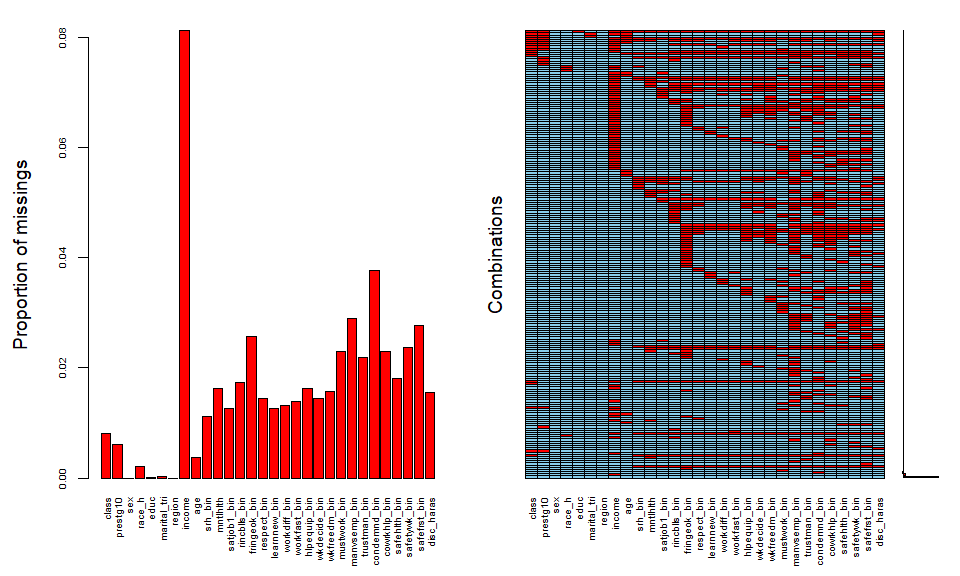<!-- -->

## Multiple imputation

Remember to update number of imputations and cores for final analyses and to not use imputed values of dependent variables in outcome regressions.


```r
#make imputation dataset. note that we're not using chngtme_bin as an imputation variable since it wasn't asked at all in 2018; correlation with other variables should mitigate bias towards null
dat_mice <- dat[,c('vpsu', 'vstrat', 'wtssall', 'year', 'age', 'sex', 'race_h', 'educ', 'region', 'marital_tri', 'income', "prestg10", "class", "race_h_gender", "srh_bin", "mntlhlth", "satjob1_bin", "rincblls_bin", "fringeok_bin", "respect_bin", "learnnew_bin", "workdiff_bin",  "workfast_bin", "hlpequip_bin", "wkdecide_bin", "wkfreedm_bin", "mustwork_bin", "manvsemp_bin", "trustman_bin", "condemnd_bin", "cowrkhlp_bin",  "safehlth_bin",  "safetywk_bin", "safefrst_bin", "disc_haras", "satjob1_bin_unimp", "rincblls_bin_unimp", "fringeok_bin_unimp", "respect_bin_unimp", "learnnew_bin_unimp", "workdiff_bin_unimp",  "workfast_bin_unimp", "hlpequip_bin_unimp", "wkdecide_bin_unimp", "wkfreedm_bin_unimp", "mustwork_bin_unimp", "chngtme_bin_unimp", "manvsemp_bin_unimp", "trustman_bin_unimp", "condemnd_bin_unimp", "cowrkhlp_bin_unimp",  "safehlth_bin_unimp",  "safetywk_bin_unimp", "safefrst_bin_unimp", "disc_haras_unimp")]

#this creates an empty imputation object that you can manipulate and set options
initialize <- mice(dat_mice, max=0, print=FALSE)

#this creates an object that will contain the imputation method for each variable. let mice choose defaults based on variable class
method <- initialize$method 

#this code tells mice not to impute these variables: not imputing variables with complete data or the unimputed versions of the outcome variables
method[c("vpsu", 'vstrat', 'wtssall', "year", "sex", "region", "satjob1_bin_unimp", "rincblls_bin_unimp", "fringeok_bin_unimp", "learnnew_bin_unimp", "workdiff_bin_unimp",  "workfast_bin_unimp", "hlpequip_bin_unimp", "wkdecide_bin_unimp", "wkfreedm_bin_unimp", "mustwork_bin_unimp", "chngtme_bin_unimp",  "condemnd_bin_unimp", "respect_bin_unimp", "manvsemp_bin_unimp", "trustman_bin_unimp", "cowrkhlp_bin_unimp",  "safehlth_bin_unimp",  "safetywk_bin_unimp", "safefrst_bin_unimp", "disc_haras_unimp")] <- "" 

#use logistic models for imputed versions of outcome variables: default otherwise is pmm since I didn't code them as factor variables above
method[c("satjob1_bin", "rincblls_bin", "fringeok_bin", "respect_bin", "learnnew_bin", "workdiff_bin",  "workfast_bin", "hlpequip_bin", "wkdecide_bin", "wkfreedm_bin", "mustwork_bin", "manvsemp_bin", "trustman_bin", "condemnd_bin", "cowrkhlp_bin",  "safehlth_bin",  "safetywk_bin", "safefrst_bin", "disc_haras")] <- "logreg" 

#passive imputation of variables that are perfect combos of other variables
method['race_h_gender'] <- "~ifelse(race_h=='NH white' & sex=='male', 'NH white men',
                                    ifelse(race_h=='NH white' & sex=='female', 'NH white women',
                                          ifelse(race_h=='NH Black' & sex=='male', 'NH Black men',
                                                 ifelse(race_h=='NH Black' & sex=='female', 'NH Black women',
                                                        ifelse(race_h=='NH other' & sex=='male', 'NH other men',
                                                               ifelse(race_h=='NH other' & sex=='female', 'NH other women', 
                                                                      ifelse(race_h=='Hispanic' & sex=='male', 'Hispanic men', 
                                                                                   ifelse(race_h=='Hispanic' & sex=='female', 'Hispanic women', NA))))))))"

#this creates an object that will indicate which variables we actually want to include in predicting missing variables. 
prediction <- initialize$predictorMatrix  

#don't use interacted race-gender variable as predictor since it's collinear with uninteracted versions of those variables; also don't use vstrat, since it has so many levels that models dont fit; don't use duplicated versions of dependent variables
prediction[,c("race_h_gender", 'vstrat', "satjob1_bin_unimp", "rincblls_bin_unimp", "fringeok_bin_unimp", "learnnew_bin_unimp", "workdiff_bin_unimp",  "workfast_bin_unimp", "hlpequip_bin_unimp", "wkdecide_bin_unimp", "wkfreedm_bin_unimp", "mustwork_bin_unimp", "chngtme_bin_unimp",  "condemnd_bin_unimp", "respect_bin_unimp", "manvsemp_bin_unimp", "trustman_bin_unimp", "cowrkhlp_bin_unimp",  "safehlth_bin_unimp",  "safetywk_bin_unimp", "safefrst_bin_unimp", "disc_haras_unimp")] <- 0  

#run MICE in parallel (4 cores * 5 imputations per core = 20 imputed datasets)
imp_merged <- parlmice(dat_mice, n.core=4, n.imp.core=5, meth=method, pred=prediction, maxit = 25, cluster.seed=9956) 

#put data into usable format for survey package
imp.list <- lapply(1:20, function(x) mice::complete(imp_merged, x))
dat_mi <- imputationList(imp.list)
```

# Survey set the data


```r
#center data for the single-PSU stratum at the sample grand mean rather than the stratum mean (conservative)
options(survey.lonely.psu="adjust")

#make imputed survey design object
svy_dat_mi <- svydesign(ids = ~ vpsu,
                 strata = ~ vstrat, 
                 weights = ~ wtssall,
                 nest=TRUE, 
                 data=dat_mi)

#survey-set unimputed data for descriptives
svy_dat <- svydesign(ids = ~ vpsu,
                     strata = ~ vstrat,
                     weights = ~ wtssall, 
                     nest=TRUE, 
                     data=dat)
```

# Survey-weighted, unimputed descriptives

## Demographics and health stratifed by class 


```r
#vars of interest
vars <- c('sex', 'race_h', 'educ', 'marital_tri', 'region', 'income', 'age', "srh_bin", "mntlhlth")
nonorm <- c('income', 'age')

x <- svyCreateTableOne(data = svy_dat, vars = vars, strata='class')
x <- print(x, printToggle=FALSE, noSpaces=TRUE, nonnormal=nonorm)
kable(x[,1:4]) %>%
  kable_styling(c("striped", "condensed"))
```

<table class="table table-striped table-condensed" style="margin-left: auto; margin-right: auto;">
 <thead>
  <tr>
   <th style="text-align:left;">   </th>
   <th style="text-align:left;"> Workers </th>
   <th style="text-align:left;"> Managers </th>
   <th style="text-align:left;"> Petit bourgeoisie </th>
   <th style="text-align:left;"> Capitalists </th>
  </tr>
 </thead>
<tbody>
  <tr>
   <td style="text-align:left;"> n </td>
   <td style="text-align:left;"> 3821.8 </td>
   <td style="text-align:left;"> 2128.6 </td>
   <td style="text-align:left;"> 544.2 </td>
   <td style="text-align:left;"> 423.8 </td>
  </tr>
  <tr>
   <td style="text-align:left;"> sex = male (%) </td>
   <td style="text-align:left;"> 1703.1 (44.6) </td>
   <td style="text-align:left;"> 1097.2 (51.5) </td>
   <td style="text-align:left;"> 278.4 (51.2) </td>
   <td style="text-align:left;"> 324.9 (76.7) </td>
  </tr>
  <tr>
   <td style="text-align:left;"> race_h (%) </td>
   <td style="text-align:left;">  </td>
   <td style="text-align:left;">  </td>
   <td style="text-align:left;">  </td>
   <td style="text-align:left;">  </td>
  </tr>
  <tr>
   <td style="text-align:left;"> NH white </td>
   <td style="text-align:left;"> 2521.9 (66.1) </td>
   <td style="text-align:left;"> 1514.9 (71.2) </td>
   <td style="text-align:left;"> 392.8 (72.3) </td>
   <td style="text-align:left;"> 337.6 (79.9) </td>
  </tr>
  <tr>
   <td style="text-align:left;"> NH Black </td>
   <td style="text-align:left;"> 599.7 (15.7) </td>
   <td style="text-align:left;"> 252.9 (11.9) </td>
   <td style="text-align:left;"> 40.4 (7.4) </td>
   <td style="text-align:left;"> 23.4 (5.5) </td>
  </tr>
  <tr>
   <td style="text-align:left;"> NH other </td>
   <td style="text-align:left;"> 145.0 (3.8) </td>
   <td style="text-align:left;"> 108.7 (5.1) </td>
   <td style="text-align:left;"> 39.2 (7.2) </td>
   <td style="text-align:left;"> 29.4 (7.0) </td>
  </tr>
  <tr>
   <td style="text-align:left;"> Hispanic </td>
   <td style="text-align:left;"> 547.5 (14.4) </td>
   <td style="text-align:left;"> 249.9 (11.8) </td>
   <td style="text-align:left;"> 71.0 (13.1) </td>
   <td style="text-align:left;"> 32.0 (7.6) </td>
  </tr>
  <tr>
   <td style="text-align:left;"> educ (%) </td>
   <td style="text-align:left;">  </td>
   <td style="text-align:left;">  </td>
   <td style="text-align:left;">  </td>
   <td style="text-align:left;">  </td>
  </tr>
  <tr>
   <td style="text-align:left;"> &lt;HS </td>
   <td style="text-align:left;"> 359.4 (9.4) </td>
   <td style="text-align:left;"> 158.1 (7.4) </td>
   <td style="text-align:left;"> 65.0 (11.9) </td>
   <td style="text-align:left;"> 33.4 (7.9) </td>
  </tr>
  <tr>
   <td style="text-align:left;"> HS </td>
   <td style="text-align:left;"> 2111.2 (55.2) </td>
   <td style="text-align:left;"> 927.3 (43.6) </td>
   <td style="text-align:left;"> 259.7 (47.7) </td>
   <td style="text-align:left;"> 170.7 (40.3) </td>
  </tr>
  <tr>
   <td style="text-align:left;"> JuCo </td>
   <td style="text-align:left;"> 345.7 (9.0) </td>
   <td style="text-align:left;"> 227.7 (10.7) </td>
   <td style="text-align:left;"> 50.0 (9.2) </td>
   <td style="text-align:left;"> 31.1 (7.3) </td>
  </tr>
  <tr>
   <td style="text-align:left;"> College + </td>
   <td style="text-align:left;"> 1005.5 (26.3) </td>
   <td style="text-align:left;"> 815.5 (38.3) </td>
   <td style="text-align:left;"> 169.5 (31.1) </td>
   <td style="text-align:left;"> 188.7 (44.5) </td>
  </tr>
  <tr>
   <td style="text-align:left;"> marital_tri (%) </td>
   <td style="text-align:left;">  </td>
   <td style="text-align:left;">  </td>
   <td style="text-align:left;">  </td>
   <td style="text-align:left;">  </td>
  </tr>
  <tr>
   <td style="text-align:left;"> married </td>
   <td style="text-align:left;"> 1950.2 (51.0) </td>
   <td style="text-align:left;"> 1190.8 (55.9) </td>
   <td style="text-align:left;"> 327.5 (60.2) </td>
   <td style="text-align:left;"> 301.5 (71.1) </td>
  </tr>
  <tr>
   <td style="text-align:left;"> never married </td>
   <td style="text-align:left;"> 1192.5 (31.2) </td>
   <td style="text-align:left;"> 565.9 (26.6) </td>
   <td style="text-align:left;"> 106.1 (19.5) </td>
   <td style="text-align:left;"> 41.6 (9.8) </td>
  </tr>
  <tr>
   <td style="text-align:left;"> wid/div/sep </td>
   <td style="text-align:left;"> 679.1 (17.8) </td>
   <td style="text-align:left;"> 371.8 (17.5) </td>
   <td style="text-align:left;"> 110.6 (20.3) </td>
   <td style="text-align:left;"> 80.7 (19.0) </td>
  </tr>
  <tr>
   <td style="text-align:left;"> region (%) </td>
   <td style="text-align:left;">  </td>
   <td style="text-align:left;">  </td>
   <td style="text-align:left;">  </td>
   <td style="text-align:left;">  </td>
  </tr>
  <tr>
   <td style="text-align:left;"> Midwest </td>
   <td style="text-align:left;"> 932.2 (24.4) </td>
   <td style="text-align:left;"> 475.6 (22.3) </td>
   <td style="text-align:left;"> 99.9 (18.4) </td>
   <td style="text-align:left;"> 87.7 (20.7) </td>
  </tr>
  <tr>
   <td style="text-align:left;"> Northeast </td>
   <td style="text-align:left;"> 630.1 (16.5) </td>
   <td style="text-align:left;"> 395.9 (18.6) </td>
   <td style="text-align:left;"> 87.4 (16.1) </td>
   <td style="text-align:left;"> 57.2 (13.5) </td>
  </tr>
  <tr>
   <td style="text-align:left;"> South </td>
   <td style="text-align:left;"> 1485.9 (38.9) </td>
   <td style="text-align:left;"> 745.6 (35.0) </td>
   <td style="text-align:left;"> 197.7 (36.3) </td>
   <td style="text-align:left;"> 150.2 (35.4) </td>
  </tr>
  <tr>
   <td style="text-align:left;"> West </td>
   <td style="text-align:left;"> 773.6 (20.2) </td>
   <td style="text-align:left;"> 511.5 (24.0) </td>
   <td style="text-align:left;"> 159.1 (29.2) </td>
   <td style="text-align:left;"> 128.6 (30.3) </td>
  </tr>
  <tr>
   <td style="text-align:left;"> income (median [IQR]) </td>
   <td style="text-align:left;"> 63838.02 [35022.03, 102218.99] </td>
   <td style="text-align:left;"> 84330.67 [48492.05, 128628.24] </td>
   <td style="text-align:left;"> 63838.02 [32196.43, 122662.79] </td>
   <td style="text-align:left;"> 122662.79 [69724.29, 230688.05] </td>
  </tr>
  <tr>
   <td style="text-align:left;"> age (median [IQR]) </td>
   <td style="text-align:left;"> 40.00 [29.00, 51.00] </td>
   <td style="text-align:left;"> 42.00 [31.00, 51.00] </td>
   <td style="text-align:left;"> 49.00 [37.00, 58.00] </td>
   <td style="text-align:left;"> 50.00 [40.00, 58.00] </td>
  </tr>
  <tr>
   <td style="text-align:left;"> srh_bin = poor/fair (%) </td>
   <td style="text-align:left;"> 579.3 (15.2) </td>
   <td style="text-align:left;"> 271.1 (12.9) </td>
   <td style="text-align:left;"> 83.4 (15.6) </td>
   <td style="text-align:left;"> 43.4 (10.4) </td>
  </tr>
  <tr>
   <td style="text-align:left;"> mntlhlth (mean (SD)) </td>
   <td style="text-align:left;"> 3.55 (7.14) </td>
   <td style="text-align:left;"> 3.34 (6.83) </td>
   <td style="text-align:left;"> 2.55 (6.13) </td>
   <td style="text-align:left;"> 2.98 (6.99) </td>
  </tr>
</tbody>
</table>

## Select QWL variables stratified by class 

Unadjusted prevalence of bad category of each binary QWL variable among each class.


```r
#vars of interest
qwl_vars <- c("satjob1_bin", "rincblls_bin", "fringeok_bin", "respect_bin", "learnnew_bin", "workdiff_bin",  "workfast_bin", "hlpequip_bin", "wkdecide_bin", "wkfreedm_bin", "mustwork_bin", "chngtme_bin", "manvsemp_bin", "trustman_bin", "condemnd_bin", "cowrkhlp_bin",  "safehlth_bin",  "safetywk_bin", "safefrst_bin", "disc_haras")

x <- svyCreateTableOne(data = svy_dat, vars = qwl_vars, factorVars=qwl_vars, strata='class')
x <- print(x, printToggle=FALSE, noSpaces=TRUE)
kable(x[,1:4]) %>%
  kable_styling(c("striped", "condensed"))
```

<table class="table table-striped table-condensed" style="margin-left: auto; margin-right: auto;">
 <thead>
  <tr>
   <th style="text-align:left;">   </th>
   <th style="text-align:left;"> Workers </th>
   <th style="text-align:left;"> Managers </th>
   <th style="text-align:left;"> Petit bourgeoisie </th>
   <th style="text-align:left;"> Capitalists </th>
  </tr>
 </thead>
<tbody>
  <tr>
   <td style="text-align:left;"> n </td>
   <td style="text-align:left;"> 3821.8 </td>
   <td style="text-align:left;"> 2128.6 </td>
   <td style="text-align:left;"> 544.2 </td>
   <td style="text-align:left;"> 423.8 </td>
  </tr>
  <tr>
   <td style="text-align:left;"> satjob1_bin = 1 (%) </td>
   <td style="text-align:left;"> 315.7 (8.3) </td>
   <td style="text-align:left;"> 149.1 (7.1) </td>
   <td style="text-align:left;"> 19.6 (3.7) </td>
   <td style="text-align:left;"> 10.6 (2.5) </td>
  </tr>
  <tr>
   <td style="text-align:left;"> rincblls_bin = 1 (%) </td>
   <td style="text-align:left;"> 2289.9 (60.5) </td>
   <td style="text-align:left;"> 1011.8 (48.2) </td>
   <td style="text-align:left;"> 289.4 (55.1) </td>
   <td style="text-align:left;"> 121.4 (29.5) </td>
  </tr>
  <tr>
   <td style="text-align:left;"> fringeok_bin = 1 (%) </td>
   <td style="text-align:left;"> 1088.0 (29.0) </td>
   <td style="text-align:left;"> 493.3 (23.6) </td>
   <td style="text-align:left;"> 211.4 (41.4) </td>
   <td style="text-align:left;"> 96.5 (24.2) </td>
  </tr>
  <tr>
   <td style="text-align:left;"> respect_bin = 1 (%) </td>
   <td style="text-align:left;"> 334.9 (8.8) </td>
   <td style="text-align:left;"> 131.3 (6.2) </td>
   <td style="text-align:left;"> 22.4 (4.2) </td>
   <td style="text-align:left;"> 11.6 (2.8) </td>
  </tr>
  <tr>
   <td style="text-align:left;"> learnnew_bin = 1 (%) </td>
   <td style="text-align:left;"> 650.0 (17.1) </td>
   <td style="text-align:left;"> 169.1 (8.0) </td>
   <td style="text-align:left;"> 68.7 (12.9) </td>
   <td style="text-align:left;"> 16.5 (4.0) </td>
  </tr>
  <tr>
   <td style="text-align:left;"> workdiff_bin = 1 (%) </td>
   <td style="text-align:left;"> 529.4 (13.9) </td>
   <td style="text-align:left;"> 114.2 (5.4) </td>
   <td style="text-align:left;"> 62.2 (11.7) </td>
   <td style="text-align:left;"> 20.9 (5.0) </td>
  </tr>
  <tr>
   <td style="text-align:left;"> workfast_bin = 1 (%) </td>
   <td style="text-align:left;"> 2450.7 (64.6) </td>
   <td style="text-align:left;"> 1558.0 (74.1) </td>
   <td style="text-align:left;"> 275.8 (51.8) </td>
   <td style="text-align:left;"> 307.2 (74.1) </td>
  </tr>
  <tr>
   <td style="text-align:left;"> hlpequip_bin = 1 (%) </td>
   <td style="text-align:left;"> 526.0 (13.8) </td>
   <td style="text-align:left;"> 302.6 (14.4) </td>
   <td style="text-align:left;"> 39.1 (7.6) </td>
   <td style="text-align:left;"> 32.0 (7.9) </td>
  </tr>
  <tr>
   <td style="text-align:left;"> wkdecide_bin = 1 (%) </td>
   <td style="text-align:left;"> 1081.6 (28.5) </td>
   <td style="text-align:left;"> 231.1 (11.0) </td>
   <td style="text-align:left;"> 211.6 (40.2) </td>
   <td style="text-align:left;"> 62.7 (15.4) </td>
  </tr>
  <tr>
   <td style="text-align:left;"> wkfreedm_bin = 1 (%) </td>
   <td style="text-align:left;"> 613.8 (16.2) </td>
   <td style="text-align:left;"> 201.3 (9.6) </td>
   <td style="text-align:left;"> 19.5 (3.7) </td>
   <td style="text-align:left;"> 6.4 (1.6) </td>
  </tr>
  <tr>
   <td style="text-align:left;"> mustwork_bin = 1 (%) </td>
   <td style="text-align:left;"> 926.2 (24.7) </td>
   <td style="text-align:left;"> 633.4 (30.2) </td>
   <td style="text-align:left;"> 123.8 (23.7) </td>
   <td style="text-align:left;"> 136.5 (33.8) </td>
  </tr>
  <tr>
   <td style="text-align:left;"> chngtme_bin = 1 (%) </td>
   <td style="text-align:left;"> 1673.2 (56.6) </td>
   <td style="text-align:left;"> 705.9 (42.2) </td>
   <td style="text-align:left;"> 53.4 (12.7) </td>
   <td style="text-align:left;"> 50.3 (15.2) </td>
  </tr>
  <tr>
   <td style="text-align:left;"> manvsemp_bin = 1 (%) </td>
   <td style="text-align:left;"> 318.6 (8.4) </td>
   <td style="text-align:left;"> 138.5 (6.6) </td>
   <td style="text-align:left;"> 10.2 (2.3) </td>
   <td style="text-align:left;"> 7.6 (1.9) </td>
  </tr>
  <tr>
   <td style="text-align:left;"> trustman_bin = 1 (%) </td>
   <td style="text-align:left;"> 833.9 (22.0) </td>
   <td style="text-align:left;"> 398.0 (19.0) </td>
   <td style="text-align:left;"> 26.4 (5.1) </td>
   <td style="text-align:left;"> 18.9 (4.7) </td>
  </tr>
  <tr>
   <td style="text-align:left;"> condemnd_bin = 1 (%) </td>
   <td style="text-align:left;"> 904.3 (24.4) </td>
   <td style="text-align:left;"> 639.7 (31.0) </td>
   <td style="text-align:left;"> 87.4 (17.5) </td>
   <td style="text-align:left;"> 118.8 (29.4) </td>
  </tr>
  <tr>
   <td style="text-align:left;"> cowrkhlp_bin = 1 (%) </td>
   <td style="text-align:left;"> 362.1 (9.5) </td>
   <td style="text-align:left;"> 184.5 (8.8) </td>
   <td style="text-align:left;"> 45.8 (9.7) </td>
   <td style="text-align:left;"> 23.1 (5.7) </td>
  </tr>
  <tr>
   <td style="text-align:left;"> safehlth_bin = 1 (%) </td>
   <td style="text-align:left;"> 258.2 (6.8) </td>
   <td style="text-align:left;"> 110.3 (5.2) </td>
   <td style="text-align:left;"> 19.7 (3.8) </td>
   <td style="text-align:left;"> 17.0 (4.2) </td>
  </tr>
  <tr>
   <td style="text-align:left;"> safetywk_bin = 1 (%) </td>
   <td style="text-align:left;"> 362.6 (9.6) </td>
   <td style="text-align:left;"> 165.5 (7.9) </td>
   <td style="text-align:left;"> 17.0 (3.4) </td>
   <td style="text-align:left;"> 15.1 (3.7) </td>
  </tr>
  <tr>
   <td style="text-align:left;"> safefrst_bin = 1 (%) </td>
   <td style="text-align:left;"> 387.8 (10.3) </td>
   <td style="text-align:left;"> 188.7 (9.0) </td>
   <td style="text-align:left;"> 20.4 (4.1) </td>
   <td style="text-align:left;"> 27.0 (6.7) </td>
  </tr>
  <tr>
   <td style="text-align:left;"> disc_haras = 1 (%) </td>
   <td style="text-align:left;"> 789.4 (20.8) </td>
   <td style="text-align:left;"> 499.3 (23.8) </td>
   <td style="text-align:left;"> 72.6 (13.8) </td>
   <td style="text-align:left;"> 67.9 (16.6) </td>
  </tr>
</tbody>
</table>

# Survey-weighted associations between select QWL variables and class from Poisson regressions

Restricted to intrinsically relational variables with potentially interesting differences across classes or races.

## Functions


```r
#regression function
mysvy <- function(dat, columns, adjvars, ...){
  model <- lapply(as.list(columns), function(x){
    with(dat, svyglm(as.formula(paste0(names(dat$designs[[1]]$variables)[x], adjvars)), family=poisson(), ...))
  })
  return(model)
}

#regression matrix function
matrix_func <- function(nums, coefs, cols){
  regs_less = NULL
  for(i in 1:nums){
    exp(summary(MIcombine(less_adj[[i]]))[2:coefs,c(1,3,4)]) -> bind
    rbind(regs_less, cbind(bind, names(svy_dat_mi$designs[[1]]$variables)[cols][i])) -> regs_less
  }
  names(regs_less) <- c("PR", "Lower", "Upper", "Var")
  return(regs_less)
}

#format matrix function
formatted <- function(classvec, rows, qwlvec, dummy, facvec){
  as.data.frame(regs_less) %>%
    mutate(Class=rep(classvec, rows)) %>%
    bind_rows(data.frame(Var=qwlvec, 
                         Class=rep(dummy, rows), PR=rep(1, rows), Lower=rep(NA, rows), Upper=rep(NA, rows))) %>% #worker dummy row
    mutate(Class=factor(Class, levels=facvec),
           Var=factor(Var, levels=qwlvec),
           Cat=ifelse(Var=="satjob1_bin_unimp" | Var=="rincblls_bin_unimp" | Var=="fringeok_bin_unimp" | Var=="respect_bin_unimp", "General",
                      ifelse(Var=="learnnew_bin_unimp" | Var=="workdiff_bin_unimp" | Var == "workfast_bin_unimp" | Var=="hlpequip_bin_unimp", "Labor process",
                             ifelse(Var=="wkdecide_bin_unimp" | Var=="wkfreedm_bin_unimp" | Var == "mustwork_bin_unimp" | Var=="chngtme_bin_unimp", "Autonomy",
                                    ifelse(Var=="manvsemp_bin_unimp" | Var=="trustman_bin_unimp" | Var == "condemnd_bin_unimp" | Var=="cowrkhlp_bin_unimp", "Conflict",
                                           ifelse(Var=="safehlth_bin_unimp" | Var=="safetywk_bin_unimp" | Var=="safefrst_bin_unimp" | Var == "disc_haras_unimp", "Hazards", NA)))))) -> binded
  return(binded)
}

#facet labeller function
facet_names <- list(
  "satjob1_bin_unimp"="Dissatisfied with job",
  "rincblls_bin_unimp"="Income doesn't pay bills",
  "fringeok_bin_unimp"="Benefits not good",
  "respect_bin_unimp"="Not treated with respect",
  "learnnew_bin_unimp"="Don't learn new things",
  "workdiff_bin_unimp"="Repetitive tasks",
  "workfast_bin_unimp"="Need to work fast", 
  "hlpequip_bin_unimp"="Not enough help/equip.",
  "wkdecide_bin_unimp"="Don't make decisions", 
  "wkfreedm_bin_unimp"="No freedom on job", 
  "mustwork_bin_unimp"="Mandatory extra hours",
  "chngtme_bin_unimp"="Can't change schedule",
  "manvsemp_bin_unimp"="Worker-manager conflict", 
  "trustman_bin_unimp"="Don't trust management",
  "condemnd_bin_unimp"="Face conflicting demands", 
  "cowrkhlp_bin_unimp"="Can't rely on coworkers",
  "safehlth_bin_unimp"="Poor safety conditions",
  "safetywk_bin_unimp"="Safety not a priority",
  "safefrst_bin_unimp"="Safety shortcuts taken",
  "disc_haras_unimp"="Face discrim. & harass."
)

facet_labeller <- function(variable,value){
  return(facet_names[value])
}

#plot function
plotted <- function(rows, xaxis, limitsvec, breaksvec, cols, shapes){
  xaxis <- enquo(xaxis)
  ggplot(binded[rows,], aes(x=!!xaxis, y=PR, ymin=Lower, ymax=Upper, shape=!!xaxis, color=!!xaxis)) +
    geom_hline(yintercept=1, lty=1, col='darkgrey') +
    geom_errorbar(width=0.5) +
    geom_point(size=2) +
    facet_wrap(~Var, ncol=1, labeller=facet_labeller) +
    scale_y_continuous(trans="log", limits=limitsvec, breaks=breaksvec, labels=scales::number_format(accuracy=0.01)) +
    theme_light() + 
    scale_color_manual(values=cols) +
    scale_shape_manual(values=shapes) +
    xlab('') +
    ylab("Prevalence ratio") +
    ggtitle(binded$Cat[rows]) +
    theme(strip.background = element_rect(fill=NA, color='grey'), strip.text = element_text(colour = "black"), 
          legend.position='none', axis.title.x = element_blank(), axis.text.x = element_blank(), 
          axis.ticks.x=element_blank(), plot.title = element_text(hjust = 0.5))
}

#legend function
legends <- function(rows, xaxis, cols, shapes, nrow=1){
  xaxis <- enquo(xaxis)
  leg <- ggplot(binded[rows,], aes(x=!!xaxis, y=PR, ymin=Lower, ymax=Upper, shape=!!xaxis, color=!!xaxis)) +
    geom_hline(yintercept=1, lty=1, col='darkgrey') +
    geom_errorbar(width=0.5) +
    geom_point(size=2) +
    facet_wrap(~Var, ncol=1) +
    theme_light() + 
    scale_color_manual(values=cols) +
    scale_shape_manual(values=shapes) +
    theme(legend.title=element_blank()) +
    guides(color=guide_legend(nrow=nrow, byrow=T, label.position="bottom", keywidth=7, keyheight=0.5)) 
  leg <- get_legend(leg)
  leg <- as_ggplot(leg)
}

#table function
tabled <- function(rows, captioned){
  kable(binded[rows,], digits=2, col.names=c("QWL variable", "Class", "PR", "Lower", "Upper", "Type"), caption=captioned) %>%
  kable_styling("striped") %>%
  scroll_box(width = "100%", height = "250px")
}
```

## Class and QWL 

Prevalence of bad category of each binary QWL variable among each class relative to the prevalence among workers adjusted for age and year with restricted cubic splines.


```r
#run regression
less_adj <- mysvy(svy_dat_mi, c(36:55), "~class + rcs(age, 3) + rcs(year, 3)")

#pull into matrix
regs_less <- matrix_func(20, 4, c(36:55))

#format matrix
binded <- formatted(c("Managers", "Petite bourgeoisie", "Capitalists"), 20,
                    c("satjob1_bin_unimp", "rincblls_bin_unimp", "fringeok_bin_unimp", "respect_bin_unimp",  
                      "learnnew_bin_unimp", "workdiff_bin_unimp", "workfast_bin_unimp", "hlpequip_bin_unimp", 
                      "wkdecide_bin_unimp", "wkfreedm_bin_unimp", "mustwork_bin_unimp", "chngtme_bin_unimp",  
                      "manvsemp_bin_unimp", "trustman_bin_unimp", "condemnd_bin_unimp", "cowrkhlp_bin_unimp", 
                      "safehlth_bin_unimp", "safetywk_bin_unimp", "safefrst_bin_unimp", "disc_haras_unimp"),
                    "Workers",
                    c("Workers", "Managers", "Petite bourgeoisie", "Capitalists"))
```


```r
#plot of estimates
(plotted(rows=c(1:12,61:64), xaxis=Class, limitsvec=c(0.049, 1.73), breaksvec=c(0.125, 0.25, 0.5, 1, 2), 
        cols=brewer.pal(8, "Blues")[c(5,6,7,8)], shapes=c(15,16,17,18))  + 
  plotted(rows=c(13:24,65:68), xaxis=Class, limitsvec=c(0.049, 1.73), breaksvec=c(0.125, 0.25, 0.5, 1, 2), 
          cols=brewer.pal(8, "Blues")[c(5,6,7,8)], shapes=c(15,16,17,18)) + 
   theme(axis.title.y=element_blank(), axis.text.y=element_blank(), axis.ticks.y=element_blank()) + 
  plotted(rows=c(25:36,69:72), xaxis=Class, limitsvec=c(0.049, 1.73), breaksvec=c(0.125, 0.25, 0.5, 1, 2), 
          cols=brewer.pal(8, "Blues")[c(5,6,7,8)], shapes=c(15,16,17,18)) + 
   theme(axis.title.y=element_blank(), axis.text.y=element_blank(), axis.ticks.y=element_blank()) + 
  plotted(rows=c(37:48, 73:76), xaxis=Class, limitsvec=c(0.049, 1.73), breaksvec=c(0.125, 0.25, 0.5, 1, 2), 
          cols=brewer.pal(8, "Blues")[c(5,6,7,8)], shapes=c(15,16,17,18)) + 
   theme(axis.title.y=element_blank(), axis.text.y=element_blank(), axis.ticks.y=element_blank()) + 
  plotted(rows=c(49:60, 77:80), xaxis=Class, limitsvec=c(0.049, 1.73), breaksvec=c(0.125, 0.25, 0.5, 1, 2), 
          cols=brewer.pal(8, "Blues")[c(5,6,7,8)], shapes=c(15,16,17,18)) + 
   theme(axis.title.y=element_blank(), axis.text.y=element_blank(), axis.ticks.y=element_blank()) +   
  plot_layout(ncol=5)) /
  legends(rows=c(1:3,61), xaxis=Class, cols=brewer.pal(8, "Blues")[c(5,6,7,8)], shapes=c(15,16,17,18), nrow=1) +
  plot_layout(heights=c(1,0.1))
```

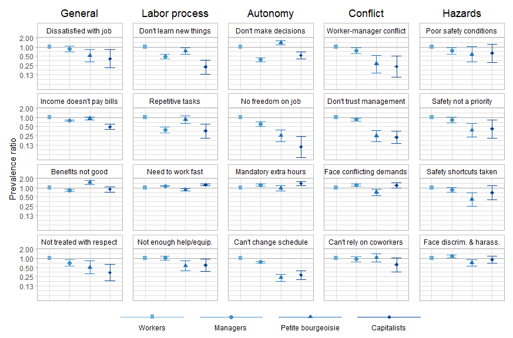<!-- -->

```r
#table of estimates
tabled(1:60, "Ref: workers")
```

<div style="border: 1px solid #ddd; padding: 0px; overflow-y: scroll; height:250px; overflow-x: scroll; width:100%; "><table class="table table-striped" style="margin-left: auto; margin-right: auto;">
<caption>Ref: workers</caption>
 <thead>
  <tr>
   <th style="text-align:right;position: sticky; top:0; background-color: #FFFFFF;"> QWL variable </th>
   <th style="text-align:right;position: sticky; top:0; background-color: #FFFFFF;"> Class </th>
   <th style="text-align:right;position: sticky; top:0; background-color: #FFFFFF;"> PR </th>
   <th style="text-align:left;position: sticky; top:0; background-color: #FFFFFF;"> Lower </th>
   <th style="text-align:left;position: sticky; top:0; background-color: #FFFFFF;"> Upper </th>
   <th style="text-align:left;position: sticky; top:0; background-color: #FFFFFF;"> Type </th>
  </tr>
 </thead>
<tbody>
  <tr>
   <td style="text-align:right;"> 0.87 </td>
   <td style="text-align:right;"> 0.68 </td>
   <td style="text-align:right;"> 1.10 </td>
   <td style="text-align:left;"> satjob1_bin_unimp </td>
   <td style="text-align:left;"> Managers </td>
   <td style="text-align:left;"> General </td>
  </tr>
  <tr>
   <td style="text-align:right;"> 0.52 </td>
   <td style="text-align:right;"> 0.33 </td>
   <td style="text-align:right;"> 0.83 </td>
   <td style="text-align:left;"> satjob1_bin_unimp </td>
   <td style="text-align:left;"> Petite bourgeoisie </td>
   <td style="text-align:left;"> General </td>
  </tr>
  <tr>
   <td style="text-align:right;"> 0.42 </td>
   <td style="text-align:right;"> 0.21 </td>
   <td style="text-align:right;"> 0.81 </td>
   <td style="text-align:left;"> satjob1_bin_unimp </td>
   <td style="text-align:left;"> Capitalists </td>
   <td style="text-align:left;"> General </td>
  </tr>
  <tr>
   <td style="text-align:right;"> 0.79 </td>
   <td style="text-align:right;"> 0.75 </td>
   <td style="text-align:right;"> 0.84 </td>
   <td style="text-align:left;"> rincblls_bin_unimp </td>
   <td style="text-align:left;"> Managers </td>
   <td style="text-align:left;"> General </td>
  </tr>
  <tr>
   <td style="text-align:right;"> 0.92 </td>
   <td style="text-align:right;"> 0.84 </td>
   <td style="text-align:right;"> 1.01 </td>
   <td style="text-align:left;"> rincblls_bin_unimp </td>
   <td style="text-align:left;"> Petite bourgeoisie </td>
   <td style="text-align:left;"> General </td>
  </tr>
  <tr>
   <td style="text-align:right;"> 0.50 </td>
   <td style="text-align:right;"> 0.41 </td>
   <td style="text-align:right;"> 0.60 </td>
   <td style="text-align:left;"> rincblls_bin_unimp </td>
   <td style="text-align:left;"> Capitalists </td>
   <td style="text-align:left;"> General </td>
  </tr>
  <tr>
   <td style="text-align:right;"> 0.83 </td>
   <td style="text-align:right;"> 0.75 </td>
   <td style="text-align:right;"> 0.92 </td>
   <td style="text-align:left;"> fringeok_bin_unimp </td>
   <td style="text-align:left;"> Managers </td>
   <td style="text-align:left;"> General </td>
  </tr>
  <tr>
   <td style="text-align:right;"> 1.50 </td>
   <td style="text-align:right;"> 1.31 </td>
   <td style="text-align:right;"> 1.72 </td>
   <td style="text-align:left;"> fringeok_bin_unimp </td>
   <td style="text-align:left;"> Petite bourgeoisie </td>
   <td style="text-align:left;"> General </td>
  </tr>
  <tr>
   <td style="text-align:right;"> 0.90 </td>
   <td style="text-align:right;"> 0.74 </td>
   <td style="text-align:right;"> 1.09 </td>
   <td style="text-align:left;"> fringeok_bin_unimp </td>
   <td style="text-align:left;"> Capitalists </td>
   <td style="text-align:left;"> General </td>
  </tr>
  <tr>
   <td style="text-align:right;"> 0.70 </td>
   <td style="text-align:right;"> 0.55 </td>
   <td style="text-align:right;"> 0.89 </td>
   <td style="text-align:left;"> respect_bin_unimp </td>
   <td style="text-align:left;"> Managers </td>
   <td style="text-align:left;"> General </td>
  </tr>
  <tr>
   <td style="text-align:right;"> 0.51 </td>
   <td style="text-align:right;"> 0.32 </td>
   <td style="text-align:right;"> 0.82 </td>
   <td style="text-align:left;"> respect_bin_unimp </td>
   <td style="text-align:left;"> Petite bourgeoisie </td>
   <td style="text-align:left;"> General </td>
  </tr>
  <tr>
   <td style="text-align:right;"> 0.34 </td>
   <td style="text-align:right;"> 0.18 </td>
   <td style="text-align:right;"> 0.64 </td>
   <td style="text-align:left;"> respect_bin_unimp </td>
   <td style="text-align:left;"> Capitalists </td>
   <td style="text-align:left;"> General </td>
  </tr>
  <tr>
   <td style="text-align:right;"> 0.48 </td>
   <td style="text-align:right;"> 0.40 </td>
   <td style="text-align:right;"> 0.59 </td>
   <td style="text-align:left;"> learnnew_bin_unimp </td>
   <td style="text-align:left;"> Managers </td>
   <td style="text-align:left;"> Labor process </td>
  </tr>
  <tr>
   <td style="text-align:right;"> 0.73 </td>
   <td style="text-align:right;"> 0.57 </td>
   <td style="text-align:right;"> 0.93 </td>
   <td style="text-align:left;"> learnnew_bin_unimp </td>
   <td style="text-align:left;"> Petite bourgeoisie </td>
   <td style="text-align:left;"> Labor process </td>
  </tr>
  <tr>
   <td style="text-align:right;"> 0.22 </td>
   <td style="text-align:right;"> 0.13 </td>
   <td style="text-align:right;"> 0.38 </td>
   <td style="text-align:left;"> learnnew_bin_unimp </td>
   <td style="text-align:left;"> Capitalists </td>
   <td style="text-align:left;"> Labor process </td>
  </tr>
  <tr>
   <td style="text-align:right;"> 0.39 </td>
   <td style="text-align:right;"> 0.31 </td>
   <td style="text-align:right;"> 0.49 </td>
   <td style="text-align:left;"> workdiff_bin_unimp </td>
   <td style="text-align:left;"> Managers </td>
   <td style="text-align:left;"> Labor process </td>
  </tr>
  <tr>
   <td style="text-align:right;"> 0.84 </td>
   <td style="text-align:right;"> 0.64 </td>
   <td style="text-align:right;"> 1.11 </td>
   <td style="text-align:left;"> workdiff_bin_unimp </td>
   <td style="text-align:left;"> Petite bourgeoisie </td>
   <td style="text-align:left;"> Labor process </td>
  </tr>
  <tr>
   <td style="text-align:right;"> 0.36 </td>
   <td style="text-align:right;"> 0.21 </td>
   <td style="text-align:right;"> 0.61 </td>
   <td style="text-align:left;"> workdiff_bin_unimp </td>
   <td style="text-align:left;"> Capitalists </td>
   <td style="text-align:left;"> Labor process </td>
  </tr>
  <tr>
   <td style="text-align:right;"> 1.15 </td>
   <td style="text-align:right;"> 1.11 </td>
   <td style="text-align:right;"> 1.20 </td>
   <td style="text-align:left;"> workfast_bin_unimp </td>
   <td style="text-align:left;"> Managers </td>
   <td style="text-align:left;"> Labor process </td>
  </tr>
  <tr>
   <td style="text-align:right;"> 0.86 </td>
   <td style="text-align:right;"> 0.78 </td>
   <td style="text-align:right;"> 0.95 </td>
   <td style="text-align:left;"> workfast_bin_unimp </td>
   <td style="text-align:left;"> Petite bourgeoisie </td>
   <td style="text-align:left;"> Labor process </td>
  </tr>
  <tr>
   <td style="text-align:right;"> 1.26 </td>
   <td style="text-align:right;"> 1.17 </td>
   <td style="text-align:right;"> 1.35 </td>
   <td style="text-align:left;"> workfast_bin_unimp </td>
   <td style="text-align:left;"> Capitalists </td>
   <td style="text-align:left;"> Labor process </td>
  </tr>
  <tr>
   <td style="text-align:right;"> 1.02 </td>
   <td style="text-align:right;"> 0.88 </td>
   <td style="text-align:right;"> 1.18 </td>
   <td style="text-align:left;"> hlpequip_bin_unimp </td>
   <td style="text-align:left;"> Managers </td>
   <td style="text-align:left;"> Labor process </td>
  </tr>
  <tr>
   <td style="text-align:right;"> 0.56 </td>
   <td style="text-align:right;"> 0.39 </td>
   <td style="text-align:right;"> 0.82 </td>
   <td style="text-align:left;"> hlpequip_bin_unimp </td>
   <td style="text-align:left;"> Petite bourgeoisie </td>
   <td style="text-align:left;"> Labor process </td>
  </tr>
  <tr>
   <td style="text-align:right;"> 0.60 </td>
   <td style="text-align:right;"> 0.38 </td>
   <td style="text-align:right;"> 0.94 </td>
   <td style="text-align:left;"> hlpequip_bin_unimp </td>
   <td style="text-align:left;"> Capitalists </td>
   <td style="text-align:left;"> Labor process </td>
  </tr>
  <tr>
   <td style="text-align:right;"> 0.39 </td>
   <td style="text-align:right;"> 0.33 </td>
   <td style="text-align:right;"> 0.45 </td>
   <td style="text-align:left;"> wkdecide_bin_unimp </td>
   <td style="text-align:left;"> Managers </td>
   <td style="text-align:left;"> Autonomy </td>
  </tr>
  <tr>
   <td style="text-align:right;"> 1.37 </td>
   <td style="text-align:right;"> 1.19 </td>
   <td style="text-align:right;"> 1.58 </td>
   <td style="text-align:left;"> wkdecide_bin_unimp </td>
   <td style="text-align:left;"> Petite bourgeoisie </td>
   <td style="text-align:left;"> Autonomy </td>
  </tr>
  <tr>
   <td style="text-align:right;"> 0.53 </td>
   <td style="text-align:right;"> 0.41 </td>
   <td style="text-align:right;"> 0.69 </td>
   <td style="text-align:left;"> wkdecide_bin_unimp </td>
   <td style="text-align:left;"> Capitalists </td>
   <td style="text-align:left;"> Autonomy </td>
  </tr>
  <tr>
   <td style="text-align:right;"> 0.60 </td>
   <td style="text-align:right;"> 0.50 </td>
   <td style="text-align:right;"> 0.72 </td>
   <td style="text-align:left;"> wkfreedm_bin_unimp </td>
   <td style="text-align:left;"> Managers </td>
   <td style="text-align:left;"> Autonomy </td>
  </tr>
  <tr>
   <td style="text-align:right;"> 0.25 </td>
   <td style="text-align:right;"> 0.16 </td>
   <td style="text-align:right;"> 0.40 </td>
   <td style="text-align:left;"> wkfreedm_bin_unimp </td>
   <td style="text-align:left;"> Petite bourgeoisie </td>
   <td style="text-align:left;"> Autonomy </td>
  </tr>
  <tr>
   <td style="text-align:right;"> 0.11 </td>
   <td style="text-align:right;"> 0.05 </td>
   <td style="text-align:right;"> 0.24 </td>
   <td style="text-align:left;"> wkfreedm_bin_unimp </td>
   <td style="text-align:left;"> Capitalists </td>
   <td style="text-align:left;"> Autonomy </td>
  </tr>
  <tr>
   <td style="text-align:right;"> 1.22 </td>
   <td style="text-align:right;"> 1.10 </td>
   <td style="text-align:right;"> 1.34 </td>
   <td style="text-align:left;"> mustwork_bin_unimp </td>
   <td style="text-align:left;"> Managers </td>
   <td style="text-align:left;"> Autonomy </td>
  </tr>
  <tr>
   <td style="text-align:right;"> 0.96 </td>
   <td style="text-align:right;"> 0.79 </td>
   <td style="text-align:right;"> 1.17 </td>
   <td style="text-align:left;"> mustwork_bin_unimp </td>
   <td style="text-align:left;"> Petite bourgeoisie </td>
   <td style="text-align:left;"> Autonomy </td>
  </tr>
  <tr>
   <td style="text-align:right;"> 1.37 </td>
   <td style="text-align:right;"> 1.18 </td>
   <td style="text-align:right;"> 1.61 </td>
   <td style="text-align:left;"> mustwork_bin_unimp </td>
   <td style="text-align:left;"> Capitalists </td>
   <td style="text-align:left;"> Autonomy </td>
  </tr>
  <tr>
   <td style="text-align:right;"> 0.75 </td>
   <td style="text-align:right;"> 0.69 </td>
   <td style="text-align:right;"> 0.81 </td>
   <td style="text-align:left;"> chngtme_bin_unimp </td>
   <td style="text-align:left;"> Managers </td>
   <td style="text-align:left;"> Autonomy </td>
  </tr>
  <tr>
   <td style="text-align:right;"> 0.23 </td>
   <td style="text-align:right;"> 0.18 </td>
   <td style="text-align:right;"> 0.30 </td>
   <td style="text-align:left;"> chngtme_bin_unimp </td>
   <td style="text-align:left;"> Petite bourgeoisie </td>
   <td style="text-align:left;"> Autonomy </td>
  </tr>
  <tr>
   <td style="text-align:right;"> 0.28 </td>
   <td style="text-align:right;"> 0.21 </td>
   <td style="text-align:right;"> 0.39 </td>
   <td style="text-align:left;"> chngtme_bin_unimp </td>
   <td style="text-align:left;"> Capitalists </td>
   <td style="text-align:left;"> Autonomy </td>
  </tr>
  <tr>
   <td style="text-align:right;"> 0.76 </td>
   <td style="text-align:right;"> 0.61 </td>
   <td style="text-align:right;"> 0.95 </td>
   <td style="text-align:left;"> manvsemp_bin_unimp </td>
   <td style="text-align:left;"> Managers </td>
   <td style="text-align:left;"> Conflict </td>
  </tr>
  <tr>
   <td style="text-align:right;"> 0.28 </td>
   <td style="text-align:right;"> 0.14 </td>
   <td style="text-align:right;"> 0.54 </td>
   <td style="text-align:left;"> manvsemp_bin_unimp </td>
   <td style="text-align:left;"> Petite bourgeoisie </td>
   <td style="text-align:left;"> Conflict </td>
  </tr>
  <tr>
   <td style="text-align:right;"> 0.23 </td>
   <td style="text-align:right;"> 0.10 </td>
   <td style="text-align:right;"> 0.51 </td>
   <td style="text-align:left;"> manvsemp_bin_unimp </td>
   <td style="text-align:left;"> Capitalists </td>
   <td style="text-align:left;"> Conflict </td>
  </tr>
  <tr>
   <td style="text-align:right;"> 0.84 </td>
   <td style="text-align:right;"> 0.75 </td>
   <td style="text-align:right;"> 0.95 </td>
   <td style="text-align:left;"> trustman_bin_unimp </td>
   <td style="text-align:left;"> Managers </td>
   <td style="text-align:left;"> Conflict </td>
  </tr>
  <tr>
   <td style="text-align:right;"> 0.24 </td>
   <td style="text-align:right;"> 0.16 </td>
   <td style="text-align:right;"> 0.37 </td>
   <td style="text-align:left;"> trustman_bin_unimp </td>
   <td style="text-align:left;"> Petite bourgeoisie </td>
   <td style="text-align:left;"> Conflict </td>
  </tr>
  <tr>
   <td style="text-align:right;"> 0.23 </td>
   <td style="text-align:right;"> 0.14 </td>
   <td style="text-align:right;"> 0.36 </td>
   <td style="text-align:left;"> trustman_bin_unimp </td>
   <td style="text-align:left;"> Capitalists </td>
   <td style="text-align:left;"> Conflict </td>
  </tr>
  <tr>
   <td style="text-align:right;"> 1.23 </td>
   <td style="text-align:right;"> 1.12 </td>
   <td style="text-align:right;"> 1.36 </td>
   <td style="text-align:left;"> condemnd_bin_unimp </td>
   <td style="text-align:left;"> Managers </td>
   <td style="text-align:left;"> Conflict </td>
  </tr>
  <tr>
   <td style="text-align:right;"> 0.72 </td>
   <td style="text-align:right;"> 0.57 </td>
   <td style="text-align:right;"> 0.90 </td>
   <td style="text-align:left;"> condemnd_bin_unimp </td>
   <td style="text-align:left;"> Petite bourgeoisie </td>
   <td style="text-align:left;"> Conflict </td>
  </tr>
  <tr>
   <td style="text-align:right;"> 1.21 </td>
   <td style="text-align:right;"> 1.00 </td>
   <td style="text-align:right;"> 1.46 </td>
   <td style="text-align:left;"> condemnd_bin_unimp </td>
   <td style="text-align:left;"> Capitalists </td>
   <td style="text-align:left;"> Conflict </td>
  </tr>
  <tr>
   <td style="text-align:right;"> 0.93 </td>
   <td style="text-align:right;"> 0.77 </td>
   <td style="text-align:right;"> 1.12 </td>
   <td style="text-align:left;"> cowrkhlp_bin_unimp </td>
   <td style="text-align:left;"> Managers </td>
   <td style="text-align:left;"> Conflict </td>
  </tr>
  <tr>
   <td style="text-align:right;"> 1.05 </td>
   <td style="text-align:right;"> 0.77 </td>
   <td style="text-align:right;"> 1.43 </td>
   <td style="text-align:left;"> cowrkhlp_bin_unimp </td>
   <td style="text-align:left;"> Petite bourgeoisie </td>
   <td style="text-align:left;"> Conflict </td>
  </tr>
  <tr>
   <td style="text-align:right;"> 0.62 </td>
   <td style="text-align:right;"> 0.36 </td>
   <td style="text-align:right;"> 1.05 </td>
   <td style="text-align:left;"> cowrkhlp_bin_unimp </td>
   <td style="text-align:left;"> Capitalists </td>
   <td style="text-align:left;"> Conflict </td>
  </tr>
  <tr>
   <td style="text-align:right;"> 0.75 </td>
   <td style="text-align:right;"> 0.59 </td>
   <td style="text-align:right;"> 0.96 </td>
   <td style="text-align:left;"> safehlth_bin_unimp </td>
   <td style="text-align:left;"> Managers </td>
   <td style="text-align:left;"> Hazards </td>
  </tr>
  <tr>
   <td style="text-align:right;"> 0.58 </td>
   <td style="text-align:right;"> 0.33 </td>
   <td style="text-align:right;"> 1.01 </td>
   <td style="text-align:left;"> safehlth_bin_unimp </td>
   <td style="text-align:left;"> Petite bourgeoisie </td>
   <td style="text-align:left;"> Hazards </td>
  </tr>
  <tr>
   <td style="text-align:right;"> 0.63 </td>
   <td style="text-align:right;"> 0.31 </td>
   <td style="text-align:right;"> 1.25 </td>
   <td style="text-align:left;"> safehlth_bin_unimp </td>
   <td style="text-align:left;"> Capitalists </td>
   <td style="text-align:left;"> Hazards </td>
  </tr>
  <tr>
   <td style="text-align:right;"> 0.82 </td>
   <td style="text-align:right;"> 0.66 </td>
   <td style="text-align:right;"> 1.01 </td>
   <td style="text-align:left;"> safetywk_bin_unimp </td>
   <td style="text-align:left;"> Managers </td>
   <td style="text-align:left;"> Hazards </td>
  </tr>
  <tr>
   <td style="text-align:right;"> 0.38 </td>
   <td style="text-align:right;"> 0.23 </td>
   <td style="text-align:right;"> 0.62 </td>
   <td style="text-align:left;"> safetywk_bin_unimp </td>
   <td style="text-align:left;"> Petite bourgeoisie </td>
   <td style="text-align:left;"> Hazards </td>
  </tr>
  <tr>
   <td style="text-align:right;"> 0.42 </td>
   <td style="text-align:right;"> 0.21 </td>
   <td style="text-align:right;"> 0.83 </td>
   <td style="text-align:left;"> safetywk_bin_unimp </td>
   <td style="text-align:left;"> Capitalists </td>
   <td style="text-align:left;"> Hazards </td>
  </tr>
  <tr>
   <td style="text-align:right;"> 0.86 </td>
   <td style="text-align:right;"> 0.71 </td>
   <td style="text-align:right;"> 1.05 </td>
   <td style="text-align:left;"> safefrst_bin_unimp </td>
   <td style="text-align:left;"> Managers </td>
   <td style="text-align:left;"> Hazards </td>
  </tr>
  <tr>
   <td style="text-align:right;"> 0.42 </td>
   <td style="text-align:right;"> 0.25 </td>
   <td style="text-align:right;"> 0.70 </td>
   <td style="text-align:left;"> safefrst_bin_unimp </td>
   <td style="text-align:left;"> Petite bourgeoisie </td>
   <td style="text-align:left;"> Hazards </td>
  </tr>
  <tr>
   <td style="text-align:right;"> 0.70 </td>
   <td style="text-align:right;"> 0.42 </td>
   <td style="text-align:right;"> 1.17 </td>
   <td style="text-align:left;"> safefrst_bin_unimp </td>
   <td style="text-align:left;"> Capitalists </td>
   <td style="text-align:left;"> Hazards </td>
  </tr>
  <tr>
   <td style="text-align:right;"> 1.17 </td>
   <td style="text-align:right;"> 1.04 </td>
   <td style="text-align:right;"> 1.31 </td>
   <td style="text-align:left;"> disc_haras_unimp </td>
   <td style="text-align:left;"> Managers </td>
   <td style="text-align:left;"> Hazards </td>
  </tr>
  <tr>
   <td style="text-align:right;"> 0.72 </td>
   <td style="text-align:right;"> 0.56 </td>
   <td style="text-align:right;"> 0.93 </td>
   <td style="text-align:left;"> disc_haras_unimp </td>
   <td style="text-align:left;"> Petite bourgeoisie </td>
   <td style="text-align:left;"> Hazards </td>
  </tr>
  <tr>
   <td style="text-align:right;"> 0.89 </td>
   <td style="text-align:right;"> 0.68 </td>
   <td style="text-align:right;"> 1.16 </td>
   <td style="text-align:left;"> disc_haras_unimp </td>
   <td style="text-align:left;"> Capitalists </td>
   <td style="text-align:left;"> Hazards </td>
  </tr>
</tbody>
</table></div>

## Gender, race, and select QWL variables among workers

Prevalence of bad category of each binary QWL variable among each minoritized gender, racial, or gender-racial group of workers relative to the prevalence among male, white, or white male workers adjusted for age and year with restricted cubic splines.

### Gender


```r
#run regression
less_adj <- mysvy(subset(svy_dat_mi, class=="Workers"), c(36:55), "~relevel(as.factor(sex), ref='male') + rcs(age, 3) + rcs(year, 3)")

#pull into matrix
regs_less <- matrix_func(20, 3, c(36:55))

#for some reason function doesn't work properly when only extract one coefficient so we need to delete every other row from regs_less to get df formatted correctly
nth.delete <- function(dataframe, n)dataframe[-(seq(n,to=nrow(dataframe),by=n)),]
regs_less <- nth.delete(regs_less, 2)
  
#format matrix
binded <- formatted(c("Female"), 20, 
                    c("satjob1_bin_unimp", "rincblls_bin_unimp", "fringeok_bin_unimp", "respect_bin_unimp",  
                      "learnnew_bin_unimp", "workdiff_bin_unimp", "workfast_bin_unimp", "hlpequip_bin_unimp", 
                      "wkdecide_bin_unimp", "wkfreedm_bin_unimp", "mustwork_bin_unimp", "chngtme_bin_unimp",  
                      "manvsemp_bin_unimp", "trustman_bin_unimp", "condemnd_bin_unimp", "cowrkhlp_bin_unimp", 
                      "safehlth_bin_unimp", "safetywk_bin_unimp", "safefrst_bin_unimp", "disc_haras_unimp"),
                    "Male",
                    c("Male", "Female"))
```


```r
#plot of estimates
(plotted(rows=c(1:4,21:24), xaxis=Class, limitsvec=c(0.62,1.57), breaksvec=c(0.75, 1, 1.3333333, 1.333333^2), 
        cols=c(brewer.pal(8, "Blues")[c(6)], brewer.pal(8, "Greens")[c(6)]), shapes=c(15, 0))  + 
  plotted(rows=c(5:8,25:28), xaxis=Class, limitsvec=c(0.62,1.57), breaksvec=c(0.75, 1, 1.3333333, 1.333333^2), 
          cols=c(brewer.pal(8, "Blues")[c(6)], brewer.pal(8, "Greens")[c(6)]), shapes=c(15, 0)) + 
   theme(axis.title.y=element_blank(), axis.text.y=element_blank(), axis.ticks.y=element_blank()) + 
  plotted(rows=c(9:12,29:32), xaxis=Class, limitsvec=c(0.62,1.57), breaksvec=c(0.75, 1, 1.3333333, 1.333333^2), 
          cols=c(brewer.pal(8, "Blues")[c(6)], brewer.pal(8, "Greens")[c(6)]), shapes=c(15, 0)) + 
   theme(axis.title.y=element_blank(), axis.text.y=element_blank(), axis.ticks.y=element_blank()) + 
  plotted(rows=c(13:16,33:36), xaxis=Class, limitsvec=c(0.62,1.57), breaksvec=c(0.75, 1, 1.3333333, 1.333333^2), 
          cols=c(brewer.pal(8, "Blues")[c(6)], brewer.pal(8, "Greens")[c(6)]), shapes=c(15, 0)) + 
   theme(axis.title.y=element_blank(), axis.text.y=element_blank(), axis.ticks.y=element_blank()) + 
  plot_layout(ncol=4)) /
  legends(rows=c(1,21), xaxis=Class, cols=c(brewer.pal(8, "Blues")[c(6)], brewer.pal(8, "Greens")[c(6)]), shapes=c(15, 0), nrow=1) +
  plot_layout(heights=c(1,0.1))
```

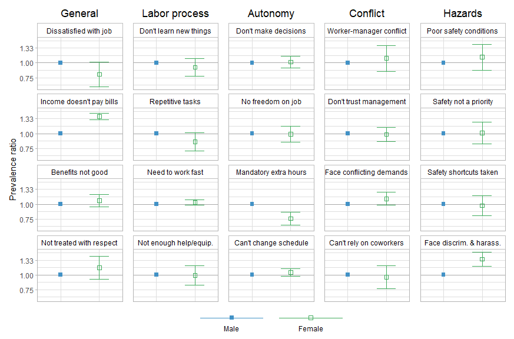<!-- -->

```r
#table of estimates
tabled(1:20, "Ref: male")
```

<div style="border: 1px solid #ddd; padding: 0px; overflow-y: scroll; height:250px; overflow-x: scroll; width:100%; "><table class="table table-striped" style="margin-left: auto; margin-right: auto;">
<caption>Ref: male</caption>
 <thead>
  <tr>
   <th style="text-align:right;position: sticky; top:0; background-color: #FFFFFF;"> QWL variable </th>
   <th style="text-align:right;position: sticky; top:0; background-color: #FFFFFF;"> Class </th>
   <th style="text-align:right;position: sticky; top:0; background-color: #FFFFFF;"> PR </th>
   <th style="text-align:left;position: sticky; top:0; background-color: #FFFFFF;"> Lower </th>
   <th style="text-align:left;position: sticky; top:0; background-color: #FFFFFF;"> Upper </th>
   <th style="text-align:left;position: sticky; top:0; background-color: #FFFFFF;"> Type </th>
  </tr>
 </thead>
<tbody>
  <tr>
   <td style="text-align:right;"> 0.80 </td>
   <td style="text-align:right;"> 0.62 </td>
   <td style="text-align:right;"> 1.02 </td>
   <td style="text-align:left;"> satjob1_bin_unimp </td>
   <td style="text-align:left;"> Female </td>
   <td style="text-align:left;"> General </td>
  </tr>
  <tr>
   <td style="text-align:right;"> 1.40 </td>
   <td style="text-align:right;"> 1.31 </td>
   <td style="text-align:right;"> 1.49 </td>
   <td style="text-align:left;"> rincblls_bin_unimp </td>
   <td style="text-align:left;"> Female </td>
   <td style="text-align:left;"> General </td>
  </tr>
  <tr>
   <td style="text-align:right;"> 1.07 </td>
   <td style="text-align:right;"> 0.95 </td>
   <td style="text-align:right;"> 1.21 </td>
   <td style="text-align:left;"> fringeok_bin_unimp </td>
   <td style="text-align:left;"> Female </td>
   <td style="text-align:left;"> General </td>
  </tr>
  <tr>
   <td style="text-align:right;"> 1.15 </td>
   <td style="text-align:right;"> 0.92 </td>
   <td style="text-align:right;"> 1.43 </td>
   <td style="text-align:left;"> respect_bin_unimp </td>
   <td style="text-align:left;"> Female </td>
   <td style="text-align:left;"> General </td>
  </tr>
  <tr>
   <td style="text-align:right;"> 0.92 </td>
   <td style="text-align:right;"> 0.77 </td>
   <td style="text-align:right;"> 1.09 </td>
   <td style="text-align:left;"> learnnew_bin_unimp </td>
   <td style="text-align:left;"> Female </td>
   <td style="text-align:left;"> Labor process </td>
  </tr>
  <tr>
   <td style="text-align:right;"> 0.85 </td>
   <td style="text-align:right;"> 0.71 </td>
   <td style="text-align:right;"> 1.02 </td>
   <td style="text-align:left;"> workdiff_bin_unimp </td>
   <td style="text-align:left;"> Female </td>
   <td style="text-align:left;"> Labor process </td>
  </tr>
  <tr>
   <td style="text-align:right;"> 1.04 </td>
   <td style="text-align:right;"> 0.98 </td>
   <td style="text-align:right;"> 1.10 </td>
   <td style="text-align:left;"> workfast_bin_unimp </td>
   <td style="text-align:left;"> Female </td>
   <td style="text-align:left;"> Labor process </td>
  </tr>
  <tr>
   <td style="text-align:right;"> 0.99 </td>
   <td style="text-align:right;"> 0.82 </td>
   <td style="text-align:right;"> 1.19 </td>
   <td style="text-align:left;"> hlpequip_bin_unimp </td>
   <td style="text-align:left;"> Female </td>
   <td style="text-align:left;"> Labor process </td>
  </tr>
  <tr>
   <td style="text-align:right;"> 1.02 </td>
   <td style="text-align:right;"> 0.91 </td>
   <td style="text-align:right;"> 1.14 </td>
   <td style="text-align:left;"> wkdecide_bin_unimp </td>
   <td style="text-align:left;"> Female </td>
   <td style="text-align:left;"> Autonomy </td>
  </tr>
  <tr>
   <td style="text-align:right;"> 0.99 </td>
   <td style="text-align:right;"> 0.85 </td>
   <td style="text-align:right;"> 1.16 </td>
   <td style="text-align:left;"> wkfreedm_bin_unimp </td>
   <td style="text-align:left;"> Female </td>
   <td style="text-align:left;"> Autonomy </td>
  </tr>
  <tr>
   <td style="text-align:right;"> 0.75 </td>
   <td style="text-align:right;"> 0.66 </td>
   <td style="text-align:right;"> 0.86 </td>
   <td style="text-align:left;"> mustwork_bin_unimp </td>
   <td style="text-align:left;"> Female </td>
   <td style="text-align:left;"> Autonomy </td>
  </tr>
  <tr>
   <td style="text-align:right;"> 1.05 </td>
   <td style="text-align:right;"> 0.97 </td>
   <td style="text-align:right;"> 1.13 </td>
   <td style="text-align:left;"> chngtme_bin_unimp </td>
   <td style="text-align:left;"> Female </td>
   <td style="text-align:left;"> Autonomy </td>
  </tr>
  <tr>
   <td style="text-align:right;"> 1.09 </td>
   <td style="text-align:right;"> 0.85 </td>
   <td style="text-align:right;"> 1.40 </td>
   <td style="text-align:left;"> manvsemp_bin_unimp </td>
   <td style="text-align:left;"> Female </td>
   <td style="text-align:left;"> Conflict </td>
  </tr>
  <tr>
   <td style="text-align:right;"> 0.98 </td>
   <td style="text-align:right;"> 0.86 </td>
   <td style="text-align:right;"> 1.13 </td>
   <td style="text-align:left;"> trustman_bin_unimp </td>
   <td style="text-align:left;"> Female </td>
   <td style="text-align:left;"> Conflict </td>
  </tr>
  <tr>
   <td style="text-align:right;"> 1.11 </td>
   <td style="text-align:right;"> 0.98 </td>
   <td style="text-align:right;"> 1.26 </td>
   <td style="text-align:left;"> condemnd_bin_unimp </td>
   <td style="text-align:left;"> Female </td>
   <td style="text-align:left;"> Conflict </td>
  </tr>
  <tr>
   <td style="text-align:right;"> 0.96 </td>
   <td style="text-align:right;"> 0.77 </td>
   <td style="text-align:right;"> 1.20 </td>
   <td style="text-align:left;"> cowrkhlp_bin_unimp </td>
   <td style="text-align:left;"> Female </td>
   <td style="text-align:left;"> Conflict </td>
  </tr>
  <tr>
   <td style="text-align:right;"> 1.12 </td>
   <td style="text-align:right;"> 0.87 </td>
   <td style="text-align:right;"> 1.44 </td>
   <td style="text-align:left;"> safehlth_bin_unimp </td>
   <td style="text-align:left;"> Female </td>
   <td style="text-align:left;"> Hazards </td>
  </tr>
  <tr>
   <td style="text-align:right;"> 1.01 </td>
   <td style="text-align:right;"> 0.82 </td>
   <td style="text-align:right;"> 1.26 </td>
   <td style="text-align:left;"> safetywk_bin_unimp </td>
   <td style="text-align:left;"> Female </td>
   <td style="text-align:left;"> Hazards </td>
  </tr>
  <tr>
   <td style="text-align:right;"> 0.97 </td>
   <td style="text-align:right;"> 0.80 </td>
   <td style="text-align:right;"> 1.19 </td>
   <td style="text-align:left;"> safefrst_bin_unimp </td>
   <td style="text-align:left;"> Female </td>
   <td style="text-align:left;"> Hazards </td>
  </tr>
  <tr>
   <td style="text-align:right;"> 1.36 </td>
   <td style="text-align:right;"> 1.18 </td>
   <td style="text-align:right;"> 1.56 </td>
   <td style="text-align:left;"> disc_haras_unimp </td>
   <td style="text-align:left;"> Female </td>
   <td style="text-align:left;"> Hazards </td>
  </tr>
</tbody>
</table></div>

### Race


```r
#run regression
less_adj <- mysvy(subset(svy_dat_mi, class=="Workers"), c(36:55), "~race_h + rcs(age, 3) + rcs(year, 3)")

#pull into matrix
regs_less <- matrix_func(20, 4, 36:55)
  
#format matrix
binded <- formatted(c("NH Black", "NH other", "Hispanic"), 20, 
                    c("satjob1_bin_unimp", "rincblls_bin_unimp", "fringeok_bin_unimp", "respect_bin_unimp",  
                      "learnnew_bin_unimp", "workdiff_bin_unimp", "workfast_bin_unimp", "hlpequip_bin_unimp", 
                      "wkdecide_bin_unimp", "wkfreedm_bin_unimp", "mustwork_bin_unimp", "chngtme_bin_unimp",  
                      "manvsemp_bin_unimp", "trustman_bin_unimp", "condemnd_bin_unimp", "cowrkhlp_bin_unimp", 
                      "safehlth_bin_unimp", "safetywk_bin_unimp", "safefrst_bin_unimp", "disc_haras_unimp"),
                    "NH white",
                    c("NH white", "NH Black", "NH other", "Hispanic"))
```


```r
#plot of estimates
(plotted(rows=c(1:12,61:64), xaxis=Class, limitsvec=c(0.30, 2.78), breaksvec=c(0.6, 1, 1.666667, 1.666667^2), 
        cols=c(brewer.pal(8, "Blues")[c(6)], brewer.pal(8, "Greens")[c(6)], brewer.pal(8, "Purples")[c(6)], brewer.pal(8, "Greys")[c(6)]), shapes=c(15, 0, 12, 4))  + 
  plotted(rows=c(13:24,65:68), xaxis=Class, limitsvec=c(0.30, 2.78), breaksvec=c(0.6, 1, 1.666667, 1.666667^2), 
          cols=c(brewer.pal(8, "Blues")[c(6)], brewer.pal(8, "Greens")[c(6)], brewer.pal(8, "Purples")[c(6)], brewer.pal(8, "Greys")[c(6)]), shapes=c(15, 0, 12, 4))  + 
    theme(axis.title.y=element_blank(), axis.text.y=element_blank(), axis.ticks.y=element_blank()) + 
  plotted(rows=c(25:36,69:72), xaxis=Class, limitsvec=c(0.30, 2.78), breaksvec=c(0.6, 1, 1.666667, 1.666667^2), 
          cols=c(brewer.pal(8, "Blues")[c(6)], brewer.pal(8, "Greens")[c(6)], brewer.pal(8, "Purples")[c(6)], brewer.pal(8, "Greys")[c(6)]), shapes=c(15, 0, 12, 4))  + 
    theme(axis.title.y=element_blank(), axis.text.y=element_blank(), axis.ticks.y=element_blank()) + 
  plotted(rows=c(37:48,73:76), xaxis=Class, limitsvec=c(0.30, 2.78), breaksvec=c(0.6, 1, 1.666667, 1.666667^2), 
          cols=c(brewer.pal(8, "Blues")[c(6)], brewer.pal(8, "Greens")[c(6)], brewer.pal(8, "Purples")[c(6)], brewer.pal(8, "Greys")[c(6)]), shapes=c(15, 0, 12, 4))  + 
    theme(axis.title.y=element_blank(), axis.text.y=element_blank(), axis.ticks.y=element_blank()) + 
  plotted(rows=c(49:60,77:80), xaxis=Class, limitsvec=c(0.30, 2.78), breaksvec=c(0.6, 1, 1.666667, 1.666667^2), 
          cols=c(brewer.pal(8, "Blues")[c(6)], brewer.pal(8, "Greens")[c(6)], brewer.pal(8, "Purples")[c(6)], brewer.pal(8, "Greys")[c(6)]), shapes=c(15, 0, 12, 4))  + 
    theme(axis.title.y=element_blank(), axis.text.y=element_blank(), axis.ticks.y=element_blank()) +    
  plot_layout(ncol=5)) /
  legends(rows=c(1:3,61), xaxis=Class, cols=c(brewer.pal(8, "Blues")[c(6)], brewer.pal(8, "Greens")[c(6)], brewer.pal(8, "Purples")[c(6)], brewer.pal(8, "Greys")[c(6)]),
          shapes=c(15, 0, 12, 4), nrow=1) +
  plot_layout(heights=c(1,0.1))
```

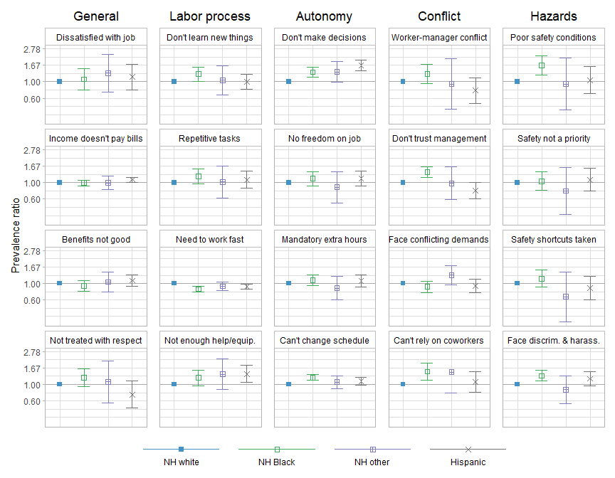<!-- -->

```r
#table of estimates
tabled(1:60, "Ref: white")
```

<div style="border: 1px solid #ddd; padding: 0px; overflow-y: scroll; height:250px; overflow-x: scroll; width:100%; "><table class="table table-striped" style="margin-left: auto; margin-right: auto;">
<caption>Ref: white</caption>
 <thead>
  <tr>
   <th style="text-align:right;position: sticky; top:0; background-color: #FFFFFF;"> QWL variable </th>
   <th style="text-align:right;position: sticky; top:0; background-color: #FFFFFF;"> Class </th>
   <th style="text-align:right;position: sticky; top:0; background-color: #FFFFFF;"> PR </th>
   <th style="text-align:left;position: sticky; top:0; background-color: #FFFFFF;"> Lower </th>
   <th style="text-align:left;position: sticky; top:0; background-color: #FFFFFF;"> Upper </th>
   <th style="text-align:left;position: sticky; top:0; background-color: #FFFFFF;"> Type </th>
  </tr>
 </thead>
<tbody>
  <tr>
   <td style="text-align:right;"> 1.08 </td>
   <td style="text-align:right;"> 0.77 </td>
   <td style="text-align:right;"> 1.51 </td>
   <td style="text-align:left;"> satjob1_bin_unimp </td>
   <td style="text-align:left;"> NH Black </td>
   <td style="text-align:left;"> General </td>
  </tr>
  <tr>
   <td style="text-align:right;"> 1.31 </td>
   <td style="text-align:right;"> 0.73 </td>
   <td style="text-align:right;"> 2.33 </td>
   <td style="text-align:left;"> satjob1_bin_unimp </td>
   <td style="text-align:left;"> NH other </td>
   <td style="text-align:left;"> General </td>
  </tr>
  <tr>
   <td style="text-align:right;"> 1.16 </td>
   <td style="text-align:right;"> 0.78 </td>
   <td style="text-align:right;"> 1.73 </td>
   <td style="text-align:left;"> satjob1_bin_unimp </td>
   <td style="text-align:left;"> Hispanic </td>
   <td style="text-align:left;"> General </td>
  </tr>
  <tr>
   <td style="text-align:right;"> 0.99 </td>
   <td style="text-align:right;"> 0.91 </td>
   <td style="text-align:right;"> 1.09 </td>
   <td style="text-align:left;"> rincblls_bin_unimp </td>
   <td style="text-align:left;"> NH Black </td>
   <td style="text-align:left;"> General </td>
  </tr>
  <tr>
   <td style="text-align:right;"> 1.00 </td>
   <td style="text-align:right;"> 0.81 </td>
   <td style="text-align:right;"> 1.22 </td>
   <td style="text-align:left;"> rincblls_bin_unimp </td>
   <td style="text-align:left;"> NH other </td>
   <td style="text-align:left;"> General </td>
  </tr>
  <tr>
   <td style="text-align:right;"> 1.10 </td>
   <td style="text-align:right;"> 1.01 </td>
   <td style="text-align:right;"> 1.19 </td>
   <td style="text-align:left;"> rincblls_bin_unimp </td>
   <td style="text-align:left;"> Hispanic </td>
   <td style="text-align:left;"> General </td>
  </tr>
  <tr>
   <td style="text-align:right;"> 0.93 </td>
   <td style="text-align:right;"> 0.78 </td>
   <td style="text-align:right;"> 1.09 </td>
   <td style="text-align:left;"> fringeok_bin_unimp </td>
   <td style="text-align:left;"> NH Black </td>
   <td style="text-align:left;"> General </td>
  </tr>
  <tr>
   <td style="text-align:right;"> 1.05 </td>
   <td style="text-align:right;"> 0.76 </td>
   <td style="text-align:right;"> 1.43 </td>
   <td style="text-align:left;"> fringeok_bin_unimp </td>
   <td style="text-align:left;"> NH other </td>
   <td style="text-align:left;"> General </td>
  </tr>
  <tr>
   <td style="text-align:right;"> 1.10 </td>
   <td style="text-align:right;"> 0.92 </td>
   <td style="text-align:right;"> 1.32 </td>
   <td style="text-align:left;"> fringeok_bin_unimp </td>
   <td style="text-align:left;"> Hispanic </td>
   <td style="text-align:left;"> General </td>
  </tr>
  <tr>
   <td style="text-align:right;"> 1.23 </td>
   <td style="text-align:right;"> 0.94 </td>
   <td style="text-align:right;"> 1.62 </td>
   <td style="text-align:left;"> respect_bin_unimp </td>
   <td style="text-align:left;"> NH Black </td>
   <td style="text-align:left;"> General </td>
  </tr>
  <tr>
   <td style="text-align:right;"> 1.08 </td>
   <td style="text-align:right;"> 0.56 </td>
   <td style="text-align:right;"> 2.07 </td>
   <td style="text-align:left;"> respect_bin_unimp </td>
   <td style="text-align:left;"> NH other </td>
   <td style="text-align:left;"> General </td>
  </tr>
  <tr>
   <td style="text-align:right;"> 0.73 </td>
   <td style="text-align:right;"> 0.48 </td>
   <td style="text-align:right;"> 1.11 </td>
   <td style="text-align:left;"> respect_bin_unimp </td>
   <td style="text-align:left;"> Hispanic </td>
   <td style="text-align:left;"> General </td>
  </tr>
  <tr>
   <td style="text-align:right;"> 1.27 </td>
   <td style="text-align:right;"> 1.02 </td>
   <td style="text-align:right;"> 1.59 </td>
   <td style="text-align:left;"> learnnew_bin_unimp </td>
   <td style="text-align:left;"> NH Black </td>
   <td style="text-align:left;"> Labor process </td>
  </tr>
  <tr>
   <td style="text-align:right;"> 1.05 </td>
   <td style="text-align:right;"> 0.66 </td>
   <td style="text-align:right;"> 1.66 </td>
   <td style="text-align:left;"> learnnew_bin_unimp </td>
   <td style="text-align:left;"> NH other </td>
   <td style="text-align:left;"> Labor process </td>
  </tr>
  <tr>
   <td style="text-align:right;"> 0.99 </td>
   <td style="text-align:right;"> 0.79 </td>
   <td style="text-align:right;"> 1.25 </td>
   <td style="text-align:left;"> learnnew_bin_unimp </td>
   <td style="text-align:left;"> Hispanic </td>
   <td style="text-align:left;"> Labor process </td>
  </tr>
  <tr>
   <td style="text-align:right;"> 1.22 </td>
   <td style="text-align:right;"> 0.97 </td>
   <td style="text-align:right;"> 1.52 </td>
   <td style="text-align:left;"> workdiff_bin_unimp </td>
   <td style="text-align:left;"> NH Black </td>
   <td style="text-align:left;"> Labor process </td>
  </tr>
  <tr>
   <td style="text-align:right;"> 1.02 </td>
   <td style="text-align:right;"> 0.61 </td>
   <td style="text-align:right;"> 1.69 </td>
   <td style="text-align:left;"> workdiff_bin_unimp </td>
   <td style="text-align:left;"> NH other </td>
   <td style="text-align:left;"> Labor process </td>
  </tr>
  <tr>
   <td style="text-align:right;"> 1.09 </td>
   <td style="text-align:right;"> 0.84 </td>
   <td style="text-align:right;"> 1.42 </td>
   <td style="text-align:left;"> workdiff_bin_unimp </td>
   <td style="text-align:left;"> Hispanic </td>
   <td style="text-align:left;"> Labor process </td>
  </tr>
  <tr>
   <td style="text-align:right;"> 0.84 </td>
   <td style="text-align:right;"> 0.77 </td>
   <td style="text-align:right;"> 0.91 </td>
   <td style="text-align:left;"> workfast_bin_unimp </td>
   <td style="text-align:left;"> NH Black </td>
   <td style="text-align:left;"> Labor process </td>
  </tr>
  <tr>
   <td style="text-align:right;"> 0.92 </td>
   <td style="text-align:right;"> 0.81 </td>
   <td style="text-align:right;"> 1.05 </td>
   <td style="text-align:left;"> workfast_bin_unimp </td>
   <td style="text-align:left;"> NH other </td>
   <td style="text-align:left;"> Labor process </td>
  </tr>
  <tr>
   <td style="text-align:right;"> 0.91 </td>
   <td style="text-align:right;"> 0.84 </td>
   <td style="text-align:right;"> 0.98 </td>
   <td style="text-align:left;"> workfast_bin_unimp </td>
   <td style="text-align:left;"> Hispanic </td>
   <td style="text-align:left;"> Labor process </td>
  </tr>
  <tr>
   <td style="text-align:right;"> 1.23 </td>
   <td style="text-align:right;"> 0.97 </td>
   <td style="text-align:right;"> 1.57 </td>
   <td style="text-align:left;"> hlpequip_bin_unimp </td>
   <td style="text-align:left;"> NH Black </td>
   <td style="text-align:left;"> Labor process </td>
  </tr>
  <tr>
   <td style="text-align:right;"> 1.38 </td>
   <td style="text-align:right;"> 0.86 </td>
   <td style="text-align:right;"> 2.22 </td>
   <td style="text-align:left;"> hlpequip_bin_unimp </td>
   <td style="text-align:left;"> NH other </td>
   <td style="text-align:left;"> Labor process </td>
  </tr>
  <tr>
   <td style="text-align:right;"> 1.38 </td>
   <td style="text-align:right;"> 1.06 </td>
   <td style="text-align:right;"> 1.80 </td>
   <td style="text-align:left;"> hlpequip_bin_unimp </td>
   <td style="text-align:left;"> Hispanic </td>
   <td style="text-align:left;"> Labor process </td>
  </tr>
  <tr>
   <td style="text-align:right;"> 1.35 </td>
   <td style="text-align:right;"> 1.15 </td>
   <td style="text-align:right;"> 1.58 </td>
   <td style="text-align:left;"> wkdecide_bin_unimp </td>
   <td style="text-align:left;"> NH Black </td>
   <td style="text-align:left;"> Autonomy </td>
  </tr>
  <tr>
   <td style="text-align:right;"> 1.36 </td>
   <td style="text-align:right;"> 0.99 </td>
   <td style="text-align:right;"> 1.86 </td>
   <td style="text-align:left;"> wkdecide_bin_unimp </td>
   <td style="text-align:left;"> NH other </td>
   <td style="text-align:left;"> Autonomy </td>
  </tr>
  <tr>
   <td style="text-align:right;"> 1.66 </td>
   <td style="text-align:right;"> 1.41 </td>
   <td style="text-align:right;"> 1.95 </td>
   <td style="text-align:left;"> wkdecide_bin_unimp </td>
   <td style="text-align:left;"> Hispanic </td>
   <td style="text-align:left;"> Autonomy </td>
  </tr>
  <tr>
   <td style="text-align:right;"> 1.13 </td>
   <td style="text-align:right;"> 0.91 </td>
   <td style="text-align:right;"> 1.40 </td>
   <td style="text-align:left;"> wkfreedm_bin_unimp </td>
   <td style="text-align:left;"> NH Black </td>
   <td style="text-align:left;"> Autonomy </td>
  </tr>
  <tr>
   <td style="text-align:right;"> 0.87 </td>
   <td style="text-align:right;"> 0.53 </td>
   <td style="text-align:right;"> 1.41 </td>
   <td style="text-align:left;"> wkfreedm_bin_unimp </td>
   <td style="text-align:left;"> NH other </td>
   <td style="text-align:left;"> Autonomy </td>
  </tr>
  <tr>
   <td style="text-align:right;"> 1.14 </td>
   <td style="text-align:right;"> 0.90 </td>
   <td style="text-align:right;"> 1.45 </td>
   <td style="text-align:left;"> wkfreedm_bin_unimp </td>
   <td style="text-align:left;"> Hispanic </td>
   <td style="text-align:left;"> Autonomy </td>
  </tr>
  <tr>
   <td style="text-align:right;"> 1.11 </td>
   <td style="text-align:right;"> 0.94 </td>
   <td style="text-align:right;"> 1.31 </td>
   <td style="text-align:left;"> mustwork_bin_unimp </td>
   <td style="text-align:left;"> NH Black </td>
   <td style="text-align:left;"> Autonomy </td>
  </tr>
  <tr>
   <td style="text-align:right;"> 0.87 </td>
   <td style="text-align:right;"> 0.60 </td>
   <td style="text-align:right;"> 1.25 </td>
   <td style="text-align:left;"> mustwork_bin_unimp </td>
   <td style="text-align:left;"> NH other </td>
   <td style="text-align:left;"> Autonomy </td>
  </tr>
  <tr>
   <td style="text-align:right;"> 1.09 </td>
   <td style="text-align:right;"> 0.89 </td>
   <td style="text-align:right;"> 1.32 </td>
   <td style="text-align:left;"> mustwork_bin_unimp </td>
   <td style="text-align:left;"> Hispanic </td>
   <td style="text-align:left;"> Autonomy </td>
  </tr>
  <tr>
   <td style="text-align:right;"> 1.24 </td>
   <td style="text-align:right;"> 1.13 </td>
   <td style="text-align:right;"> 1.36 </td>
   <td style="text-align:left;"> chngtme_bin_unimp </td>
   <td style="text-align:left;"> NH Black </td>
   <td style="text-align:left;"> Autonomy </td>
  </tr>
  <tr>
   <td style="text-align:right;"> 1.08 </td>
   <td style="text-align:right;"> 0.88 </td>
   <td style="text-align:right;"> 1.32 </td>
   <td style="text-align:left;"> chngtme_bin_unimp </td>
   <td style="text-align:left;"> NH other </td>
   <td style="text-align:left;"> Autonomy </td>
  </tr>
  <tr>
   <td style="text-align:right;"> 1.11 </td>
   <td style="text-align:right;"> 0.99 </td>
   <td style="text-align:right;"> 1.24 </td>
   <td style="text-align:left;"> chngtme_bin_unimp </td>
   <td style="text-align:left;"> Hispanic </td>
   <td style="text-align:left;"> Autonomy </td>
  </tr>
  <tr>
   <td style="text-align:right;"> 1.28 </td>
   <td style="text-align:right;"> 0.95 </td>
   <td style="text-align:right;"> 1.71 </td>
   <td style="text-align:left;"> manvsemp_bin_unimp </td>
   <td style="text-align:left;"> NH Black </td>
   <td style="text-align:left;"> Conflict </td>
  </tr>
  <tr>
   <td style="text-align:right;"> 0.93 </td>
   <td style="text-align:right;"> 0.43 </td>
   <td style="text-align:right;"> 2.04 </td>
   <td style="text-align:left;"> manvsemp_bin_unimp </td>
   <td style="text-align:left;"> NH other </td>
   <td style="text-align:left;"> Conflict </td>
  </tr>
  <tr>
   <td style="text-align:right;"> 0.76 </td>
   <td style="text-align:right;"> 0.51 </td>
   <td style="text-align:right;"> 1.14 </td>
   <td style="text-align:left;"> manvsemp_bin_unimp </td>
   <td style="text-align:left;"> Hispanic </td>
   <td style="text-align:left;"> Conflict </td>
  </tr>
  <tr>
   <td style="text-align:right;"> 1.38 </td>
   <td style="text-align:right;"> 1.18 </td>
   <td style="text-align:right;"> 1.63 </td>
   <td style="text-align:left;"> trustman_bin_unimp </td>
   <td style="text-align:left;"> NH Black </td>
   <td style="text-align:left;"> Conflict </td>
  </tr>
  <tr>
   <td style="text-align:right;"> 0.98 </td>
   <td style="text-align:right;"> 0.59 </td>
   <td style="text-align:right;"> 1.63 </td>
   <td style="text-align:left;"> trustman_bin_unimp </td>
   <td style="text-align:left;"> NH other </td>
   <td style="text-align:left;"> Conflict </td>
  </tr>
  <tr>
   <td style="text-align:right;"> 0.78 </td>
   <td style="text-align:right;"> 0.61 </td>
   <td style="text-align:right;"> 1.01 </td>
   <td style="text-align:left;"> trustman_bin_unimp </td>
   <td style="text-align:left;"> Hispanic </td>
   <td style="text-align:left;"> Conflict </td>
  </tr>
  <tr>
   <td style="text-align:right;"> 0.90 </td>
   <td style="text-align:right;"> 0.76 </td>
   <td style="text-align:right;"> 1.08 </td>
   <td style="text-align:left;"> condemnd_bin_unimp </td>
   <td style="text-align:left;"> NH Black </td>
   <td style="text-align:left;"> Conflict </td>
  </tr>
  <tr>
   <td style="text-align:right;"> 1.29 </td>
   <td style="text-align:right;"> 0.97 </td>
   <td style="text-align:right;"> 1.73 </td>
   <td style="text-align:left;"> condemnd_bin_unimp </td>
   <td style="text-align:left;"> NH other </td>
   <td style="text-align:left;"> Conflict </td>
  </tr>
  <tr>
   <td style="text-align:right;"> 0.93 </td>
   <td style="text-align:right;"> 0.76 </td>
   <td style="text-align:right;"> 1.15 </td>
   <td style="text-align:left;"> condemnd_bin_unimp </td>
   <td style="text-align:left;"> Hispanic </td>
   <td style="text-align:left;"> Conflict </td>
  </tr>
  <tr>
   <td style="text-align:right;"> 1.49 </td>
   <td style="text-align:right;"> 1.14 </td>
   <td style="text-align:right;"> 1.94 </td>
   <td style="text-align:left;"> cowrkhlp_bin_unimp </td>
   <td style="text-align:left;"> NH Black </td>
   <td style="text-align:left;"> Conflict </td>
  </tr>
  <tr>
   <td style="text-align:right;"> 1.47 </td>
   <td style="text-align:right;"> 0.77 </td>
   <td style="text-align:right;"> 2.78 </td>
   <td style="text-align:left;"> cowrkhlp_bin_unimp </td>
   <td style="text-align:left;"> NH other </td>
   <td style="text-align:left;"> Conflict </td>
  </tr>
  <tr>
   <td style="text-align:right;"> 1.07 </td>
   <td style="text-align:right;"> 0.78 </td>
   <td style="text-align:right;"> 1.48 </td>
   <td style="text-align:left;"> cowrkhlp_bin_unimp </td>
   <td style="text-align:left;"> Hispanic </td>
   <td style="text-align:left;"> Conflict </td>
  </tr>
  <tr>
   <td style="text-align:right;"> 1.67 </td>
   <td style="text-align:right;"> 1.24 </td>
   <td style="text-align:right;"> 2.23 </td>
   <td style="text-align:left;"> safehlth_bin_unimp </td>
   <td style="text-align:left;"> NH Black </td>
   <td style="text-align:left;"> Hazards </td>
  </tr>
  <tr>
   <td style="text-align:right;"> 0.93 </td>
   <td style="text-align:right;"> 0.41 </td>
   <td style="text-align:right;"> 2.08 </td>
   <td style="text-align:left;"> safehlth_bin_unimp </td>
   <td style="text-align:left;"> NH other </td>
   <td style="text-align:left;"> Hazards </td>
  </tr>
  <tr>
   <td style="text-align:right;"> 1.05 </td>
   <td style="text-align:right;"> 0.69 </td>
   <td style="text-align:right;"> 1.60 </td>
   <td style="text-align:left;"> safehlth_bin_unimp </td>
   <td style="text-align:left;"> Hispanic </td>
   <td style="text-align:left;"> Hazards </td>
  </tr>
  <tr>
   <td style="text-align:right;"> 1.05 </td>
   <td style="text-align:right;"> 0.78 </td>
   <td style="text-align:right;"> 1.40 </td>
   <td style="text-align:left;"> safetywk_bin_unimp </td>
   <td style="text-align:left;"> NH Black </td>
   <td style="text-align:left;"> Hazards </td>
  </tr>
  <tr>
   <td style="text-align:right;"> 0.77 </td>
   <td style="text-align:right;"> 0.37 </td>
   <td style="text-align:right;"> 1.60 </td>
   <td style="text-align:left;"> safetywk_bin_unimp </td>
   <td style="text-align:left;"> NH other </td>
   <td style="text-align:left;"> Hazards </td>
  </tr>
  <tr>
   <td style="text-align:right;"> 1.09 </td>
   <td style="text-align:right;"> 0.77 </td>
   <td style="text-align:right;"> 1.55 </td>
   <td style="text-align:left;"> safetywk_bin_unimp </td>
   <td style="text-align:left;"> Hispanic </td>
   <td style="text-align:left;"> Hazards </td>
  </tr>
  <tr>
   <td style="text-align:right;"> 1.16 </td>
   <td style="text-align:right;"> 0.89 </td>
   <td style="text-align:right;"> 1.52 </td>
   <td style="text-align:left;"> safefrst_bin_unimp </td>
   <td style="text-align:left;"> NH Black </td>
   <td style="text-align:left;"> Hazards </td>
  </tr>
  <tr>
   <td style="text-align:right;"> 0.66 </td>
   <td style="text-align:right;"> 0.31 </td>
   <td style="text-align:right;"> 1.44 </td>
   <td style="text-align:left;"> safefrst_bin_unimp </td>
   <td style="text-align:left;"> NH other </td>
   <td style="text-align:left;"> Hazards </td>
  </tr>
  <tr>
   <td style="text-align:right;"> 0.87 </td>
   <td style="text-align:right;"> 0.61 </td>
   <td style="text-align:right;"> 1.25 </td>
   <td style="text-align:left;"> safefrst_bin_unimp </td>
   <td style="text-align:left;"> Hispanic </td>
   <td style="text-align:left;"> Hazards </td>
  </tr>
  <tr>
   <td style="text-align:right;"> 1.31 </td>
   <td style="text-align:right;"> 1.11 </td>
   <td style="text-align:right;"> 1.54 </td>
   <td style="text-align:left;"> disc_haras_unimp </td>
   <td style="text-align:left;"> NH Black </td>
   <td style="text-align:left;"> Hazards </td>
  </tr>
  <tr>
   <td style="text-align:right;"> 0.85 </td>
   <td style="text-align:right;"> 0.55 </td>
   <td style="text-align:right;"> 1.32 </td>
   <td style="text-align:left;"> disc_haras_unimp </td>
   <td style="text-align:left;"> NH other </td>
   <td style="text-align:left;"> Hazards </td>
  </tr>
  <tr>
   <td style="text-align:right;"> 1.20 </td>
   <td style="text-align:right;"> 0.96 </td>
   <td style="text-align:right;"> 1.49 </td>
   <td style="text-align:left;"> disc_haras_unimp </td>
   <td style="text-align:left;"> Hispanic </td>
   <td style="text-align:left;"> Hazards </td>
  </tr>
</tbody>
</table></div>

### Gender-race interaction


```r
#run regression
less_adj <- mysvy(subset(svy_dat_mi, class=="Workers"), 36:55, "~race_h_gender + rcs(age, 3) + rcs(year, 3)")

#pull into matrix
regs_less <- matrix_func(20, 8, 36:55)

#format matrix
binded <- formatted(c("NH white women", "NH Black men", "NH Black women", "NH other men", "NH other women", "Hispanic men", "Hispanic women"), 20, 
                    c("satjob1_bin_unimp", "rincblls_bin_unimp", "fringeok_bin_unimp", "respect_bin_unimp",  
                      "learnnew_bin_unimp", "workdiff_bin_unimp", "workfast_bin_unimp", "hlpequip_bin_unimp", 
                      "wkdecide_bin_unimp", "wkfreedm_bin_unimp", "mustwork_bin_unimp", "chngtme_bin_unimp",  
                      "manvsemp_bin_unimp", "trustman_bin_unimp", "condemnd_bin_unimp", "cowrkhlp_bin_unimp", 
                      "safehlth_bin_unimp", "safetywk_bin_unimp", "safefrst_bin_unimp", "disc_haras_unimp"),
                    "NH white men",
                    c("NH white men" , "NH white women", "NH Black men", "NH Black women", "NH other men", "NH other women", "Hispanic men", "Hispanic women"))
```


```r
#plot estimates
(plotted(rows=c(1:28,141:144), xaxis=Class, limitsvec=c(0.06, 4.3), breaksvec=c(0.125, 0.25, 0.5, 1, 2), 
        cols=c(brewer.pal(8, "Blues")[c(6,8)], brewer.pal(8, "Greens")[c(6,8)], brewer.pal(8, "Purples")[c(6,8)], brewer.pal(8, "Greys")[c(6,8)]), shapes=c(15, 16, 0, 1, 12, 10, 4, 8))  + 
  plotted(rows=c(29:56,145:148), xaxis=Class, limitsvec=c(0.06, 4.3), breaksvec=c(0.125, 0.25, 0.5, 1, 2), 
        cols=c(brewer.pal(8, "Blues")[c(6,8)], brewer.pal(8, "Greens")[c(6,8)], brewer.pal(8, "Purples")[c(6,8)], brewer.pal(8, "Greys")[c(6,8)]), shapes=c(15, 16, 0, 1, 12, 10, 4, 8))  +  
    theme(axis.title.y=element_blank(), axis.text.y=element_blank(), axis.ticks.y=element_blank()) + 
  plotted(rows=c(57:84,149:152), xaxis=Class, limitsvec=c(0.06, 4.3), breaksvec=c(0.125, 0.25, 0.5, 1, 2), 
        cols=c(brewer.pal(8, "Blues")[c(6,8)], brewer.pal(8, "Greens")[c(6,8)], brewer.pal(8, "Purples")[c(6,8)], brewer.pal(8, "Greys")[c(6,8)]), shapes=c(15, 16, 0, 1, 12, 10, 4, 8))  + 
    theme(axis.title.y=element_blank(), axis.text.y=element_blank(), axis.ticks.y=element_blank()) + 
  plotted(rows=c(85:112,153:156), xaxis=Class, limitsvec=c(0.06, 4.3), breaksvec=c(0.125, 0.25, 0.5, 1, 2), 
        cols=c(brewer.pal(8, "Blues")[c(6,8)], brewer.pal(8, "Greens")[c(6,8)], brewer.pal(8, "Purples")[c(6,8)], brewer.pal(8, "Greys")[c(6,8)]), shapes=c(15, 16, 0, 1, 12, 10, 4, 8))  + 
    theme(axis.title.y=element_blank(), axis.text.y=element_blank(), axis.ticks.y=element_blank()) + 
  plotted(rows=c(113:140,157:160), xaxis=Class, limitsvec=c(0.06, 4.3), breaksvec=c(0.125, 0.25, 0.5, 1, 2), 
        cols=c(brewer.pal(8, "Blues")[c(6,8)], brewer.pal(8, "Greens")[c(6,8)], brewer.pal(8, "Purples")[c(6,8)], brewer.pal(8, "Greys")[c(6,8)]), shapes=c(15, 16, 0, 1, 12, 10, 4, 8))  + 
    theme(axis.title.y=element_blank(), axis.text.y=element_blank(), axis.ticks.y=element_blank()) + 
  plot_layout(ncol=5)) /
  legends(rows=c(1:7,141), xaxis=Class, cols=c(brewer.pal(8, "Blues")[c(6,8)], brewer.pal(8, "Greens")[c(6,8)], brewer.pal(8, "Purples")[c(6,8)], brewer.pal(8, "Greys")[c(6,8)]),
          shapes=c(15, 16, 0, 1, 12, 10, 4, 8), nrow=2) +
  plot_layout(heights=c(1,0.1))
```

<!-- -->

```r
#table of estimates
tabled(1:140, "Ref: white male")
```

<div style="border: 1px solid #ddd; padding: 0px; overflow-y: scroll; height:250px; overflow-x: scroll; width:100%; "><table class="table table-striped" style="margin-left: auto; margin-right: auto;">
<caption>Ref: white male</caption>
 <thead>
  <tr>
   <th style="text-align:right;position: sticky; top:0; background-color: #FFFFFF;"> QWL variable </th>
   <th style="text-align:right;position: sticky; top:0; background-color: #FFFFFF;"> Class </th>
   <th style="text-align:right;position: sticky; top:0; background-color: #FFFFFF;"> PR </th>
   <th style="text-align:left;position: sticky; top:0; background-color: #FFFFFF;"> Lower </th>
   <th style="text-align:left;position: sticky; top:0; background-color: #FFFFFF;"> Upper </th>
   <th style="text-align:left;position: sticky; top:0; background-color: #FFFFFF;"> Type </th>
  </tr>
 </thead>
<tbody>
  <tr>
   <td style="text-align:right;"> 0.75 </td>
   <td style="text-align:right;"> 0.56 </td>
   <td style="text-align:right;"> 1.01 </td>
   <td style="text-align:left;"> satjob1_bin_unimp </td>
   <td style="text-align:left;"> NH white women </td>
   <td style="text-align:left;"> General </td>
  </tr>
  <tr>
   <td style="text-align:right;"> 0.59 </td>
   <td style="text-align:right;"> 0.34 </td>
   <td style="text-align:right;"> 1.02 </td>
   <td style="text-align:left;"> satjob1_bin_unimp </td>
   <td style="text-align:left;"> NH Black men </td>
   <td style="text-align:left;"> General </td>
  </tr>
  <tr>
   <td style="text-align:right;"> 1.17 </td>
   <td style="text-align:right;"> 0.79 </td>
   <td style="text-align:right;"> 1.73 </td>
   <td style="text-align:left;"> satjob1_bin_unimp </td>
   <td style="text-align:left;"> NH Black women </td>
   <td style="text-align:left;"> General </td>
  </tr>
  <tr>
   <td style="text-align:right;"> 1.22 </td>
   <td style="text-align:right;"> 0.53 </td>
   <td style="text-align:right;"> 2.79 </td>
   <td style="text-align:left;"> satjob1_bin_unimp </td>
   <td style="text-align:left;"> NH other men </td>
   <td style="text-align:left;"> General </td>
  </tr>
  <tr>
   <td style="text-align:right;"> 1.07 </td>
   <td style="text-align:right;"> 0.48 </td>
   <td style="text-align:right;"> 2.35 </td>
   <td style="text-align:left;"> satjob1_bin_unimp </td>
   <td style="text-align:left;"> NH other women </td>
   <td style="text-align:left;"> General </td>
  </tr>
  <tr>
   <td style="text-align:right;"> 1.42 </td>
   <td style="text-align:right;"> 0.88 </td>
   <td style="text-align:right;"> 2.30 </td>
   <td style="text-align:left;"> satjob1_bin_unimp </td>
   <td style="text-align:left;"> Hispanic men </td>
   <td style="text-align:left;"> General </td>
  </tr>
  <tr>
   <td style="text-align:right;"> 0.58 </td>
   <td style="text-align:right;"> 0.31 </td>
   <td style="text-align:right;"> 1.08 </td>
   <td style="text-align:left;"> satjob1_bin_unimp </td>
   <td style="text-align:left;"> Hispanic women </td>
   <td style="text-align:left;"> General </td>
  </tr>
  <tr>
   <td style="text-align:right;"> 1.43 </td>
   <td style="text-align:right;"> 1.31 </td>
   <td style="text-align:right;"> 1.55 </td>
   <td style="text-align:left;"> rincblls_bin_unimp </td>
   <td style="text-align:left;"> NH white women </td>
   <td style="text-align:left;"> General </td>
  </tr>
  <tr>
   <td style="text-align:right;"> 0.99 </td>
   <td style="text-align:right;"> 0.84 </td>
   <td style="text-align:right;"> 1.18 </td>
   <td style="text-align:left;"> rincblls_bin_unimp </td>
   <td style="text-align:left;"> NH Black men </td>
   <td style="text-align:left;"> General </td>
  </tr>
  <tr>
   <td style="text-align:right;"> 1.38 </td>
   <td style="text-align:right;"> 1.24 </td>
   <td style="text-align:right;"> 1.55 </td>
   <td style="text-align:left;"> rincblls_bin_unimp </td>
   <td style="text-align:left;"> NH Black women </td>
   <td style="text-align:left;"> General </td>
  </tr>
  <tr>
   <td style="text-align:right;"> 1.05 </td>
   <td style="text-align:right;"> 0.74 </td>
   <td style="text-align:right;"> 1.50 </td>
   <td style="text-align:left;"> rincblls_bin_unimp </td>
   <td style="text-align:left;"> NH other men </td>
   <td style="text-align:left;"> General </td>
  </tr>
  <tr>
   <td style="text-align:right;"> 1.36 </td>
   <td style="text-align:right;"> 1.09 </td>
   <td style="text-align:right;"> 1.69 </td>
   <td style="text-align:left;"> rincblls_bin_unimp </td>
   <td style="text-align:left;"> NH other women </td>
   <td style="text-align:left;"> General </td>
  </tr>
  <tr>
   <td style="text-align:right;"> 1.15 </td>
   <td style="text-align:right;"> 0.99 </td>
   <td style="text-align:right;"> 1.34 </td>
   <td style="text-align:left;"> rincblls_bin_unimp </td>
   <td style="text-align:left;"> Hispanic men </td>
   <td style="text-align:left;"> General </td>
  </tr>
  <tr>
   <td style="text-align:right;"> 1.55 </td>
   <td style="text-align:right;"> 1.39 </td>
   <td style="text-align:right;"> 1.73 </td>
   <td style="text-align:left;"> rincblls_bin_unimp </td>
   <td style="text-align:left;"> Hispanic women </td>
   <td style="text-align:left;"> General </td>
  </tr>
  <tr>
   <td style="text-align:right;"> 1.07 </td>
   <td style="text-align:right;"> 0.93 </td>
   <td style="text-align:right;"> 1.23 </td>
   <td style="text-align:left;"> fringeok_bin_unimp </td>
   <td style="text-align:left;"> NH white women </td>
   <td style="text-align:left;"> General </td>
  </tr>
  <tr>
   <td style="text-align:right;"> 0.75 </td>
   <td style="text-align:right;"> 0.56 </td>
   <td style="text-align:right;"> 1.00 </td>
   <td style="text-align:left;"> fringeok_bin_unimp </td>
   <td style="text-align:left;"> NH Black men </td>
   <td style="text-align:left;"> General </td>
  </tr>
  <tr>
   <td style="text-align:right;"> 1.11 </td>
   <td style="text-align:right;"> 0.89 </td>
   <td style="text-align:right;"> 1.38 </td>
   <td style="text-align:left;"> fringeok_bin_unimp </td>
   <td style="text-align:left;"> NH Black women </td>
   <td style="text-align:left;"> General </td>
  </tr>
  <tr>
   <td style="text-align:right;"> 1.36 </td>
   <td style="text-align:right;"> 0.85 </td>
   <td style="text-align:right;"> 2.19 </td>
   <td style="text-align:left;"> fringeok_bin_unimp </td>
   <td style="text-align:left;"> NH other men </td>
   <td style="text-align:left;"> General </td>
  </tr>
  <tr>
   <td style="text-align:right;"> 0.87 </td>
   <td style="text-align:right;"> 0.54 </td>
   <td style="text-align:right;"> 1.40 </td>
   <td style="text-align:left;"> fringeok_bin_unimp </td>
   <td style="text-align:left;"> NH other women </td>
   <td style="text-align:left;"> General </td>
  </tr>
  <tr>
   <td style="text-align:right;"> 1.16 </td>
   <td style="text-align:right;"> 0.90 </td>
   <td style="text-align:right;"> 1.49 </td>
   <td style="text-align:left;"> fringeok_bin_unimp </td>
   <td style="text-align:left;"> Hispanic men </td>
   <td style="text-align:left;"> General </td>
  </tr>
  <tr>
   <td style="text-align:right;"> 1.12 </td>
   <td style="text-align:right;"> 0.88 </td>
   <td style="text-align:right;"> 1.43 </td>
   <td style="text-align:left;"> fringeok_bin_unimp </td>
   <td style="text-align:left;"> Hispanic women </td>
   <td style="text-align:left;"> General </td>
  </tr>
  <tr>
   <td style="text-align:right;"> 0.93 </td>
   <td style="text-align:right;"> 0.71 </td>
   <td style="text-align:right;"> 1.22 </td>
   <td style="text-align:left;"> respect_bin_unimp </td>
   <td style="text-align:left;"> NH white women </td>
   <td style="text-align:left;"> General </td>
  </tr>
  <tr>
   <td style="text-align:right;"> 0.87 </td>
   <td style="text-align:right;"> 0.55 </td>
   <td style="text-align:right;"> 1.37 </td>
   <td style="text-align:left;"> respect_bin_unimp </td>
   <td style="text-align:left;"> NH Black men </td>
   <td style="text-align:left;"> General </td>
  </tr>
  <tr>
   <td style="text-align:right;"> 1.40 </td>
   <td style="text-align:right;"> 0.99 </td>
   <td style="text-align:right;"> 1.97 </td>
   <td style="text-align:left;"> respect_bin_unimp </td>
   <td style="text-align:left;"> NH Black women </td>
   <td style="text-align:left;"> General </td>
  </tr>
  <tr>
   <td style="text-align:right;"> 0.25 </td>
   <td style="text-align:right;"> 0.06 </td>
   <td style="text-align:right;"> 1.06 </td>
   <td style="text-align:left;"> respect_bin_unimp </td>
   <td style="text-align:left;"> NH other men </td>
   <td style="text-align:left;"> General </td>
  </tr>
  <tr>
   <td style="text-align:right;"> 1.66 </td>
   <td style="text-align:right;"> 0.83 </td>
   <td style="text-align:right;"> 3.35 </td>
   <td style="text-align:left;"> respect_bin_unimp </td>
   <td style="text-align:left;"> NH other women </td>
   <td style="text-align:left;"> General </td>
  </tr>
  <tr>
   <td style="text-align:right;"> 0.62 </td>
   <td style="text-align:right;"> 0.34 </td>
   <td style="text-align:right;"> 1.13 </td>
   <td style="text-align:left;"> respect_bin_unimp </td>
   <td style="text-align:left;"> Hispanic men </td>
   <td style="text-align:left;"> General </td>
  </tr>
  <tr>
   <td style="text-align:right;"> 0.79 </td>
   <td style="text-align:right;"> 0.46 </td>
   <td style="text-align:right;"> 1.37 </td>
   <td style="text-align:left;"> respect_bin_unimp </td>
   <td style="text-align:left;"> Hispanic women </td>
   <td style="text-align:left;"> General </td>
  </tr>
  <tr>
   <td style="text-align:right;"> 0.93 </td>
   <td style="text-align:right;"> 0.75 </td>
   <td style="text-align:right;"> 1.14 </td>
   <td style="text-align:left;"> learnnew_bin_unimp </td>
   <td style="text-align:left;"> NH white women </td>
   <td style="text-align:left;"> Labor process </td>
  </tr>
  <tr>
   <td style="text-align:right;"> 1.41 </td>
   <td style="text-align:right;"> 1.02 </td>
   <td style="text-align:right;"> 1.95 </td>
   <td style="text-align:left;"> learnnew_bin_unimp </td>
   <td style="text-align:left;"> NH Black men </td>
   <td style="text-align:left;"> Labor process </td>
  </tr>
  <tr>
   <td style="text-align:right;"> 1.09 </td>
   <td style="text-align:right;"> 0.82 </td>
   <td style="text-align:right;"> 1.45 </td>
   <td style="text-align:left;"> learnnew_bin_unimp </td>
   <td style="text-align:left;"> NH Black women </td>
   <td style="text-align:left;"> Labor process </td>
  </tr>
  <tr>
   <td style="text-align:right;"> 0.87 </td>
   <td style="text-align:right;"> 0.31 </td>
   <td style="text-align:right;"> 2.41 </td>
   <td style="text-align:left;"> learnnew_bin_unimp </td>
   <td style="text-align:left;"> NH other men </td>
   <td style="text-align:left;"> Labor process </td>
  </tr>
  <tr>
   <td style="text-align:right;"> 1.10 </td>
   <td style="text-align:right;"> 0.67 </td>
   <td style="text-align:right;"> 1.80 </td>
   <td style="text-align:left;"> learnnew_bin_unimp </td>
   <td style="text-align:left;"> NH other women </td>
   <td style="text-align:left;"> Labor process </td>
  </tr>
  <tr>
   <td style="text-align:right;"> 0.97 </td>
   <td style="text-align:right;"> 0.70 </td>
   <td style="text-align:right;"> 1.35 </td>
   <td style="text-align:left;"> learnnew_bin_unimp </td>
   <td style="text-align:left;"> Hispanic men </td>
   <td style="text-align:left;"> Labor process </td>
  </tr>
  <tr>
   <td style="text-align:right;"> 0.94 </td>
   <td style="text-align:right;"> 0.68 </td>
   <td style="text-align:right;"> 1.31 </td>
   <td style="text-align:left;"> learnnew_bin_unimp </td>
   <td style="text-align:left;"> Hispanic women </td>
   <td style="text-align:left;"> Labor process </td>
  </tr>
  <tr>
   <td style="text-align:right;"> 0.78 </td>
   <td style="text-align:right;"> 0.61 </td>
   <td style="text-align:right;"> 0.99 </td>
   <td style="text-align:left;"> workdiff_bin_unimp </td>
   <td style="text-align:left;"> NH white women </td>
   <td style="text-align:left;"> Labor process </td>
  </tr>
  <tr>
   <td style="text-align:right;"> 1.02 </td>
   <td style="text-align:right;"> 0.74 </td>
   <td style="text-align:right;"> 1.43 </td>
   <td style="text-align:left;"> workdiff_bin_unimp </td>
   <td style="text-align:left;"> NH Black men </td>
   <td style="text-align:left;"> Labor process </td>
  </tr>
  <tr>
   <td style="text-align:right;"> 1.10 </td>
   <td style="text-align:right;"> 0.82 </td>
   <td style="text-align:right;"> 1.46 </td>
   <td style="text-align:left;"> workdiff_bin_unimp </td>
   <td style="text-align:left;"> NH Black women </td>
   <td style="text-align:left;"> Labor process </td>
  </tr>
  <tr>
   <td style="text-align:right;"> 0.67 </td>
   <td style="text-align:right;"> 0.29 </td>
   <td style="text-align:right;"> 1.53 </td>
   <td style="text-align:left;"> workdiff_bin_unimp </td>
   <td style="text-align:left;"> NH other men </td>
   <td style="text-align:left;"> Labor process </td>
  </tr>
  <tr>
   <td style="text-align:right;"> 1.08 </td>
   <td style="text-align:right;"> 0.57 </td>
   <td style="text-align:right;"> 2.02 </td>
   <td style="text-align:left;"> workdiff_bin_unimp </td>
   <td style="text-align:left;"> NH other women </td>
   <td style="text-align:left;"> Labor process </td>
  </tr>
  <tr>
   <td style="text-align:right;"> 1.07 </td>
   <td style="text-align:right;"> 0.75 </td>
   <td style="text-align:right;"> 1.53 </td>
   <td style="text-align:left;"> workdiff_bin_unimp </td>
   <td style="text-align:left;"> Hispanic men </td>
   <td style="text-align:left;"> Labor process </td>
  </tr>
  <tr>
   <td style="text-align:right;"> 0.86 </td>
   <td style="text-align:right;"> 0.58 </td>
   <td style="text-align:right;"> 1.26 </td>
   <td style="text-align:left;"> workdiff_bin_unimp </td>
   <td style="text-align:left;"> Hispanic women </td>
   <td style="text-align:left;"> Labor process </td>
  </tr>
  <tr>
   <td style="text-align:right;"> 1.05 </td>
   <td style="text-align:right;"> 0.99 </td>
   <td style="text-align:right;"> 1.12 </td>
   <td style="text-align:left;"> workfast_bin_unimp </td>
   <td style="text-align:left;"> NH white women </td>
   <td style="text-align:left;"> Labor process </td>
  </tr>
  <tr>
   <td style="text-align:right;"> 0.83 </td>
   <td style="text-align:right;"> 0.72 </td>
   <td style="text-align:right;"> 0.97 </td>
   <td style="text-align:left;"> workfast_bin_unimp </td>
   <td style="text-align:left;"> NH Black men </td>
   <td style="text-align:left;"> Labor process </td>
  </tr>
  <tr>
   <td style="text-align:right;"> 0.89 </td>
   <td style="text-align:right;"> 0.80 </td>
   <td style="text-align:right;"> 0.98 </td>
   <td style="text-align:left;"> workfast_bin_unimp </td>
   <td style="text-align:left;"> NH Black women </td>
   <td style="text-align:left;"> Labor process </td>
  </tr>
  <tr>
   <td style="text-align:right;"> 0.90 </td>
   <td style="text-align:right;"> 0.74 </td>
   <td style="text-align:right;"> 1.10 </td>
   <td style="text-align:left;"> workfast_bin_unimp </td>
   <td style="text-align:left;"> NH other men </td>
   <td style="text-align:left;"> Labor process </td>
  </tr>
  <tr>
   <td style="text-align:right;"> 0.98 </td>
   <td style="text-align:right;"> 0.83 </td>
   <td style="text-align:right;"> 1.16 </td>
   <td style="text-align:left;"> workfast_bin_unimp </td>
   <td style="text-align:left;"> NH other women </td>
   <td style="text-align:left;"> Labor process </td>
  </tr>
  <tr>
   <td style="text-align:right;"> 0.96 </td>
   <td style="text-align:right;"> 0.86 </td>
   <td style="text-align:right;"> 1.07 </td>
   <td style="text-align:left;"> workfast_bin_unimp </td>
   <td style="text-align:left;"> Hispanic men </td>
   <td style="text-align:left;"> Labor process </td>
  </tr>
  <tr>
   <td style="text-align:right;"> 0.91 </td>
   <td style="text-align:right;"> 0.81 </td>
   <td style="text-align:right;"> 1.02 </td>
   <td style="text-align:left;"> workfast_bin_unimp </td>
   <td style="text-align:left;"> Hispanic women </td>
   <td style="text-align:left;"> Labor process </td>
  </tr>
  <tr>
   <td style="text-align:right;"> 0.98 </td>
   <td style="text-align:right;"> 0.77 </td>
   <td style="text-align:right;"> 1.25 </td>
   <td style="text-align:left;"> hlpequip_bin_unimp </td>
   <td style="text-align:left;"> NH white women </td>
   <td style="text-align:left;"> Labor process </td>
  </tr>
  <tr>
   <td style="text-align:right;"> 0.95 </td>
   <td style="text-align:right;"> 0.64 </td>
   <td style="text-align:right;"> 1.40 </td>
   <td style="text-align:left;"> hlpequip_bin_unimp </td>
   <td style="text-align:left;"> NH Black men </td>
   <td style="text-align:left;"> Labor process </td>
  </tr>
  <tr>
   <td style="text-align:right;"> 1.40 </td>
   <td style="text-align:right;"> 1.02 </td>
   <td style="text-align:right;"> 1.94 </td>
   <td style="text-align:left;"> hlpequip_bin_unimp </td>
   <td style="text-align:left;"> NH Black women </td>
   <td style="text-align:left;"> Labor process </td>
  </tr>
  <tr>
   <td style="text-align:right;"> 1.55 </td>
   <td style="text-align:right;"> 0.84 </td>
   <td style="text-align:right;"> 2.84 </td>
   <td style="text-align:left;"> hlpequip_bin_unimp </td>
   <td style="text-align:left;"> NH other men </td>
   <td style="text-align:left;"> Labor process </td>
  </tr>
  <tr>
   <td style="text-align:right;"> 1.22 </td>
   <td style="text-align:right;"> 0.58 </td>
   <td style="text-align:right;"> 2.58 </td>
   <td style="text-align:left;"> hlpequip_bin_unimp </td>
   <td style="text-align:left;"> NH other women </td>
   <td style="text-align:left;"> Labor process </td>
  </tr>
  <tr>
   <td style="text-align:right;"> 1.57 </td>
   <td style="text-align:right;"> 1.09 </td>
   <td style="text-align:right;"> 2.28 </td>
   <td style="text-align:left;"> hlpequip_bin_unimp </td>
   <td style="text-align:left;"> Hispanic men </td>
   <td style="text-align:left;"> Labor process </td>
  </tr>
  <tr>
   <td style="text-align:right;"> 1.16 </td>
   <td style="text-align:right;"> 0.79 </td>
   <td style="text-align:right;"> 1.70 </td>
   <td style="text-align:left;"> hlpequip_bin_unimp </td>
   <td style="text-align:left;"> Hispanic women </td>
   <td style="text-align:left;"> Labor process </td>
  </tr>
  <tr>
   <td style="text-align:right;"> 0.95 </td>
   <td style="text-align:right;"> 0.81 </td>
   <td style="text-align:right;"> 1.11 </td>
   <td style="text-align:left;"> wkdecide_bin_unimp </td>
   <td style="text-align:left;"> NH white women </td>
   <td style="text-align:left;"> Autonomy </td>
  </tr>
  <tr>
   <td style="text-align:right;"> 1.28 </td>
   <td style="text-align:right;"> 0.98 </td>
   <td style="text-align:right;"> 1.66 </td>
   <td style="text-align:left;"> wkdecide_bin_unimp </td>
   <td style="text-align:left;"> NH Black men </td>
   <td style="text-align:left;"> Autonomy </td>
  </tr>
  <tr>
   <td style="text-align:right;"> 1.33 </td>
   <td style="text-align:right;"> 1.09 </td>
   <td style="text-align:right;"> 1.63 </td>
   <td style="text-align:left;"> wkdecide_bin_unimp </td>
   <td style="text-align:left;"> NH Black women </td>
   <td style="text-align:left;"> Autonomy </td>
  </tr>
  <tr>
   <td style="text-align:right;"> 0.65 </td>
   <td style="text-align:right;"> 0.36 </td>
   <td style="text-align:right;"> 1.16 </td>
   <td style="text-align:left;"> wkdecide_bin_unimp </td>
   <td style="text-align:left;"> NH other men </td>
   <td style="text-align:left;"> Autonomy </td>
  </tr>
  <tr>
   <td style="text-align:right;"> 1.84 </td>
   <td style="text-align:right;"> 1.29 </td>
   <td style="text-align:right;"> 2.61 </td>
   <td style="text-align:left;"> wkdecide_bin_unimp </td>
   <td style="text-align:left;"> NH other women </td>
   <td style="text-align:left;"> Autonomy </td>
  </tr>
  <tr>
   <td style="text-align:right;"> 1.58 </td>
   <td style="text-align:right;"> 1.26 </td>
   <td style="text-align:right;"> 1.98 </td>
   <td style="text-align:left;"> wkdecide_bin_unimp </td>
   <td style="text-align:left;"> Hispanic men </td>
   <td style="text-align:left;"> Autonomy </td>
  </tr>
  <tr>
   <td style="text-align:right;"> 1.65 </td>
   <td style="text-align:right;"> 1.33 </td>
   <td style="text-align:right;"> 2.04 </td>
   <td style="text-align:left;"> wkdecide_bin_unimp </td>
   <td style="text-align:left;"> Hispanic women </td>
   <td style="text-align:left;"> Autonomy </td>
  </tr>
  <tr>
   <td style="text-align:right;"> 0.96 </td>
   <td style="text-align:right;"> 0.79 </td>
   <td style="text-align:right;"> 1.16 </td>
   <td style="text-align:left;"> wkfreedm_bin_unimp </td>
   <td style="text-align:left;"> NH white women </td>
   <td style="text-align:left;"> Autonomy </td>
  </tr>
  <tr>
   <td style="text-align:right;"> 1.06 </td>
   <td style="text-align:right;"> 0.74 </td>
   <td style="text-align:right;"> 1.51 </td>
   <td style="text-align:left;"> wkfreedm_bin_unimp </td>
   <td style="text-align:left;"> NH Black men </td>
   <td style="text-align:left;"> Autonomy </td>
  </tr>
  <tr>
   <td style="text-align:right;"> 1.13 </td>
   <td style="text-align:right;"> 0.85 </td>
   <td style="text-align:right;"> 1.51 </td>
   <td style="text-align:left;"> wkfreedm_bin_unimp </td>
   <td style="text-align:left;"> NH Black women </td>
   <td style="text-align:left;"> Autonomy </td>
  </tr>
  <tr>
   <td style="text-align:right;"> 0.52 </td>
   <td style="text-align:right;"> 0.24 </td>
   <td style="text-align:right;"> 1.12 </td>
   <td style="text-align:left;"> wkfreedm_bin_unimp </td>
   <td style="text-align:left;"> NH other men </td>
   <td style="text-align:left;"> Autonomy </td>
  </tr>
  <tr>
   <td style="text-align:right;"> 1.08 </td>
   <td style="text-align:right;"> 0.59 </td>
   <td style="text-align:right;"> 2.00 </td>
   <td style="text-align:left;"> wkfreedm_bin_unimp </td>
   <td style="text-align:left;"> NH other women </td>
   <td style="text-align:left;"> Autonomy </td>
  </tr>
  <tr>
   <td style="text-align:right;"> 1.16 </td>
   <td style="text-align:right;"> 0.82 </td>
   <td style="text-align:right;"> 1.63 </td>
   <td style="text-align:left;"> wkfreedm_bin_unimp </td>
   <td style="text-align:left;"> Hispanic men </td>
   <td style="text-align:left;"> Autonomy </td>
  </tr>
  <tr>
   <td style="text-align:right;"> 1.07 </td>
   <td style="text-align:right;"> 0.76 </td>
   <td style="text-align:right;"> 1.49 </td>
   <td style="text-align:left;"> wkfreedm_bin_unimp </td>
   <td style="text-align:left;"> Hispanic women </td>
   <td style="text-align:left;"> Autonomy </td>
  </tr>
  <tr>
   <td style="text-align:right;"> 0.70 </td>
   <td style="text-align:right;"> 0.59 </td>
   <td style="text-align:right;"> 0.83 </td>
   <td style="text-align:left;"> mustwork_bin_unimp </td>
   <td style="text-align:left;"> NH white women </td>
   <td style="text-align:left;"> Autonomy </td>
  </tr>
  <tr>
   <td style="text-align:right;"> 1.05 </td>
   <td style="text-align:right;"> 0.83 </td>
   <td style="text-align:right;"> 1.33 </td>
   <td style="text-align:left;"> mustwork_bin_unimp </td>
   <td style="text-align:left;"> NH Black men </td>
   <td style="text-align:left;"> Autonomy </td>
  </tr>
  <tr>
   <td style="text-align:right;"> 0.85 </td>
   <td style="text-align:right;"> 0.68 </td>
   <td style="text-align:right;"> 1.06 </td>
   <td style="text-align:left;"> mustwork_bin_unimp </td>
   <td style="text-align:left;"> NH Black women </td>
   <td style="text-align:left;"> Autonomy </td>
  </tr>
  <tr>
   <td style="text-align:right;"> 0.30 </td>
   <td style="text-align:right;"> 0.14 </td>
   <td style="text-align:right;"> 0.65 </td>
   <td style="text-align:left;"> mustwork_bin_unimp </td>
   <td style="text-align:left;"> NH other men </td>
   <td style="text-align:left;"> Autonomy </td>
  </tr>
  <tr>
   <td style="text-align:right;"> 1.05 </td>
   <td style="text-align:right;"> 0.70 </td>
   <td style="text-align:right;"> 1.56 </td>
   <td style="text-align:left;"> mustwork_bin_unimp </td>
   <td style="text-align:left;"> NH other women </td>
   <td style="text-align:left;"> Autonomy </td>
  </tr>
  <tr>
   <td style="text-align:right;"> 1.06 </td>
   <td style="text-align:right;"> 0.82 </td>
   <td style="text-align:right;"> 1.39 </td>
   <td style="text-align:left;"> mustwork_bin_unimp </td>
   <td style="text-align:left;"> Hispanic men </td>
   <td style="text-align:left;"> Autonomy </td>
  </tr>
  <tr>
   <td style="text-align:right;"> 0.75 </td>
   <td style="text-align:right;"> 0.58 </td>
   <td style="text-align:right;"> 0.98 </td>
   <td style="text-align:left;"> mustwork_bin_unimp </td>
   <td style="text-align:left;"> Hispanic women </td>
   <td style="text-align:left;"> Autonomy </td>
  </tr>
  <tr>
   <td style="text-align:right;"> 1.09 </td>
   <td style="text-align:right;"> 0.99 </td>
   <td style="text-align:right;"> 1.20 </td>
   <td style="text-align:left;"> chngtme_bin_unimp </td>
   <td style="text-align:left;"> NH white women </td>
   <td style="text-align:left;"> Autonomy </td>
  </tr>
  <tr>
   <td style="text-align:right;"> 1.28 </td>
   <td style="text-align:right;"> 1.11 </td>
   <td style="text-align:right;"> 1.49 </td>
   <td style="text-align:left;"> chngtme_bin_unimp </td>
   <td style="text-align:left;"> NH Black men </td>
   <td style="text-align:left;"> Autonomy </td>
  </tr>
  <tr>
   <td style="text-align:right;"> 1.32 </td>
   <td style="text-align:right;"> 1.17 </td>
   <td style="text-align:right;"> 1.48 </td>
   <td style="text-align:left;"> chngtme_bin_unimp </td>
   <td style="text-align:left;"> NH Black women </td>
   <td style="text-align:left;"> Autonomy </td>
  </tr>
  <tr>
   <td style="text-align:right;"> 1.15 </td>
   <td style="text-align:right;"> 0.89 </td>
   <td style="text-align:right;"> 1.49 </td>
   <td style="text-align:left;"> chngtme_bin_unimp </td>
   <td style="text-align:left;"> NH other men </td>
   <td style="text-align:left;"> Autonomy </td>
  </tr>
  <tr>
   <td style="text-align:right;"> 1.12 </td>
   <td style="text-align:right;"> 0.83 </td>
   <td style="text-align:right;"> 1.52 </td>
   <td style="text-align:left;"> chngtme_bin_unimp </td>
   <td style="text-align:left;"> NH other women </td>
   <td style="text-align:left;"> Autonomy </td>
  </tr>
  <tr>
   <td style="text-align:right;"> 1.23 </td>
   <td style="text-align:right;"> 1.06 </td>
   <td style="text-align:right;"> 1.44 </td>
   <td style="text-align:left;"> chngtme_bin_unimp </td>
   <td style="text-align:left;"> Hispanic men </td>
   <td style="text-align:left;"> Autonomy </td>
  </tr>
  <tr>
   <td style="text-align:right;"> 1.08 </td>
   <td style="text-align:right;"> 0.90 </td>
   <td style="text-align:right;"> 1.30 </td>
   <td style="text-align:left;"> chngtme_bin_unimp </td>
   <td style="text-align:left;"> Hispanic women </td>
   <td style="text-align:left;"> Autonomy </td>
  </tr>
  <tr>
   <td style="text-align:right;"> 0.82 </td>
   <td style="text-align:right;"> 0.61 </td>
   <td style="text-align:right;"> 1.10 </td>
   <td style="text-align:left;"> manvsemp_bin_unimp </td>
   <td style="text-align:left;"> NH white women </td>
   <td style="text-align:left;"> Conflict </td>
  </tr>
  <tr>
   <td style="text-align:right;"> 0.88 </td>
   <td style="text-align:right;"> 0.54 </td>
   <td style="text-align:right;"> 1.46 </td>
   <td style="text-align:left;"> manvsemp_bin_unimp </td>
   <td style="text-align:left;"> NH Black men </td>
   <td style="text-align:left;"> Conflict </td>
  </tr>
  <tr>
   <td style="text-align:right;"> 1.33 </td>
   <td style="text-align:right;"> 0.91 </td>
   <td style="text-align:right;"> 1.94 </td>
   <td style="text-align:left;"> manvsemp_bin_unimp </td>
   <td style="text-align:left;"> NH Black women </td>
   <td style="text-align:left;"> Conflict </td>
  </tr>
  <tr>
   <td style="text-align:right;"> 0.34 </td>
   <td style="text-align:right;"> 0.10 </td>
   <td style="text-align:right;"> 1.15 </td>
   <td style="text-align:left;"> manvsemp_bin_unimp </td>
   <td style="text-align:left;"> NH other men </td>
   <td style="text-align:left;"> Conflict </td>
  </tr>
  <tr>
   <td style="text-align:right;"> 1.25 </td>
   <td style="text-align:right;"> 0.50 </td>
   <td style="text-align:right;"> 3.11 </td>
   <td style="text-align:left;"> manvsemp_bin_unimp </td>
   <td style="text-align:left;"> NH other women </td>
   <td style="text-align:left;"> Conflict </td>
  </tr>
  <tr>
   <td style="text-align:right;"> 0.41 </td>
   <td style="text-align:right;"> 0.20 </td>
   <td style="text-align:right;"> 0.86 </td>
   <td style="text-align:left;"> manvsemp_bin_unimp </td>
   <td style="text-align:left;"> Hispanic men </td>
   <td style="text-align:left;"> Conflict </td>
  </tr>
  <tr>
   <td style="text-align:right;"> 0.96 </td>
   <td style="text-align:right;"> 0.60 </td>
   <td style="text-align:right;"> 1.54 </td>
   <td style="text-align:left;"> manvsemp_bin_unimp </td>
   <td style="text-align:left;"> Hispanic women </td>
   <td style="text-align:left;"> Conflict </td>
  </tr>
  <tr>
   <td style="text-align:right;"> 0.84 </td>
   <td style="text-align:right;"> 0.72 </td>
   <td style="text-align:right;"> 0.99 </td>
   <td style="text-align:left;"> trustman_bin_unimp </td>
   <td style="text-align:left;"> NH white women </td>
   <td style="text-align:left;"> Conflict </td>
  </tr>
  <tr>
   <td style="text-align:right;"> 1.05 </td>
   <td style="text-align:right;"> 0.80 </td>
   <td style="text-align:right;"> 1.39 </td>
   <td style="text-align:left;"> trustman_bin_unimp </td>
   <td style="text-align:left;"> NH Black men </td>
   <td style="text-align:left;"> Conflict </td>
  </tr>
  <tr>
   <td style="text-align:right;"> 1.40 </td>
   <td style="text-align:right;"> 1.16 </td>
   <td style="text-align:right;"> 1.70 </td>
   <td style="text-align:left;"> trustman_bin_unimp </td>
   <td style="text-align:left;"> NH Black women </td>
   <td style="text-align:left;"> Conflict </td>
  </tr>
  <tr>
   <td style="text-align:right;"> 1.01 </td>
   <td style="text-align:right;"> 0.52 </td>
   <td style="text-align:right;"> 1.93 </td>
   <td style="text-align:left;"> trustman_bin_unimp </td>
   <td style="text-align:left;"> NH other men </td>
   <td style="text-align:left;"> Conflict </td>
  </tr>
  <tr>
   <td style="text-align:right;"> 0.81 </td>
   <td style="text-align:right;"> 0.43 </td>
   <td style="text-align:right;"> 1.51 </td>
   <td style="text-align:left;"> trustman_bin_unimp </td>
   <td style="text-align:left;"> NH other women </td>
   <td style="text-align:left;"> Conflict </td>
  </tr>
  <tr>
   <td style="text-align:right;"> 0.63 </td>
   <td style="text-align:right;"> 0.44 </td>
   <td style="text-align:right;"> 0.91 </td>
   <td style="text-align:left;"> trustman_bin_unimp </td>
   <td style="text-align:left;"> Hispanic men </td>
   <td style="text-align:left;"> Conflict </td>
  </tr>
  <tr>
   <td style="text-align:right;"> 0.80 </td>
   <td style="text-align:right;"> 0.58 </td>
   <td style="text-align:right;"> 1.10 </td>
   <td style="text-align:left;"> trustman_bin_unimp </td>
   <td style="text-align:left;"> Hispanic women </td>
   <td style="text-align:left;"> Conflict </td>
  </tr>
  <tr>
   <td style="text-align:right;"> 1.10 </td>
   <td style="text-align:right;"> 0.94 </td>
   <td style="text-align:right;"> 1.29 </td>
   <td style="text-align:left;"> condemnd_bin_unimp </td>
   <td style="text-align:left;"> NH white women </td>
   <td style="text-align:left;"> Conflict </td>
  </tr>
  <tr>
   <td style="text-align:right;"> 0.82 </td>
   <td style="text-align:right;"> 0.59 </td>
   <td style="text-align:right;"> 1.13 </td>
   <td style="text-align:left;"> condemnd_bin_unimp </td>
   <td style="text-align:left;"> NH Black men </td>
   <td style="text-align:left;"> Conflict </td>
  </tr>
  <tr>
   <td style="text-align:right;"> 1.04 </td>
   <td style="text-align:right;"> 0.84 </td>
   <td style="text-align:right;"> 1.30 </td>
   <td style="text-align:left;"> condemnd_bin_unimp </td>
   <td style="text-align:left;"> NH Black women </td>
   <td style="text-align:left;"> Conflict </td>
  </tr>
  <tr>
   <td style="text-align:right;"> 1.18 </td>
   <td style="text-align:right;"> 0.77 </td>
   <td style="text-align:right;"> 1.80 </td>
   <td style="text-align:left;"> condemnd_bin_unimp </td>
   <td style="text-align:left;"> NH other men </td>
   <td style="text-align:left;"> Conflict </td>
  </tr>
  <tr>
   <td style="text-align:right;"> 1.51 </td>
   <td style="text-align:right;"> 1.03 </td>
   <td style="text-align:right;"> 2.22 </td>
   <td style="text-align:left;"> condemnd_bin_unimp </td>
   <td style="text-align:left;"> NH other women </td>
   <td style="text-align:left;"> Conflict </td>
  </tr>
  <tr>
   <td style="text-align:right;"> 0.99 </td>
   <td style="text-align:right;"> 0.72 </td>
   <td style="text-align:right;"> 1.36 </td>
   <td style="text-align:left;"> condemnd_bin_unimp </td>
   <td style="text-align:left;"> Hispanic men </td>
   <td style="text-align:left;"> Conflict </td>
  </tr>
  <tr>
   <td style="text-align:right;"> 0.98 </td>
   <td style="text-align:right;"> 0.73 </td>
   <td style="text-align:right;"> 1.30 </td>
   <td style="text-align:left;"> condemnd_bin_unimp </td>
   <td style="text-align:left;"> Hispanic women </td>
   <td style="text-align:left;"> Conflict </td>
  </tr>
  <tr>
   <td style="text-align:right;"> 0.91 </td>
   <td style="text-align:right;"> 0.68 </td>
   <td style="text-align:right;"> 1.21 </td>
   <td style="text-align:left;"> cowrkhlp_bin_unimp </td>
   <td style="text-align:left;"> NH white women </td>
   <td style="text-align:left;"> Conflict </td>
  </tr>
  <tr>
   <td style="text-align:right;"> 1.38 </td>
   <td style="text-align:right;"> 0.91 </td>
   <td style="text-align:right;"> 2.08 </td>
   <td style="text-align:left;"> cowrkhlp_bin_unimp </td>
   <td style="text-align:left;"> NH Black men </td>
   <td style="text-align:left;"> Conflict </td>
  </tr>
  <tr>
   <td style="text-align:right;"> 1.44 </td>
   <td style="text-align:right;"> 1.00 </td>
   <td style="text-align:right;"> 2.07 </td>
   <td style="text-align:left;"> cowrkhlp_bin_unimp </td>
   <td style="text-align:left;"> NH Black women </td>
   <td style="text-align:left;"> Conflict </td>
  </tr>
  <tr>
   <td style="text-align:right;"> 1.51 </td>
   <td style="text-align:right;"> 0.53 </td>
   <td style="text-align:right;"> 4.30 </td>
   <td style="text-align:left;"> cowrkhlp_bin_unimp </td>
   <td style="text-align:left;"> NH other men </td>
   <td style="text-align:left;"> Conflict </td>
  </tr>
  <tr>
   <td style="text-align:right;"> 1.31 </td>
   <td style="text-align:right;"> 0.65 </td>
   <td style="text-align:right;"> 2.65 </td>
   <td style="text-align:left;"> cowrkhlp_bin_unimp </td>
   <td style="text-align:left;"> NH other women </td>
   <td style="text-align:left;"> Conflict </td>
  </tr>
  <tr>
   <td style="text-align:right;"> 1.02 </td>
   <td style="text-align:right;"> 0.63 </td>
   <td style="text-align:right;"> 1.64 </td>
   <td style="text-align:left;"> cowrkhlp_bin_unimp </td>
   <td style="text-align:left;"> Hispanic men </td>
   <td style="text-align:left;"> Conflict </td>
  </tr>
  <tr>
   <td style="text-align:right;"> 1.02 </td>
   <td style="text-align:right;"> 0.64 </td>
   <td style="text-align:right;"> 1.64 </td>
   <td style="text-align:left;"> cowrkhlp_bin_unimp </td>
   <td style="text-align:left;"> Hispanic women </td>
   <td style="text-align:left;"> Conflict </td>
  </tr>
  <tr>
   <td style="text-align:right;"> 1.14 </td>
   <td style="text-align:right;"> 0.82 </td>
   <td style="text-align:right;"> 1.58 </td>
   <td style="text-align:left;"> safehlth_bin_unimp </td>
   <td style="text-align:left;"> NH white women </td>
   <td style="text-align:left;"> Hazards </td>
  </tr>
  <tr>
   <td style="text-align:right;"> 1.59 </td>
   <td style="text-align:right;"> 0.96 </td>
   <td style="text-align:right;"> 2.62 </td>
   <td style="text-align:left;"> safehlth_bin_unimp </td>
   <td style="text-align:left;"> NH Black men </td>
   <td style="text-align:left;"> Hazards </td>
  </tr>
  <tr>
   <td style="text-align:right;"> 1.92 </td>
   <td style="text-align:right;"> 1.32 </td>
   <td style="text-align:right;"> 2.81 </td>
   <td style="text-align:left;"> safehlth_bin_unimp </td>
   <td style="text-align:left;"> NH Black women </td>
   <td style="text-align:left;"> Hazards </td>
  </tr>
  <tr>
   <td style="text-align:right;"> 0.90 </td>
   <td style="text-align:right;"> 0.33 </td>
   <td style="text-align:right;"> 2.44 </td>
   <td style="text-align:left;"> safehlth_bin_unimp </td>
   <td style="text-align:left;"> NH other men </td>
   <td style="text-align:left;"> Hazards </td>
  </tr>
  <tr>
   <td style="text-align:right;"> 1.08 </td>
   <td style="text-align:right;"> 0.32 </td>
   <td style="text-align:right;"> 3.58 </td>
   <td style="text-align:left;"> safehlth_bin_unimp </td>
   <td style="text-align:left;"> NH other women </td>
   <td style="text-align:left;"> Hazards </td>
  </tr>
  <tr>
   <td style="text-align:right;"> 1.27 </td>
   <td style="text-align:right;"> 0.71 </td>
   <td style="text-align:right;"> 2.26 </td>
   <td style="text-align:left;"> safehlth_bin_unimp </td>
   <td style="text-align:left;"> Hispanic men </td>
   <td style="text-align:left;"> Hazards </td>
  </tr>
  <tr>
   <td style="text-align:right;"> 0.99 </td>
   <td style="text-align:right;"> 0.50 </td>
   <td style="text-align:right;"> 1.95 </td>
   <td style="text-align:left;"> safehlth_bin_unimp </td>
   <td style="text-align:left;"> Hispanic women </td>
   <td style="text-align:left;"> Hazards </td>
  </tr>
  <tr>
   <td style="text-align:right;"> 0.91 </td>
   <td style="text-align:right;"> 0.69 </td>
   <td style="text-align:right;"> 1.19 </td>
   <td style="text-align:left;"> safetywk_bin_unimp </td>
   <td style="text-align:left;"> NH white women </td>
   <td style="text-align:left;"> Hazards </td>
  </tr>
  <tr>
   <td style="text-align:right;"> 0.68 </td>
   <td style="text-align:right;"> 0.42 </td>
   <td style="text-align:right;"> 1.12 </td>
   <td style="text-align:left;"> safetywk_bin_unimp </td>
   <td style="text-align:left;"> NH Black men </td>
   <td style="text-align:left;"> Hazards </td>
  </tr>
  <tr>
   <td style="text-align:right;"> 1.20 </td>
   <td style="text-align:right;"> 0.83 </td>
   <td style="text-align:right;"> 1.73 </td>
   <td style="text-align:left;"> safetywk_bin_unimp </td>
   <td style="text-align:left;"> NH Black women </td>
   <td style="text-align:left;"> Hazards </td>
  </tr>
  <tr>
   <td style="text-align:right;"> 0.55 </td>
   <td style="text-align:right;"> 0.22 </td>
   <td style="text-align:right;"> 1.41 </td>
   <td style="text-align:left;"> safetywk_bin_unimp </td>
   <td style="text-align:left;"> NH other men </td>
   <td style="text-align:left;"> Hazards </td>
  </tr>
  <tr>
   <td style="text-align:right;"> 0.87 </td>
   <td style="text-align:right;"> 0.33 </td>
   <td style="text-align:right;"> 2.30 </td>
   <td style="text-align:left;"> safetywk_bin_unimp </td>
   <td style="text-align:left;"> NH other women </td>
   <td style="text-align:left;"> Hazards </td>
  </tr>
  <tr>
   <td style="text-align:right;"> 1.08 </td>
   <td style="text-align:right;"> 0.66 </td>
   <td style="text-align:right;"> 1.78 </td>
   <td style="text-align:left;"> safetywk_bin_unimp </td>
   <td style="text-align:left;"> Hispanic men </td>
   <td style="text-align:left;"> Hazards </td>
  </tr>
  <tr>
   <td style="text-align:right;"> 0.99 </td>
   <td style="text-align:right;"> 0.62 </td>
   <td style="text-align:right;"> 1.57 </td>
   <td style="text-align:left;"> safetywk_bin_unimp </td>
   <td style="text-align:left;"> Hispanic women </td>
   <td style="text-align:left;"> Hazards </td>
  </tr>
  <tr>
   <td style="text-align:right;"> 0.91 </td>
   <td style="text-align:right;"> 0.71 </td>
   <td style="text-align:right;"> 1.17 </td>
   <td style="text-align:left;"> safefrst_bin_unimp </td>
   <td style="text-align:left;"> NH white women </td>
   <td style="text-align:left;"> Hazards </td>
  </tr>
  <tr>
   <td style="text-align:right;"> 0.81 </td>
   <td style="text-align:right;"> 0.50 </td>
   <td style="text-align:right;"> 1.30 </td>
   <td style="text-align:left;"> safefrst_bin_unimp </td>
   <td style="text-align:left;"> NH Black men </td>
   <td style="text-align:left;"> Hazards </td>
  </tr>
  <tr>
   <td style="text-align:right;"> 1.31 </td>
   <td style="text-align:right;"> 0.95 </td>
   <td style="text-align:right;"> 1.80 </td>
   <td style="text-align:left;"> safefrst_bin_unimp </td>
   <td style="text-align:left;"> NH Black women </td>
   <td style="text-align:left;"> Hazards </td>
  </tr>
  <tr>
   <td style="text-align:right;"> 0.77 </td>
   <td style="text-align:right;"> 0.28 </td>
   <td style="text-align:right;"> 2.10 </td>
   <td style="text-align:left;"> safefrst_bin_unimp </td>
   <td style="text-align:left;"> NH other men </td>
   <td style="text-align:left;"> Hazards </td>
  </tr>
  <tr>
   <td style="text-align:right;"> 0.52 </td>
   <td style="text-align:right;"> 0.16 </td>
   <td style="text-align:right;"> 1.73 </td>
   <td style="text-align:left;"> safefrst_bin_unimp </td>
   <td style="text-align:left;"> NH other women </td>
   <td style="text-align:left;"> Hazards </td>
  </tr>
  <tr>
   <td style="text-align:right;"> 0.96 </td>
   <td style="text-align:right;"> 0.59 </td>
   <td style="text-align:right;"> 1.59 </td>
   <td style="text-align:left;"> safefrst_bin_unimp </td>
   <td style="text-align:left;"> Hispanic men </td>
   <td style="text-align:left;"> Hazards </td>
  </tr>
  <tr>
   <td style="text-align:right;"> 0.69 </td>
   <td style="text-align:right;"> 0.42 </td>
   <td style="text-align:right;"> 1.11 </td>
   <td style="text-align:left;"> safefrst_bin_unimp </td>
   <td style="text-align:left;"> Hispanic women </td>
   <td style="text-align:left;"> Hazards </td>
  </tr>
  <tr>
   <td style="text-align:right;"> 1.64 </td>
   <td style="text-align:right;"> 1.38 </td>
   <td style="text-align:right;"> 1.96 </td>
   <td style="text-align:left;"> disc_haras_unimp </td>
   <td style="text-align:left;"> NH white women </td>
   <td style="text-align:left;"> Hazards </td>
  </tr>
  <tr>
   <td style="text-align:right;"> 1.58 </td>
   <td style="text-align:right;"> 1.19 </td>
   <td style="text-align:right;"> 2.08 </td>
   <td style="text-align:left;"> disc_haras_unimp </td>
   <td style="text-align:left;"> NH Black men </td>
   <td style="text-align:left;"> Hazards </td>
  </tr>
  <tr>
   <td style="text-align:right;"> 1.90 </td>
   <td style="text-align:right;"> 1.51 </td>
   <td style="text-align:right;"> 2.40 </td>
   <td style="text-align:left;"> disc_haras_unimp </td>
   <td style="text-align:left;"> NH Black women </td>
   <td style="text-align:left;"> Hazards </td>
  </tr>
  <tr>
   <td style="text-align:right;"> 0.99 </td>
   <td style="text-align:right;"> 0.52 </td>
   <td style="text-align:right;"> 1.89 </td>
   <td style="text-align:left;"> disc_haras_unimp </td>
   <td style="text-align:left;"> NH other men </td>
   <td style="text-align:left;"> Hazards </td>
  </tr>
  <tr>
   <td style="text-align:right;"> 1.27 </td>
   <td style="text-align:right;"> 0.71 </td>
   <td style="text-align:right;"> 2.26 </td>
   <td style="text-align:left;"> disc_haras_unimp </td>
   <td style="text-align:left;"> NH other women </td>
   <td style="text-align:left;"> Hazards </td>
  </tr>
  <tr>
   <td style="text-align:right;"> 1.81 </td>
   <td style="text-align:right;"> 1.34 </td>
   <td style="text-align:right;"> 2.46 </td>
   <td style="text-align:left;"> disc_haras_unimp </td>
   <td style="text-align:left;"> Hispanic men </td>
   <td style="text-align:left;"> Hazards </td>
  </tr>
  <tr>
   <td style="text-align:right;"> 1.42 </td>
   <td style="text-align:right;"> 1.00 </td>
   <td style="text-align:right;"> 2.00 </td>
   <td style="text-align:left;"> disc_haras_unimp </td>
   <td style="text-align:left;"> Hispanic women </td>
   <td style="text-align:left;"> Hazards </td>
  </tr>
</tbody>
</table></div>

# Appendix

## How many employees do PBs and capitalists typically identify as having? 

Note that the numemps variable wasn't asked in 2002, which is why we aren't using it for our primary analyses. Note also that numemps was only asked of people who identified as self-employed, which further supports our use of the self-employed variable to identify owners.


```r
#run on unimputed data
dat %>%
  filter(year !=2002 & c(class=="Capitalists" | class=="Petit bourgeoisie")) %>%
  group_by(class) %>%
  summarise(mean_emps=round(mean(as.numeric(numemps), na.rm=T),1), 
            median_emps=round(median(as.numeric(numemps), na.rm=T),1),
            lower_IQR=round(quantile(as.numeric(numemps), 0.25, na.rm=T),1),
            upper_IQR=round(quantile(as.numeric(numemps), 0.75, na.rm=T),1),
            max=max(as.numeric(numemps), na.rm=T)) %>%
  kable() %>%
  kable_styling("striped") %>%
  scroll_box(width = "100%", height = "250px")
```

<div style="border: 1px solid #ddd; padding: 0px; overflow-y: scroll; height:250px; overflow-x: scroll; width:100%; "><table class="table table-striped" style="margin-left: auto; margin-right: auto;">
 <thead>
  <tr>
   <th style="text-align:left;position: sticky; top:0; background-color: #FFFFFF;"> class </th>
   <th style="text-align:right;position: sticky; top:0; background-color: #FFFFFF;"> mean_emps </th>
   <th style="text-align:right;position: sticky; top:0; background-color: #FFFFFF;"> median_emps </th>
   <th style="text-align:right;position: sticky; top:0; background-color: #FFFFFF;"> lower_IQR </th>
   <th style="text-align:right;position: sticky; top:0; background-color: #FFFFFF;"> upper_IQR </th>
   <th style="text-align:right;position: sticky; top:0; background-color: #FFFFFF;"> max </th>
  </tr>
 </thead>
<tbody>
  <tr>
   <td style="text-align:left;"> Petit bourgeoisie </td>
   <td style="text-align:right;"> 0.2 </td>
   <td style="text-align:right;"> 0 </td>
   <td style="text-align:right;"> 0 </td>
   <td style="text-align:right;"> 0 </td>
   <td style="text-align:right;"> 34 </td>
  </tr>
  <tr>
   <td style="text-align:left;"> Capitalists </td>
   <td style="text-align:right;"> 6.0 </td>
   <td style="text-align:right;"> 2 </td>
   <td style="text-align:right;"> 0 </td>
   <td style="text-align:right;"> 6 </td>
   <td style="text-align:right;"> 97 </td>
  </tr>
</tbody>
</table></div>

## Imputation convergence plots


```r
plot(imp_merged, y=c('class', 'race_h', 'educ', 'marital_tri', "prestg10", 'income', 'age', "srh_bin", "mntlhlth", "learnnew_bin", "wkdecide_bin", "manvsemp_bin", "safehlth_bin", "workdiff_bin", "wkfreedm_bin", "trustman_bin", "safetywk_bin",  "workfast_bin", "respect_bin", "condemnd_bin", "disc_haras"), main='Convergence plots')
```

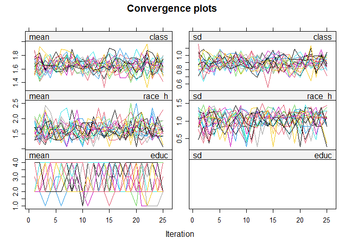<!-- -->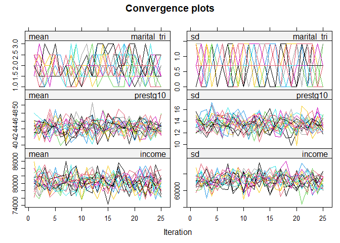<!-- -->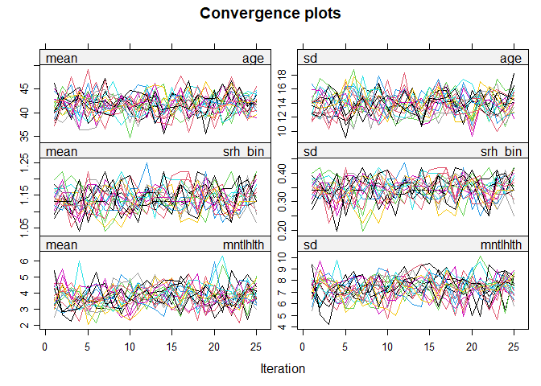<!-- -->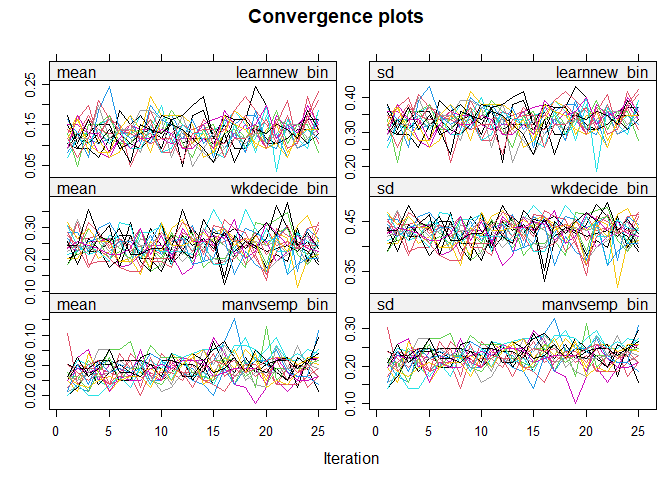<!-- -->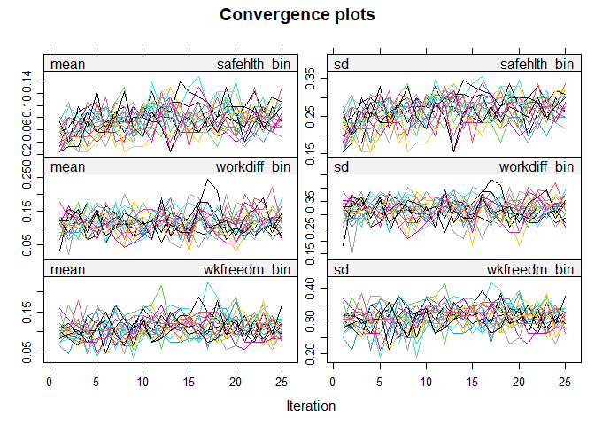<!-- -->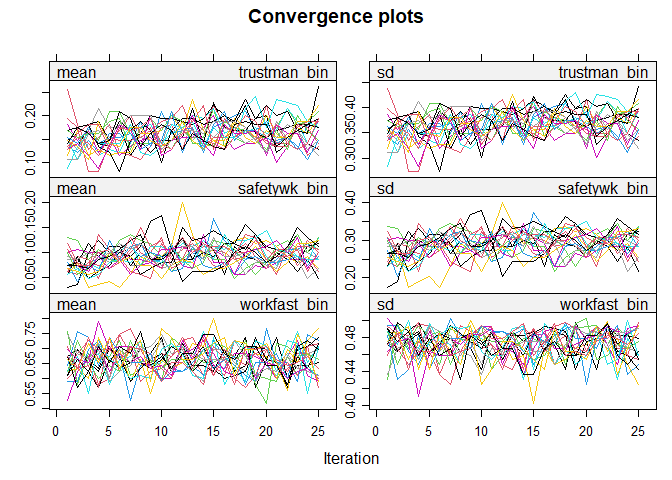<!-- -->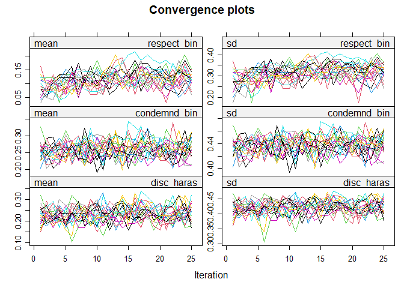<!-- -->
