# Codebook for key variables

* Class variables:
    + workers: those who are not self-employed, who do not supervise others, and who are not chief executives
    + managers: those who are not self-employed, who do supervise others, and who are not chief executives
    + petit bourgeoisie: those who are self-employed and do not supervise others, or those who are chief executives and do not supervise others
    + capitalists: those who are self employed and do supervise others, or those who are chief executives and do supervise others

* Health variables:
    + srh_bin: poor/fair vs good/vgood/excellent self-rated health
    + mntlhlth: days of poor mental health in past 30 days

* QWL variables:
    +	mustwork	 :	Mandatory to work extra hours
    +	chngtme	   :	How often r allowed change schedule
    +	learnnew	 :	Job requires r to learn new things
    +	workfast	 :	Job requires r to work fast
    +	workdiff	 :	R does numerous things on job
    +	respect	   :	R treated with respect at work
    +	trustman	 :	R trust management at work
    +	safetywk	 :	Worker safety priority at work
    +	safehlth	 :	Safety and health condition good at work
    +	wkdecide	 :	How often r take part in decisions
    +	wkfreedm	 :	A lot of freedom to decide how to do job
    +	condemnd	 :	R free from conflicting demands
    +	manvsemp	 :	Relations bw management and employees
    +	rincblls	 :	Income alone is enough
    +	satjob1	   :	Job satisfaction in general
    + disc_haras :  Faced any discrimination or harassment on job


```r
library(readstata13)
library(foreign)
library(tidyr)
library(dplyr)
library(survival)
library(knitr)
library(ggplot2)
library(kableExtra)
library(survey)
library(tableone)
library(RColorBrewer)
library(survey)
library(VIM)
library(mice)
library(parallel)
library(mitools)
library(viridis)
library(survminer)
library(gridExtra)
library(stringr)
library(rms)
library(patchwork) 
library(spatstat)
library(purrr)
library(ggmosaic)

#########load data, which is a subsetted version of the GSS cumulative file available at the GSS website that I converted from .dta to .csv using Stata 
#####
#
#drop survey-ballot d, which was a ballot in 2006 that lacked responses to QWL variables
#remove those who were not employed, as only employed respondents were asked the QWL variables - also remove those with NA wrkstat (n=9), since they weren't asked the QWL variables 
#remove ballot b in 2002, as class variables weren't asked of that ballot in that year
#remove 421 respondents who still have IAP in 2006 and 2014 for QWL variables, even after making appropriate sample restrictions - according to GSS helpdesk, they weren't administered the questions/didn't complete the survey ('breakoffs')
read.csv('GSS_02_06_10_14_18.csv') %>% 
  filter(ballot != "ballot d") %>%
  filter(wrkstat=="working fulltime" | wrkstat=="working parttime" | wrkstat=="temp not working") %>%
  filter(!(year==2002 & ballot=="ballot b")) %>%
  mutate_all(funs(ifelse(.=="DK" | .=="NO ANSWER" | .=="DONT KNOW" | .=="Not asked" | .=="IAP,DK,NA,uncodeable" | .==".a", NA, .))) %>%
  filter(is.na(respect) | respect!="IAP") -> dat #removing those with IAP for respect is sufficient since IAPs are the same across other QWL variables

#########code new variables and make sure other variables coded correctly and will be treated appropriately by MICE (e.g., no character vars)
######
#

dat %>% 
  mutate(educ=factor(ifelse(degree == "bachelor" | degree == "graduate", "College +", 
                              ifelse(degree== "high school", "HS", 
                                     ifelse(degree == "junior college", "JuCo", 
                                            ifelse(degree == "lt high school", "<HS", NA)))),
                       levels=c("<HS", "HS", "JuCo", "College +")), 
         hispanic_bin=ifelse(hispanic=="not hispanic", 0, 1),
         race_h=factor(ifelse(race=="white" & hispanic_bin==0, "NH white",
                              ifelse(race=="black" & hispanic_bin==0, "NH Black",
                                     ifelse(race=="other" & hispanic_bin==0, "NH other",
                                            ifelse(hispanic_bin==1, "Hispanic", NA)))), levels=c("NH white", "NH Black", "NH other", "Hispanic")),
         poc=factor(ifelse(race_h=="NH white", "NH white",
                                  ifelse(race_h=="NH Black" | race_h=="Hispanic" | race_h=="NH other", "POC", NA)), levels=c("NH white", "POC")),
         age=ifelse(age=="89 or older", 89, as.numeric(as.character(age))),
         mntlhlth=as.numeric(as.character(mntlhlth)),
         srh_bin=as.factor(ifelse(health1 == "fair" | health1 == "poor", "poor/fair", "good/vgood/exc")), 
         region = factor(ifelse(region == "new england" | region == "middle atlantic", "Northeast",
                                ifelse(region == "e. sou. central" | region == "south atlantic" | region == "w. sou. central", "South",
                                       ifelse(region == "e. nor. central" | region == "w. nor. central", "Midwest", "West")))),
         marital_tri=as.factor(ifelse(marital=="married", "married",
                                      ifelse(marital=="never married", "never married",
                                            ifelse(marital=="widowed" | marital=="divorced" | marital=="separated", "wid/div/sep", marital)))),
         sex=as.factor(sex),
         disc_haras_bin=ifelse(wkageism=="yes" | wkracism=="yes" | wksexism=="yes" | wkharsex=="yes" | wkharoth=="yes", 1, 0),
         disc_haras_bin_unimp=disc_haras_bin, #make duplicated version of each variable for which we wont impute data for so that we can use it in outcome regression
         respect_bin=ifelse(respect=="disagree" | respect=="strongly disagree", 1, 0),
         respect_bin_unimp=respect_bin,
         trustman_bin=ifelse(trustman=="disagree" | trustman=="strongly disagree", 1, 0),
         trustman_bin_unimp=trustman_bin,
         manvsemp_bin=ifelse(manvsemp=="quite bad" | manvsemp=="very bad", 1, 0),
         manvsemp_bin_unimp=manvsemp_bin,
         wkfreedm_bin=ifelse(wkfreedm=="not too true" | wkfreedm=="not at all true", 1, 0),
         wkfreedm_bin_unimp=wkfreedm_bin,
         wkdecide_bin=ifelse(wkdecide=="rarely" | wkdecide=="never", 1, 0),
         wkdecide_bin_unimp=wkdecide_bin,
         safehlth_bin=ifelse(safehlth=="disagree" | safehlth=="strongly disagree", 1, 0),
         safehlth_bin_unimp=safehlth_bin,
         safetywk_bin=ifelse(safetywk=="disagree" | safetywk=="strongly disagree", 1, 0),
         safetywk_bin_unimp=safetywk_bin,
         safefrst_bin=ifelse(safefrst=="disagree" | safefrst=="strongly disagree", 1, 0),
         safefrst_bin_unimp=safefrst_bin,
         mustwork_bin=ifelse(mustwork=="yes", 1, 0),
         mustwork_bin_unimp=mustwork_bin,
         workfast_bin=ifelse(workfast=="agree" | workfast=="strongly agree", 1, 0),
         workfast_bin_unimp=workfast_bin,
         workdiff_bin=ifelse(workdiff=="disagree" | workdiff=="strongly disagree", 1, 0),
         workdiff_bin_unimp=workdiff_bin,
         overwork_bin=ifelse(overwork=="agree" | overwork=="strongly agree", 1, 0),
         overwork_bin_unimp=overwork_bin,
         wrktime_bin=ifelse(wrktime=="not too true" | wrktime=="not at all true", 1, 0),
         wrktime_bin_unimp=wrktime_bin,
         learnnew_bin=ifelse(learnnew=="disagree" | learnnew=="strongly disagree", 1, 0),
         learnnew_bin_unimp=learnnew_bin,
         condemnd_bin=ifelse(condemnd=="not too true" | condemnd=="not at all true", 1, 0),
         condemnd_bin_unimp=condemnd_bin,
         knowschd_bin=ifelse(knowschd=="not too true" | knowschd=="not at all true", 1, 0),
         knowschd_bin_unimp=knowschd_bin,
         satjob1_bin=ifelse(satjob1=="not at all satisifed" | satjob1=="not too satisfied", 1, 0),
         satjob1_bin_unimp=satjob1_bin,
         rincblls_bin=ifelse(rincblls=="no", 1, 0),
         rincblls_bin_unimp=rincblls_bin,
         chngtme_bin=ifelse(chngtme=="IAP", NA, #chngtme not asked in 2018
                            ifelse(chngtme=="never" | chngtme=="rarely", 1, 0)),
         chngtme_bin_unimp=chngtme_bin,
         income=(as.numeric(as.character(coninc)) * 251.1 / 172.2)/10000, #adjust income to 2018 dollars from 2000 dollars (251.1 is 2018 CPI, 172.2 is 200 CPI), then convert to $10000s
         prestg10=as.numeric(prestg10),
         class=factor(ifelse((wksup == "yes" & wrkslf == "self-employed") | (wksup == "yes" & wrkslf == "someone else" & occ10 == "chief executives"), "Capitalists", 
                              ifelse((wksup == "no" & wrkslf == "self-employed") | (wksup == "no" & wrkslf == "someone else" & occ10 == "chief executives"), "Petit bourgeoisie", 
                                                 ifelse(wksup == "yes" & wrkslf == "someone else" & occ10 != "chief executives", "Managers", 
                                                        ifelse(wksup == "no" & wrkslf ==  "someone else" & occ10 != "chief executives", "Workers", NA)))), 
                                   levels=c("Workers", "Managers", "Petit bourgeoisie", "Capitalists")),
         poc_gender=factor(ifelse(poc=="NH white" & sex=="male", "NH white men",
                                          ifelse(poc=="NH white" & sex=="female", "NH white women",
                                                 ifelse(poc=="POC" & sex=="male", "POC men",
                                                        ifelse(poc=="POC" & sex=="female", "POC women", NA)))),
                            levels=c("NH white men", "NH white women", "POC men", "POC women")),
         class_gender=factor(ifelse(class=="Workers" & sex=="male", "Male workers",
                                    ifelse(class=="Workers" & sex=="female", "Female workers",
                                           ifelse(class=="Managers" & sex=="male", "Male managers",
                                                  ifelse(class=="Managers" & sex=="female", "Female managers",
                                                         ifelse(class=="Petit bourgeoisie" & sex=="male", "Male petit bourgeoisie",
                                                                ifelse(class=="Petit bourgeoisie" & sex=="female", "Female petit bourgeoisie",
                                                                       ifelse(class=="Capitalists" & sex=="male", "Male capitalists",
                                                                              ifelse(class=="Capitalists" & sex=="female", "Female capitalists", NA)))))))),
                             levels=c("Male workers", "Male managers", "Male petit bourgeoisie", "Male capitalists",
                                      "Female workers", "Female managers", "Female petit bourgeoisie", "Female capitalists")),
         class_poc=factor(ifelse(class=="Workers" & poc=="NH white", "NH white workers",
                                    ifelse(class=="Workers" & poc=="POC", "POC workers",
                                           ifelse(class=="Managers" & poc=="NH white", "NH white managers",
                                                  ifelse(class=="Managers" & poc=="POC", "POC managers",
                                                         ifelse(class=="Petit bourgeoisie" & poc=="NH white", "NH white petit bourgeoisie",
                                                                ifelse(class=="Petit bourgeoisie" & poc=="POC", "POC petit bourgeoisie",
                                                                       ifelse(class=="Capitalists" & poc=="NH white", "NH white capitalists",
                                                                              ifelse(class=="Capitalists" & poc=="POC", "POC capitalists", NA)))))))),
                             levels=c("NH white workers", "NH white managers", "NH white petit bourgeoisie", "NH white capitalists",
                                      "POC workers", "POC managers", "POC petit bourgeoisie", "POC capitalists")),
         class_poc_gender=factor(ifelse(is.na(class_poc) | is.na(class_gender), NA, paste(class_poc, class_gender)))) -> dat
```


```r
#make imputation dataset
dat_mice <- dat[,c('vpsu', 'vstrat', 'wtssall', 'year', 'age', 'sex', 'race_h', 'poc', "poc_gender", 'educ', 'region', 'marital_tri', 'income', "prestg10", "class", "class_gender", "class_poc", "class_poc_gender", "srh_bin", "mntlhlth", "satjob1_bin", "rincblls_bin", "safehlth_bin", "safetywk_bin", "workdiff_bin", "learnnew_bin", "condemnd_bin", "workfast_bin", "wkdecide_bin", "wkfreedm_bin", "mustwork_bin", "chngtme_bin", "manvsemp_bin", "trustman_bin", "respect_bin", "disc_haras_bin", "satjob1_bin_unimp", "rincblls_bin_unimp", "safehlth_bin_unimp", "safetywk_bin_unimp", "workdiff_bin_unimp", "learnnew_bin_unimp", "condemnd_bin_unimp", "workfast_bin_unimp", "wkdecide_bin_unimp", "wkfreedm_bin_unimp", "mustwork_bin_unimp", "chngtme_bin_unimp", "manvsemp_bin_unimp", "trustman_bin_unimp", "respect_bin_unimp", "disc_haras_bin_unimp")]

#this creates an empty imputation object that you can manipulate and set options
initialize <- mice(dat_mice, max=0, print=FALSE)

#this creates an object that will contain the imputation method for each variable. let mice choose defaults based on variable class
method <- initialize$method 

#this code tells mice not to impute these variables: not imputing variables with complete data or the unimputed versions of the outcome variables; don't impute chngtme_bin either, since it wasn't asked in 2018;  correlation with other variables should mitigate bias towards null
method[c("vpsu", 'vstrat', 'wtssall', "year", "sex", "region", "satjob1_bin_unimp", "rincblls_bin_unimp", "safehlth_bin_unimp", "safetywk_bin_unimp", "workdiff_bin_unimp", "learnnew_bin_unimp", "condemnd_bin_unimp", "workfast_bin_unimp", "wkdecide_bin_unimp", "wkfreedm_bin_unimp", "mustwork_bin_unimp", "chngtme_bin", "chngtme_bin_unimp", "manvsemp_bin_unimp", "trustman_bin_unimp", "respect_bin_unimp", "disc_haras_bin_unimp")] <- "" 

#use logistic models for imputed versions of outcome variables: default otherwise is pmm since I didn't code them as factor variables above
method[c("satjob1_bin", "rincblls_bin", "safehlth_bin", "safetywk_bin", "workdiff_bin", "learnnew_bin", "condemnd_bin", "workfast_bin", "wkdecide_bin", "wkfreedm_bin", "mustwork_bin", "manvsemp_bin", "trustman_bin", "respect_bin", "disc_haras_bin")] <- "logreg" 

#passive imputation of variables that are perfect combos of other variables; we transformed then imputed where we could (e.g., for the uninteracted class variable), but aren't with these variables to avoid collinearity/perfect-prediction issues; since there's so little missingness in the dataset anyways, the choice of transform-then-impute or impute-then-transform doesn't make much of a difference)

method['poc'] <- "~ifelse(race_h=='NH white', 'NH white',
                                  ifelse(race_h=='NH Black' | race_h=='Hispanic' | race_h=='NH other', 'POC', NA))"

method['poc_gender'] <- "~ifelse(poc=='NH white' & sex=='male', 'NH white men',
                                        ifelse(poc=='NH white' & sex=='female', 'NH white women',
                                               ifelse(poc=='POC' & sex=='male', 'POC men',
                                                      ifelse(poc=='POC' & sex=='female', 'POC women', NA))))"

method['class_gender'] <- "~ ifelse(class=='Workers' & sex=='male', 'Male workers',
                                    ifelse(class=='Workers' & sex=='female', 'Female workers',
                                           ifelse(class=='Managers' & sex=='male', 'Male managers',
                                                  ifelse(class=='Managers' & sex=='female', 'Female managers',
                                                         ifelse(class=='Petit bourgeoisie' & sex=='male', 'Male petit bourgeoisie',
                                                                ifelse(class=='Petit bourgeoisie' & sex=='female', 'Female petit bourgeoisie',
                                                                       ifelse(class=='Capitalists' & sex=='male', 'Male capitalists',
                                                                              ifelse(class=='Capitalists' & sex=='female', 'Female capitalists', NA))))))))"

method['class_poc'] <- "~ifelse(class=='Workers' & poc=='NH white', 'NH white workers',
                                    ifelse(class=='Workers' & poc=='POC', 'POC workers',
                                           ifelse(class=='Managers' & poc=='NH white', 'NH white managers',
                                                  ifelse(class=='Managers' & poc=='POC', 'POC managers',
                                                         ifelse(class=='Petit bourgeoisie' & poc=='NH white', 'NH white petit bourgeoisie',
                                                                ifelse(class=='Petit bourgeoisie' & poc=='POC', 'POC petit bourgeoisie',
                                                                       ifelse(class=='Capitalists' & poc=='NH white', 'NH white capitalists',
                                                                              ifelse(class=='Capitalists' & poc=='POC', 'POC capitalists', NA))))))))"

method['class_poc_gender'] <- "~ifelse(is.na(class_poc) | is.na(class_gender), NA, paste(class_poc, class_gender))"

#this creates an object that will indicate which variables we actually want to include in predicting missing variables. 
prediction <- initialize$predictorMatrix  

#in general, don't use uninteracted/less-interacted versions (poc, sex, class, poc_gender, class_poc, class_gender) of fully interacted variable (class_poc_gender) as predictors since they're collinear with fully-interacted variable; fully-interacted variable included over uninteracted/less-interacted variables per advice of MICE documentation; also don't use vstrat as a predictor, since it has so many levels that models dont fit; don't use duplicated versions of dependent variables; don't use chngtme_bin, since it wasn't asked in 2018
prediction[,c("race_h", "poc", "sex", "class", "poc_gender", "class_poc", "class_gender", 'vstrat', "satjob1_bin_unimp", "rincblls_bin_unimp", "safehlth_bin_unimp", "safetywk_bin_unimp", "workdiff_bin_unimp", "learnnew_bin_unimp", "condemnd_bin_unimp", "workfast_bin_unimp", "wkdecide_bin_unimp", "wkfreedm_bin_unimp", "mustwork_bin_unimp", "chngtme_bin", "chngtme_bin_unimp", "manvsemp_bin_unimp", "trustman_bin_unimp", "respect_bin_unimp", "disc_haras_bin_unimp")] <- 0

#when imputing race_h, i want gender and class as predictors (class_gender) but not class_poc_gender because of collinearity; don't need to do this for 'poc' because it's passively imputed
#when imputing class, i want gender and poc as predictors (poc_gender) but not class_poc_gender because of collinearity
#gender doesn't need imputing, interacted versions of variables are passively imputed
prediction[c("race_h"), "class_gender"] <- 1
prediction[c("race_h"), "class_poc_gender"] <- 0
prediction[c("class"), "poc_gender"] <- 1
prediction[c("class"), "class_poc_gender"] <- 0

#run MICE in parallel (4 cores * 5 imputations per core = 20 imputed datasets)
imp_merged <- parlmice(dat_mice, n.core=4, n.imp.core=5, meth=method, pred=prediction, maxit = 25, cluster.seed=9956) 

#put data into usable format for survey package
imp.list <- lapply(1:20, function(x) mice::complete(imp_merged, x))
dat_mi <- imputationList(imp.list)
```


```r
#center data for the single-PSU stratum at the sample grand mean rather than the stratum mean (conservative)
options(survey.lonely.psu="adjust")

#make imputed survey design object
svy_dat_mi <- svydesign(ids = ~ vpsu,
                 strata = ~ vstrat, 
                 weights = ~ wtssall,
                 nest=TRUE, 
                 data=dat_mi)

#survey-set unimputed data for descriptives
svy_dat <- svydesign(ids = ~ vpsu,
                     strata = ~ vstrat,
                     weights = ~ wtssall, 
                     nest=TRUE, 
                     data=dat)
```

# Survey-weighted descriptives

## Demographics and health stratifed by class 


```r
#vars of interest
vars <- c('sex', 'race_h', 'educ', 'marital_tri', 'region', 'age', 'income', "srh_bin", "mntlhlth")
nonorm <- c('income', 'age')

x <- svyCreateTableOne(data = svy_dat, vars = vars, strata='class')
x <- print(x, printToggle=FALSE, noSpaces=TRUE, nonnormal=nonorm, format='p')
kable(x[,1:4]) %>%
  kable_styling(c("striped", "condensed"))
```

<table class="table table-striped table-condensed" style="margin-left: auto; margin-right: auto;">
 <thead>
  <tr>
   <th style="text-align:left;">   </th>
   <th style="text-align:left;"> Workers </th>
   <th style="text-align:left;"> Managers </th>
   <th style="text-align:left;"> Petit bourgeoisie </th>
   <th style="text-align:left;"> Capitalists </th>
  </tr>
 </thead>
<tbody>
  <tr>
   <td style="text-align:left;"> n </td>
   <td style="text-align:left;"> 3821.8 </td>
   <td style="text-align:left;"> 2128.6 </td>
   <td style="text-align:left;"> 544.2 </td>
   <td style="text-align:left;"> 423.8 </td>
  </tr>
  <tr>
   <td style="text-align:left;"> sex = male (%) </td>
   <td style="text-align:left;"> 44.6 </td>
   <td style="text-align:left;"> 51.5 </td>
   <td style="text-align:left;"> 51.2 </td>
   <td style="text-align:left;"> 76.7 </td>
  </tr>
  <tr>
   <td style="text-align:left;"> race_h (%) </td>
   <td style="text-align:left;">  </td>
   <td style="text-align:left;">  </td>
   <td style="text-align:left;">  </td>
   <td style="text-align:left;">  </td>
  </tr>
  <tr>
   <td style="text-align:left;"> NH white </td>
   <td style="text-align:left;"> 66.1 </td>
   <td style="text-align:left;"> 71.2 </td>
   <td style="text-align:left;"> 72.3 </td>
   <td style="text-align:left;"> 79.9 </td>
  </tr>
  <tr>
   <td style="text-align:left;"> NH Black </td>
   <td style="text-align:left;"> 15.7 </td>
   <td style="text-align:left;"> 11.9 </td>
   <td style="text-align:left;"> 7.4 </td>
   <td style="text-align:left;"> 5.5 </td>
  </tr>
  <tr>
   <td style="text-align:left;"> NH other </td>
   <td style="text-align:left;"> 3.8 </td>
   <td style="text-align:left;"> 5.1 </td>
   <td style="text-align:left;"> 7.2 </td>
   <td style="text-align:left;"> 7.0 </td>
  </tr>
  <tr>
   <td style="text-align:left;"> Hispanic </td>
   <td style="text-align:left;"> 14.4 </td>
   <td style="text-align:left;"> 11.8 </td>
   <td style="text-align:left;"> 13.1 </td>
   <td style="text-align:left;"> 7.6 </td>
  </tr>
  <tr>
   <td style="text-align:left;"> educ (%) </td>
   <td style="text-align:left;">  </td>
   <td style="text-align:left;">  </td>
   <td style="text-align:left;">  </td>
   <td style="text-align:left;">  </td>
  </tr>
  <tr>
   <td style="text-align:left;"> &lt;HS </td>
   <td style="text-align:left;"> 9.4 </td>
   <td style="text-align:left;"> 7.4 </td>
   <td style="text-align:left;"> 11.9 </td>
   <td style="text-align:left;"> 7.9 </td>
  </tr>
  <tr>
   <td style="text-align:left;"> HS </td>
   <td style="text-align:left;"> 55.2 </td>
   <td style="text-align:left;"> 43.6 </td>
   <td style="text-align:left;"> 47.7 </td>
   <td style="text-align:left;"> 40.3 </td>
  </tr>
  <tr>
   <td style="text-align:left;"> JuCo </td>
   <td style="text-align:left;"> 9.0 </td>
   <td style="text-align:left;"> 10.7 </td>
   <td style="text-align:left;"> 9.2 </td>
   <td style="text-align:left;"> 7.3 </td>
  </tr>
  <tr>
   <td style="text-align:left;"> College + </td>
   <td style="text-align:left;"> 26.3 </td>
   <td style="text-align:left;"> 38.3 </td>
   <td style="text-align:left;"> 31.1 </td>
   <td style="text-align:left;"> 44.5 </td>
  </tr>
  <tr>
   <td style="text-align:left;"> marital_tri (%) </td>
   <td style="text-align:left;">  </td>
   <td style="text-align:left;">  </td>
   <td style="text-align:left;">  </td>
   <td style="text-align:left;">  </td>
  </tr>
  <tr>
   <td style="text-align:left;"> married </td>
   <td style="text-align:left;"> 51.0 </td>
   <td style="text-align:left;"> 55.9 </td>
   <td style="text-align:left;"> 60.2 </td>
   <td style="text-align:left;"> 71.1 </td>
  </tr>
  <tr>
   <td style="text-align:left;"> never married </td>
   <td style="text-align:left;"> 31.2 </td>
   <td style="text-align:left;"> 26.6 </td>
   <td style="text-align:left;"> 19.5 </td>
   <td style="text-align:left;"> 9.8 </td>
  </tr>
  <tr>
   <td style="text-align:left;"> wid/div/sep </td>
   <td style="text-align:left;"> 17.8 </td>
   <td style="text-align:left;"> 17.5 </td>
   <td style="text-align:left;"> 20.3 </td>
   <td style="text-align:left;"> 19.0 </td>
  </tr>
  <tr>
   <td style="text-align:left;"> region (%) </td>
   <td style="text-align:left;">  </td>
   <td style="text-align:left;">  </td>
   <td style="text-align:left;">  </td>
   <td style="text-align:left;">  </td>
  </tr>
  <tr>
   <td style="text-align:left;"> Midwest </td>
   <td style="text-align:left;"> 24.4 </td>
   <td style="text-align:left;"> 22.3 </td>
   <td style="text-align:left;"> 18.4 </td>
   <td style="text-align:left;"> 20.7 </td>
  </tr>
  <tr>
   <td style="text-align:left;"> Northeast </td>
   <td style="text-align:left;"> 16.5 </td>
   <td style="text-align:left;"> 18.6 </td>
   <td style="text-align:left;"> 16.1 </td>
   <td style="text-align:left;"> 13.5 </td>
  </tr>
  <tr>
   <td style="text-align:left;"> South </td>
   <td style="text-align:left;"> 38.9 </td>
   <td style="text-align:left;"> 35.0 </td>
   <td style="text-align:left;"> 36.3 </td>
   <td style="text-align:left;"> 35.4 </td>
  </tr>
  <tr>
   <td style="text-align:left;"> West </td>
   <td style="text-align:left;"> 20.2 </td>
   <td style="text-align:left;"> 24.0 </td>
   <td style="text-align:left;"> 29.2 </td>
   <td style="text-align:left;"> 30.3 </td>
  </tr>
  <tr>
   <td style="text-align:left;"> age (median [IQR]) </td>
   <td style="text-align:left;"> 40.00 [29.00, 51.00] </td>
   <td style="text-align:left;"> 42.00 [31.00, 51.00] </td>
   <td style="text-align:left;"> 49.00 [37.00, 58.00] </td>
   <td style="text-align:left;"> 50.00 [40.00, 58.00] </td>
  </tr>
  <tr>
   <td style="text-align:left;"> income (median [IQR]) </td>
   <td style="text-align:left;"> 6.38 [3.50, 10.22] </td>
   <td style="text-align:left;"> 8.43 [4.85, 12.86] </td>
   <td style="text-align:left;"> 6.38 [3.22, 12.27] </td>
   <td style="text-align:left;"> 12.27 [6.97, 23.07] </td>
  </tr>
  <tr>
   <td style="text-align:left;"> srh_bin = poor/fair (%) </td>
   <td style="text-align:left;"> 15.2 </td>
   <td style="text-align:left;"> 12.9 </td>
   <td style="text-align:left;"> 15.6 </td>
   <td style="text-align:left;"> 10.4 </td>
  </tr>
  <tr>
   <td style="text-align:left;"> mntlhlth (mean (SD)) </td>
   <td style="text-align:left;"> 3.55 (7.14) </td>
   <td style="text-align:left;"> 3.34 (6.83) </td>
   <td style="text-align:left;"> 2.55 (6.13) </td>
   <td style="text-align:left;"> 2.98 (6.99) </td>
  </tr>
</tbody>
</table>

## Distribution of class stratified by race-gender (and vice versa)

### Table


```r
#class by race-gender
x <- svyCreateTableOne(data = svy_dat, vars = "class", strata='poc_gender')
x <- print(x, printToggle=FALSE, noSpaces=TRUE)
kable(x[,1:4]) %>%
  kable_styling(c("striped", "condensed"))
```

<table class="table table-striped table-condensed" style="margin-left: auto; margin-right: auto;">
 <thead>
  <tr>
   <th style="text-align:left;">   </th>
   <th style="text-align:left;"> NH white men </th>
   <th style="text-align:left;"> NH white women </th>
   <th style="text-align:left;"> POC men </th>
   <th style="text-align:left;"> POC women </th>
  </tr>
 </thead>
<tbody>
  <tr>
   <td style="text-align:left;"> n </td>
   <td style="text-align:left;"> 2414.8 </td>
   <td style="text-align:left;"> 2393.3 </td>
   <td style="text-align:left;"> 1010.3 </td>
   <td style="text-align:left;"> 1143.6 </td>
  </tr>
  <tr>
   <td style="text-align:left;"> class (%) </td>
   <td style="text-align:left;">  </td>
   <td style="text-align:left;">  </td>
   <td style="text-align:left;">  </td>
   <td style="text-align:left;">  </td>
  </tr>
  <tr>
   <td style="text-align:left;"> Workers </td>
   <td style="text-align:left;"> 1120.7 (46.7) </td>
   <td style="text-align:left;"> 1401.2 (59.1) </td>
   <td style="text-align:left;"> 579.4 (57.9) </td>
   <td style="text-align:left;"> 712.8 (62.6) </td>
  </tr>
  <tr>
   <td style="text-align:left;"> Managers </td>
   <td style="text-align:left;"> 813.3 (33.9) </td>
   <td style="text-align:left;"> 701.6 (29.6) </td>
   <td style="text-align:left;"> 282.9 (28.3) </td>
   <td style="text-align:left;"> 328.5 (28.9) </td>
  </tr>
  <tr>
   <td style="text-align:left;"> Petit bourgeoisie </td>
   <td style="text-align:left;"> 203.6 (8.5) </td>
   <td style="text-align:left;"> 189.2 (8.0) </td>
   <td style="text-align:left;"> 73.9 (7.4) </td>
   <td style="text-align:left;"> 76.6 (6.7) </td>
  </tr>
  <tr>
   <td style="text-align:left;"> Capitalists </td>
   <td style="text-align:left;"> 260.3 (10.9) </td>
   <td style="text-align:left;"> 77.3 (3.3) </td>
   <td style="text-align:left;"> 64.5 (6.5) </td>
   <td style="text-align:left;"> 20.3 (1.8) </td>
  </tr>
</tbody>
</table>

```r
#race-gender by class
x <- svyCreateTableOne(data = svy_dat, vars = "poc_gender", strata='class')
x <- print(x, printToggle=FALSE, noSpaces=TRUE)
kable(x[,1:4]) %>%
  kable_styling(c("striped", "condensed"))
```

<table class="table table-striped table-condensed" style="margin-left: auto; margin-right: auto;">
 <thead>
  <tr>
   <th style="text-align:left;">   </th>
   <th style="text-align:left;"> Workers </th>
   <th style="text-align:left;"> Managers </th>
   <th style="text-align:left;"> Petit bourgeoisie </th>
   <th style="text-align:left;"> Capitalists </th>
  </tr>
 </thead>
<tbody>
  <tr>
   <td style="text-align:left;"> n </td>
   <td style="text-align:left;"> 3821.8 </td>
   <td style="text-align:left;"> 2128.6 </td>
   <td style="text-align:left;"> 544.2 </td>
   <td style="text-align:left;"> 423.8 </td>
  </tr>
  <tr>
   <td style="text-align:left;"> poc_gender (%) </td>
   <td style="text-align:left;">  </td>
   <td style="text-align:left;">  </td>
   <td style="text-align:left;">  </td>
   <td style="text-align:left;">  </td>
  </tr>
  <tr>
   <td style="text-align:left;"> NH white men </td>
   <td style="text-align:left;"> 1120.7 (29.4) </td>
   <td style="text-align:left;"> 813.3 (38.3) </td>
   <td style="text-align:left;"> 203.6 (37.5) </td>
   <td style="text-align:left;"> 260.3 (61.6) </td>
  </tr>
  <tr>
   <td style="text-align:left;"> NH white women </td>
   <td style="text-align:left;"> 1401.2 (36.7) </td>
   <td style="text-align:left;"> 701.6 (33.0) </td>
   <td style="text-align:left;"> 189.2 (34.8) </td>
   <td style="text-align:left;"> 77.3 (18.3) </td>
  </tr>
  <tr>
   <td style="text-align:left;"> POC men </td>
   <td style="text-align:left;"> 579.4 (15.2) </td>
   <td style="text-align:left;"> 282.9 (13.3) </td>
   <td style="text-align:left;"> 73.9 (13.6) </td>
   <td style="text-align:left;"> 64.5 (15.3) </td>
  </tr>
  <tr>
   <td style="text-align:left;"> POC women </td>
   <td style="text-align:left;"> 712.8 (18.7) </td>
   <td style="text-align:left;"> 328.5 (15.4) </td>
   <td style="text-align:left;"> 76.6 (14.1) </td>
   <td style="text-align:left;"> 20.3 (4.8) </td>
  </tr>
</tbody>
</table>

### Figure


```r
ggplot(data = subset(dat, !is.na(class) & !is.na(poc_gender))) +
  geom_mosaic(aes(x = product(class, poc_gender), fill=class, weight=wtssall)) +
  ylab("") +
  xlab("")  +
  scale_y_productlist(expand=c(0,0)) +
  scale_x_productlist(expand=c(0,0)) +
  scale_fill_manual(values= c("#1F78B4", "#6A3D9A", "#33A02C", "#FF7F00")) +
  theme_classic() +
  theme(axis.line=element_blank(), axis.title=element_blank(), legend.position="none") 
```

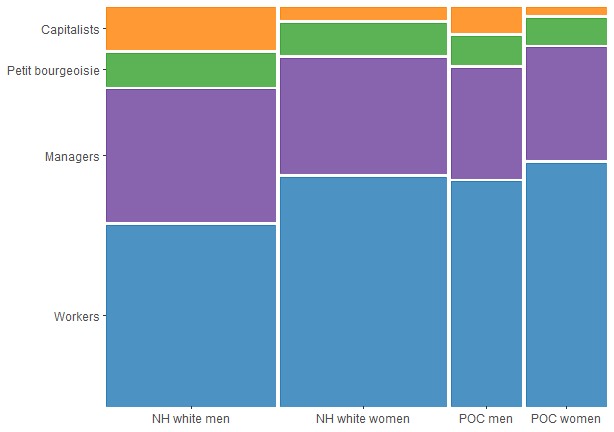<!-- -->

```r
ggsave("mosaic.png", height=4.5, width=6.4, dpi=600)
```

# Survey-weighted regressions


```r
#regression function
mysvy <- function(dat, outvars, adjvars, ...){
  model <- lapply(as.list(outvars), function(x){
    with(dat, svyglm(as.formula(paste0(names(dat$designs[[1]]$variables)[which(names(dat$designs[[1]]$variables)==x)], adjvars)), family=poisson(), ...))
  })
  return(model)
}

#regression matrix function
matrix_func <- function(nums, coefs, outvars){
  regs_less = NULL
  for(i in 1:nums){
    exp(summary(MIcombine(less_adj[[i]]))[2:coefs,c(1,3,4)]) -> bind
    rbind(regs_less, cbind(bind, outvars[i])) -> regs_less
  }
  names(regs_less) <- c("PR", "Lower", "Upper", "Var")
  return(regs_less)
}

#format matrix function
formatted <- function(classvec, rows, qwlvec, dummy, facvec){
  as.data.frame(regs_less) %>%
    mutate(Class=rep(classvec, rows)) %>%
    bind_rows(data.frame(Var=qwlvec, 
                         Class=rep(dummy, rows), PR=rep(1, rows), Lower=rep(NA, rows), Upper=rep(NA, rows))) %>% #worker dummy row
    mutate(Class=factor(Class, levels=facvec),
           Var=factor(Var, levels=qwlvec),
           Cat=ifelse(Var=="satjob1_bin_unimp" | Var=="rincblls_bin_unimp" | Var=="safehlth_bin_unimp" | Var=="safetywk_bin_unimp", "Rewards/hazards",
                      ifelse(Var=="learnnew_bin_unimp" | Var=="workdiff_bin_unimp" | Var == "workfast_bin_unimp" | Var=="condemnd_bin_unimp", "Labor process",
                             ifelse(Var=="wkdecide_bin_unimp" | Var=="wkfreedm_bin_unimp" | Var == "mustwork_bin_unimp" | Var=="chngtme_bin_unimp", "Autonomy",
                                    ifelse(Var=="manvsemp_bin_unimp" | Var=="trustman_bin_unimp" | Var == "respect_bin_unimp" | Var=="disc_haras_bin_unimp", "Conflict", NA))))) %>%
    relocate(Var, Class) -> binded
  return(binded)
}

#facet labeller function
facet_names <- c(
  "satjob1_bin_unimp"="Dissatisfied with job",
  "rincblls_bin_unimp"="Income doesn't pay bills",
  "safehlth_bin_unimp"="Poor safety conditions",
  "safetywk_bin_unimp"="Safety not a priority",
  "workdiff_bin_unimp"="Repetitive tasks",
  "learnnew_bin_unimp"="Don't learn new things",
  "condemnd_bin_unimp"="Face conflicting demands",
  "workfast_bin_unimp"="Need to work fast", 
  "wkdecide_bin_unimp"="Don't make decisions", 
  "wkfreedm_bin_unimp"="Lack freedom", 
  "mustwork_bin_unimp"="Mandatory extra hours",
  "chngtme_bin_unimp"="Can't change schedule",
  "manvsemp_bin_unimp"="Worker-management conflict", 
  "trustman_bin_unimp"="Don't trust management",
  "respect_bin_unimp"="Not treated with respect",
  "disc_haras_bin_unimp"="Face discrim. & harass."
)

#plot function
plotted <- function(binded, limitsvec, breaksvec, cols, shapes){
  ggplot(binded, aes(y=Class, x=PR, xmin=Lower, xmax=Upper, shape=Class, color=Class)) +
    geom_vline(xintercept=1, lty=1, col='darkgrey') +
    geom_errorbar(width=0.25) +
    geom_point() +
    facet_wrap(~Var, ncol=4, labeller=as_labeller(facet_names)) +
    scale_x_continuous(trans="log", limits=limitsvec, breaks=breaksvec, labels=scales::number_format(accuracy=0.01)) +
    theme_light() + 
    scale_color_manual(values=cols) +
    scale_shape_manual(values=shapes) +
    scale_y_discrete(limits=rev(levels(binded$Class))) +
    theme(strip.background = element_blank(), strip.text = element_blank(), legend.position='none', panel.grid.major.y = element_blank(), 
          axis.title.x=element_blank(), axis.text.x=element_blank(), axis.ticks.x=element_blank(), axis.title.y=element_blank(), plot.margin=margin(2.5,0,0,0)) 
}

#table function
tabled <- function(dat, captioned){
  kable(dat, digits=2, col.names=c("QWL variable", "Class", "PR", "Lower", "Upper"), caption=captioned, row.names=FALSE) %>%
    kable_styling("striped") %>%
    group_rows("Class", 1, 12) %>%
    group_rows("Class*gender", 13, 40) %>%
    group_rows("Class*POC", 41, 68) %>%
    scroll_box(width = "100%", height = "250px")
}
```

## Class, race, and gender differences in QWL 

Prevalence of adverse category of each binary QWL variable among each class relative to the prevalence among workers adjusted for age and year with restricted cubic splines. Class*race estimates exclude "NH other" group from sample because they're so heterogeneous. 

### Compensation and safety


```r
#outvars
outvars <- c("satjob1_bin_unimp", "rincblls_bin_unimp", "safehlth_bin_unimp", "safetywk_bin_unimp")

########everyone
#run regression
less_adj <- mysvy(svy_dat_mi, outvars, "~class + rcs(age, 3) + rcs(year, 3)")

#pull into matrix
regs_less <- matrix_func(4, 4, outvars)

#format matrix
binded_overall <- formatted(c("Managers", "Petit bourgeoisie", "Capitalists"), 4,
                            outvars,
                            "Workers",
                            c("Workers", "Managers", "Petit bourgeoisie", "Capitalists"))

#######gender interaction
#run regression
less_adj <- mysvy(svy_dat_mi, outvars, "~class_gender + rcs(age, 3) + rcs(year, 3)")

#pull into matrix
regs_less <- matrix_func(4, 8, outvars)

#format matrix
binded_gender <- formatted(c("Male managers", "Male petit bourgeoisie", "Male capitalists",
                             "Female workers", "Female managers", "Female petit bourgeoisie", "Female capitalists"), 4,
                           outvars,
                           "Male workers",
                           c("Male workers", "Male managers", "Male petit bourgeoisie", "Male capitalists",
                             "Female workers", "Female managers", "Female petit bourgeoisie", "Female capitalists"))

#######race interaction
#run regression
less_adj <- mysvy(subset(svy_dat_mi, race_h!="NH other"), outvars, "~class_poc + rcs(age, 3) + rcs(year, 3)")

#pull into matrix
regs_less <- matrix_func(4, 8, outvars)

#format matrix
binded_race <- formatted(c("NH white managers", "NH white petit bourgeoisie", "NH white capitalists",
                           "POC workers", "POC managers", "POC petit bourgeoisie", "POC capitalists"), 4,
                          outvars,
                         "NH white workers",
                         c("NH white workers", "NH white managers", "NH white petit bourgeoisie", "NH white capitalists",
                           "POC workers", "POC managers", "POC petit bourgeoisie", "POC capitalists"))
```


```r
#figure
plotted(binded_overall, limitsvec=c(0.09, 3.73), breaksvec=c(0.125, 0.25, 0.5, 1, 2, 4), 
             cols=brewer.pal(8, "Blues")[c(5,6,7,8)], shapes=c(15,16,17,18)) + theme(strip.text=element_text(colour = "black", vjust=1.07)) +
    plotted(binded_gender, limitsvec=c(0.09, 3.73), breaksvec=c(0.125, 0.25, 0.5, 1, 2, 4), 
                 cols=c(brewer.pal(8, "Blues")[c(5,6,7,8)], brewer.pal(8, "Purples")[c(5,6,7,8)]), shapes=c(15,16,17,18,0,1,2,5)) +
    plotted(filter(binded_race, row_number() != 7), limitsvec=c(0.09, 3.73), breaksvec=c(0.125, 0.25, 0.5, 1, 2, 4), 
            cols=c(brewer.pal(8, "Blues")[c(5,6,7,8)], brewer.pal(8, "Purples")[c(5,6,7,8)]), shapes=c(15,16,17,18,0,1,2,5)) + 
            xlab("Prevalence ratio") + theme(axis.title.x=element_text(), axis.text.x=element_text(), axis.ticks.x=element_line(), axis.title.y=element_blank()) +              geom_text(data=filter(binded_race, row_number()==7), x=-2.3, y=1.13, label="\u2190", color="#4A1486", size=6) +  
            geom_text(data=filter(binded_race, row_number()==28), x=-2.3, y=1.13, label="\u2190", color="#4A1486", size=6) +  
  plot_layout(ncol=1, heights=c(1, 2, 2))
```

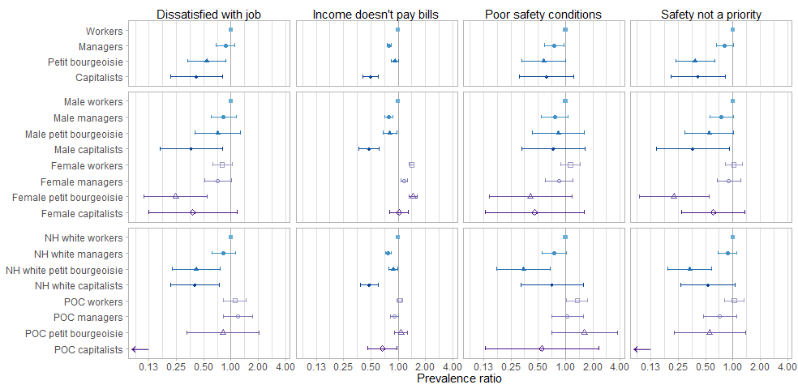<!-- -->

```r
ggsave("comp_safety.png", height=5, width=10.25, dpi=600)

#table 
tabled(rbind(binded_overall[1:12,1:5], binded_gender[1:28,1:5], binded_race[1:28,1:5]), "Ref: workers/male workers/white workers")
```

<div style="border: 1px solid #ddd; padding: 0px; overflow-y: scroll; height:250px; overflow-x: scroll; width:100%; "><table class="table table-striped" style="margin-left: auto; margin-right: auto;">
<caption>Ref: workers/male workers/white workers</caption>
 <thead>
  <tr>
   <th style="text-align:left;position: sticky; top:0; background-color: #FFFFFF;"> QWL variable </th>
   <th style="text-align:left;position: sticky; top:0; background-color: #FFFFFF;"> Class </th>
   <th style="text-align:right;position: sticky; top:0; background-color: #FFFFFF;"> PR </th>
   <th style="text-align:right;position: sticky; top:0; background-color: #FFFFFF;"> Lower </th>
   <th style="text-align:right;position: sticky; top:0; background-color: #FFFFFF;"> Upper </th>
  </tr>
 </thead>
<tbody>
  <tr grouplength="12"><td colspan="5" style="border-bottom: 1px solid;"><strong>Class</strong></td></tr>
<tr>
   <td style="text-align:left; padding-left:  2em;" indentlevel="1"> satjob1_bin_unimp </td>
   <td style="text-align:left;"> Managers </td>
   <td style="text-align:right;"> 0.87 </td>
   <td style="text-align:right;"> 0.69 </td>
   <td style="text-align:right;"> 1.10 </td>
  </tr>
  <tr>
   <td style="text-align:left; padding-left:  2em;" indentlevel="1"> satjob1_bin_unimp </td>
   <td style="text-align:left;"> Petit bourgeoisie </td>
   <td style="text-align:right;"> 0.54 </td>
   <td style="text-align:right;"> 0.34 </td>
   <td style="text-align:right;"> 0.88 </td>
  </tr>
  <tr>
   <td style="text-align:left; padding-left:  2em;" indentlevel="1"> satjob1_bin_unimp </td>
   <td style="text-align:left;"> Capitalists </td>
   <td style="text-align:right;"> 0.42 </td>
   <td style="text-align:right;"> 0.22 </td>
   <td style="text-align:right;"> 0.80 </td>
  </tr>
  <tr>
   <td style="text-align:left; padding-left:  2em;" indentlevel="1"> rincblls_bin_unimp </td>
   <td style="text-align:left;"> Managers </td>
   <td style="text-align:right;"> 0.79 </td>
   <td style="text-align:right;"> 0.75 </td>
   <td style="text-align:right;"> 0.84 </td>
  </tr>
  <tr>
   <td style="text-align:left; padding-left:  2em;" indentlevel="1"> rincblls_bin_unimp </td>
   <td style="text-align:left;"> Petit bourgeoisie </td>
   <td style="text-align:right;"> 0.92 </td>
   <td style="text-align:right;"> 0.84 </td>
   <td style="text-align:right;"> 1.01 </td>
  </tr>
  <tr>
   <td style="text-align:left; padding-left:  2em;" indentlevel="1"> rincblls_bin_unimp </td>
   <td style="text-align:left;"> Capitalists </td>
   <td style="text-align:right;"> 0.50 </td>
   <td style="text-align:right;"> 0.41 </td>
   <td style="text-align:right;"> 0.60 </td>
  </tr>
  <tr>
   <td style="text-align:left; padding-left:  2em;" indentlevel="1"> safehlth_bin_unimp </td>
   <td style="text-align:left;"> Managers </td>
   <td style="text-align:right;"> 0.75 </td>
   <td style="text-align:right;"> 0.58 </td>
   <td style="text-align:right;"> 0.95 </td>
  </tr>
  <tr>
   <td style="text-align:left; padding-left:  2em;" indentlevel="1"> safehlth_bin_unimp </td>
   <td style="text-align:left;"> Petit bourgeoisie </td>
   <td style="text-align:right;"> 0.58 </td>
   <td style="text-align:right;"> 0.33 </td>
   <td style="text-align:right;"> 1.01 </td>
  </tr>
  <tr>
   <td style="text-align:left; padding-left:  2em;" indentlevel="1"> safehlth_bin_unimp </td>
   <td style="text-align:left;"> Capitalists </td>
   <td style="text-align:right;"> 0.62 </td>
   <td style="text-align:right;"> 0.31 </td>
   <td style="text-align:right;"> 1.24 </td>
  </tr>
  <tr>
   <td style="text-align:left; padding-left:  2em;" indentlevel="1"> safetywk_bin_unimp </td>
   <td style="text-align:left;"> Managers </td>
   <td style="text-align:right;"> 0.81 </td>
   <td style="text-align:right;"> 0.66 </td>
   <td style="text-align:right;"> 1.01 </td>
  </tr>
  <tr>
   <td style="text-align:left; padding-left:  2em;" indentlevel="1"> safetywk_bin_unimp </td>
   <td style="text-align:left;"> Petit bourgeoisie </td>
   <td style="text-align:right;"> 0.38 </td>
   <td style="text-align:right;"> 0.23 </td>
   <td style="text-align:right;"> 0.63 </td>
  </tr>
  <tr>
   <td style="text-align:left; padding-left:  2em;" indentlevel="1"> safetywk_bin_unimp </td>
   <td style="text-align:left;"> Capitalists </td>
   <td style="text-align:right;"> 0.41 </td>
   <td style="text-align:right;"> 0.21 </td>
   <td style="text-align:right;"> 0.82 </td>
  </tr>
  <tr grouplength="28"><td colspan="5" style="border-bottom: 1px solid;"><strong>Class*gender</strong></td></tr>
<tr>
   <td style="text-align:left; padding-left:  2em;" indentlevel="1"> satjob1_bin_unimp </td>
   <td style="text-align:left;"> Male managers </td>
   <td style="text-align:right;"> 0.83 </td>
   <td style="text-align:right;"> 0.61 </td>
   <td style="text-align:right;"> 1.15 </td>
  </tr>
  <tr>
   <td style="text-align:left; padding-left:  2em;" indentlevel="1"> satjob1_bin_unimp </td>
   <td style="text-align:left;"> Male petit bourgeoisie </td>
   <td style="text-align:right;"> 0.72 </td>
   <td style="text-align:right;"> 0.40 </td>
   <td style="text-align:right;"> 1.28 </td>
  </tr>
  <tr>
   <td style="text-align:left; padding-left:  2em;" indentlevel="1"> satjob1_bin_unimp </td>
   <td style="text-align:left;"> Male capitalists </td>
   <td style="text-align:right;"> 0.37 </td>
   <td style="text-align:right;"> 0.16 </td>
   <td style="text-align:right;"> 0.81 </td>
  </tr>
  <tr>
   <td style="text-align:left; padding-left:  2em;" indentlevel="1"> satjob1_bin_unimp </td>
   <td style="text-align:left;"> Female workers </td>
   <td style="text-align:right;"> 0.80 </td>
   <td style="text-align:right;"> 0.63 </td>
   <td style="text-align:right;"> 1.02 </td>
  </tr>
  <tr>
   <td style="text-align:left; padding-left:  2em;" indentlevel="1"> satjob1_bin_unimp </td>
   <td style="text-align:left;"> Female managers </td>
   <td style="text-align:right;"> 0.71 </td>
   <td style="text-align:right;"> 0.51 </td>
   <td style="text-align:right;"> 1.00 </td>
  </tr>
  <tr>
   <td style="text-align:left; padding-left:  2em;" indentlevel="1"> satjob1_bin_unimp </td>
   <td style="text-align:left;"> Female petit bourgeoisie </td>
   <td style="text-align:right;"> 0.24 </td>
   <td style="text-align:right;"> 0.11 </td>
   <td style="text-align:right;"> 0.55 </td>
  </tr>
  <tr>
   <td style="text-align:left; padding-left:  2em;" indentlevel="1"> satjob1_bin_unimp </td>
   <td style="text-align:left;"> Female capitalists </td>
   <td style="text-align:right;"> 0.38 </td>
   <td style="text-align:right;"> 0.12 </td>
   <td style="text-align:right;"> 1.17 </td>
  </tr>
  <tr>
   <td style="text-align:left; padding-left:  2em;" indentlevel="1"> rincblls_bin_unimp </td>
   <td style="text-align:left;"> Male managers </td>
   <td style="text-align:right;"> 0.79 </td>
   <td style="text-align:right;"> 0.71 </td>
   <td style="text-align:right;"> 0.87 </td>
  </tr>
  <tr>
   <td style="text-align:left; padding-left:  2em;" indentlevel="1"> rincblls_bin_unimp </td>
   <td style="text-align:left;"> Male petit bourgeoisie </td>
   <td style="text-align:right;"> 0.81 </td>
   <td style="text-align:right;"> 0.67 </td>
   <td style="text-align:right;"> 0.96 </td>
  </tr>
  <tr>
   <td style="text-align:left; padding-left:  2em;" indentlevel="1"> rincblls_bin_unimp </td>
   <td style="text-align:left;"> Male capitalists </td>
   <td style="text-align:right;"> 0.48 </td>
   <td style="text-align:right;"> 0.37 </td>
   <td style="text-align:right;"> 0.62 </td>
  </tr>
  <tr>
   <td style="text-align:left; padding-left:  2em;" indentlevel="1"> rincblls_bin_unimp </td>
   <td style="text-align:left;"> Female workers </td>
   <td style="text-align:right;"> 1.40 </td>
   <td style="text-align:right;"> 1.31 </td>
   <td style="text-align:right;"> 1.50 </td>
  </tr>
  <tr>
   <td style="text-align:left; padding-left:  2em;" indentlevel="1"> rincblls_bin_unimp </td>
   <td style="text-align:left;"> Female managers </td>
   <td style="text-align:right;"> 1.17 </td>
   <td style="text-align:right;"> 1.07 </td>
   <td style="text-align:right;"> 1.27 </td>
  </tr>
  <tr>
   <td style="text-align:left; padding-left:  2em;" indentlevel="1"> rincblls_bin_unimp </td>
   <td style="text-align:left;"> Female petit bourgeoisie </td>
   <td style="text-align:right;"> 1.47 </td>
   <td style="text-align:right;"> 1.32 </td>
   <td style="text-align:right;"> 1.63 </td>
  </tr>
  <tr>
   <td style="text-align:left; padding-left:  2em;" indentlevel="1"> rincblls_bin_unimp </td>
   <td style="text-align:left;"> Female capitalists </td>
   <td style="text-align:right;"> 1.02 </td>
   <td style="text-align:right;"> 0.81 </td>
   <td style="text-align:right;"> 1.29 </td>
  </tr>
  <tr>
   <td style="text-align:left; padding-left:  2em;" indentlevel="1"> safehlth_bin_unimp </td>
   <td style="text-align:left;"> Male managers </td>
   <td style="text-align:right;"> 0.76 </td>
   <td style="text-align:right;"> 0.54 </td>
   <td style="text-align:right;"> 1.07 </td>
  </tr>
  <tr>
   <td style="text-align:left; padding-left:  2em;" indentlevel="1"> safehlth_bin_unimp </td>
   <td style="text-align:left;"> Male petit bourgeoisie </td>
   <td style="text-align:right;"> 0.83 </td>
   <td style="text-align:right;"> 0.43 </td>
   <td style="text-align:right;"> 1.62 </td>
  </tr>
  <tr>
   <td style="text-align:left; padding-left:  2em;" indentlevel="1"> safehlth_bin_unimp </td>
   <td style="text-align:left;"> Male capitalists </td>
   <td style="text-align:right;"> 0.74 </td>
   <td style="text-align:right;"> 0.33 </td>
   <td style="text-align:right;"> 1.65 </td>
  </tr>
  <tr>
   <td style="text-align:left; padding-left:  2em;" indentlevel="1"> safehlth_bin_unimp </td>
   <td style="text-align:left;"> Female workers </td>
   <td style="text-align:right;"> 1.13 </td>
   <td style="text-align:right;"> 0.88 </td>
   <td style="text-align:right;"> 1.46 </td>
  </tr>
  <tr>
   <td style="text-align:left; padding-left:  2em;" indentlevel="1"> safehlth_bin_unimp </td>
   <td style="text-align:left;"> Female managers </td>
   <td style="text-align:right;"> 0.85 </td>
   <td style="text-align:right;"> 0.59 </td>
   <td style="text-align:right;"> 1.21 </td>
  </tr>
  <tr>
   <td style="text-align:left; padding-left:  2em;" indentlevel="1"> safehlth_bin_unimp </td>
   <td style="text-align:left;"> Female petit bourgeoisie </td>
   <td style="text-align:right;"> 0.41 </td>
   <td style="text-align:right;"> 0.14 </td>
   <td style="text-align:right;"> 1.17 </td>
  </tr>
  <tr>
   <td style="text-align:left; padding-left:  2em;" indentlevel="1"> safehlth_bin_unimp </td>
   <td style="text-align:left;"> Female capitalists </td>
   <td style="text-align:right;"> 0.46 </td>
   <td style="text-align:right;"> 0.13 </td>
   <td style="text-align:right;"> 1.59 </td>
  </tr>
  <tr>
   <td style="text-align:left; padding-left:  2em;" indentlevel="1"> safetywk_bin_unimp </td>
   <td style="text-align:left;"> Male managers </td>
   <td style="text-align:right;"> 0.75 </td>
   <td style="text-align:right;"> 0.56 </td>
   <td style="text-align:right;"> 1.01 </td>
  </tr>
  <tr>
   <td style="text-align:left; padding-left:  2em;" indentlevel="1"> safetywk_bin_unimp </td>
   <td style="text-align:left;"> Male petit bourgeoisie </td>
   <td style="text-align:right;"> 0.55 </td>
   <td style="text-align:right;"> 0.30 </td>
   <td style="text-align:right;"> 1.02 </td>
  </tr>
  <tr>
   <td style="text-align:left; padding-left:  2em;" indentlevel="1"> safetywk_bin_unimp </td>
   <td style="text-align:left;"> Male capitalists </td>
   <td style="text-align:right;"> 0.36 </td>
   <td style="text-align:right;"> 0.14 </td>
   <td style="text-align:right;"> 0.92 </td>
  </tr>
  <tr>
   <td style="text-align:left; padding-left:  2em;" indentlevel="1"> safetywk_bin_unimp </td>
   <td style="text-align:left;"> Female workers </td>
   <td style="text-align:right;"> 1.02 </td>
   <td style="text-align:right;"> 0.82 </td>
   <td style="text-align:right;"> 1.27 </td>
  </tr>
  <tr>
   <td style="text-align:left; padding-left:  2em;" indentlevel="1"> safetywk_bin_unimp </td>
   <td style="text-align:left;"> Female managers </td>
   <td style="text-align:right;"> 0.90 </td>
   <td style="text-align:right;"> 0.67 </td>
   <td style="text-align:right;"> 1.21 </td>
  </tr>
  <tr>
   <td style="text-align:left; padding-left:  2em;" indentlevel="1"> safetywk_bin_unimp </td>
   <td style="text-align:left;"> Female petit bourgeoisie </td>
   <td style="text-align:right;"> 0.23 </td>
   <td style="text-align:right;"> 0.09 </td>
   <td style="text-align:right;"> 0.54 </td>
  </tr>
  <tr>
   <td style="text-align:left; padding-left:  2em;" indentlevel="1"> safetywk_bin_unimp </td>
   <td style="text-align:left;"> Female capitalists </td>
   <td style="text-align:right;"> 0.61 </td>
   <td style="text-align:right;"> 0.27 </td>
   <td style="text-align:right;"> 1.37 </td>
  </tr>
  <tr grouplength="28"><td colspan="5" style="border-bottom: 1px solid;"><strong>Class*POC</strong></td></tr>
<tr>
   <td style="text-align:left; padding-left:  2em;" indentlevel="1"> satjob1_bin_unimp </td>
   <td style="text-align:left;"> NH white managers </td>
   <td style="text-align:right;"> 0.83 </td>
   <td style="text-align:right;"> 0.62 </td>
   <td style="text-align:right;"> 1.12 </td>
  </tr>
  <tr>
   <td style="text-align:left; padding-left:  2em;" indentlevel="1"> satjob1_bin_unimp </td>
   <td style="text-align:left;"> NH white petit bourgeoisie </td>
   <td style="text-align:right;"> 0.41 </td>
   <td style="text-align:right;"> 0.23 </td>
   <td style="text-align:right;"> 0.76 </td>
  </tr>
  <tr>
   <td style="text-align:left; padding-left:  2em;" indentlevel="1"> satjob1_bin_unimp </td>
   <td style="text-align:left;"> NH white capitalists </td>
   <td style="text-align:right;"> 0.40 </td>
   <td style="text-align:right;"> 0.22 </td>
   <td style="text-align:right;"> 0.75 </td>
  </tr>
  <tr>
   <td style="text-align:left; padding-left:  2em;" indentlevel="1"> satjob1_bin_unimp </td>
   <td style="text-align:left;"> POC workers </td>
   <td style="text-align:right;"> 1.10 </td>
   <td style="text-align:right;"> 0.83 </td>
   <td style="text-align:right;"> 1.46 </td>
  </tr>
  <tr>
   <td style="text-align:left; padding-left:  2em;" indentlevel="1"> satjob1_bin_unimp </td>
   <td style="text-align:left;"> POC managers </td>
   <td style="text-align:right;"> 1.19 </td>
   <td style="text-align:right;"> 0.82 </td>
   <td style="text-align:right;"> 1.72 </td>
  </tr>
  <tr>
   <td style="text-align:left; padding-left:  2em;" indentlevel="1"> satjob1_bin_unimp </td>
   <td style="text-align:left;"> POC petit bourgeoisie </td>
   <td style="text-align:right;"> 0.82 </td>
   <td style="text-align:right;"> 0.33 </td>
   <td style="text-align:right;"> 2.06 </td>
  </tr>
  <tr>
   <td style="text-align:left; padding-left:  2em;" indentlevel="1"> satjob1_bin_unimp </td>
   <td style="text-align:left;"> POC capitalists </td>
   <td style="text-align:right;"> 0.00 </td>
   <td style="text-align:right;"> 0.00 </td>
   <td style="text-align:right;"> 2142.16 </td>
  </tr>
  <tr>
   <td style="text-align:left; padding-left:  2em;" indentlevel="1"> rincblls_bin_unimp </td>
   <td style="text-align:left;"> NH white managers </td>
   <td style="text-align:right;"> 0.77 </td>
   <td style="text-align:right;"> 0.72 </td>
   <td style="text-align:right;"> 0.83 </td>
  </tr>
  <tr>
   <td style="text-align:left; padding-left:  2em;" indentlevel="1"> rincblls_bin_unimp </td>
   <td style="text-align:left;"> NH white petit bourgeoisie </td>
   <td style="text-align:right;"> 0.88 </td>
   <td style="text-align:right;"> 0.79 </td>
   <td style="text-align:right;"> 0.99 </td>
  </tr>
  <tr>
   <td style="text-align:left; padding-left:  2em;" indentlevel="1"> rincblls_bin_unimp </td>
   <td style="text-align:left;"> NH white capitalists </td>
   <td style="text-align:right;"> 0.48 </td>
   <td style="text-align:right;"> 0.38 </td>
   <td style="text-align:right;"> 0.60 </td>
  </tr>
  <tr>
   <td style="text-align:left; padding-left:  2em;" indentlevel="1"> rincblls_bin_unimp </td>
   <td style="text-align:left;"> POC workers </td>
   <td style="text-align:right;"> 1.03 </td>
   <td style="text-align:right;"> 0.97 </td>
   <td style="text-align:right;"> 1.11 </td>
  </tr>
  <tr>
   <td style="text-align:left; padding-left:  2em;" indentlevel="1"> rincblls_bin_unimp </td>
   <td style="text-align:left;"> POC managers </td>
   <td style="text-align:right;"> 0.91 </td>
   <td style="text-align:right;"> 0.82 </td>
   <td style="text-align:right;"> 1.01 </td>
  </tr>
  <tr>
   <td style="text-align:left; padding-left:  2em;" indentlevel="1"> rincblls_bin_unimp </td>
   <td style="text-align:left;"> POC petit bourgeoisie </td>
   <td style="text-align:right;"> 1.08 </td>
   <td style="text-align:right;"> 0.91 </td>
   <td style="text-align:right;"> 1.27 </td>
  </tr>
  <tr>
   <td style="text-align:left; padding-left:  2em;" indentlevel="1"> rincblls_bin_unimp </td>
   <td style="text-align:left;"> POC capitalists </td>
   <td style="text-align:right;"> 0.67 </td>
   <td style="text-align:right;"> 0.47 </td>
   <td style="text-align:right;"> 0.97 </td>
  </tr>
  <tr>
   <td style="text-align:left; padding-left:  2em;" indentlevel="1"> safehlth_bin_unimp </td>
   <td style="text-align:left;"> NH white managers </td>
   <td style="text-align:right;"> 0.75 </td>
   <td style="text-align:right;"> 0.55 </td>
   <td style="text-align:right;"> 1.01 </td>
  </tr>
  <tr>
   <td style="text-align:left; padding-left:  2em;" indentlevel="1"> safehlth_bin_unimp </td>
   <td style="text-align:left;"> NH white petit bourgeoisie </td>
   <td style="text-align:right;"> 0.34 </td>
   <td style="text-align:right;"> 0.17 </td>
   <td style="text-align:right;"> 0.68 </td>
  </tr>
  <tr>
   <td style="text-align:left; padding-left:  2em;" indentlevel="1"> safehlth_bin_unimp </td>
   <td style="text-align:left;"> NH white capitalists </td>
   <td style="text-align:right;"> 0.71 </td>
   <td style="text-align:right;"> 0.32 </td>
   <td style="text-align:right;"> 1.57 </td>
  </tr>
  <tr>
   <td style="text-align:left; padding-left:  2em;" indentlevel="1"> safehlth_bin_unimp </td>
   <td style="text-align:left;"> POC workers </td>
   <td style="text-align:right;"> 1.34 </td>
   <td style="text-align:right;"> 1.03 </td>
   <td style="text-align:right;"> 1.75 </td>
  </tr>
  <tr>
   <td style="text-align:left; padding-left:  2em;" indentlevel="1"> safehlth_bin_unimp </td>
   <td style="text-align:left;"> POC managers </td>
   <td style="text-align:right;"> 1.05 </td>
   <td style="text-align:right;"> 0.70 </td>
   <td style="text-align:right;"> 1.57 </td>
  </tr>
  <tr>
   <td style="text-align:left; padding-left:  2em;" indentlevel="1"> safehlth_bin_unimp </td>
   <td style="text-align:left;"> POC petit bourgeoisie </td>
   <td style="text-align:right;"> 1.62 </td>
   <td style="text-align:right;"> 0.71 </td>
   <td style="text-align:right;"> 3.73 </td>
  </tr>
  <tr>
   <td style="text-align:left; padding-left:  2em;" indentlevel="1"> safehlth_bin_unimp </td>
   <td style="text-align:left;"> POC capitalists </td>
   <td style="text-align:right;"> 0.55 </td>
   <td style="text-align:right;"> 0.13 </td>
   <td style="text-align:right;"> 2.31 </td>
  </tr>
  <tr>
   <td style="text-align:left; padding-left:  2em;" indentlevel="1"> safetywk_bin_unimp </td>
   <td style="text-align:left;"> NH white managers </td>
   <td style="text-align:right;"> 0.87 </td>
   <td style="text-align:right;"> 0.69 </td>
   <td style="text-align:right;"> 1.11 </td>
  </tr>
  <tr>
   <td style="text-align:left; padding-left:  2em;" indentlevel="1"> safetywk_bin_unimp </td>
   <td style="text-align:left;"> NH white petit bourgeoisie </td>
   <td style="text-align:right;"> 0.34 </td>
   <td style="text-align:right;"> 0.19 </td>
   <td style="text-align:right;"> 0.59 </td>
  </tr>
  <tr>
   <td style="text-align:left; padding-left:  2em;" indentlevel="1"> safetywk_bin_unimp </td>
   <td style="text-align:left;"> NH white capitalists </td>
   <td style="text-align:right;"> 0.53 </td>
   <td style="text-align:right;"> 0.27 </td>
   <td style="text-align:right;"> 1.06 </td>
  </tr>
  <tr>
   <td style="text-align:left; padding-left:  2em;" indentlevel="1"> safetywk_bin_unimp </td>
   <td style="text-align:left;"> POC workers </td>
   <td style="text-align:right;"> 1.04 </td>
   <td style="text-align:right;"> 0.81 </td>
   <td style="text-align:right;"> 1.34 </td>
  </tr>
  <tr>
   <td style="text-align:left; padding-left:  2em;" indentlevel="1"> safetywk_bin_unimp </td>
   <td style="text-align:left;"> POC managers </td>
   <td style="text-align:right;"> 0.72 </td>
   <td style="text-align:right;"> 0.47 </td>
   <td style="text-align:right;"> 1.10 </td>
  </tr>
  <tr>
   <td style="text-align:left; padding-left:  2em;" indentlevel="1"> safetywk_bin_unimp </td>
   <td style="text-align:left;"> POC petit bourgeoisie </td>
   <td style="text-align:right;"> 0.56 </td>
   <td style="text-align:right;"> 0.22 </td>
   <td style="text-align:right;"> 1.38 </td>
  </tr>
  <tr>
   <td style="text-align:left; padding-left:  2em;" indentlevel="1"> safetywk_bin_unimp </td>
   <td style="text-align:left;"> POC capitalists </td>
   <td style="text-align:right;"> 0.00 </td>
   <td style="text-align:right;"> 0.00 </td>
   <td style="text-align:right;"> 0.00 </td>
  </tr>
</tbody>
</table></div>

### Labor process


```r
#outvars
outvars <- c("workdiff_bin_unimp", "learnnew_bin_unimp", "condemnd_bin_unimp", "workfast_bin_unimp")

########everyone
#run regression
less_adj <- mysvy(svy_dat_mi, outvars, "~class + rcs(age, 3) + rcs(year, 3)")

#pull into matrix
regs_less <- matrix_func(4, 4, outvars)

#format matrix
binded_overall <- formatted(c("Managers", "Petit bourgeoisie", "Capitalists"), 4,
                            c("workdiff_bin_unimp", "learnnew_bin_unimp", "condemnd_bin_unimp", "workfast_bin_unimp"),
                            "Workers",
                            c("Workers", "Managers", "Petit bourgeoisie", "Capitalists"))

#######gender interaction
#run regression
less_adj <- mysvy(svy_dat_mi, outvars, "~class_gender + rcs(age, 3) + rcs(year, 3)")

#pull into matrix
regs_less <- matrix_func(4, 8, outvars)

#format matrix
binded_gender <- formatted(c("Male managers", "Male petit bourgeoisie", "Male capitalists",
                             "Female workers", "Female managers", "Female petit bourgeoisie", "Female capitalists"), 4,
                           c("workdiff_bin_unimp", "learnnew_bin_unimp", "condemnd_bin_unimp", "workfast_bin_unimp"),
                           "Male workers",
                           c("Male workers", "Male managers", "Male petit bourgeoisie", "Male capitalists",
                             "Female workers", "Female managers", "Female petit bourgeoisie", "Female capitalists"))

#######race interaction
#run regression
less_adj <- mysvy(subset(svy_dat_mi, race_h!="NH other"), outvars, "~class_poc + rcs(age, 3) + rcs(year, 3)")

#pull into matrix
regs_less <- matrix_func(4, 8, outvars)

#format matrix
binded_race <- formatted(c("NH white managers", "NH white petit bourgeoisie", "NH white capitalists",
                           "POC workers", "POC managers", "POC petit bourgeoisie", "POC capitalists"), 4,
                         outvars,
                         "NH white workers",
                         c("NH white workers", "NH white managers", "NH white petit bourgeoisie", "NH white capitalists",
                           "POC workers", "POC managers", "POC petit bourgeoisie", "POC capitalists"))
```


```r
#figure
plotted(binded_overall, limitsvec=c(0.082, 2.84), breaksvec=c(0.125, 0.25, 0.5, 1, 2, 4), 
             cols=brewer.pal(8, "Blues")[c(5,6,7,8)], shapes=c(15,16,17,18)) + theme(strip.text=element_text(colour = "black", vjust=1.07)) +
    plotted(binded_gender, limitsvec=c(0.082, 2.84), breaksvec=c(0.125, 0.25, 0.5, 1, 2, 4), 
                 cols=c(brewer.pal(8, "Blues")[c(5,6,7,8)], brewer.pal(8, "Purples")[c(5,6,7,8)]), shapes=c(15,16,17,18,0,1,2,5)) +
    plotted(binded_race, limitsvec=c(0.082, 2.84), breaksvec=c(0.125, 0.25, 0.5, 1, 2, 4), 
            cols=c(brewer.pal(8, "Blues")[c(5,6,7,8)], brewer.pal(8, "Purples")[c(5,6,7,8)]), shapes=c(15,16,17,18,0,1,2,5)) + 
            xlab("Prevalence ratio") + theme(axis.title.x=element_text(), axis.text.x=element_text(), axis.ticks.x=element_line(), axis.title.y=element_blank()) +
  plot_layout(ncol=1, heights=c(1, 2, 2))
```

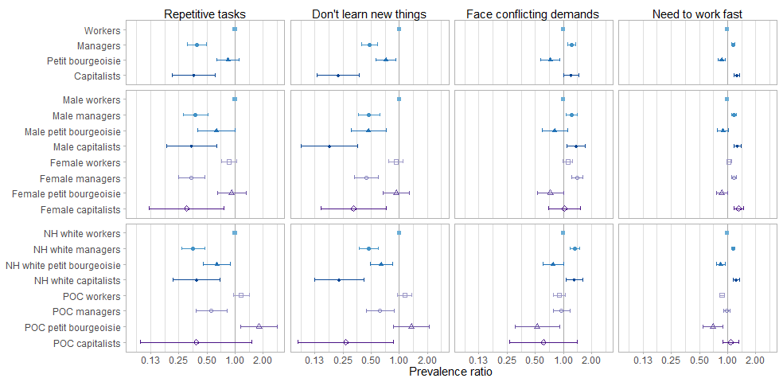<!-- -->

```r
ggsave("labor_process.png", height=5, width=10.25, dpi=600)

#table 
tabled(rbind(binded_overall[1:12,1:5], binded_gender[1:28,1:5], binded_race[1:28,1:5]), "Ref: workers/male workers/white workers")
```

<div style="border: 1px solid #ddd; padding: 0px; overflow-y: scroll; height:250px; overflow-x: scroll; width:100%; "><table class="table table-striped" style="margin-left: auto; margin-right: auto;">
<caption>Ref: workers/male workers/white workers</caption>
 <thead>
  <tr>
   <th style="text-align:left;position: sticky; top:0; background-color: #FFFFFF;"> QWL variable </th>
   <th style="text-align:left;position: sticky; top:0; background-color: #FFFFFF;"> Class </th>
   <th style="text-align:right;position: sticky; top:0; background-color: #FFFFFF;"> PR </th>
   <th style="text-align:right;position: sticky; top:0; background-color: #FFFFFF;"> Lower </th>
   <th style="text-align:right;position: sticky; top:0; background-color: #FFFFFF;"> Upper </th>
  </tr>
 </thead>
<tbody>
  <tr grouplength="12"><td colspan="5" style="border-bottom: 1px solid;"><strong>Class</strong></td></tr>
<tr>
   <td style="text-align:left; padding-left:  2em;" indentlevel="1"> workdiff_bin_unimp </td>
   <td style="text-align:left;"> Managers </td>
   <td style="text-align:right;"> 0.39 </td>
   <td style="text-align:right;"> 0.31 </td>
   <td style="text-align:right;"> 0.49 </td>
  </tr>
  <tr>
   <td style="text-align:left; padding-left:  2em;" indentlevel="1"> workdiff_bin_unimp </td>
   <td style="text-align:left;"> Petit bourgeoisie </td>
   <td style="text-align:right;"> 0.84 </td>
   <td style="text-align:right;"> 0.64 </td>
   <td style="text-align:right;"> 1.11 </td>
  </tr>
  <tr>
   <td style="text-align:left; padding-left:  2em;" indentlevel="1"> workdiff_bin_unimp </td>
   <td style="text-align:left;"> Capitalists </td>
   <td style="text-align:right;"> 0.36 </td>
   <td style="text-align:right;"> 0.21 </td>
   <td style="text-align:right;"> 0.61 </td>
  </tr>
  <tr>
   <td style="text-align:left; padding-left:  2em;" indentlevel="1"> learnnew_bin_unimp </td>
   <td style="text-align:left;"> Managers </td>
   <td style="text-align:right;"> 0.48 </td>
   <td style="text-align:right;"> 0.40 </td>
   <td style="text-align:right;"> 0.59 </td>
  </tr>
  <tr>
   <td style="text-align:left; padding-left:  2em;" indentlevel="1"> learnnew_bin_unimp </td>
   <td style="text-align:left;"> Petit bourgeoisie </td>
   <td style="text-align:right;"> 0.72 </td>
   <td style="text-align:right;"> 0.57 </td>
   <td style="text-align:right;"> 0.93 </td>
  </tr>
  <tr>
   <td style="text-align:left; padding-left:  2em;" indentlevel="1"> learnnew_bin_unimp </td>
   <td style="text-align:left;"> Capitalists </td>
   <td style="text-align:right;"> 0.22 </td>
   <td style="text-align:right;"> 0.13 </td>
   <td style="text-align:right;"> 0.38 </td>
  </tr>
  <tr>
   <td style="text-align:left; padding-left:  2em;" indentlevel="1"> condemnd_bin_unimp </td>
   <td style="text-align:left;"> Managers </td>
   <td style="text-align:right;"> 1.23 </td>
   <td style="text-align:right;"> 1.12 </td>
   <td style="text-align:right;"> 1.36 </td>
  </tr>
  <tr>
   <td style="text-align:left; padding-left:  2em;" indentlevel="1"> condemnd_bin_unimp </td>
   <td style="text-align:left;"> Petit bourgeoisie </td>
   <td style="text-align:right;"> 0.72 </td>
   <td style="text-align:right;"> 0.57 </td>
   <td style="text-align:right;"> 0.91 </td>
  </tr>
  <tr>
   <td style="text-align:left; padding-left:  2em;" indentlevel="1"> condemnd_bin_unimp </td>
   <td style="text-align:left;"> Capitalists </td>
   <td style="text-align:right;"> 1.21 </td>
   <td style="text-align:right;"> 1.00 </td>
   <td style="text-align:right;"> 1.46 </td>
  </tr>
  <tr>
   <td style="text-align:left; padding-left:  2em;" indentlevel="1"> workfast_bin_unimp </td>
   <td style="text-align:left;"> Managers </td>
   <td style="text-align:right;"> 1.15 </td>
   <td style="text-align:right;"> 1.11 </td>
   <td style="text-align:right;"> 1.20 </td>
  </tr>
  <tr>
   <td style="text-align:left; padding-left:  2em;" indentlevel="1"> workfast_bin_unimp </td>
   <td style="text-align:left;"> Petit bourgeoisie </td>
   <td style="text-align:right;"> 0.87 </td>
   <td style="text-align:right;"> 0.79 </td>
   <td style="text-align:right;"> 0.95 </td>
  </tr>
  <tr>
   <td style="text-align:left; padding-left:  2em;" indentlevel="1"> workfast_bin_unimp </td>
   <td style="text-align:left;"> Capitalists </td>
   <td style="text-align:right;"> 1.26 </td>
   <td style="text-align:right;"> 1.17 </td>
   <td style="text-align:right;"> 1.35 </td>
  </tr>
  <tr grouplength="28"><td colspan="5" style="border-bottom: 1px solid;"><strong>Class*gender</strong></td></tr>
<tr>
   <td style="text-align:left; padding-left:  2em;" indentlevel="1"> workdiff_bin_unimp </td>
   <td style="text-align:left;"> Male managers </td>
   <td style="text-align:right;"> 0.38 </td>
   <td style="text-align:right;"> 0.28 </td>
   <td style="text-align:right;"> 0.51 </td>
  </tr>
  <tr>
   <td style="text-align:left; padding-left:  2em;" indentlevel="1"> workdiff_bin_unimp </td>
   <td style="text-align:left;"> Male petit bourgeoisie </td>
   <td style="text-align:right;"> 0.63 </td>
   <td style="text-align:right;"> 0.40 </td>
   <td style="text-align:right;"> 0.99 </td>
  </tr>
  <tr>
   <td style="text-align:left; padding-left:  2em;" indentlevel="1"> workdiff_bin_unimp </td>
   <td style="text-align:left;"> Male capitalists </td>
   <td style="text-align:right;"> 0.34 </td>
   <td style="text-align:right;"> 0.19 </td>
   <td style="text-align:right;"> 0.63 </td>
  </tr>
  <tr>
   <td style="text-align:left; padding-left:  2em;" indentlevel="1"> workdiff_bin_unimp </td>
   <td style="text-align:left;"> Female workers </td>
   <td style="text-align:right;"> 0.86 </td>
   <td style="text-align:right;"> 0.72 </td>
   <td style="text-align:right;"> 1.03 </td>
  </tr>
  <tr>
   <td style="text-align:left; padding-left:  2em;" indentlevel="1"> workdiff_bin_unimp </td>
   <td style="text-align:left;"> Female managers </td>
   <td style="text-align:right;"> 0.34 </td>
   <td style="text-align:right;"> 0.25 </td>
   <td style="text-align:right;"> 0.48 </td>
  </tr>
  <tr>
   <td style="text-align:left; padding-left:  2em;" indentlevel="1"> workdiff_bin_unimp </td>
   <td style="text-align:left;"> Female petit bourgeoisie </td>
   <td style="text-align:right;"> 0.92 </td>
   <td style="text-align:right;"> 0.65 </td>
   <td style="text-align:right;"> 1.31 </td>
  </tr>
  <tr>
   <td style="text-align:left; padding-left:  2em;" indentlevel="1"> workdiff_bin_unimp </td>
   <td style="text-align:left;"> Female capitalists </td>
   <td style="text-align:right;"> 0.30 </td>
   <td style="text-align:right;"> 0.12 </td>
   <td style="text-align:right;"> 0.76 </td>
  </tr>
  <tr>
   <td style="text-align:left; padding-left:  2em;" indentlevel="1"> learnnew_bin_unimp </td>
   <td style="text-align:left;"> Male managers </td>
   <td style="text-align:right;"> 0.48 </td>
   <td style="text-align:right;"> 0.36 </td>
   <td style="text-align:right;"> 0.62 </td>
  </tr>
  <tr>
   <td style="text-align:left; padding-left:  2em;" indentlevel="1"> learnnew_bin_unimp </td>
   <td style="text-align:left;"> Male petit bourgeoisie </td>
   <td style="text-align:right;"> 0.47 </td>
   <td style="text-align:right;"> 0.31 </td>
   <td style="text-align:right;"> 0.72 </td>
  </tr>
  <tr>
   <td style="text-align:left; padding-left:  2em;" indentlevel="1"> learnnew_bin_unimp </td>
   <td style="text-align:left;"> Male capitalists </td>
   <td style="text-align:right;"> 0.18 </td>
   <td style="text-align:right;"> 0.09 </td>
   <td style="text-align:right;"> 0.36 </td>
  </tr>
  <tr>
   <td style="text-align:left; padding-left:  2em;" indentlevel="1"> learnnew_bin_unimp </td>
   <td style="text-align:left;"> Female workers </td>
   <td style="text-align:right;"> 0.92 </td>
   <td style="text-align:right;"> 0.77 </td>
   <td style="text-align:right;"> 1.10 </td>
  </tr>
  <tr>
   <td style="text-align:left; padding-left:  2em;" indentlevel="1"> learnnew_bin_unimp </td>
   <td style="text-align:left;"> Female managers </td>
   <td style="text-align:right;"> 0.45 </td>
   <td style="text-align:right;"> 0.33 </td>
   <td style="text-align:right;"> 0.60 </td>
  </tr>
  <tr>
   <td style="text-align:left; padding-left:  2em;" indentlevel="1"> learnnew_bin_unimp </td>
   <td style="text-align:left;"> Female petit bourgeoisie </td>
   <td style="text-align:right;"> 0.93 </td>
   <td style="text-align:right;"> 0.68 </td>
   <td style="text-align:right;"> 1.28 </td>
  </tr>
  <tr>
   <td style="text-align:left; padding-left:  2em;" indentlevel="1"> learnnew_bin_unimp </td>
   <td style="text-align:left;"> Female capitalists </td>
   <td style="text-align:right;"> 0.32 </td>
   <td style="text-align:right;"> 0.15 </td>
   <td style="text-align:right;"> 0.72 </td>
  </tr>
  <tr>
   <td style="text-align:left; padding-left:  2em;" indentlevel="1"> condemnd_bin_unimp </td>
   <td style="text-align:left;"> Male managers </td>
   <td style="text-align:right;"> 1.22 </td>
   <td style="text-align:right;"> 1.07 </td>
   <td style="text-align:right;"> 1.40 </td>
  </tr>
  <tr>
   <td style="text-align:left; padding-left:  2em;" indentlevel="1"> condemnd_bin_unimp </td>
   <td style="text-align:left;"> Male petit bourgeoisie </td>
   <td style="text-align:right;"> 0.81 </td>
   <td style="text-align:right;"> 0.59 </td>
   <td style="text-align:right;"> 1.12 </td>
  </tr>
  <tr>
   <td style="text-align:left; padding-left:  2em;" indentlevel="1"> condemnd_bin_unimp </td>
   <td style="text-align:left;"> Male capitalists </td>
   <td style="text-align:right;"> 1.37 </td>
   <td style="text-align:right;"> 1.10 </td>
   <td style="text-align:right;"> 1.71 </td>
  </tr>
  <tr>
   <td style="text-align:left; padding-left:  2em;" indentlevel="1"> condemnd_bin_unimp </td>
   <td style="text-align:left;"> Female workers </td>
   <td style="text-align:right;"> 1.11 </td>
   <td style="text-align:right;"> 0.98 </td>
   <td style="text-align:right;"> 1.26 </td>
  </tr>
  <tr>
   <td style="text-align:left; padding-left:  2em;" indentlevel="1"> condemnd_bin_unimp </td>
   <td style="text-align:left;"> Female managers </td>
   <td style="text-align:right;"> 1.41 </td>
   <td style="text-align:right;"> 1.22 </td>
   <td style="text-align:right;"> 1.62 </td>
  </tr>
  <tr>
   <td style="text-align:left; padding-left:  2em;" indentlevel="1"> condemnd_bin_unimp </td>
   <td style="text-align:left;"> Female petit bourgeoisie </td>
   <td style="text-align:right;"> 0.73 </td>
   <td style="text-align:right;"> 0.53 </td>
   <td style="text-align:right;"> 1.00 </td>
  </tr>
  <tr>
   <td style="text-align:left; padding-left:  2em;" indentlevel="1"> condemnd_bin_unimp </td>
   <td style="text-align:left;"> Female capitalists </td>
   <td style="text-align:right;"> 1.03 </td>
   <td style="text-align:right;"> 0.70 </td>
   <td style="text-align:right;"> 1.52 </td>
  </tr>
  <tr>
   <td style="text-align:left; padding-left:  2em;" indentlevel="1"> workfast_bin_unimp </td>
   <td style="text-align:left;"> Male managers </td>
   <td style="text-align:right;"> 1.18 </td>
   <td style="text-align:right;"> 1.11 </td>
   <td style="text-align:right;"> 1.24 </td>
  </tr>
  <tr>
   <td style="text-align:left; padding-left:  2em;" indentlevel="1"> workfast_bin_unimp </td>
   <td style="text-align:left;"> Male petit bourgeoisie </td>
   <td style="text-align:right;"> 0.89 </td>
   <td style="text-align:right;"> 0.78 </td>
   <td style="text-align:right;"> 1.03 </td>
  </tr>
  <tr>
   <td style="text-align:left; padding-left:  2em;" indentlevel="1"> workfast_bin_unimp </td>
   <td style="text-align:left;"> Male capitalists </td>
   <td style="text-align:right;"> 1.27 </td>
   <td style="text-align:right;"> 1.16 </td>
   <td style="text-align:right;"> 1.39 </td>
  </tr>
  <tr>
   <td style="text-align:left; padding-left:  2em;" indentlevel="1"> workfast_bin_unimp </td>
   <td style="text-align:left;"> Female workers </td>
   <td style="text-align:right;"> 1.04 </td>
   <td style="text-align:right;"> 0.98 </td>
   <td style="text-align:right;"> 1.09 </td>
  </tr>
  <tr>
   <td style="text-align:left; padding-left:  2em;" indentlevel="1"> workfast_bin_unimp </td>
   <td style="text-align:left;"> Female managers </td>
   <td style="text-align:right;"> 1.17 </td>
   <td style="text-align:right;"> 1.10 </td>
   <td style="text-align:right;"> 1.25 </td>
  </tr>
  <tr>
   <td style="text-align:left; padding-left:  2em;" indentlevel="1"> workfast_bin_unimp </td>
   <td style="text-align:left;"> Female petit bourgeoisie </td>
   <td style="text-align:right;"> 0.87 </td>
   <td style="text-align:right;"> 0.76 </td>
   <td style="text-align:right;"> 1.01 </td>
  </tr>
  <tr>
   <td style="text-align:left; padding-left:  2em;" indentlevel="1"> workfast_bin_unimp </td>
   <td style="text-align:left;"> Female capitalists </td>
   <td style="text-align:right;"> 1.31 </td>
   <td style="text-align:right;"> 1.16 </td>
   <td style="text-align:right;"> 1.49 </td>
  </tr>
  <tr grouplength="28"><td colspan="5" style="border-bottom: 1px solid;"><strong>Class*POC</strong></td></tr>
<tr>
   <td style="text-align:left; padding-left:  2em;" indentlevel="1"> workdiff_bin_unimp </td>
   <td style="text-align:left;"> NH white managers </td>
   <td style="text-align:right;"> 0.36 </td>
   <td style="text-align:right;"> 0.27 </td>
   <td style="text-align:right;"> 0.48 </td>
  </tr>
  <tr>
   <td style="text-align:left; padding-left:  2em;" indentlevel="1"> workdiff_bin_unimp </td>
   <td style="text-align:left;"> NH white petit bourgeoisie </td>
   <td style="text-align:right;"> 0.64 </td>
   <td style="text-align:right;"> 0.46 </td>
   <td style="text-align:right;"> 0.89 </td>
  </tr>
  <tr>
   <td style="text-align:left; padding-left:  2em;" indentlevel="1"> workdiff_bin_unimp </td>
   <td style="text-align:left;"> NH white capitalists </td>
   <td style="text-align:right;"> 0.39 </td>
   <td style="text-align:right;"> 0.22 </td>
   <td style="text-align:right;"> 0.69 </td>
  </tr>
  <tr>
   <td style="text-align:left; padding-left:  2em;" indentlevel="1"> workdiff_bin_unimp </td>
   <td style="text-align:left;"> POC workers </td>
   <td style="text-align:right;"> 1.16 </td>
   <td style="text-align:right;"> 0.96 </td>
   <td style="text-align:right;"> 1.41 </td>
  </tr>
  <tr>
   <td style="text-align:left; padding-left:  2em;" indentlevel="1"> workdiff_bin_unimp </td>
   <td style="text-align:left;"> POC managers </td>
   <td style="text-align:right;"> 0.56 </td>
   <td style="text-align:right;"> 0.38 </td>
   <td style="text-align:right;"> 0.82 </td>
  </tr>
  <tr>
   <td style="text-align:left; padding-left:  2em;" indentlevel="1"> workdiff_bin_unimp </td>
   <td style="text-align:left;"> POC petit bourgeoisie </td>
   <td style="text-align:right;"> 1.80 </td>
   <td style="text-align:right;"> 1.15 </td>
   <td style="text-align:right;"> 2.83 </td>
  </tr>
  <tr>
   <td style="text-align:left; padding-left:  2em;" indentlevel="1"> workdiff_bin_unimp </td>
   <td style="text-align:left;"> POC capitalists </td>
   <td style="text-align:right;"> 0.38 </td>
   <td style="text-align:right;"> 0.10 </td>
   <td style="text-align:right;"> 1.51 </td>
  </tr>
  <tr>
   <td style="text-align:left; padding-left:  2em;" indentlevel="1"> learnnew_bin_unimp </td>
   <td style="text-align:left;"> NH white managers </td>
   <td style="text-align:right;"> 0.47 </td>
   <td style="text-align:right;"> 0.37 </td>
   <td style="text-align:right;"> 0.60 </td>
  </tr>
  <tr>
   <td style="text-align:left; padding-left:  2em;" indentlevel="1"> learnnew_bin_unimp </td>
   <td style="text-align:left;"> NH white petit bourgeoisie </td>
   <td style="text-align:right;"> 0.65 </td>
   <td style="text-align:right;"> 0.49 </td>
   <td style="text-align:right;"> 0.85 </td>
  </tr>
  <tr>
   <td style="text-align:left; padding-left:  2em;" indentlevel="1"> learnnew_bin_unimp </td>
   <td style="text-align:left;"> NH white capitalists </td>
   <td style="text-align:right;"> 0.23 </td>
   <td style="text-align:right;"> 0.12 </td>
   <td style="text-align:right;"> 0.42 </td>
  </tr>
  <tr>
   <td style="text-align:left; padding-left:  2em;" indentlevel="1"> learnnew_bin_unimp </td>
   <td style="text-align:left;"> POC workers </td>
   <td style="text-align:right;"> 1.15 </td>
   <td style="text-align:right;"> 0.96 </td>
   <td style="text-align:right;"> 1.37 </td>
  </tr>
  <tr>
   <td style="text-align:left; padding-left:  2em;" indentlevel="1"> learnnew_bin_unimp </td>
   <td style="text-align:left;"> POC managers </td>
   <td style="text-align:right;"> 0.63 </td>
   <td style="text-align:right;"> 0.45 </td>
   <td style="text-align:right;"> 0.88 </td>
  </tr>
  <tr>
   <td style="text-align:left; padding-left:  2em;" indentlevel="1"> learnnew_bin_unimp </td>
   <td style="text-align:left;"> POC petit bourgeoisie </td>
   <td style="text-align:right;"> 1.35 </td>
   <td style="text-align:right;"> 0.87 </td>
   <td style="text-align:right;"> 2.08 </td>
  </tr>
  <tr>
   <td style="text-align:left; padding-left:  2em;" indentlevel="1"> learnnew_bin_unimp </td>
   <td style="text-align:left;"> POC capitalists </td>
   <td style="text-align:right;"> 0.27 </td>
   <td style="text-align:right;"> 0.08 </td>
   <td style="text-align:right;"> 0.87 </td>
  </tr>
  <tr>
   <td style="text-align:left; padding-left:  2em;" indentlevel="1"> condemnd_bin_unimp </td>
   <td style="text-align:left;"> NH white managers </td>
   <td style="text-align:right;"> 1.33 </td>
   <td style="text-align:right;"> 1.18 </td>
   <td style="text-align:right;"> 1.49 </td>
  </tr>
  <tr>
   <td style="text-align:left; padding-left:  2em;" indentlevel="1"> condemnd_bin_unimp </td>
   <td style="text-align:left;"> NH white petit bourgeoisie </td>
   <td style="text-align:right;"> 0.78 </td>
   <td style="text-align:right;"> 0.60 </td>
   <td style="text-align:right;"> 1.00 </td>
  </tr>
  <tr>
   <td style="text-align:left; padding-left:  2em;" indentlevel="1"> condemnd_bin_unimp </td>
   <td style="text-align:left;"> NH white capitalists </td>
   <td style="text-align:right;"> 1.31 </td>
   <td style="text-align:right;"> 1.07 </td>
   <td style="text-align:right;"> 1.60 </td>
  </tr>
  <tr>
   <td style="text-align:left; padding-left:  2em;" indentlevel="1"> condemnd_bin_unimp </td>
   <td style="text-align:left;"> POC workers </td>
   <td style="text-align:right;"> 0.91 </td>
   <td style="text-align:right;"> 0.78 </td>
   <td style="text-align:right;"> 1.05 </td>
  </tr>
  <tr>
   <td style="text-align:left; padding-left:  2em;" indentlevel="1"> condemnd_bin_unimp </td>
   <td style="text-align:left;"> POC managers </td>
   <td style="text-align:right;"> 0.95 </td>
   <td style="text-align:right;"> 0.78 </td>
   <td style="text-align:right;"> 1.17 </td>
  </tr>
  <tr>
   <td style="text-align:left; padding-left:  2em;" indentlevel="1"> condemnd_bin_unimp </td>
   <td style="text-align:left;"> POC petit bourgeoisie </td>
   <td style="text-align:right;"> 0.53 </td>
   <td style="text-align:right;"> 0.30 </td>
   <td style="text-align:right;"> 0.92 </td>
  </tr>
  <tr>
   <td style="text-align:left; padding-left:  2em;" indentlevel="1"> condemnd_bin_unimp </td>
   <td style="text-align:left;"> POC capitalists </td>
   <td style="text-align:right;"> 0.61 </td>
   <td style="text-align:right;"> 0.27 </td>
   <td style="text-align:right;"> 1.41 </td>
  </tr>
  <tr>
   <td style="text-align:left; padding-left:  2em;" indentlevel="1"> workfast_bin_unimp </td>
   <td style="text-align:left;"> NH white managers </td>
   <td style="text-align:right;"> 1.15 </td>
   <td style="text-align:right;"> 1.10 </td>
   <td style="text-align:right;"> 1.21 </td>
  </tr>
  <tr>
   <td style="text-align:left; padding-left:  2em;" indentlevel="1"> workfast_bin_unimp </td>
   <td style="text-align:left;"> NH white petit bourgeoisie </td>
   <td style="text-align:right;"> 0.85 </td>
   <td style="text-align:right;"> 0.76 </td>
   <td style="text-align:right;"> 0.95 </td>
  </tr>
  <tr>
   <td style="text-align:left; padding-left:  2em;" indentlevel="1"> workfast_bin_unimp </td>
   <td style="text-align:left;"> NH white capitalists </td>
   <td style="text-align:right;"> 1.24 </td>
   <td style="text-align:right;"> 1.14 </td>
   <td style="text-align:right;"> 1.34 </td>
  </tr>
  <tr>
   <td style="text-align:left; padding-left:  2em;" indentlevel="1"> workfast_bin_unimp </td>
   <td style="text-align:left;"> POC workers </td>
   <td style="text-align:right;"> 0.87 </td>
   <td style="text-align:right;"> 0.82 </td>
   <td style="text-align:right;"> 0.93 </td>
  </tr>
  <tr>
   <td style="text-align:left; padding-left:  2em;" indentlevel="1"> workfast_bin_unimp </td>
   <td style="text-align:left;"> POC managers </td>
   <td style="text-align:right;"> 0.98 </td>
   <td style="text-align:right;"> 0.91 </td>
   <td style="text-align:right;"> 1.06 </td>
  </tr>
  <tr>
   <td style="text-align:left; padding-left:  2em;" indentlevel="1"> workfast_bin_unimp </td>
   <td style="text-align:left;"> POC petit bourgeoisie </td>
   <td style="text-align:right;"> 0.70 </td>
   <td style="text-align:right;"> 0.55 </td>
   <td style="text-align:right;"> 0.89 </td>
  </tr>
  <tr>
   <td style="text-align:left; padding-left:  2em;" indentlevel="1"> workfast_bin_unimp </td>
   <td style="text-align:left;"> POC capitalists </td>
   <td style="text-align:right;"> 1.08 </td>
   <td style="text-align:right;"> 0.88 </td>
   <td style="text-align:right;"> 1.32 </td>
  </tr>
</tbody>
</table></div>

### Autonomy


```r
#outvars
outvars <- c("wkdecide_bin_unimp", "wkfreedm_bin_unimp", "mustwork_bin_unimp", "chngtme_bin_unimp")

########everyone
#run regression
less_adj <- mysvy(svy_dat_mi, outvars, "~class + rcs(age, 3) + rcs(year, 3)")

#pull into matrix
regs_less <- matrix_func(4, 4, outvars)

#format matrix
binded_overall <- formatted(c("Managers", "Petit bourgeoisie", "Capitalists"), 4,
                            c("wkdecide_bin_unimp", "wkfreedm_bin_unimp", "mustwork_bin_unimp", "chngtme_bin_unimp"),
                            "Workers",
                            c("Workers", "Managers", "Petit bourgeoisie", "Capitalists"))

#######gender interaction
#run regression
less_adj <- mysvy(svy_dat_mi, outvars, "~class_gender + rcs(age, 3) + rcs(year, 3)")

#pull into matrix
regs_less <- matrix_func(4, 8, outvars)

#format matrix
binded_gender <- formatted(c("Male managers", "Male petit bourgeoisie", "Male capitalists",
                             "Female workers", "Female managers", "Female petit bourgeoisie", "Female capitalists"), 4,
                           c("wkdecide_bin_unimp", "wkfreedm_bin_unimp", "mustwork_bin_unimp", "chngtme_bin_unimp"),
                           "Male workers",
                           c("Male workers", "Male managers", "Male petit bourgeoisie", "Male capitalists",
                             "Female workers", "Female managers", "Female petit bourgeoisie", "Female capitalists"))

#######race interaction
#run regression
less_adj <- mysvy(subset(svy_dat_mi, race_h!="NH other"), outvars, "~class_poc + rcs(age, 3) + rcs(year, 3)")

#pull into matrix
regs_less <- matrix_func(4, 8, outvars)

#format matrix
binded_race <- formatted(c("NH white managers", "NH white petit bourgeoisie", "NH white capitalists",
                           "POC workers", "POC managers", "POC petit bourgeoisie", "POC capitalists"), 4,
                         outvars,
                         "NH white workers",
                         c("NH white workers", "NH white managers", "NH white petit bourgeoisie", "NH white capitalists",
                           "POC workers", "POC managers", "POC petit bourgeoisie", "POC capitalists"))
```


```r
#figure
plotted(binded_overall, limitsvec=c(0.026, 2.72), breaksvec=c(0.031, 0.0625, 0.125, 0.25, 0.5, 1, 2, 4), 
             cols=brewer.pal(8, "Blues")[c(5,6,7,8)], shapes=c(15,16,17,18)) + theme(strip.text=element_text(colour = "black", vjust=1.07)) +
    plotted(binded_gender, limitsvec=c(0.026, 2.72), breaksvec=c(0.031, 0.0625, 0.125, 0.25, 0.5, 1, 2, 4), 
                 cols=c(brewer.pal(8, "Blues")[c(5,6,7,8)], brewer.pal(8, "Purples")[c(5,6,7,8)]), shapes=c(15,16,17,18,0,1,2,5)) +
    plotted(binded_race, limitsvec=c(0.026, 2.72), breaksvec=c(0.031, 0.0625, 0.125, 0.25, 0.5, 1, 2, 4), 
            cols=c(brewer.pal(8, "Blues")[c(5,6,7,8)], brewer.pal(8, "Purples")[c(5,6,7,8)]), shapes=c(15,16,17,18,0,1,2,5)) + 
            xlab("Prevalence ratio") + theme(axis.title.x=element_text(), axis.text.x=element_text(), axis.ticks.x=element_line(), axis.title.y=element_blank()) +
  plot_layout(ncol=1, heights=c(1, 2, 2))
```

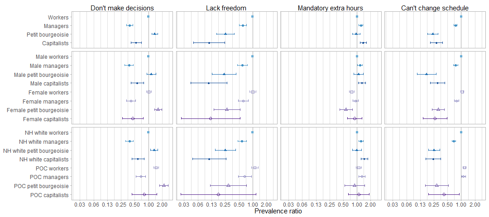<!-- -->

```r
ggsave("autonomy.png", height=5, width=11.25, dpi=600)

#table 
tabled(rbind(binded_overall[1:12,1:5], binded_gender[1:28,1:5], binded_race[1:28,1:5]), "Ref: workers/male workers/white workers")
```

<div style="border: 1px solid #ddd; padding: 0px; overflow-y: scroll; height:250px; overflow-x: scroll; width:100%; "><table class="table table-striped" style="margin-left: auto; margin-right: auto;">
<caption>Ref: workers/male workers/white workers</caption>
 <thead>
  <tr>
   <th style="text-align:left;position: sticky; top:0; background-color: #FFFFFF;"> QWL variable </th>
   <th style="text-align:left;position: sticky; top:0; background-color: #FFFFFF;"> Class </th>
   <th style="text-align:right;position: sticky; top:0; background-color: #FFFFFF;"> PR </th>
   <th style="text-align:right;position: sticky; top:0; background-color: #FFFFFF;"> Lower </th>
   <th style="text-align:right;position: sticky; top:0; background-color: #FFFFFF;"> Upper </th>
  </tr>
 </thead>
<tbody>
  <tr grouplength="12"><td colspan="5" style="border-bottom: 1px solid;"><strong>Class</strong></td></tr>
<tr>
   <td style="text-align:left; padding-left:  2em;" indentlevel="1"> wkdecide_bin_unimp </td>
   <td style="text-align:left;"> Managers </td>
   <td style="text-align:right;"> 0.39 </td>
   <td style="text-align:right;"> 0.33 </td>
   <td style="text-align:right;"> 0.45 </td>
  </tr>
  <tr>
   <td style="text-align:left; padding-left:  2em;" indentlevel="1"> wkdecide_bin_unimp </td>
   <td style="text-align:left;"> Petit bourgeoisie </td>
   <td style="text-align:right;"> 1.37 </td>
   <td style="text-align:right;"> 1.19 </td>
   <td style="text-align:right;"> 1.59 </td>
  </tr>
  <tr>
   <td style="text-align:left; padding-left:  2em;" indentlevel="1"> wkdecide_bin_unimp </td>
   <td style="text-align:left;"> Capitalists </td>
   <td style="text-align:right;"> 0.53 </td>
   <td style="text-align:right;"> 0.41 </td>
   <td style="text-align:right;"> 0.70 </td>
  </tr>
  <tr>
   <td style="text-align:left; padding-left:  2em;" indentlevel="1"> wkfreedm_bin_unimp </td>
   <td style="text-align:left;"> Managers </td>
   <td style="text-align:right;"> 0.60 </td>
   <td style="text-align:right;"> 0.50 </td>
   <td style="text-align:right;"> 0.72 </td>
  </tr>
  <tr>
   <td style="text-align:left; padding-left:  2em;" indentlevel="1"> wkfreedm_bin_unimp </td>
   <td style="text-align:left;"> Petit bourgeoisie </td>
   <td style="text-align:right;"> 0.25 </td>
   <td style="text-align:right;"> 0.16 </td>
   <td style="text-align:right;"> 0.40 </td>
  </tr>
  <tr>
   <td style="text-align:left; padding-left:  2em;" indentlevel="1"> wkfreedm_bin_unimp </td>
   <td style="text-align:left;"> Capitalists </td>
   <td style="text-align:right;"> 0.11 </td>
   <td style="text-align:right;"> 0.05 </td>
   <td style="text-align:right;"> 0.24 </td>
  </tr>
  <tr>
   <td style="text-align:left; padding-left:  2em;" indentlevel="1"> mustwork_bin_unimp </td>
   <td style="text-align:left;"> Managers </td>
   <td style="text-align:right;"> 1.21 </td>
   <td style="text-align:right;"> 1.10 </td>
   <td style="text-align:right;"> 1.34 </td>
  </tr>
  <tr>
   <td style="text-align:left; padding-left:  2em;" indentlevel="1"> mustwork_bin_unimp </td>
   <td style="text-align:left;"> Petit bourgeoisie </td>
   <td style="text-align:right;"> 0.96 </td>
   <td style="text-align:right;"> 0.79 </td>
   <td style="text-align:right;"> 1.18 </td>
  </tr>
  <tr>
   <td style="text-align:left; padding-left:  2em;" indentlevel="1"> mustwork_bin_unimp </td>
   <td style="text-align:left;"> Capitalists </td>
   <td style="text-align:right;"> 1.37 </td>
   <td style="text-align:right;"> 1.18 </td>
   <td style="text-align:right;"> 1.61 </td>
  </tr>
  <tr>
   <td style="text-align:left; padding-left:  2em;" indentlevel="1"> chngtme_bin_unimp </td>
   <td style="text-align:left;"> Managers </td>
   <td style="text-align:right;"> 0.75 </td>
   <td style="text-align:right;"> 0.69 </td>
   <td style="text-align:right;"> 0.81 </td>
  </tr>
  <tr>
   <td style="text-align:left; padding-left:  2em;" indentlevel="1"> chngtme_bin_unimp </td>
   <td style="text-align:left;"> Petit bourgeoisie </td>
   <td style="text-align:right;"> 0.24 </td>
   <td style="text-align:right;"> 0.18 </td>
   <td style="text-align:right;"> 0.31 </td>
  </tr>
  <tr>
   <td style="text-align:left; padding-left:  2em;" indentlevel="1"> chngtme_bin_unimp </td>
   <td style="text-align:left;"> Capitalists </td>
   <td style="text-align:right;"> 0.28 </td>
   <td style="text-align:right;"> 0.21 </td>
   <td style="text-align:right;"> 0.39 </td>
  </tr>
  <tr grouplength="28"><td colspan="5" style="border-bottom: 1px solid;"><strong>Class*gender</strong></td></tr>
<tr>
   <td style="text-align:left; padding-left:  2em;" indentlevel="1"> wkdecide_bin_unimp </td>
   <td style="text-align:left;"> Male managers </td>
   <td style="text-align:right;"> 0.37 </td>
   <td style="text-align:right;"> 0.30 </td>
   <td style="text-align:right;"> 0.46 </td>
  </tr>
  <tr>
   <td style="text-align:left; padding-left:  2em;" indentlevel="1"> wkdecide_bin_unimp </td>
   <td style="text-align:left;"> Male petit bourgeoisie </td>
   <td style="text-align:right;"> 1.15 </td>
   <td style="text-align:right;"> 0.92 </td>
   <td style="text-align:right;"> 1.44 </td>
  </tr>
  <tr>
   <td style="text-align:left; padding-left:  2em;" indentlevel="1"> wkdecide_bin_unimp </td>
   <td style="text-align:left;"> Male capitalists </td>
   <td style="text-align:right;"> 0.57 </td>
   <td style="text-align:right;"> 0.41 </td>
   <td style="text-align:right;"> 0.78 </td>
  </tr>
  <tr>
   <td style="text-align:left; padding-left:  2em;" indentlevel="1"> wkdecide_bin_unimp </td>
   <td style="text-align:left;"> Female workers </td>
   <td style="text-align:right;"> 1.02 </td>
   <td style="text-align:right;"> 0.91 </td>
   <td style="text-align:right;"> 1.15 </td>
  </tr>
  <tr>
   <td style="text-align:left; padding-left:  2em;" indentlevel="1"> wkdecide_bin_unimp </td>
   <td style="text-align:left;"> Female managers </td>
   <td style="text-align:right;"> 0.41 </td>
   <td style="text-align:right;"> 0.33 </td>
   <td style="text-align:right;"> 0.51 </td>
  </tr>
  <tr>
   <td style="text-align:left; padding-left:  2em;" indentlevel="1"> wkdecide_bin_unimp </td>
   <td style="text-align:left;"> Female petit bourgeoisie </td>
   <td style="text-align:right;"> 1.63 </td>
   <td style="text-align:right;"> 1.36 </td>
   <td style="text-align:right;"> 1.95 </td>
  </tr>
  <tr>
   <td style="text-align:left; padding-left:  2em;" indentlevel="1"> wkdecide_bin_unimp </td>
   <td style="text-align:left;"> Female capitalists </td>
   <td style="text-align:right;"> 0.45 </td>
   <td style="text-align:right;"> 0.27 </td>
   <td style="text-align:right;"> 0.77 </td>
  </tr>
  <tr>
   <td style="text-align:left; padding-left:  2em;" indentlevel="1"> wkfreedm_bin_unimp </td>
   <td style="text-align:left;"> Male managers </td>
   <td style="text-align:right;"> 0.59 </td>
   <td style="text-align:right;"> 0.46 </td>
   <td style="text-align:right;"> 0.76 </td>
  </tr>
  <tr>
   <td style="text-align:left; padding-left:  2em;" indentlevel="1"> wkfreedm_bin_unimp </td>
   <td style="text-align:left;"> Male petit bourgeoisie </td>
   <td style="text-align:right;"> 0.24 </td>
   <td style="text-align:right;"> 0.13 </td>
   <td style="text-align:right;"> 0.43 </td>
  </tr>
  <tr>
   <td style="text-align:left; padding-left:  2em;" indentlevel="1"> wkfreedm_bin_unimp </td>
   <td style="text-align:left;"> Male capitalists </td>
   <td style="text-align:right;"> 0.11 </td>
   <td style="text-align:right;"> 0.04 </td>
   <td style="text-align:right;"> 0.27 </td>
  </tr>
  <tr>
   <td style="text-align:left; padding-left:  2em;" indentlevel="1"> wkfreedm_bin_unimp </td>
   <td style="text-align:left;"> Female workers </td>
   <td style="text-align:right;"> 1.00 </td>
   <td style="text-align:right;"> 0.86 </td>
   <td style="text-align:right;"> 1.17 </td>
  </tr>
  <tr>
   <td style="text-align:left; padding-left:  2em;" indentlevel="1"> wkfreedm_bin_unimp </td>
   <td style="text-align:left;"> Female managers </td>
   <td style="text-align:right;"> 0.62 </td>
   <td style="text-align:right;"> 0.48 </td>
   <td style="text-align:right;"> 0.80 </td>
  </tr>
  <tr>
   <td style="text-align:left; padding-left:  2em;" indentlevel="1"> wkfreedm_bin_unimp </td>
   <td style="text-align:left;"> Female petit bourgeoisie </td>
   <td style="text-align:right;"> 0.27 </td>
   <td style="text-align:right;"> 0.14 </td>
   <td style="text-align:right;"> 0.52 </td>
  </tr>
  <tr>
   <td style="text-align:left; padding-left:  2em;" indentlevel="1"> wkfreedm_bin_unimp </td>
   <td style="text-align:left;"> Female capitalists </td>
   <td style="text-align:right;"> 0.12 </td>
   <td style="text-align:right;"> 0.03 </td>
   <td style="text-align:right;"> 0.52 </td>
  </tr>
  <tr>
   <td style="text-align:left; padding-left:  2em;" indentlevel="1"> mustwork_bin_unimp </td>
   <td style="text-align:left;"> Male managers </td>
   <td style="text-align:right;"> 1.16 </td>
   <td style="text-align:right;"> 1.03 </td>
   <td style="text-align:right;"> 1.32 </td>
  </tr>
  <tr>
   <td style="text-align:left; padding-left:  2em;" indentlevel="1"> mustwork_bin_unimp </td>
   <td style="text-align:left;"> Male petit bourgeoisie </td>
   <td style="text-align:right;"> 1.08 </td>
   <td style="text-align:right;"> 0.85 </td>
   <td style="text-align:right;"> 1.37 </td>
  </tr>
  <tr>
   <td style="text-align:left; padding-left:  2em;" indentlevel="1"> mustwork_bin_unimp </td>
   <td style="text-align:left;"> Male capitalists </td>
   <td style="text-align:right;"> 1.29 </td>
   <td style="text-align:right;"> 1.07 </td>
   <td style="text-align:right;"> 1.54 </td>
  </tr>
  <tr>
   <td style="text-align:left; padding-left:  2em;" indentlevel="1"> mustwork_bin_unimp </td>
   <td style="text-align:left;"> Female workers </td>
   <td style="text-align:right;"> 0.76 </td>
   <td style="text-align:right;"> 0.67 </td>
   <td style="text-align:right;"> 0.86 </td>
  </tr>
  <tr>
   <td style="text-align:left; padding-left:  2em;" indentlevel="1"> mustwork_bin_unimp </td>
   <td style="text-align:left;"> Female managers </td>
   <td style="text-align:right;"> 0.93 </td>
   <td style="text-align:right;"> 0.81 </td>
   <td style="text-align:right;"> 1.07 </td>
  </tr>
  <tr>
   <td style="text-align:left; padding-left:  2em;" indentlevel="1"> mustwork_bin_unimp </td>
   <td style="text-align:left;"> Female petit bourgeoisie </td>
   <td style="text-align:right;"> 0.57 </td>
   <td style="text-align:right;"> 0.41 </td>
   <td style="text-align:right;"> 0.79 </td>
  </tr>
  <tr>
   <td style="text-align:left; padding-left:  2em;" indentlevel="1"> mustwork_bin_unimp </td>
   <td style="text-align:left;"> Female capitalists </td>
   <td style="text-align:right;"> 0.89 </td>
   <td style="text-align:right;"> 0.61 </td>
   <td style="text-align:right;"> 1.28 </td>
  </tr>
  <tr>
   <td style="text-align:left; padding-left:  2em;" indentlevel="1"> chngtme_bin_unimp </td>
   <td style="text-align:left;"> Male managers </td>
   <td style="text-align:right;"> 0.75 </td>
   <td style="text-align:right;"> 0.67 </td>
   <td style="text-align:right;"> 0.84 </td>
  </tr>
  <tr>
   <td style="text-align:left; padding-left:  2em;" indentlevel="1"> chngtme_bin_unimp </td>
   <td style="text-align:left;"> Male petit bourgeoisie </td>
   <td style="text-align:right;"> 0.17 </td>
   <td style="text-align:right;"> 0.11 </td>
   <td style="text-align:right;"> 0.28 </td>
  </tr>
  <tr>
   <td style="text-align:left; padding-left:  2em;" indentlevel="1"> chngtme_bin_unimp </td>
   <td style="text-align:left;"> Male capitalists </td>
   <td style="text-align:right;"> 0.30 </td>
   <td style="text-align:right;"> 0.21 </td>
   <td style="text-align:right;"> 0.44 </td>
  </tr>
  <tr>
   <td style="text-align:left; padding-left:  2em;" indentlevel="1"> chngtme_bin_unimp </td>
   <td style="text-align:left;"> Female workers </td>
   <td style="text-align:right;"> 1.05 </td>
   <td style="text-align:right;"> 0.98 </td>
   <td style="text-align:right;"> 1.14 </td>
  </tr>
  <tr>
   <td style="text-align:left; padding-left:  2em;" indentlevel="1"> chngtme_bin_unimp </td>
   <td style="text-align:left;"> Female managers </td>
   <td style="text-align:right;"> 0.79 </td>
   <td style="text-align:right;"> 0.71 </td>
   <td style="text-align:right;"> 0.88 </td>
  </tr>
  <tr>
   <td style="text-align:left; padding-left:  2em;" indentlevel="1"> chngtme_bin_unimp </td>
   <td style="text-align:left;"> Female petit bourgeoisie </td>
   <td style="text-align:right;"> 0.31 </td>
   <td style="text-align:right;"> 0.23 </td>
   <td style="text-align:right;"> 0.43 </td>
  </tr>
  <tr>
   <td style="text-align:left; padding-left:  2em;" indentlevel="1"> chngtme_bin_unimp </td>
   <td style="text-align:left;"> Female capitalists </td>
   <td style="text-align:right;"> 0.26 </td>
   <td style="text-align:right;"> 0.14 </td>
   <td style="text-align:right;"> 0.49 </td>
  </tr>
  <tr grouplength="28"><td colspan="5" style="border-bottom: 1px solid;"><strong>Class*POC</strong></td></tr>
<tr>
   <td style="text-align:left; padding-left:  2em;" indentlevel="1"> wkdecide_bin_unimp </td>
   <td style="text-align:left;"> NH white managers </td>
   <td style="text-align:right;"> 0.38 </td>
   <td style="text-align:right;"> 0.31 </td>
   <td style="text-align:right;"> 0.47 </td>
  </tr>
  <tr>
   <td style="text-align:left; padding-left:  2em;" indentlevel="1"> wkdecide_bin_unimp </td>
   <td style="text-align:left;"> NH white petit bourgeoisie </td>
   <td style="text-align:right;"> 1.34 </td>
   <td style="text-align:right;"> 1.12 </td>
   <td style="text-align:right;"> 1.61 </td>
  </tr>
  <tr>
   <td style="text-align:left; padding-left:  2em;" indentlevel="1"> wkdecide_bin_unimp </td>
   <td style="text-align:left;"> NH white capitalists </td>
   <td style="text-align:right;"> 0.59 </td>
   <td style="text-align:right;"> 0.43 </td>
   <td style="text-align:right;"> 0.79 </td>
  </tr>
  <tr>
   <td style="text-align:left; padding-left:  2em;" indentlevel="1"> wkdecide_bin_unimp </td>
   <td style="text-align:left;"> POC workers </td>
   <td style="text-align:right;"> 1.48 </td>
   <td style="text-align:right;"> 1.31 </td>
   <td style="text-align:right;"> 1.68 </td>
  </tr>
  <tr>
   <td style="text-align:left; padding-left:  2em;" indentlevel="1"> wkdecide_bin_unimp </td>
   <td style="text-align:left;"> POC managers </td>
   <td style="text-align:right;"> 0.68 </td>
   <td style="text-align:right;"> 0.53 </td>
   <td style="text-align:right;"> 0.86 </td>
  </tr>
  <tr>
   <td style="text-align:left; padding-left:  2em;" indentlevel="1"> wkdecide_bin_unimp </td>
   <td style="text-align:left;"> POC petit bourgeoisie </td>
   <td style="text-align:right;"> 2.18 </td>
   <td style="text-align:right;"> 1.75 </td>
   <td style="text-align:right;"> 2.72 </td>
  </tr>
  <tr>
   <td style="text-align:left; padding-left:  2em;" indentlevel="1"> wkdecide_bin_unimp </td>
   <td style="text-align:left;"> POC capitalists </td>
   <td style="text-align:right;"> 0.81 </td>
   <td style="text-align:right;"> 0.43 </td>
   <td style="text-align:right;"> 1.52 </td>
  </tr>
  <tr>
   <td style="text-align:left; padding-left:  2em;" indentlevel="1"> wkfreedm_bin_unimp </td>
   <td style="text-align:left;"> NH white managers </td>
   <td style="text-align:right;"> 0.58 </td>
   <td style="text-align:right;"> 0.47 </td>
   <td style="text-align:right;"> 0.72 </td>
  </tr>
  <tr>
   <td style="text-align:left; padding-left:  2em;" indentlevel="1"> wkfreedm_bin_unimp </td>
   <td style="text-align:left;"> NH white petit bourgeoisie </td>
   <td style="text-align:right;"> 0.25 </td>
   <td style="text-align:right;"> 0.15 </td>
   <td style="text-align:right;"> 0.42 </td>
  </tr>
  <tr>
   <td style="text-align:left; padding-left:  2em;" indentlevel="1"> wkfreedm_bin_unimp </td>
   <td style="text-align:left;"> NH white capitalists </td>
   <td style="text-align:right;"> 0.11 </td>
   <td style="text-align:right;"> 0.05 </td>
   <td style="text-align:right;"> 0.26 </td>
  </tr>
  <tr>
   <td style="text-align:left; padding-left:  2em;" indentlevel="1"> wkfreedm_bin_unimp </td>
   <td style="text-align:left;"> POC workers </td>
   <td style="text-align:right;"> 1.11 </td>
   <td style="text-align:right;"> 0.93 </td>
   <td style="text-align:right;"> 1.33 </td>
  </tr>
  <tr>
   <td style="text-align:left; padding-left:  2em;" indentlevel="1"> wkfreedm_bin_unimp </td>
   <td style="text-align:left;"> POC managers </td>
   <td style="text-align:right;"> 0.67 </td>
   <td style="text-align:right;"> 0.48 </td>
   <td style="text-align:right;"> 0.93 </td>
  </tr>
  <tr>
   <td style="text-align:left; padding-left:  2em;" indentlevel="1"> wkfreedm_bin_unimp </td>
   <td style="text-align:left;"> POC petit bourgeoisie </td>
   <td style="text-align:right;"> 0.29 </td>
   <td style="text-align:right;"> 0.12 </td>
   <td style="text-align:right;"> 0.72 </td>
  </tr>
  <tr>
   <td style="text-align:left; padding-left:  2em;" indentlevel="1"> wkfreedm_bin_unimp </td>
   <td style="text-align:left;"> POC capitalists </td>
   <td style="text-align:right;"> 0.18 </td>
   <td style="text-align:right;"> 0.03 </td>
   <td style="text-align:right;"> 1.19 </td>
  </tr>
  <tr>
   <td style="text-align:left; padding-left:  2em;" indentlevel="1"> mustwork_bin_unimp </td>
   <td style="text-align:left;"> NH white managers </td>
   <td style="text-align:right;"> 1.23 </td>
   <td style="text-align:right;"> 1.10 </td>
   <td style="text-align:right;"> 1.37 </td>
  </tr>
  <tr>
   <td style="text-align:left; padding-left:  2em;" indentlevel="1"> mustwork_bin_unimp </td>
   <td style="text-align:left;"> NH white petit bourgeoisie </td>
   <td style="text-align:right;"> 0.99 </td>
   <td style="text-align:right;"> 0.79 </td>
   <td style="text-align:right;"> 1.25 </td>
  </tr>
  <tr>
   <td style="text-align:left; padding-left:  2em;" indentlevel="1"> mustwork_bin_unimp </td>
   <td style="text-align:left;"> NH white capitalists </td>
   <td style="text-align:right;"> 1.44 </td>
   <td style="text-align:right;"> 1.22 </td>
   <td style="text-align:right;"> 1.71 </td>
  </tr>
  <tr>
   <td style="text-align:left; padding-left:  2em;" indentlevel="1"> mustwork_bin_unimp </td>
   <td style="text-align:left;"> POC workers </td>
   <td style="text-align:right;"> 1.09 </td>
   <td style="text-align:right;"> 0.95 </td>
   <td style="text-align:right;"> 1.25 </td>
  </tr>
  <tr>
   <td style="text-align:left; padding-left:  2em;" indentlevel="1"> mustwork_bin_unimp </td>
   <td style="text-align:left;"> POC managers </td>
   <td style="text-align:right;"> 1.28 </td>
   <td style="text-align:right;"> 1.08 </td>
   <td style="text-align:right;"> 1.52 </td>
  </tr>
  <tr>
   <td style="text-align:left; padding-left:  2em;" indentlevel="1"> mustwork_bin_unimp </td>
   <td style="text-align:left;"> POC petit bourgeoisie </td>
   <td style="text-align:right;"> 0.88 </td>
   <td style="text-align:right;"> 0.53 </td>
   <td style="text-align:right;"> 1.46 </td>
  </tr>
  <tr>
   <td style="text-align:left; padding-left:  2em;" indentlevel="1"> mustwork_bin_unimp </td>
   <td style="text-align:left;"> POC capitalists </td>
   <td style="text-align:right;"> 1.10 </td>
   <td style="text-align:right;"> 0.64 </td>
   <td style="text-align:right;"> 1.87 </td>
  </tr>
  <tr>
   <td style="text-align:left; padding-left:  2em;" indentlevel="1"> chngtme_bin_unimp </td>
   <td style="text-align:left;"> NH white managers </td>
   <td style="text-align:right;"> 0.69 </td>
   <td style="text-align:right;"> 0.63 </td>
   <td style="text-align:right;"> 0.76 </td>
  </tr>
  <tr>
   <td style="text-align:left; padding-left:  2em;" indentlevel="1"> chngtme_bin_unimp </td>
   <td style="text-align:left;"> NH white petit bourgeoisie </td>
   <td style="text-align:right;"> 0.25 </td>
   <td style="text-align:right;"> 0.19 </td>
   <td style="text-align:right;"> 0.34 </td>
  </tr>
  <tr>
   <td style="text-align:left; padding-left:  2em;" indentlevel="1"> chngtme_bin_unimp </td>
   <td style="text-align:left;"> NH white capitalists </td>
   <td style="text-align:right;"> 0.24 </td>
   <td style="text-align:right;"> 0.17 </td>
   <td style="text-align:right;"> 0.35 </td>
  </tr>
  <tr>
   <td style="text-align:left; padding-left:  2em;" indentlevel="1"> chngtme_bin_unimp </td>
   <td style="text-align:left;"> POC workers </td>
   <td style="text-align:right;"> 1.18 </td>
   <td style="text-align:right;"> 1.09 </td>
   <td style="text-align:right;"> 1.28 </td>
  </tr>
  <tr>
   <td style="text-align:left; padding-left:  2em;" indentlevel="1"> chngtme_bin_unimp </td>
   <td style="text-align:left;"> POC managers </td>
   <td style="text-align:right;"> 1.12 </td>
   <td style="text-align:right;"> 1.01 </td>
   <td style="text-align:right;"> 1.25 </td>
  </tr>
  <tr>
   <td style="text-align:left; padding-left:  2em;" indentlevel="1"> chngtme_bin_unimp </td>
   <td style="text-align:left;"> POC petit bourgeoisie </td>
   <td style="text-align:right;"> 0.29 </td>
   <td style="text-align:right;"> 0.16 </td>
   <td style="text-align:right;"> 0.52 </td>
  </tr>
  <tr>
   <td style="text-align:left; padding-left:  2em;" indentlevel="1"> chngtme_bin_unimp </td>
   <td style="text-align:left;"> POC capitalists </td>
   <td style="text-align:right;"> 0.42 </td>
   <td style="text-align:right;"> 0.19 </td>
   <td style="text-align:right;"> 0.91 </td>
  </tr>
</tbody>
</table></div>

### Conflict


```r
#outvars
outvars <- c("manvsemp_bin_unimp", "trustman_bin_unimp", "respect_bin_unimp", "disc_haras_bin_unimp")

########everyone
#run regression
less_adj <- mysvy(svy_dat_mi, outvars, "~class + rcs(age, 3) + rcs(year, 3)")

#pull into matrix
regs_less <- matrix_func(4, 4, outvars)

#format matrix
binded_overall <- formatted(c("Managers", "Petit bourgeoisie", "Capitalists"), 4,
                            c("manvsemp_bin_unimp", "trustman_bin_unimp", "respect_bin_unimp", "disc_haras_bin_unimp"),
                            "Workers",
                            c("Workers", "Managers", "Petit bourgeoisie", "Capitalists"))

#######gender interaction
#run regression
less_adj <- mysvy(svy_dat_mi, outvars, "~class_gender + rcs(age, 3) + rcs(year, 3)")

#pull into matrix
regs_less <- matrix_func(4, 8, outvars)

#format matrix
binded_gender <- formatted(c("Male managers", "Male petit bourgeoisie", "Male capitalists",
                             "Female workers", "Female managers", "Female petit bourgeoisie", "Female capitalists"), 4,
                           c("manvsemp_bin_unimp", "trustman_bin_unimp", "respect_bin_unimp", "disc_haras_bin_unimp"),
                           "Male workers",
                           c("Male workers", "Male managers", "Male petit bourgeoisie", "Male capitalists",
                             "Female workers", "Female managers", "Female petit bourgeoisie", "Female capitalists"))

#######race interaction
#run regression
less_adj <- mysvy(subset(svy_dat_mi, race_h!="NH other"), outvars, "~class_poc + rcs(age, 3) + rcs(year, 3)")

#pull into matrix
regs_less <- matrix_func(4, 8, outvars)

#format matrix
binded_race <- formatted(c("NH white managers", "NH white petit bourgeoisie", "NH white capitalists",
                           "POC workers", "POC managers", "POC petit bourgeoisie", "POC capitalists"), 4,
                         outvars,
                         "NH white workers",
                         c("NH white workers", "NH white managers", "NH white petit bourgeoisie", "NH white capitalists",
                           "POC workers", "POC managers", "POC petit bourgeoisie", "POC capitalists"))
```


```r
#figure
plotted(binded_overall, limitsvec=c(0.017, 2.42), breaksvec=c(0.031, 0.0625, 0.125, 0.25, 0.5, 1, 2, 4), 
             cols=brewer.pal(8, "Blues")[c(5,6,7,8)], shapes=c(15,16,17,18)) + theme(strip.text=element_text(colour = "black", vjust=1.07)) +
    plotted(binded_gender, limitsvec=c(0.017, 2.42), breaksvec=c(0.031, 0.0625, 0.125, 0.25, 0.5, 1, 2, 4), 
                 cols=c(brewer.pal(8, "Blues")[c(5,6,7,8)], brewer.pal(8, "Purples")[c(5,6,7,8)]), shapes=c(15,16,17,18,0,1,2,5)) +
    plotted(binded_race, limitsvec=c(0.017, 2.42), breaksvec=c(0.031, 0.0625, 0.125, 0.25, 0.5, 1, 2, 4), 
            cols=c(brewer.pal(8, "Blues")[c(5,6,7,8)], brewer.pal(8, "Purples")[c(5,6,7,8)]), shapes=c(15,16,17,18,0,1,2,5)) + 
            xlab("Prevalence ratio") + theme(axis.title.x=element_text(), axis.text.x=element_text(), axis.ticks.x=element_line(), axis.title.y=element_blank()) +
            geom_text(data=filter(binded_race, row_number()==7), x=-3.95, y=1.13, label="\u2190", color="#4A1486", size=6) +  
  plot_layout(ncol=1, heights=c(1, 2, 2))
```

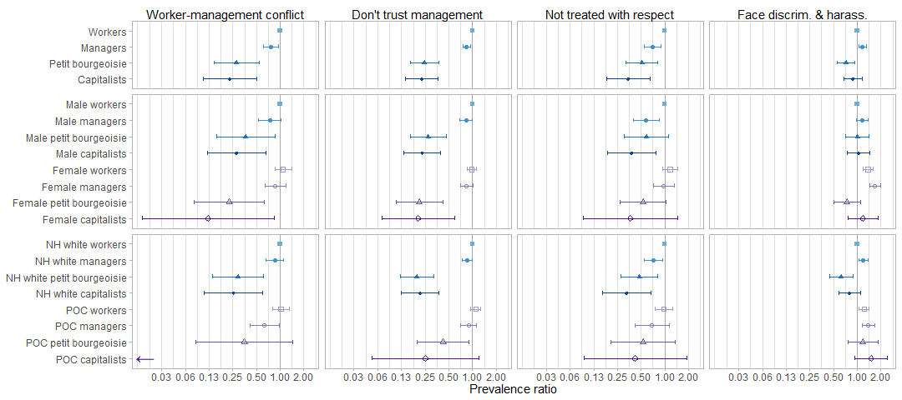<!-- -->

```r
ggsave("conflict.png", height=5, width=11.25, dpi=600)

#table 
tabled(rbind(binded_overall[1:12,1:5], binded_gender[1:28,1:5], binded_race[1:28,1:5]), "Ref: workers/male workers/white workers")
```

<div style="border: 1px solid #ddd; padding: 0px; overflow-y: scroll; height:250px; overflow-x: scroll; width:100%; "><table class="table table-striped" style="margin-left: auto; margin-right: auto;">
<caption>Ref: workers/male workers/white workers</caption>
 <thead>
  <tr>
   <th style="text-align:left;position: sticky; top:0; background-color: #FFFFFF;"> QWL variable </th>
   <th style="text-align:left;position: sticky; top:0; background-color: #FFFFFF;"> Class </th>
   <th style="text-align:right;position: sticky; top:0; background-color: #FFFFFF;"> PR </th>
   <th style="text-align:right;position: sticky; top:0; background-color: #FFFFFF;"> Lower </th>
   <th style="text-align:right;position: sticky; top:0; background-color: #FFFFFF;"> Upper </th>
  </tr>
 </thead>
<tbody>
  <tr grouplength="12"><td colspan="5" style="border-bottom: 1px solid;"><strong>Class</strong></td></tr>
<tr>
   <td style="text-align:left; padding-left:  2em;" indentlevel="1"> manvsemp_bin_unimp </td>
   <td style="text-align:left;"> Managers </td>
   <td style="text-align:right;"> 0.76 </td>
   <td style="text-align:right;"> 0.61 </td>
   <td style="text-align:right;"> 0.95 </td>
  </tr>
  <tr>
   <td style="text-align:left; padding-left:  2em;" indentlevel="1"> manvsemp_bin_unimp </td>
   <td style="text-align:left;"> Petit bourgeoisie </td>
   <td style="text-align:right;"> 0.28 </td>
   <td style="text-align:right;"> 0.14 </td>
   <td style="text-align:right;"> 0.54 </td>
  </tr>
  <tr>
   <td style="text-align:left; padding-left:  2em;" indentlevel="1"> manvsemp_bin_unimp </td>
   <td style="text-align:left;"> Capitalists </td>
   <td style="text-align:right;"> 0.23 </td>
   <td style="text-align:right;"> 0.10 </td>
   <td style="text-align:right;"> 0.50 </td>
  </tr>
  <tr>
   <td style="text-align:left; padding-left:  2em;" indentlevel="1"> trustman_bin_unimp </td>
   <td style="text-align:left;"> Managers </td>
   <td style="text-align:right;"> 0.84 </td>
   <td style="text-align:right;"> 0.75 </td>
   <td style="text-align:right;"> 0.95 </td>
  </tr>
  <tr>
   <td style="text-align:left; padding-left:  2em;" indentlevel="1"> trustman_bin_unimp </td>
   <td style="text-align:left;"> Petit bourgeoisie </td>
   <td style="text-align:right;"> 0.24 </td>
   <td style="text-align:right;"> 0.16 </td>
   <td style="text-align:right;"> 0.37 </td>
  </tr>
  <tr>
   <td style="text-align:left; padding-left:  2em;" indentlevel="1"> trustman_bin_unimp </td>
   <td style="text-align:left;"> Capitalists </td>
   <td style="text-align:right;"> 0.23 </td>
   <td style="text-align:right;"> 0.14 </td>
   <td style="text-align:right;"> 0.36 </td>
  </tr>
  <tr>
   <td style="text-align:left; padding-left:  2em;" indentlevel="1"> respect_bin_unimp </td>
   <td style="text-align:left;"> Managers </td>
   <td style="text-align:right;"> 0.70 </td>
   <td style="text-align:right;"> 0.55 </td>
   <td style="text-align:right;"> 0.89 </td>
  </tr>
  <tr>
   <td style="text-align:left; padding-left:  2em;" indentlevel="1"> respect_bin_unimp </td>
   <td style="text-align:left;"> Petit bourgeoisie </td>
   <td style="text-align:right;"> 0.51 </td>
   <td style="text-align:right;"> 0.32 </td>
   <td style="text-align:right;"> 0.82 </td>
  </tr>
  <tr>
   <td style="text-align:left; padding-left:  2em;" indentlevel="1"> respect_bin_unimp </td>
   <td style="text-align:left;"> Capitalists </td>
   <td style="text-align:right;"> 0.34 </td>
   <td style="text-align:right;"> 0.18 </td>
   <td style="text-align:right;"> 0.64 </td>
  </tr>
  <tr>
   <td style="text-align:left; padding-left:  2em;" indentlevel="1"> disc_haras_bin_unimp </td>
   <td style="text-align:left;"> Managers </td>
   <td style="text-align:right;"> 1.17 </td>
   <td style="text-align:right;"> 1.04 </td>
   <td style="text-align:right;"> 1.31 </td>
  </tr>
  <tr>
   <td style="text-align:left; padding-left:  2em;" indentlevel="1"> disc_haras_bin_unimp </td>
   <td style="text-align:left;"> Petit bourgeoisie </td>
   <td style="text-align:right;"> 0.73 </td>
   <td style="text-align:right;"> 0.56 </td>
   <td style="text-align:right;"> 0.94 </td>
  </tr>
  <tr>
   <td style="text-align:left; padding-left:  2em;" indentlevel="1"> disc_haras_bin_unimp </td>
   <td style="text-align:left;"> Capitalists </td>
   <td style="text-align:right;"> 0.89 </td>
   <td style="text-align:right;"> 0.68 </td>
   <td style="text-align:right;"> 1.16 </td>
  </tr>
  <tr grouplength="28"><td colspan="5" style="border-bottom: 1px solid;"><strong>Class*gender</strong></td></tr>
<tr>
   <td style="text-align:left; padding-left:  2em;" indentlevel="1"> manvsemp_bin_unimp </td>
   <td style="text-align:left;"> Male managers </td>
   <td style="text-align:right;"> 0.74 </td>
   <td style="text-align:right;"> 0.53 </td>
   <td style="text-align:right;"> 1.02 </td>
  </tr>
  <tr>
   <td style="text-align:left; padding-left:  2em;" indentlevel="1"> manvsemp_bin_unimp </td>
   <td style="text-align:left;"> Male petit bourgeoisie </td>
   <td style="text-align:right;"> 0.37 </td>
   <td style="text-align:right;"> 0.15 </td>
   <td style="text-align:right;"> 0.87 </td>
  </tr>
  <tr>
   <td style="text-align:left; padding-left:  2em;" indentlevel="1"> manvsemp_bin_unimp </td>
   <td style="text-align:left;"> Male capitalists </td>
   <td style="text-align:right;"> 0.28 </td>
   <td style="text-align:right;"> 0.12 </td>
   <td style="text-align:right;"> 0.66 </td>
  </tr>
  <tr>
   <td style="text-align:left; padding-left:  2em;" indentlevel="1"> manvsemp_bin_unimp </td>
   <td style="text-align:left;"> Female workers </td>
   <td style="text-align:right;"> 1.10 </td>
   <td style="text-align:right;"> 0.85 </td>
   <td style="text-align:right;"> 1.41 </td>
  </tr>
  <tr>
   <td style="text-align:left; padding-left:  2em;" indentlevel="1"> manvsemp_bin_unimp </td>
   <td style="text-align:left;"> Female managers </td>
   <td style="text-align:right;"> 0.87 </td>
   <td style="text-align:right;"> 0.64 </td>
   <td style="text-align:right;"> 1.19 </td>
  </tr>
  <tr>
   <td style="text-align:left; padding-left:  2em;" indentlevel="1"> manvsemp_bin_unimp </td>
   <td style="text-align:left;"> Female petit bourgeoisie </td>
   <td style="text-align:right;"> 0.23 </td>
   <td style="text-align:right;"> 0.08 </td>
   <td style="text-align:right;"> 0.63 </td>
  </tr>
  <tr>
   <td style="text-align:left; padding-left:  2em;" indentlevel="1"> manvsemp_bin_unimp </td>
   <td style="text-align:left;"> Female capitalists </td>
   <td style="text-align:right;"> 0.12 </td>
   <td style="text-align:right;"> 0.02 </td>
   <td style="text-align:right;"> 0.83 </td>
  </tr>
  <tr>
   <td style="text-align:left; padding-left:  2em;" indentlevel="1"> trustman_bin_unimp </td>
   <td style="text-align:left;"> Male managers </td>
   <td style="text-align:right;"> 0.83 </td>
   <td style="text-align:right;"> 0.69 </td>
   <td style="text-align:right;"> 1.00 </td>
  </tr>
  <tr>
   <td style="text-align:left; padding-left:  2em;" indentlevel="1"> trustman_bin_unimp </td>
   <td style="text-align:left;"> Male petit bourgeoisie </td>
   <td style="text-align:right;"> 0.27 </td>
   <td style="text-align:right;"> 0.16 </td>
   <td style="text-align:right;"> 0.47 </td>
  </tr>
  <tr>
   <td style="text-align:left; padding-left:  2em;" indentlevel="1"> trustman_bin_unimp </td>
   <td style="text-align:left;"> Male capitalists </td>
   <td style="text-align:right;"> 0.23 </td>
   <td style="text-align:right;"> 0.13 </td>
   <td style="text-align:right;"> 0.40 </td>
  </tr>
  <tr>
   <td style="text-align:left; padding-left:  2em;" indentlevel="1"> trustman_bin_unimp </td>
   <td style="text-align:left;"> Female workers </td>
   <td style="text-align:right;"> 0.99 </td>
   <td style="text-align:right;"> 0.86 </td>
   <td style="text-align:right;"> 1.13 </td>
  </tr>
  <tr>
   <td style="text-align:left; padding-left:  2em;" indentlevel="1"> trustman_bin_unimp </td>
   <td style="text-align:left;"> Female managers </td>
   <td style="text-align:right;"> 0.84 </td>
   <td style="text-align:right;"> 0.71 </td>
   <td style="text-align:right;"> 1.00 </td>
  </tr>
  <tr>
   <td style="text-align:left; padding-left:  2em;" indentlevel="1"> trustman_bin_unimp </td>
   <td style="text-align:left;"> Female petit bourgeoisie </td>
   <td style="text-align:right;"> 0.21 </td>
   <td style="text-align:right;"> 0.11 </td>
   <td style="text-align:right;"> 0.42 </td>
  </tr>
  <tr>
   <td style="text-align:left; padding-left:  2em;" indentlevel="1"> trustman_bin_unimp </td>
   <td style="text-align:left;"> Female capitalists </td>
   <td style="text-align:right;"> 0.20 </td>
   <td style="text-align:right;"> 0.07 </td>
   <td style="text-align:right;"> 0.59 </td>
  </tr>
  <tr>
   <td style="text-align:left; padding-left:  2em;" indentlevel="1"> respect_bin_unimp </td>
   <td style="text-align:left;"> Male managers </td>
   <td style="text-align:right;"> 0.58 </td>
   <td style="text-align:right;"> 0.39 </td>
   <td style="text-align:right;"> 0.85 </td>
  </tr>
  <tr>
   <td style="text-align:left; padding-left:  2em;" indentlevel="1"> respect_bin_unimp </td>
   <td style="text-align:left;"> Male petit bourgeoisie </td>
   <td style="text-align:right;"> 0.58 </td>
   <td style="text-align:right;"> 0.30 </td>
   <td style="text-align:right;"> 1.12 </td>
  </tr>
  <tr>
   <td style="text-align:left; padding-left:  2em;" indentlevel="1"> respect_bin_unimp </td>
   <td style="text-align:left;"> Male capitalists </td>
   <td style="text-align:right;"> 0.38 </td>
   <td style="text-align:right;"> 0.19 </td>
   <td style="text-align:right;"> 0.77 </td>
  </tr>
  <tr>
   <td style="text-align:left; padding-left:  2em;" indentlevel="1"> respect_bin_unimp </td>
   <td style="text-align:left;"> Female workers </td>
   <td style="text-align:right;"> 1.17 </td>
   <td style="text-align:right;"> 0.93 </td>
   <td style="text-align:right;"> 1.46 </td>
  </tr>
  <tr>
   <td style="text-align:left; padding-left:  2em;" indentlevel="1"> respect_bin_unimp </td>
   <td style="text-align:left;"> Female managers </td>
   <td style="text-align:right;"> 0.97 </td>
   <td style="text-align:right;"> 0.71 </td>
   <td style="text-align:right;"> 1.32 </td>
  </tr>
  <tr>
   <td style="text-align:left; padding-left:  2em;" indentlevel="1"> respect_bin_unimp </td>
   <td style="text-align:left;"> Female petit bourgeoisie </td>
   <td style="text-align:right;"> 0.53 </td>
   <td style="text-align:right;"> 0.27 </td>
   <td style="text-align:right;"> 1.05 </td>
  </tr>
  <tr>
   <td style="text-align:left; padding-left:  2em;" indentlevel="1"> respect_bin_unimp </td>
   <td style="text-align:left;"> Female capitalists </td>
   <td style="text-align:right;"> 0.36 </td>
   <td style="text-align:right;"> 0.09 </td>
   <td style="text-align:right;"> 1.44 </td>
  </tr>
  <tr>
   <td style="text-align:left; padding-left:  2em;" indentlevel="1"> disc_haras_bin_unimp </td>
   <td style="text-align:left;"> Male managers </td>
   <td style="text-align:right;"> 1.16 </td>
   <td style="text-align:right;"> 0.98 </td>
   <td style="text-align:right;"> 1.38 </td>
  </tr>
  <tr>
   <td style="text-align:left; padding-left:  2em;" indentlevel="1"> disc_haras_bin_unimp </td>
   <td style="text-align:left;"> Male petit bourgeoisie </td>
   <td style="text-align:right;"> 1.01 </td>
   <td style="text-align:right;"> 0.72 </td>
   <td style="text-align:right;"> 1.43 </td>
  </tr>
  <tr>
   <td style="text-align:left; padding-left:  2em;" indentlevel="1"> disc_haras_bin_unimp </td>
   <td style="text-align:left;"> Male capitalists </td>
   <td style="text-align:right;"> 1.04 </td>
   <td style="text-align:right;"> 0.74 </td>
   <td style="text-align:right;"> 1.46 </td>
  </tr>
  <tr>
   <td style="text-align:left; padding-left:  2em;" indentlevel="1"> disc_haras_bin_unimp </td>
   <td style="text-align:left;"> Female workers </td>
   <td style="text-align:right;"> 1.38 </td>
   <td style="text-align:right;"> 1.19 </td>
   <td style="text-align:right;"> 1.59 </td>
  </tr>
  <tr>
   <td style="text-align:left; padding-left:  2em;" indentlevel="1"> disc_haras_bin_unimp </td>
   <td style="text-align:left;"> Female managers </td>
   <td style="text-align:right;"> 1.68 </td>
   <td style="text-align:right;"> 1.43 </td>
   <td style="text-align:right;"> 1.97 </td>
  </tr>
  <tr>
   <td style="text-align:left; padding-left:  2em;" indentlevel="1"> disc_haras_bin_unimp </td>
   <td style="text-align:left;"> Female petit bourgeoisie </td>
   <td style="text-align:right;"> 0.74 </td>
   <td style="text-align:right;"> 0.50 </td>
   <td style="text-align:right;"> 1.11 </td>
  </tr>
  <tr>
   <td style="text-align:left; padding-left:  2em;" indentlevel="1"> disc_haras_bin_unimp </td>
   <td style="text-align:left;"> Female capitalists </td>
   <td style="text-align:right;"> 1.18 </td>
   <td style="text-align:right;"> 0.76 </td>
   <td style="text-align:right;"> 1.84 </td>
  </tr>
  <tr grouplength="28"><td colspan="5" style="border-bottom: 1px solid;"><strong>Class*POC</strong></td></tr>
<tr>
   <td style="text-align:left; padding-left:  2em;" indentlevel="1"> manvsemp_bin_unimp </td>
   <td style="text-align:left;"> NH white managers </td>
   <td style="text-align:right;"> 0.85 </td>
   <td style="text-align:right;"> 0.66 </td>
   <td style="text-align:right;"> 1.10 </td>
  </tr>
  <tr>
   <td style="text-align:left; padding-left:  2em;" indentlevel="1"> manvsemp_bin_unimp </td>
   <td style="text-align:left;"> NH white petit bourgeoisie </td>
   <td style="text-align:right;"> 0.29 </td>
   <td style="text-align:right;"> 0.14 </td>
   <td style="text-align:right;"> 0.61 </td>
  </tr>
  <tr>
   <td style="text-align:left; padding-left:  2em;" indentlevel="1"> manvsemp_bin_unimp </td>
   <td style="text-align:left;"> NH white capitalists </td>
   <td style="text-align:right;"> 0.25 </td>
   <td style="text-align:right;"> 0.11 </td>
   <td style="text-align:right;"> 0.60 </td>
  </tr>
  <tr>
   <td style="text-align:left; padding-left:  2em;" indentlevel="1"> manvsemp_bin_unimp </td>
   <td style="text-align:left;"> POC workers </td>
   <td style="text-align:right;"> 1.02 </td>
   <td style="text-align:right;"> 0.79 </td>
   <td style="text-align:right;"> 1.32 </td>
  </tr>
  <tr>
   <td style="text-align:left; padding-left:  2em;" indentlevel="1"> manvsemp_bin_unimp </td>
   <td style="text-align:left;"> POC managers </td>
   <td style="text-align:right;"> 0.63 </td>
   <td style="text-align:right;"> 0.41 </td>
   <td style="text-align:right;"> 0.97 </td>
  </tr>
  <tr>
   <td style="text-align:left; padding-left:  2em;" indentlevel="1"> manvsemp_bin_unimp </td>
   <td style="text-align:left;"> POC petit bourgeoisie </td>
   <td style="text-align:right;"> 0.35 </td>
   <td style="text-align:right;"> 0.08 </td>
   <td style="text-align:right;"> 1.46 </td>
  </tr>
  <tr>
   <td style="text-align:left; padding-left:  2em;" indentlevel="1"> manvsemp_bin_unimp </td>
   <td style="text-align:left;"> POC capitalists </td>
   <td style="text-align:right;"> 0.00 </td>
   <td style="text-align:right;"> 0.00 </td>
   <td style="text-align:right;"> 0.00 </td>
  </tr>
  <tr>
   <td style="text-align:left; padding-left:  2em;" indentlevel="1"> trustman_bin_unimp </td>
   <td style="text-align:left;"> NH white managers </td>
   <td style="text-align:right;"> 0.86 </td>
   <td style="text-align:right;"> 0.74 </td>
   <td style="text-align:right;"> 0.99 </td>
  </tr>
  <tr>
   <td style="text-align:left; padding-left:  2em;" indentlevel="1"> trustman_bin_unimp </td>
   <td style="text-align:left;"> NH white petit bourgeoisie </td>
   <td style="text-align:right;"> 0.20 </td>
   <td style="text-align:right;"> 0.12 </td>
   <td style="text-align:right;"> 0.32 </td>
  </tr>
  <tr>
   <td style="text-align:left; padding-left:  2em;" indentlevel="1"> trustman_bin_unimp </td>
   <td style="text-align:left;"> NH white capitalists </td>
   <td style="text-align:right;"> 0.22 </td>
   <td style="text-align:right;"> 0.12 </td>
   <td style="text-align:right;"> 0.38 </td>
  </tr>
  <tr>
   <td style="text-align:left; padding-left:  2em;" indentlevel="1"> trustman_bin_unimp </td>
   <td style="text-align:left;"> POC workers </td>
   <td style="text-align:right;"> 1.10 </td>
   <td style="text-align:right;"> 0.94 </td>
   <td style="text-align:right;"> 1.27 </td>
  </tr>
  <tr>
   <td style="text-align:left; padding-left:  2em;" indentlevel="1"> trustman_bin_unimp </td>
   <td style="text-align:left;"> POC managers </td>
   <td style="text-align:right;"> 0.89 </td>
   <td style="text-align:right;"> 0.70 </td>
   <td style="text-align:right;"> 1.12 </td>
  </tr>
  <tr>
   <td style="text-align:left; padding-left:  2em;" indentlevel="1"> trustman_bin_unimp </td>
   <td style="text-align:left;"> POC petit bourgeoisie </td>
   <td style="text-align:right;"> 0.42 </td>
   <td style="text-align:right;"> 0.20 </td>
   <td style="text-align:right;"> 0.91 </td>
  </tr>
  <tr>
   <td style="text-align:left; padding-left:  2em;" indentlevel="1"> trustman_bin_unimp </td>
   <td style="text-align:left;"> POC capitalists </td>
   <td style="text-align:right;"> 0.25 </td>
   <td style="text-align:right;"> 0.05 </td>
   <td style="text-align:right;"> 1.19 </td>
  </tr>
  <tr>
   <td style="text-align:left; padding-left:  2em;" indentlevel="1"> respect_bin_unimp </td>
   <td style="text-align:left;"> NH white managers </td>
   <td style="text-align:right;"> 0.72 </td>
   <td style="text-align:right;"> 0.55 </td>
   <td style="text-align:right;"> 0.94 </td>
  </tr>
  <tr>
   <td style="text-align:left; padding-left:  2em;" indentlevel="1"> respect_bin_unimp </td>
   <td style="text-align:left;"> NH white petit bourgeoisie </td>
   <td style="text-align:right;"> 0.48 </td>
   <td style="text-align:right;"> 0.28 </td>
   <td style="text-align:right;"> 0.82 </td>
  </tr>
  <tr>
   <td style="text-align:left; padding-left:  2em;" indentlevel="1"> respect_bin_unimp </td>
   <td style="text-align:left;"> NH white capitalists </td>
   <td style="text-align:right;"> 0.33 </td>
   <td style="text-align:right;"> 0.16 </td>
   <td style="text-align:right;"> 0.67 </td>
  </tr>
  <tr>
   <td style="text-align:left; padding-left:  2em;" indentlevel="1"> respect_bin_unimp </td>
   <td style="text-align:left;"> POC workers </td>
   <td style="text-align:right;"> 0.97 </td>
   <td style="text-align:right;"> 0.75 </td>
   <td style="text-align:right;"> 1.25 </td>
  </tr>
  <tr>
   <td style="text-align:left; padding-left:  2em;" indentlevel="1"> respect_bin_unimp </td>
   <td style="text-align:left;"> POC managers </td>
   <td style="text-align:right;"> 0.69 </td>
   <td style="text-align:right;"> 0.42 </td>
   <td style="text-align:right;"> 1.13 </td>
  </tr>
  <tr>
   <td style="text-align:left; padding-left:  2em;" indentlevel="1"> respect_bin_unimp </td>
   <td style="text-align:left;"> POC petit bourgeoisie </td>
   <td style="text-align:right;"> 0.53 </td>
   <td style="text-align:right;"> 0.21 </td>
   <td style="text-align:right;"> 1.35 </td>
  </tr>
  <tr>
   <td style="text-align:left; padding-left:  2em;" indentlevel="1"> respect_bin_unimp </td>
   <td style="text-align:left;"> POC capitalists </td>
   <td style="text-align:right;"> 0.42 </td>
   <td style="text-align:right;"> 0.09 </td>
   <td style="text-align:right;"> 1.89 </td>
  </tr>
  <tr>
   <td style="text-align:left; padding-left:  2em;" indentlevel="1"> disc_haras_bin_unimp </td>
   <td style="text-align:left;"> NH white managers </td>
   <td style="text-align:right;"> 1.20 </td>
   <td style="text-align:right;"> 1.05 </td>
   <td style="text-align:right;"> 1.37 </td>
  </tr>
  <tr>
   <td style="text-align:left; padding-left:  2em;" indentlevel="1"> disc_haras_bin_unimp </td>
   <td style="text-align:left;"> NH white petit bourgeoisie </td>
   <td style="text-align:right;"> 0.63 </td>
   <td style="text-align:right;"> 0.45 </td>
   <td style="text-align:right;"> 0.88 </td>
  </tr>
  <tr>
   <td style="text-align:left; padding-left:  2em;" indentlevel="1"> disc_haras_bin_unimp </td>
   <td style="text-align:left;"> NH white capitalists </td>
   <td style="text-align:right;"> 0.80 </td>
   <td style="text-align:right;"> 0.58 </td>
   <td style="text-align:right;"> 1.10 </td>
  </tr>
  <tr>
   <td style="text-align:left; padding-left:  2em;" indentlevel="1"> disc_haras_bin_unimp </td>
   <td style="text-align:left;"> POC workers </td>
   <td style="text-align:right;"> 1.23 </td>
   <td style="text-align:right;"> 1.05 </td>
   <td style="text-align:right;"> 1.42 </td>
  </tr>
  <tr>
   <td style="text-align:left; padding-left:  2em;" indentlevel="1"> disc_haras_bin_unimp </td>
   <td style="text-align:left;"> POC managers </td>
   <td style="text-align:right;"> 1.38 </td>
   <td style="text-align:right;"> 1.15 </td>
   <td style="text-align:right;"> 1.67 </td>
  </tr>
  <tr>
   <td style="text-align:left; padding-left:  2em;" indentlevel="1"> disc_haras_bin_unimp </td>
   <td style="text-align:left;"> POC petit bourgeoisie </td>
   <td style="text-align:right;"> 1.18 </td>
   <td style="text-align:right;"> 0.76 </td>
   <td style="text-align:right;"> 1.84 </td>
  </tr>
  <tr>
   <td style="text-align:left; padding-left:  2em;" indentlevel="1"> disc_haras_bin_unimp </td>
   <td style="text-align:left;"> POC capitalists </td>
   <td style="text-align:right;"> 1.50 </td>
   <td style="text-align:right;"> 0.94 </td>
   <td style="text-align:right;"> 2.41 </td>
  </tr>
</tbody>
</table></div>

## Gender-race differences in QWL among workers

Prevalence of bad category of each binary QWL variable among each gender-racial group of workers relative to the prevalence among white male workers adjusted for age and year with restricted cubic splines. Estimates exclude "NH other" group from sample because they're so heterogeneous. 


```r
#outvars
outvars <-  c("satjob1_bin_unimp", "rincblls_bin_unimp", "safehlth_bin_unimp", "safetywk_bin_unimp",
              "workdiff_bin_unimp", "learnnew_bin_unimp", "condemnd_bin_unimp", "workfast_bin_unimp",
              "wkdecide_bin_unimp", "wkfreedm_bin_unimp", "mustwork_bin_unimp", "chngtme_bin_unimp",
              "manvsemp_bin_unimp", "trustman_bin_unimp", "respect_bin_unimp", "disc_haras_bin_unimp")

#run regression
less_adj <- mysvy(subset(svy_dat_mi, class=="Workers" & race_h!="NH other"), outvars, "~poc_gender + rcs(age, 3) + rcs(year, 3)")

#pull into matrix
regs_less <- matrix_func(16, 4, outvars)

#format matrix
binded <- formatted(c("NH white women", "POC men", "POC women"), 16, 
                    outvars,
                    "NH white men",
                    c("NH white men" , "NH white women", "POC men", "POC women"))
```


```r
#figure
ests <-  ggplot(binded, aes(y=Class, x=PR, xmin=Lower, xmax=Upper, shape=Class, color=Class)) +
    geom_vline(xintercept=1, lty=1, col='darkgrey') +
    geom_errorbar(width=0.25) +
    geom_point() +
    facet_wrap(~Var, ncol=4, labeller=as_labeller(facet_names), dir='v') +
    scale_x_continuous(trans="log", limits=c(0.40, 2.2), breaks=c(0.5, 1, 2), labels=scales::number_format(accuracy=0.01)) +
    theme_light() + 
    scale_color_manual(values=c(brewer.pal(8, "Blues")[c(6,8)], brewer.pal(8, "Purples")[c(6,8)])) +
    scale_shape_manual(values=c(15, 16, 0, 1)) +
    scale_y_discrete(limits=rev(levels(binded$Class))) +
    xlab("Prevalence ratio") +
    theme(strip.background = element_blank(), strip.text = element_text(color='black'), legend.position='none', 
          panel.grid.major.y = element_blank(), axis.title.y=element_blank())
  
comp <-  ggplot() + theme_void() + ggtitle("Compensation/hazards") + theme(plot.title=element_text(hjust=0.5))
process <-  ggplot() + theme_void() + ggtitle("Labor process") + theme(plot.title=element_text(hjust=0.5))
autonomy <-  ggplot() + theme_void() + ggtitle("Autonomy") + theme(plot.title=element_text(hjust=0.5))
conflict <-  ggplot() + theme_void() + ggtitle("Conflict") + theme(plot.title=element_text(hjust=0.5))

(comp + process + autonomy + conflict + plot_layout(ncol=4)) /
  ests + 
  plot_layout(heights=c(0.001, 1000))  
```

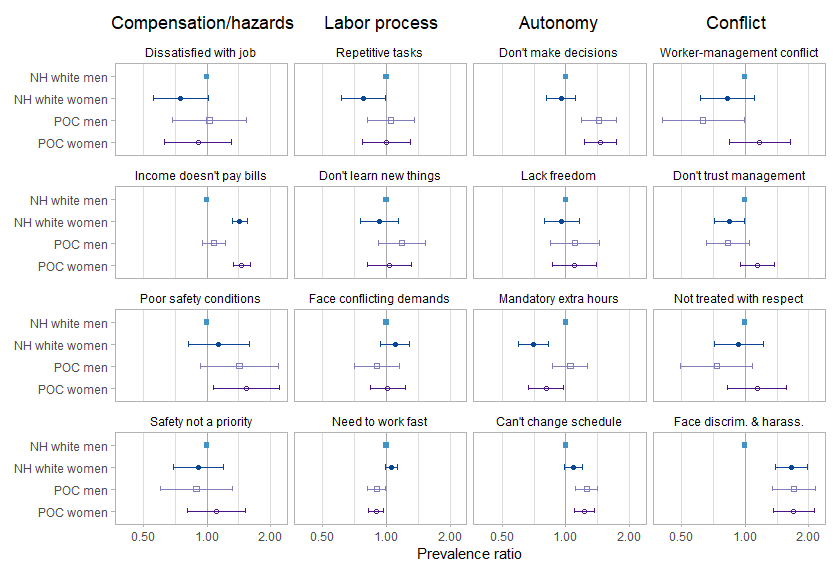<!-- -->

```r
ggsave("gender_race_workers.png", height=6, width=8.75, dpi=600)

#table
kable(binded[1:48,], caption="Ref: NH white men", digits=2) %>%
  kable_styling("striped") %>%
    scroll_box(width = "100%", height = "250px")
```

<div style="border: 1px solid #ddd; padding: 0px; overflow-y: scroll; height:250px; overflow-x: scroll; width:100%; "><table class="table table-striped" style="margin-left: auto; margin-right: auto;">
<caption>Ref: NH white men</caption>
 <thead>
  <tr>
   <th style="text-align:left;position: sticky; top:0; background-color: #FFFFFF;">   </th>
   <th style="text-align:left;position: sticky; top:0; background-color: #FFFFFF;"> Var </th>
   <th style="text-align:left;position: sticky; top:0; background-color: #FFFFFF;"> Class </th>
   <th style="text-align:right;position: sticky; top:0; background-color: #FFFFFF;"> PR </th>
   <th style="text-align:right;position: sticky; top:0; background-color: #FFFFFF;"> Lower </th>
   <th style="text-align:right;position: sticky; top:0; background-color: #FFFFFF;"> Upper </th>
   <th style="text-align:left;position: sticky; top:0; background-color: #FFFFFF;"> Cat </th>
  </tr>
 </thead>
<tbody>
  <tr>
   <td style="text-align:left;"> poc_genderNH white women </td>
   <td style="text-align:left;"> satjob1_bin_unimp </td>
   <td style="text-align:left;"> NH white women </td>
   <td style="text-align:right;"> 0.75 </td>
   <td style="text-align:right;"> 0.56 </td>
   <td style="text-align:right;"> 1.01 </td>
   <td style="text-align:left;"> Rewards/hazards </td>
  </tr>
  <tr>
   <td style="text-align:left;"> poc_genderPOC men </td>
   <td style="text-align:left;"> satjob1_bin_unimp </td>
   <td style="text-align:left;"> POC men </td>
   <td style="text-align:right;"> 1.03 </td>
   <td style="text-align:right;"> 0.69 </td>
   <td style="text-align:right;"> 1.54 </td>
   <td style="text-align:left;"> Rewards/hazards </td>
  </tr>
  <tr>
   <td style="text-align:left;"> poc_genderPOC women </td>
   <td style="text-align:left;"> satjob1_bin_unimp </td>
   <td style="text-align:left;"> POC women </td>
   <td style="text-align:right;"> 0.91 </td>
   <td style="text-align:right;"> 0.63 </td>
   <td style="text-align:right;"> 1.31 </td>
   <td style="text-align:left;"> Rewards/hazards </td>
  </tr>
  <tr>
   <td style="text-align:left;"> poc_genderNH white women1 </td>
   <td style="text-align:left;"> rincblls_bin_unimp </td>
   <td style="text-align:left;"> NH white women </td>
   <td style="text-align:right;"> 1.43 </td>
   <td style="text-align:right;"> 1.32 </td>
   <td style="text-align:right;"> 1.56 </td>
   <td style="text-align:left;"> Rewards/hazards </td>
  </tr>
  <tr>
   <td style="text-align:left;"> poc_genderPOC men1 </td>
   <td style="text-align:left;"> rincblls_bin_unimp </td>
   <td style="text-align:left;"> POC men </td>
   <td style="text-align:right;"> 1.07 </td>
   <td style="text-align:right;"> 0.95 </td>
   <td style="text-align:right;"> 1.22 </td>
   <td style="text-align:left;"> Rewards/hazards </td>
  </tr>
  <tr>
   <td style="text-align:left;"> poc_genderPOC women1 </td>
   <td style="text-align:left;"> rincblls_bin_unimp </td>
   <td style="text-align:left;"> POC women </td>
   <td style="text-align:right;"> 1.46 </td>
   <td style="text-align:right;"> 1.33 </td>
   <td style="text-align:right;"> 1.60 </td>
   <td style="text-align:left;"> Rewards/hazards </td>
  </tr>
  <tr>
   <td style="text-align:left;"> poc_genderNH white women2 </td>
   <td style="text-align:left;"> safehlth_bin_unimp </td>
   <td style="text-align:left;"> NH white women </td>
   <td style="text-align:right;"> 1.13 </td>
   <td style="text-align:right;"> 0.82 </td>
   <td style="text-align:right;"> 1.58 </td>
   <td style="text-align:left;"> Rewards/hazards </td>
  </tr>
  <tr>
   <td style="text-align:left;"> poc_genderPOC men2 </td>
   <td style="text-align:left;"> safehlth_bin_unimp </td>
   <td style="text-align:left;"> POC men </td>
   <td style="text-align:right;"> 1.42 </td>
   <td style="text-align:right;"> 0.93 </td>
   <td style="text-align:right;"> 2.17 </td>
   <td style="text-align:left;"> Rewards/hazards </td>
  </tr>
  <tr>
   <td style="text-align:left;"> poc_genderPOC women2 </td>
   <td style="text-align:left;"> safehlth_bin_unimp </td>
   <td style="text-align:left;"> POC women </td>
   <td style="text-align:right;"> 1.53 </td>
   <td style="text-align:right;"> 1.07 </td>
   <td style="text-align:right;"> 2.19 </td>
   <td style="text-align:left;"> Rewards/hazards </td>
  </tr>
  <tr>
   <td style="text-align:left;"> poc_genderNH white women3 </td>
   <td style="text-align:left;"> safetywk_bin_unimp </td>
   <td style="text-align:left;"> NH white women </td>
   <td style="text-align:right;"> 0.91 </td>
   <td style="text-align:right;"> 0.69 </td>
   <td style="text-align:right;"> 1.20 </td>
   <td style="text-align:left;"> Rewards/hazards </td>
  </tr>
  <tr>
   <td style="text-align:left;"> poc_genderPOC men3 </td>
   <td style="text-align:left;"> safetywk_bin_unimp </td>
   <td style="text-align:left;"> POC men </td>
   <td style="text-align:right;"> 0.89 </td>
   <td style="text-align:right;"> 0.60 </td>
   <td style="text-align:right;"> 1.31 </td>
   <td style="text-align:left;"> Rewards/hazards </td>
  </tr>
  <tr>
   <td style="text-align:left;"> poc_genderPOC women3 </td>
   <td style="text-align:left;"> safetywk_bin_unimp </td>
   <td style="text-align:left;"> POC women </td>
   <td style="text-align:right;"> 1.11 </td>
   <td style="text-align:right;"> 0.81 </td>
   <td style="text-align:right;"> 1.52 </td>
   <td style="text-align:left;"> Rewards/hazards </td>
  </tr>
  <tr>
   <td style="text-align:left;"> poc_genderNH white women4 </td>
   <td style="text-align:left;"> workdiff_bin_unimp </td>
   <td style="text-align:left;"> NH white women </td>
   <td style="text-align:right;"> 0.78 </td>
   <td style="text-align:right;"> 0.61 </td>
   <td style="text-align:right;"> 0.99 </td>
   <td style="text-align:left;"> Labor process </td>
  </tr>
  <tr>
   <td style="text-align:left;"> poc_genderPOC men4 </td>
   <td style="text-align:left;"> workdiff_bin_unimp </td>
   <td style="text-align:left;"> POC men </td>
   <td style="text-align:right;"> 1.05 </td>
   <td style="text-align:right;"> 0.81 </td>
   <td style="text-align:right;"> 1.36 </td>
   <td style="text-align:left;"> Labor process </td>
  </tr>
  <tr>
   <td style="text-align:left;"> poc_genderPOC women4 </td>
   <td style="text-align:left;"> workdiff_bin_unimp </td>
   <td style="text-align:left;"> POC women </td>
   <td style="text-align:right;"> 1.00 </td>
   <td style="text-align:right;"> 0.77 </td>
   <td style="text-align:right;"> 1.29 </td>
   <td style="text-align:left;"> Labor process </td>
  </tr>
  <tr>
   <td style="text-align:left;"> poc_genderNH white women5 </td>
   <td style="text-align:left;"> learnnew_bin_unimp </td>
   <td style="text-align:left;"> NH white women </td>
   <td style="text-align:right;"> 0.93 </td>
   <td style="text-align:right;"> 0.75 </td>
   <td style="text-align:right;"> 1.14 </td>
   <td style="text-align:left;"> Labor process </td>
  </tr>
  <tr>
   <td style="text-align:left;"> poc_genderPOC men5 </td>
   <td style="text-align:left;"> learnnew_bin_unimp </td>
   <td style="text-align:left;"> POC men </td>
   <td style="text-align:right;"> 1.18 </td>
   <td style="text-align:right;"> 0.92 </td>
   <td style="text-align:right;"> 1.53 </td>
   <td style="text-align:left;"> Labor process </td>
  </tr>
  <tr>
   <td style="text-align:left;"> poc_genderPOC women5 </td>
   <td style="text-align:left;"> learnnew_bin_unimp </td>
   <td style="text-align:left;"> POC women </td>
   <td style="text-align:right;"> 1.03 </td>
   <td style="text-align:right;"> 0.81 </td>
   <td style="text-align:right;"> 1.32 </td>
   <td style="text-align:left;"> Labor process </td>
  </tr>
  <tr>
   <td style="text-align:left;"> poc_genderNH white women6 </td>
   <td style="text-align:left;"> condemnd_bin_unimp </td>
   <td style="text-align:left;"> NH white women </td>
   <td style="text-align:right;"> 1.10 </td>
   <td style="text-align:right;"> 0.94 </td>
   <td style="text-align:right;"> 1.29 </td>
   <td style="text-align:left;"> Labor process </td>
  </tr>
  <tr>
   <td style="text-align:left;"> poc_genderPOC men6 </td>
   <td style="text-align:left;"> condemnd_bin_unimp </td>
   <td style="text-align:left;"> POC men </td>
   <td style="text-align:right;"> 0.90 </td>
   <td style="text-align:right;"> 0.70 </td>
   <td style="text-align:right;"> 1.16 </td>
   <td style="text-align:left;"> Labor process </td>
  </tr>
  <tr>
   <td style="text-align:left;"> poc_genderPOC women6 </td>
   <td style="text-align:left;"> condemnd_bin_unimp </td>
   <td style="text-align:left;"> POC women </td>
   <td style="text-align:right;"> 1.01 </td>
   <td style="text-align:right;"> 0.84 </td>
   <td style="text-align:right;"> 1.23 </td>
   <td style="text-align:left;"> Labor process </td>
  </tr>
  <tr>
   <td style="text-align:left;"> poc_genderNH white women7 </td>
   <td style="text-align:left;"> workfast_bin_unimp </td>
   <td style="text-align:left;"> NH white women </td>
   <td style="text-align:right;"> 1.05 </td>
   <td style="text-align:right;"> 0.99 </td>
   <td style="text-align:right;"> 1.12 </td>
   <td style="text-align:left;"> Labor process </td>
  </tr>
  <tr>
   <td style="text-align:left;"> poc_genderPOC men7 </td>
   <td style="text-align:left;"> workfast_bin_unimp </td>
   <td style="text-align:left;"> POC men </td>
   <td style="text-align:right;"> 0.90 </td>
   <td style="text-align:right;"> 0.81 </td>
   <td style="text-align:right;"> 0.99 </td>
   <td style="text-align:left;"> Labor process </td>
  </tr>
  <tr>
   <td style="text-align:left;"> poc_genderPOC women7 </td>
   <td style="text-align:left;"> workfast_bin_unimp </td>
   <td style="text-align:left;"> POC women </td>
   <td style="text-align:right;"> 0.89 </td>
   <td style="text-align:right;"> 0.82 </td>
   <td style="text-align:right;"> 0.97 </td>
   <td style="text-align:left;"> Labor process </td>
  </tr>
  <tr>
   <td style="text-align:left;"> poc_genderNH white women8 </td>
   <td style="text-align:left;"> wkdecide_bin_unimp </td>
   <td style="text-align:left;"> NH white women </td>
   <td style="text-align:right;"> 0.95 </td>
   <td style="text-align:right;"> 0.81 </td>
   <td style="text-align:right;"> 1.11 </td>
   <td style="text-align:left;"> Autonomy </td>
  </tr>
  <tr>
   <td style="text-align:left;"> poc_genderPOC men8 </td>
   <td style="text-align:left;"> wkdecide_bin_unimp </td>
   <td style="text-align:left;"> POC men </td>
   <td style="text-align:right;"> 1.43 </td>
   <td style="text-align:right;"> 1.18 </td>
   <td style="text-align:right;"> 1.73 </td>
   <td style="text-align:left;"> Autonomy </td>
  </tr>
  <tr>
   <td style="text-align:left;"> poc_genderPOC women8 </td>
   <td style="text-align:left;"> wkdecide_bin_unimp </td>
   <td style="text-align:left;"> POC women </td>
   <td style="text-align:right;"> 1.46 </td>
   <td style="text-align:right;"> 1.23 </td>
   <td style="text-align:right;"> 1.74 </td>
   <td style="text-align:left;"> Autonomy </td>
  </tr>
  <tr>
   <td style="text-align:left;"> poc_genderNH white women9 </td>
   <td style="text-align:left;"> wkfreedm_bin_unimp </td>
   <td style="text-align:left;"> NH white women </td>
   <td style="text-align:right;"> 0.96 </td>
   <td style="text-align:right;"> 0.79 </td>
   <td style="text-align:right;"> 1.16 </td>
   <td style="text-align:left;"> Autonomy </td>
  </tr>
  <tr>
   <td style="text-align:left;"> poc_genderPOC men9 </td>
   <td style="text-align:left;"> wkfreedm_bin_unimp </td>
   <td style="text-align:left;"> POC men </td>
   <td style="text-align:right;"> 1.11 </td>
   <td style="text-align:right;"> 0.85 </td>
   <td style="text-align:right;"> 1.44 </td>
   <td style="text-align:left;"> Autonomy </td>
  </tr>
  <tr>
   <td style="text-align:left;"> poc_genderPOC women9 </td>
   <td style="text-align:left;"> wkfreedm_bin_unimp </td>
   <td style="text-align:left;"> POC women </td>
   <td style="text-align:right;"> 1.10 </td>
   <td style="text-align:right;"> 0.87 </td>
   <td style="text-align:right;"> 1.40 </td>
   <td style="text-align:left;"> Autonomy </td>
  </tr>
  <tr>
   <td style="text-align:left;"> poc_genderNH white women10 </td>
   <td style="text-align:left;"> mustwork_bin_unimp </td>
   <td style="text-align:left;"> NH white women </td>
   <td style="text-align:right;"> 0.70 </td>
   <td style="text-align:right;"> 0.60 </td>
   <td style="text-align:right;"> 0.83 </td>
   <td style="text-align:left;"> Autonomy </td>
  </tr>
  <tr>
   <td style="text-align:left;"> poc_genderPOC men10 </td>
   <td style="text-align:left;"> mustwork_bin_unimp </td>
   <td style="text-align:left;"> POC men </td>
   <td style="text-align:right;"> 1.05 </td>
   <td style="text-align:right;"> 0.87 </td>
   <td style="text-align:right;"> 1.27 </td>
   <td style="text-align:left;"> Autonomy </td>
  </tr>
  <tr>
   <td style="text-align:left;"> poc_genderPOC women10 </td>
   <td style="text-align:left;"> mustwork_bin_unimp </td>
   <td style="text-align:left;"> POC women </td>
   <td style="text-align:right;"> 0.81 </td>
   <td style="text-align:right;"> 0.67 </td>
   <td style="text-align:right;"> 0.97 </td>
   <td style="text-align:left;"> Autonomy </td>
  </tr>
  <tr>
   <td style="text-align:left;"> poc_genderNH white women11 </td>
   <td style="text-align:left;"> chngtme_bin_unimp </td>
   <td style="text-align:left;"> NH white women </td>
   <td style="text-align:right;"> 1.09 </td>
   <td style="text-align:right;"> 0.99 </td>
   <td style="text-align:right;"> 1.20 </td>
   <td style="text-align:left;"> Autonomy </td>
  </tr>
  <tr>
   <td style="text-align:left;"> poc_genderPOC men11 </td>
   <td style="text-align:left;"> chngtme_bin_unimp </td>
   <td style="text-align:left;"> POC men </td>
   <td style="text-align:right;"> 1.25 </td>
   <td style="text-align:right;"> 1.11 </td>
   <td style="text-align:right;"> 1.41 </td>
   <td style="text-align:left;"> Autonomy </td>
  </tr>
  <tr>
   <td style="text-align:left;"> poc_genderPOC women11 </td>
   <td style="text-align:left;"> chngtme_bin_unimp </td>
   <td style="text-align:left;"> POC women </td>
   <td style="text-align:right;"> 1.22 </td>
   <td style="text-align:right;"> 1.10 </td>
   <td style="text-align:right;"> 1.37 </td>
   <td style="text-align:left;"> Autonomy </td>
  </tr>
  <tr>
   <td style="text-align:left;"> poc_genderNH white women12 </td>
   <td style="text-align:left;"> manvsemp_bin_unimp </td>
   <td style="text-align:left;"> NH white women </td>
   <td style="text-align:right;"> 0.82 </td>
   <td style="text-align:right;"> 0.62 </td>
   <td style="text-align:right;"> 1.10 </td>
   <td style="text-align:left;"> Conflict </td>
  </tr>
  <tr>
   <td style="text-align:left;"> poc_genderPOC men12 </td>
   <td style="text-align:left;"> manvsemp_bin_unimp </td>
   <td style="text-align:left;"> POC men </td>
   <td style="text-align:right;"> 0.63 </td>
   <td style="text-align:right;"> 0.40 </td>
   <td style="text-align:right;"> 0.99 </td>
   <td style="text-align:left;"> Conflict </td>
  </tr>
  <tr>
   <td style="text-align:left;"> poc_genderPOC women12 </td>
   <td style="text-align:left;"> manvsemp_bin_unimp </td>
   <td style="text-align:left;"> POC women </td>
   <td style="text-align:right;"> 1.17 </td>
   <td style="text-align:right;"> 0.84 </td>
   <td style="text-align:right;"> 1.63 </td>
   <td style="text-align:left;"> Conflict </td>
  </tr>
  <tr>
   <td style="text-align:left;"> poc_genderNH white women13 </td>
   <td style="text-align:left;"> trustman_bin_unimp </td>
   <td style="text-align:left;"> NH white women </td>
   <td style="text-align:right;"> 0.84 </td>
   <td style="text-align:right;"> 0.72 </td>
   <td style="text-align:right;"> 0.99 </td>
   <td style="text-align:left;"> Conflict </td>
  </tr>
  <tr>
   <td style="text-align:left;"> poc_genderPOC men13 </td>
   <td style="text-align:left;"> trustman_bin_unimp </td>
   <td style="text-align:left;"> POC men </td>
   <td style="text-align:right;"> 0.83 </td>
   <td style="text-align:right;"> 0.65 </td>
   <td style="text-align:right;"> 1.05 </td>
   <td style="text-align:left;"> Conflict </td>
  </tr>
  <tr>
   <td style="text-align:left;"> poc_genderPOC women13 </td>
   <td style="text-align:left;"> trustman_bin_unimp </td>
   <td style="text-align:left;"> POC women </td>
   <td style="text-align:right;"> 1.15 </td>
   <td style="text-align:right;"> 0.95 </td>
   <td style="text-align:right;"> 1.38 </td>
   <td style="text-align:left;"> Conflict </td>
  </tr>
  <tr>
   <td style="text-align:left;"> poc_genderNH white women14 </td>
   <td style="text-align:left;"> respect_bin_unimp </td>
   <td style="text-align:left;"> NH white women </td>
   <td style="text-align:right;"> 0.93 </td>
   <td style="text-align:right;"> 0.71 </td>
   <td style="text-align:right;"> 1.22 </td>
   <td style="text-align:left;"> Conflict </td>
  </tr>
  <tr>
   <td style="text-align:left;"> poc_genderPOC men14 </td>
   <td style="text-align:left;"> respect_bin_unimp </td>
   <td style="text-align:left;"> POC men </td>
   <td style="text-align:right;"> 0.73 </td>
   <td style="text-align:right;"> 0.50 </td>
   <td style="text-align:right;"> 1.09 </td>
   <td style="text-align:left;"> Conflict </td>
  </tr>
  <tr>
   <td style="text-align:left;"> poc_genderPOC women14 </td>
   <td style="text-align:left;"> respect_bin_unimp </td>
   <td style="text-align:left;"> POC women </td>
   <td style="text-align:right;"> 1.14 </td>
   <td style="text-align:right;"> 0.82 </td>
   <td style="text-align:right;"> 1.58 </td>
   <td style="text-align:left;"> Conflict </td>
  </tr>
  <tr>
   <td style="text-align:left;"> poc_genderNH white women15 </td>
   <td style="text-align:left;"> disc_haras_bin_unimp </td>
   <td style="text-align:left;"> NH white women </td>
   <td style="text-align:right;"> 1.65 </td>
   <td style="text-align:right;"> 1.39 </td>
   <td style="text-align:right;"> 1.97 </td>
   <td style="text-align:left;"> Conflict </td>
  </tr>
  <tr>
   <td style="text-align:left;"> poc_genderPOC men15 </td>
   <td style="text-align:left;"> disc_haras_bin_unimp </td>
   <td style="text-align:left;"> POC men </td>
   <td style="text-align:right;"> 1.69 </td>
   <td style="text-align:right;"> 1.34 </td>
   <td style="text-align:right;"> 2.14 </td>
   <td style="text-align:left;"> Conflict </td>
  </tr>
  <tr>
   <td style="text-align:left;"> poc_genderPOC women15 </td>
   <td style="text-align:left;"> disc_haras_bin_unimp </td>
   <td style="text-align:left;"> POC women </td>
   <td style="text-align:right;"> 1.70 </td>
   <td style="text-align:right;"> 1.36 </td>
   <td style="text-align:right;"> 2.13 </td>
   <td style="text-align:left;"> Conflict </td>
  </tr>
</tbody>
</table></div>

# Appendix

## Additional descriptives

### How many employees do PBs and capitalists identify as having? 

Note that the numemps variable wasn't asked in 2002, which is why we aren't using it for our primary analyses. Note also that numemps was only asked of people who identified as self-employed, which supports our use of the self-employed variable to identify owners.


```r
#run on unimputed data
dat %>%
  filter(year !=2002 & c(class=="Capitalists" | class=="Petit bourgeoisie")) %>%
  group_by(class) %>%
  summarise(mean_emps=round(mean(as.numeric(numemps), na.rm=T),1), 
            median_emps=round(median(as.numeric(numemps), na.rm=T),1),
            lower_IQR=round(quantile(as.numeric(numemps), 0.25, na.rm=T),1),
            upper_IQR=round(quantile(as.numeric(numemps), 0.75, na.rm=T),1),
            max=max(as.numeric(numemps), na.rm=T)) %>%
  kable() %>%
  kable_styling("striped") %>%
  scroll_box(width = "100%", height = "250px")
```

<div style="border: 1px solid #ddd; padding: 0px; overflow-y: scroll; height:250px; overflow-x: scroll; width:100%; "><table class="table table-striped" style="margin-left: auto; margin-right: auto;">
 <thead>
  <tr>
   <th style="text-align:left;position: sticky; top:0; background-color: #FFFFFF;"> class </th>
   <th style="text-align:right;position: sticky; top:0; background-color: #FFFFFF;"> mean_emps </th>
   <th style="text-align:right;position: sticky; top:0; background-color: #FFFFFF;"> median_emps </th>
   <th style="text-align:right;position: sticky; top:0; background-color: #FFFFFF;"> lower_IQR </th>
   <th style="text-align:right;position: sticky; top:0; background-color: #FFFFFF;"> upper_IQR </th>
   <th style="text-align:right;position: sticky; top:0; background-color: #FFFFFF;"> max </th>
  </tr>
 </thead>
<tbody>
  <tr>
   <td style="text-align:left;"> Petit bourgeoisie </td>
   <td style="text-align:right;"> 0.2 </td>
   <td style="text-align:right;"> 0 </td>
   <td style="text-align:right;"> 0 </td>
   <td style="text-align:right;"> 0 </td>
   <td style="text-align:right;"> 34 </td>
  </tr>
  <tr>
   <td style="text-align:left;"> Capitalists </td>
   <td style="text-align:right;"> 6.0 </td>
   <td style="text-align:right;"> 2 </td>
   <td style="text-align:right;"> 0 </td>
   <td style="text-align:right;"> 6 </td>
   <td style="text-align:right;"> 97 </td>
  </tr>
</tbody>
</table></div>

### Survey-weighted distributions of QWL variables stratified by class 

Unadjusted prevalence of bad category of each binary QWL variable among each class.


```r
#vars of interest
qwl_vars <- c("satjob1_bin", "rincblls_bin", "safehlth_bin", "safetywk_bin", "workdiff_bin", "learnnew_bin", "condemnd_bin", "workfast_bin", "wkdecide_bin", "wkfreedm_bin", "mustwork_bin", "chngtme_bin", "manvsemp_bin", "trustman_bin", "respect_bin", "disc_haras_bin")

x <- svyCreateTableOne(data = svy_dat, vars = qwl_vars, strata='class')
x <- print(x, printToggle=FALSE, noSpaces=TRUE)
kable(x[,1:4]) %>%
  kable_styling(c("striped", "condensed"))
```

<table class="table table-striped table-condensed" style="margin-left: auto; margin-right: auto;">
 <thead>
  <tr>
   <th style="text-align:left;">   </th>
   <th style="text-align:left;"> Workers </th>
   <th style="text-align:left;"> Managers </th>
   <th style="text-align:left;"> Petit bourgeoisie </th>
   <th style="text-align:left;"> Capitalists </th>
  </tr>
 </thead>
<tbody>
  <tr>
   <td style="text-align:left;"> n </td>
   <td style="text-align:left;"> 3821.80 </td>
   <td style="text-align:left;"> 2128.57 </td>
   <td style="text-align:left;"> 544.18 </td>
   <td style="text-align:left;"> 423.81 </td>
  </tr>
  <tr>
   <td style="text-align:left;"> satjob1_bin (mean (SD)) </td>
   <td style="text-align:left;"> 0.08 (0.28) </td>
   <td style="text-align:left;"> 0.07 (0.26) </td>
   <td style="text-align:left;"> 0.04 (0.19) </td>
   <td style="text-align:left;"> 0.03 (0.16) </td>
  </tr>
  <tr>
   <td style="text-align:left;"> rincblls_bin (mean (SD)) </td>
   <td style="text-align:left;"> 0.60 (0.49) </td>
   <td style="text-align:left;"> 0.48 (0.50) </td>
   <td style="text-align:left;"> 0.55 (0.50) </td>
   <td style="text-align:left;"> 0.30 (0.46) </td>
  </tr>
  <tr>
   <td style="text-align:left;"> safehlth_bin (mean (SD)) </td>
   <td style="text-align:left;"> 0.07 (0.25) </td>
   <td style="text-align:left;"> 0.05 (0.22) </td>
   <td style="text-align:left;"> 0.04 (0.19) </td>
   <td style="text-align:left;"> 0.04 (0.20) </td>
  </tr>
  <tr>
   <td style="text-align:left;"> safetywk_bin (mean (SD)) </td>
   <td style="text-align:left;"> 0.10 (0.29) </td>
   <td style="text-align:left;"> 0.08 (0.27) </td>
   <td style="text-align:left;"> 0.03 (0.18) </td>
   <td style="text-align:left;"> 0.04 (0.19) </td>
  </tr>
  <tr>
   <td style="text-align:left;"> workdiff_bin (mean (SD)) </td>
   <td style="text-align:left;"> 0.14 (0.35) </td>
   <td style="text-align:left;"> 0.05 (0.23) </td>
   <td style="text-align:left;"> 0.12 (0.32) </td>
   <td style="text-align:left;"> 0.05 (0.22) </td>
  </tr>
  <tr>
   <td style="text-align:left;"> learnnew_bin (mean (SD)) </td>
   <td style="text-align:left;"> 0.17 (0.38) </td>
   <td style="text-align:left;"> 0.08 (0.27) </td>
   <td style="text-align:left;"> 0.13 (0.34) </td>
   <td style="text-align:left;"> 0.04 (0.20) </td>
  </tr>
  <tr>
   <td style="text-align:left;"> condemnd_bin (mean (SD)) </td>
   <td style="text-align:left;"> 0.24 (0.43) </td>
   <td style="text-align:left;"> 0.31 (0.46) </td>
   <td style="text-align:left;"> 0.17 (0.38) </td>
   <td style="text-align:left;"> 0.29 (0.46) </td>
  </tr>
  <tr>
   <td style="text-align:left;"> workfast_bin (mean (SD)) </td>
   <td style="text-align:left;"> 0.65 (0.48) </td>
   <td style="text-align:left;"> 0.74 (0.44) </td>
   <td style="text-align:left;"> 0.52 (0.50) </td>
   <td style="text-align:left;"> 0.74 (0.44) </td>
  </tr>
  <tr>
   <td style="text-align:left;"> wkdecide_bin (mean (SD)) </td>
   <td style="text-align:left;"> 0.28 (0.45) </td>
   <td style="text-align:left;"> 0.11 (0.31) </td>
   <td style="text-align:left;"> 0.40 (0.49) </td>
   <td style="text-align:left;"> 0.15 (0.36) </td>
  </tr>
  <tr>
   <td style="text-align:left;"> wkfreedm_bin (mean (SD)) </td>
   <td style="text-align:left;"> 0.16 (0.37) </td>
   <td style="text-align:left;"> 0.10 (0.29) </td>
   <td style="text-align:left;"> 0.04 (0.19) </td>
   <td style="text-align:left;"> 0.02 (0.13) </td>
  </tr>
  <tr>
   <td style="text-align:left;"> mustwork_bin (mean (SD)) </td>
   <td style="text-align:left;"> 0.25 (0.43) </td>
   <td style="text-align:left;"> 0.30 (0.46) </td>
   <td style="text-align:left;"> 0.24 (0.43) </td>
   <td style="text-align:left;"> 0.34 (0.47) </td>
  </tr>
  <tr>
   <td style="text-align:left;"> chngtme_bin (mean (SD)) </td>
   <td style="text-align:left;"> 0.57 (0.50) </td>
   <td style="text-align:left;"> 0.42 (0.49) </td>
   <td style="text-align:left;"> 0.13 (0.33) </td>
   <td style="text-align:left;"> 0.15 (0.36) </td>
  </tr>
  <tr>
   <td style="text-align:left;"> manvsemp_bin (mean (SD)) </td>
   <td style="text-align:left;"> 0.08 (0.28) </td>
   <td style="text-align:left;"> 0.07 (0.25) </td>
   <td style="text-align:left;"> 0.02 (0.15) </td>
   <td style="text-align:left;"> 0.02 (0.14) </td>
  </tr>
  <tr>
   <td style="text-align:left;"> trustman_bin (mean (SD)) </td>
   <td style="text-align:left;"> 0.22 (0.41) </td>
   <td style="text-align:left;"> 0.19 (0.39) </td>
   <td style="text-align:left;"> 0.05 (0.22) </td>
   <td style="text-align:left;"> 0.05 (0.21) </td>
  </tr>
  <tr>
   <td style="text-align:left;"> respect_bin (mean (SD)) </td>
   <td style="text-align:left;"> 0.09 (0.28) </td>
   <td style="text-align:left;"> 0.06 (0.24) </td>
   <td style="text-align:left;"> 0.04 (0.20) </td>
   <td style="text-align:left;"> 0.03 (0.17) </td>
  </tr>
  <tr>
   <td style="text-align:left;"> disc_haras_bin (mean (SD)) </td>
   <td style="text-align:left;"> 0.21 (0.41) </td>
   <td style="text-align:left;"> 0.24 (0.43) </td>
   <td style="text-align:left;"> 0.14 (0.35) </td>
   <td style="text-align:left;"> 0.17 (0.37) </td>
  </tr>
</tbody>
</table>

### Survey-weighted distributions of QWL variables stratified by race-gender 

Unadjusted prevalence of bad category of each binary QWL variable among each race-gender


```r
x <- svyCreateTableOne(data = svy_dat, vars = qwl_vars, strata='poc_gender')
x <- print(x, printToggle=FALSE, noSpaces=TRUE)
kable(x[,1:4]) %>%
  kable_styling(c("striped", "condensed"))
```

<table class="table table-striped table-condensed" style="margin-left: auto; margin-right: auto;">
 <thead>
  <tr>
   <th style="text-align:left;">   </th>
   <th style="text-align:left;"> NH white men </th>
   <th style="text-align:left;"> NH white women </th>
   <th style="text-align:left;"> POC men </th>
   <th style="text-align:left;"> POC women </th>
  </tr>
 </thead>
<tbody>
  <tr>
   <td style="text-align:left;"> n </td>
   <td style="text-align:left;"> 2414.82 </td>
   <td style="text-align:left;"> 2393.32 </td>
   <td style="text-align:left;"> 1010.29 </td>
   <td style="text-align:left;"> 1143.65 </td>
  </tr>
  <tr>
   <td style="text-align:left;"> satjob1_bin (mean (SD)) </td>
   <td style="text-align:left;"> 0.07 (0.26) </td>
   <td style="text-align:left;"> 0.06 (0.24) </td>
   <td style="text-align:left;"> 0.10 (0.30) </td>
   <td style="text-align:left;"> 0.08 (0.27) </td>
  </tr>
  <tr>
   <td style="text-align:left;"> rincblls_bin (mean (SD)) </td>
   <td style="text-align:left;"> 0.40 (0.49) </td>
   <td style="text-align:left;"> 0.65 (0.48) </td>
   <td style="text-align:left;"> 0.49 (0.50) </td>
   <td style="text-align:left;"> 0.66 (0.47) </td>
  </tr>
  <tr>
   <td style="text-align:left;"> safehlth_bin (mean (SD)) </td>
   <td style="text-align:left;"> 0.05 (0.22) </td>
   <td style="text-align:left;"> 0.06 (0.23) </td>
   <td style="text-align:left;"> 0.07 (0.25) </td>
   <td style="text-align:left;"> 0.08 (0.27) </td>
  </tr>
  <tr>
   <td style="text-align:left;"> safetywk_bin (mean (SD)) </td>
   <td style="text-align:left;"> 0.08 (0.27) </td>
   <td style="text-align:left;"> 0.08 (0.28) </td>
   <td style="text-align:left;"> 0.07 (0.26) </td>
   <td style="text-align:left;"> 0.09 (0.29) </td>
  </tr>
  <tr>
   <td style="text-align:left;"> workdiff_bin (mean (SD)) </td>
   <td style="text-align:left;"> 0.10 (0.30) </td>
   <td style="text-align:left;"> 0.09 (0.29) </td>
   <td style="text-align:left;"> 0.12 (0.33) </td>
   <td style="text-align:left;"> 0.13 (0.34) </td>
  </tr>
  <tr>
   <td style="text-align:left;"> learnnew_bin (mean (SD)) </td>
   <td style="text-align:left;"> 0.12 (0.32) </td>
   <td style="text-align:left;"> 0.13 (0.34) </td>
   <td style="text-align:left;"> 0.15 (0.36) </td>
   <td style="text-align:left;"> 0.14 (0.35) </td>
  </tr>
  <tr>
   <td style="text-align:left;"> condemnd_bin (mean (SD)) </td>
   <td style="text-align:left;"> 0.27 (0.45) </td>
   <td style="text-align:left;"> 0.29 (0.45) </td>
   <td style="text-align:left;"> 0.21 (0.41) </td>
   <td style="text-align:left;"> 0.24 (0.43) </td>
  </tr>
  <tr>
   <td style="text-align:left;"> workfast_bin (mean (SD)) </td>
   <td style="text-align:left;"> 0.69 (0.46) </td>
   <td style="text-align:left;"> 0.70 (0.46) </td>
   <td style="text-align:left;"> 0.64 (0.48) </td>
   <td style="text-align:left;"> 0.62 (0.49) </td>
  </tr>
  <tr>
   <td style="text-align:left;"> wkdecide_bin (mean (SD)) </td>
   <td style="text-align:left;"> 0.19 (0.39) </td>
   <td style="text-align:left;"> 0.21 (0.41) </td>
   <td style="text-align:left;"> 0.29 (0.45) </td>
   <td style="text-align:left;"> 0.32 (0.47) </td>
  </tr>
  <tr>
   <td style="text-align:left;"> wkfreedm_bin (mean (SD)) </td>
   <td style="text-align:left;"> 0.11 (0.31) </td>
   <td style="text-align:left;"> 0.12 (0.32) </td>
   <td style="text-align:left;"> 0.13 (0.34) </td>
   <td style="text-align:left;"> 0.15 (0.36) </td>
  </tr>
  <tr>
   <td style="text-align:left;"> mustwork_bin (mean (SD)) </td>
   <td style="text-align:left;"> 0.31 (0.46) </td>
   <td style="text-align:left;"> 0.22 (0.42) </td>
   <td style="text-align:left;"> 0.31 (0.46) </td>
   <td style="text-align:left;"> 0.24 (0.43) </td>
  </tr>
  <tr>
   <td style="text-align:left;"> chngtme_bin (mean (SD)) </td>
   <td style="text-align:left;"> 0.38 (0.49) </td>
   <td style="text-align:left;"> 0.45 (0.50) </td>
   <td style="text-align:left;"> 0.56 (0.50) </td>
   <td style="text-align:left;"> 0.57 (0.50) </td>
  </tr>
  <tr>
   <td style="text-align:left;"> manvsemp_bin (mean (SD)) </td>
   <td style="text-align:left;"> 0.07 (0.26) </td>
   <td style="text-align:left;"> 0.07 (0.26) </td>
   <td style="text-align:left;"> 0.05 (0.21) </td>
   <td style="text-align:left;"> 0.09 (0.28) </td>
  </tr>
  <tr>
   <td style="text-align:left;"> trustman_bin (mean (SD)) </td>
   <td style="text-align:left;"> 0.19 (0.39) </td>
   <td style="text-align:left;"> 0.18 (0.38) </td>
   <td style="text-align:left;"> 0.18 (0.38) </td>
   <td style="text-align:left;"> 0.23 (0.42) </td>
  </tr>
  <tr>
   <td style="text-align:left;"> respect_bin (mean (SD)) </td>
   <td style="text-align:left;"> 0.06 (0.25) </td>
   <td style="text-align:left;"> 0.08 (0.27) </td>
   <td style="text-align:left;"> 0.06 (0.23) </td>
   <td style="text-align:left;"> 0.09 (0.29) </td>
  </tr>
  <tr>
   <td style="text-align:left;"> disc_haras_bin (mean (SD)) </td>
   <td style="text-align:left;"> 0.15 (0.36) </td>
   <td style="text-align:left;"> 0.24 (0.43) </td>
   <td style="text-align:left;"> 0.24 (0.43) </td>
   <td style="text-align:left;"> 0.24 (0.42) </td>
  </tr>
</tbody>
</table>

## Data management

Confirming that class, race, and gender variables are coded correctly


```r
#class variable 
kable(table(dat$class, dat$wrkslf, dat$wksup, dat$occ10=="chief executives"), caption="Class by self employed by supervisor by chief executive", col.names=c("Class", "Self-employed", "Supervisor", "Chief executive", "Count")) %>%
  kable_styling("striped") %>%
  scroll_box(width = "100%", height = "250px")
```

<div style="border: 1px solid #ddd; padding: 0px; overflow-y: scroll; height:250px; overflow-x: scroll; width:100%; "><table class="table table-striped" style="margin-left: auto; margin-right: auto;">
<caption>Class by self employed by supervisor by chief executive</caption>
 <thead>
  <tr>
   <th style="text-align:left;position: sticky; top:0; background-color: #FFFFFF;"> Class </th>
   <th style="text-align:left;position: sticky; top:0; background-color: #FFFFFF;"> Self-employed </th>
   <th style="text-align:left;position: sticky; top:0; background-color: #FFFFFF;"> Supervisor </th>
   <th style="text-align:left;position: sticky; top:0; background-color: #FFFFFF;"> Chief executive </th>
   <th style="text-align:right;position: sticky; top:0; background-color: #FFFFFF;"> Count </th>
  </tr>
 </thead>
<tbody>
  <tr>
   <td style="text-align:left;"> Workers </td>
   <td style="text-align:left;"> self-employed </td>
   <td style="text-align:left;"> no </td>
   <td style="text-align:left;"> FALSE </td>
   <td style="text-align:right;"> 0 </td>
  </tr>
  <tr>
   <td style="text-align:left;"> Managers </td>
   <td style="text-align:left;"> self-employed </td>
   <td style="text-align:left;"> no </td>
   <td style="text-align:left;"> FALSE </td>
   <td style="text-align:right;"> 0 </td>
  </tr>
  <tr>
   <td style="text-align:left;"> Petit bourgeoisie </td>
   <td style="text-align:left;"> self-employed </td>
   <td style="text-align:left;"> no </td>
   <td style="text-align:left;"> FALSE </td>
   <td style="text-align:right;"> 523 </td>
  </tr>
  <tr>
   <td style="text-align:left;"> Capitalists </td>
   <td style="text-align:left;"> self-employed </td>
   <td style="text-align:left;"> no </td>
   <td style="text-align:left;"> FALSE </td>
   <td style="text-align:right;"> 0 </td>
  </tr>
  <tr>
   <td style="text-align:left;"> Workers </td>
   <td style="text-align:left;"> someone else </td>
   <td style="text-align:left;"> no </td>
   <td style="text-align:left;"> FALSE </td>
   <td style="text-align:right;"> 3737 </td>
  </tr>
  <tr>
   <td style="text-align:left;"> Managers </td>
   <td style="text-align:left;"> someone else </td>
   <td style="text-align:left;"> no </td>
   <td style="text-align:left;"> FALSE </td>
   <td style="text-align:right;"> 0 </td>
  </tr>
  <tr>
   <td style="text-align:left;"> Petit bourgeoisie </td>
   <td style="text-align:left;"> someone else </td>
   <td style="text-align:left;"> no </td>
   <td style="text-align:left;"> FALSE </td>
   <td style="text-align:right;"> 0 </td>
  </tr>
  <tr>
   <td style="text-align:left;"> Capitalists </td>
   <td style="text-align:left;"> someone else </td>
   <td style="text-align:left;"> no </td>
   <td style="text-align:left;"> FALSE </td>
   <td style="text-align:right;"> 0 </td>
  </tr>
  <tr>
   <td style="text-align:left;"> Workers </td>
   <td style="text-align:left;"> self-employed </td>
   <td style="text-align:left;"> yes </td>
   <td style="text-align:left;"> FALSE </td>
   <td style="text-align:right;"> 0 </td>
  </tr>
  <tr>
   <td style="text-align:left;"> Managers </td>
   <td style="text-align:left;"> self-employed </td>
   <td style="text-align:left;"> yes </td>
   <td style="text-align:left;"> FALSE </td>
   <td style="text-align:right;"> 0 </td>
  </tr>
  <tr>
   <td style="text-align:left;"> Petit bourgeoisie </td>
   <td style="text-align:left;"> self-employed </td>
   <td style="text-align:left;"> yes </td>
   <td style="text-align:left;"> FALSE </td>
   <td style="text-align:right;"> 0 </td>
  </tr>
  <tr>
   <td style="text-align:left;"> Capitalists </td>
   <td style="text-align:left;"> self-employed </td>
   <td style="text-align:left;"> yes </td>
   <td style="text-align:left;"> FALSE </td>
   <td style="text-align:right;"> 358 </td>
  </tr>
  <tr>
   <td style="text-align:left;"> Workers </td>
   <td style="text-align:left;"> someone else </td>
   <td style="text-align:left;"> yes </td>
   <td style="text-align:left;"> FALSE </td>
   <td style="text-align:right;"> 0 </td>
  </tr>
  <tr>
   <td style="text-align:left;"> Managers </td>
   <td style="text-align:left;"> someone else </td>
   <td style="text-align:left;"> yes </td>
   <td style="text-align:left;"> FALSE </td>
   <td style="text-align:right;"> 2084 </td>
  </tr>
  <tr>
   <td style="text-align:left;"> Petit bourgeoisie </td>
   <td style="text-align:left;"> someone else </td>
   <td style="text-align:left;"> yes </td>
   <td style="text-align:left;"> FALSE </td>
   <td style="text-align:right;"> 0 </td>
  </tr>
  <tr>
   <td style="text-align:left;"> Capitalists </td>
   <td style="text-align:left;"> someone else </td>
   <td style="text-align:left;"> yes </td>
   <td style="text-align:left;"> FALSE </td>
   <td style="text-align:right;"> 0 </td>
  </tr>
  <tr>
   <td style="text-align:left;"> Workers </td>
   <td style="text-align:left;"> self-employed </td>
   <td style="text-align:left;"> no </td>
   <td style="text-align:left;"> TRUE </td>
   <td style="text-align:right;"> 0 </td>
  </tr>
  <tr>
   <td style="text-align:left;"> Managers </td>
   <td style="text-align:left;"> self-employed </td>
   <td style="text-align:left;"> no </td>
   <td style="text-align:left;"> TRUE </td>
   <td style="text-align:right;"> 0 </td>
  </tr>
  <tr>
   <td style="text-align:left;"> Petit bourgeoisie </td>
   <td style="text-align:left;"> self-employed </td>
   <td style="text-align:left;"> no </td>
   <td style="text-align:left;"> TRUE </td>
   <td style="text-align:right;"> 3 </td>
  </tr>
  <tr>
   <td style="text-align:left;"> Capitalists </td>
   <td style="text-align:left;"> self-employed </td>
   <td style="text-align:left;"> no </td>
   <td style="text-align:left;"> TRUE </td>
   <td style="text-align:right;"> 0 </td>
  </tr>
  <tr>
   <td style="text-align:left;"> Workers </td>
   <td style="text-align:left;"> someone else </td>
   <td style="text-align:left;"> no </td>
   <td style="text-align:left;"> TRUE </td>
   <td style="text-align:right;"> 0 </td>
  </tr>
  <tr>
   <td style="text-align:left;"> Managers </td>
   <td style="text-align:left;"> someone else </td>
   <td style="text-align:left;"> no </td>
   <td style="text-align:left;"> TRUE </td>
   <td style="text-align:right;"> 0 </td>
  </tr>
  <tr>
   <td style="text-align:left;"> Petit bourgeoisie </td>
   <td style="text-align:left;"> someone else </td>
   <td style="text-align:left;"> no </td>
   <td style="text-align:left;"> TRUE </td>
   <td style="text-align:right;"> 3 </td>
  </tr>
  <tr>
   <td style="text-align:left;"> Capitalists </td>
   <td style="text-align:left;"> someone else </td>
   <td style="text-align:left;"> no </td>
   <td style="text-align:left;"> TRUE </td>
   <td style="text-align:right;"> 0 </td>
  </tr>
  <tr>
   <td style="text-align:left;"> Workers </td>
   <td style="text-align:left;"> self-employed </td>
   <td style="text-align:left;"> yes </td>
   <td style="text-align:left;"> TRUE </td>
   <td style="text-align:right;"> 0 </td>
  </tr>
  <tr>
   <td style="text-align:left;"> Managers </td>
   <td style="text-align:left;"> self-employed </td>
   <td style="text-align:left;"> yes </td>
   <td style="text-align:left;"> TRUE </td>
   <td style="text-align:right;"> 0 </td>
  </tr>
  <tr>
   <td style="text-align:left;"> Petit bourgeoisie </td>
   <td style="text-align:left;"> self-employed </td>
   <td style="text-align:left;"> yes </td>
   <td style="text-align:left;"> TRUE </td>
   <td style="text-align:right;"> 0 </td>
  </tr>
  <tr>
   <td style="text-align:left;"> Capitalists </td>
   <td style="text-align:left;"> self-employed </td>
   <td style="text-align:left;"> yes </td>
   <td style="text-align:left;"> TRUE </td>
   <td style="text-align:right;"> 11 </td>
  </tr>
  <tr>
   <td style="text-align:left;"> Workers </td>
   <td style="text-align:left;"> someone else </td>
   <td style="text-align:left;"> yes </td>
   <td style="text-align:left;"> TRUE </td>
   <td style="text-align:right;"> 0 </td>
  </tr>
  <tr>
   <td style="text-align:left;"> Managers </td>
   <td style="text-align:left;"> someone else </td>
   <td style="text-align:left;"> yes </td>
   <td style="text-align:left;"> TRUE </td>
   <td style="text-align:right;"> 0 </td>
  </tr>
  <tr>
   <td style="text-align:left;"> Petit bourgeoisie </td>
   <td style="text-align:left;"> someone else </td>
   <td style="text-align:left;"> yes </td>
   <td style="text-align:left;"> TRUE </td>
   <td style="text-align:right;"> 0 </td>
  </tr>
  <tr>
   <td style="text-align:left;"> Capitalists </td>
   <td style="text-align:left;"> someone else </td>
   <td style="text-align:left;"> yes </td>
   <td style="text-align:left;"> TRUE </td>
   <td style="text-align:right;"> 27 </td>
  </tr>
</tbody>
</table></div>

```r
#class-gender variable 
kable(table(dat$class_gender, dat$sex), caption="Class-gender by gender", col.names=c("Class-gender", "Gender")) %>%
  kable_styling("striped") %>%
  scroll_box(width = "100%", height = "250px")
```

<div style="border: 1px solid #ddd; padding: 0px; overflow-y: scroll; height:250px; overflow-x: scroll; width:100%; "><table class="table table-striped" style="margin-left: auto; margin-right: auto;">
<caption>Class-gender by gender</caption>
 <thead>
  <tr>
   <th style="text-align:left;position: sticky; top:0; background-color: #FFFFFF;">   </th>
   <th style="text-align:right;position: sticky; top:0; background-color: #FFFFFF;"> Class-gender </th>
   <th style="text-align:right;position: sticky; top:0; background-color: #FFFFFF;"> Gender </th>
  </tr>
 </thead>
<tbody>
  <tr>
   <td style="text-align:left;"> Male workers </td>
   <td style="text-align:right;"> 0 </td>
   <td style="text-align:right;"> 1630 </td>
  </tr>
  <tr>
   <td style="text-align:left;"> Male managers </td>
   <td style="text-align:right;"> 0 </td>
   <td style="text-align:right;"> 1060 </td>
  </tr>
  <tr>
   <td style="text-align:left;"> Male petit bourgeoisie </td>
   <td style="text-align:right;"> 0 </td>
   <td style="text-align:right;"> 272 </td>
  </tr>
  <tr>
   <td style="text-align:left;"> Male capitalists </td>
   <td style="text-align:right;"> 0 </td>
   <td style="text-align:right;"> 293 </td>
  </tr>
  <tr>
   <td style="text-align:left;"> Female workers </td>
   <td style="text-align:right;"> 2107 </td>
   <td style="text-align:right;"> 0 </td>
  </tr>
  <tr>
   <td style="text-align:left;"> Female managers </td>
   <td style="text-align:right;"> 1024 </td>
   <td style="text-align:right;"> 0 </td>
  </tr>
  <tr>
   <td style="text-align:left;"> Female petit bourgeoisie </td>
   <td style="text-align:right;"> 261 </td>
   <td style="text-align:right;"> 0 </td>
  </tr>
  <tr>
   <td style="text-align:left;"> Female capitalists </td>
   <td style="text-align:right;"> 104 </td>
   <td style="text-align:right;"> 0 </td>
  </tr>
</tbody>
</table></div>

```r
#class-POC variable
kable(table(dat$class_poc, dat$poc), caption="Class-POC by POC") %>%
  kable_styling("striped") %>%
  scroll_box(width = "100%", height = "250px")
```

<div style="border: 1px solid #ddd; padding: 0px; overflow-y: scroll; height:250px; overflow-x: scroll; width:100%; "><table class="table table-striped" style="margin-left: auto; margin-right: auto;">
<caption>Class-POC by POC</caption>
 <thead>
  <tr>
   <th style="text-align:left;position: sticky; top:0; background-color: #FFFFFF;">   </th>
   <th style="text-align:right;position: sticky; top:0; background-color: #FFFFFF;"> NH white </th>
   <th style="text-align:right;position: sticky; top:0; background-color: #FFFFFF;"> POC </th>
  </tr>
 </thead>
<tbody>
  <tr>
   <td style="text-align:left;"> NH white workers </td>
   <td style="text-align:right;"> 2475 </td>
   <td style="text-align:right;"> 0 </td>
  </tr>
  <tr>
   <td style="text-align:left;"> NH white managers </td>
   <td style="text-align:right;"> 1461 </td>
   <td style="text-align:right;"> 0 </td>
  </tr>
  <tr>
   <td style="text-align:left;"> NH white petit bourgeoisie </td>
   <td style="text-align:right;"> 399 </td>
   <td style="text-align:right;"> 0 </td>
  </tr>
  <tr>
   <td style="text-align:left;"> NH white capitalists </td>
   <td style="text-align:right;"> 321 </td>
   <td style="text-align:right;"> 0 </td>
  </tr>
  <tr>
   <td style="text-align:left;"> POC workers </td>
   <td style="text-align:right;"> 0 </td>
   <td style="text-align:right;"> 1252 </td>
  </tr>
  <tr>
   <td style="text-align:left;"> POC managers </td>
   <td style="text-align:right;"> 0 </td>
   <td style="text-align:right;"> 621 </td>
  </tr>
  <tr>
   <td style="text-align:left;"> POC petit bourgeoisie </td>
   <td style="text-align:right;"> 0 </td>
   <td style="text-align:right;"> 133 </td>
  </tr>
  <tr>
   <td style="text-align:left;"> POC capitalists </td>
   <td style="text-align:right;"> 0 </td>
   <td style="text-align:right;"> 75 </td>
  </tr>
</tbody>
</table></div>

```r
#race-gender variable
kable(table(dat$poc_gender, dat$race_h, dat$sex), caption="Race-gender by race and gender", col.names=c("Race-gender", "Race", "Gender", "Count")) %>%
  kable_styling("striped") %>%
  scroll_box(width = "100%", height = "250px")
```

<div style="border: 1px solid #ddd; padding: 0px; overflow-y: scroll; height:250px; overflow-x: scroll; width:100%; "><table class="table table-striped" style="margin-left: auto; margin-right: auto;">
<caption>Race-gender by race and gender</caption>
 <thead>
  <tr>
   <th style="text-align:left;position: sticky; top:0; background-color: #FFFFFF;"> Race-gender </th>
   <th style="text-align:left;position: sticky; top:0; background-color: #FFFFFF;"> Race </th>
   <th style="text-align:left;position: sticky; top:0; background-color: #FFFFFF;"> Gender </th>
   <th style="text-align:right;position: sticky; top:0; background-color: #FFFFFF;"> Count </th>
  </tr>
 </thead>
<tbody>
  <tr>
   <td style="text-align:left;"> NH white men </td>
   <td style="text-align:left;"> NH white </td>
   <td style="text-align:left;"> female </td>
   <td style="text-align:right;"> 0 </td>
  </tr>
  <tr>
   <td style="text-align:left;"> NH white women </td>
   <td style="text-align:left;"> NH white </td>
   <td style="text-align:left;"> female </td>
   <td style="text-align:right;"> 2356 </td>
  </tr>
  <tr>
   <td style="text-align:left;"> POC men </td>
   <td style="text-align:left;"> NH white </td>
   <td style="text-align:left;"> female </td>
   <td style="text-align:right;"> 0 </td>
  </tr>
  <tr>
   <td style="text-align:left;"> POC women </td>
   <td style="text-align:left;"> NH white </td>
   <td style="text-align:left;"> female </td>
   <td style="text-align:right;"> 0 </td>
  </tr>
  <tr>
   <td style="text-align:left;"> NH white men </td>
   <td style="text-align:left;"> NH Black </td>
   <td style="text-align:left;"> female </td>
   <td style="text-align:right;"> 0 </td>
  </tr>
  <tr>
   <td style="text-align:left;"> NH white women </td>
   <td style="text-align:left;"> NH Black </td>
   <td style="text-align:left;"> female </td>
   <td style="text-align:right;"> 0 </td>
  </tr>
  <tr>
   <td style="text-align:left;"> POC men </td>
   <td style="text-align:left;"> NH Black </td>
   <td style="text-align:left;"> female </td>
   <td style="text-align:right;"> 0 </td>
  </tr>
  <tr>
   <td style="text-align:left;"> POC women </td>
   <td style="text-align:left;"> NH Black </td>
   <td style="text-align:left;"> female </td>
   <td style="text-align:right;"> 620 </td>
  </tr>
  <tr>
   <td style="text-align:left;"> NH white men </td>
   <td style="text-align:left;"> NH other </td>
   <td style="text-align:left;"> female </td>
   <td style="text-align:right;"> 0 </td>
  </tr>
  <tr>
   <td style="text-align:left;"> NH white women </td>
   <td style="text-align:left;"> NH other </td>
   <td style="text-align:left;"> female </td>
   <td style="text-align:right;"> 0 </td>
  </tr>
  <tr>
   <td style="text-align:left;"> POC men </td>
   <td style="text-align:left;"> NH other </td>
   <td style="text-align:left;"> female </td>
   <td style="text-align:right;"> 0 </td>
  </tr>
  <tr>
   <td style="text-align:left;"> POC women </td>
   <td style="text-align:left;"> NH other </td>
   <td style="text-align:left;"> female </td>
   <td style="text-align:right;"> 143 </td>
  </tr>
  <tr>
   <td style="text-align:left;"> NH white men </td>
   <td style="text-align:left;"> Hispanic </td>
   <td style="text-align:left;"> female </td>
   <td style="text-align:right;"> 0 </td>
  </tr>
  <tr>
   <td style="text-align:left;"> NH white women </td>
   <td style="text-align:left;"> Hispanic </td>
   <td style="text-align:left;"> female </td>
   <td style="text-align:right;"> 0 </td>
  </tr>
  <tr>
   <td style="text-align:left;"> POC men </td>
   <td style="text-align:left;"> Hispanic </td>
   <td style="text-align:left;"> female </td>
   <td style="text-align:right;"> 0 </td>
  </tr>
  <tr>
   <td style="text-align:left;"> POC women </td>
   <td style="text-align:left;"> Hispanic </td>
   <td style="text-align:left;"> female </td>
   <td style="text-align:right;"> 399 </td>
  </tr>
  <tr>
   <td style="text-align:left;"> NH white men </td>
   <td style="text-align:left;"> NH white </td>
   <td style="text-align:left;"> male </td>
   <td style="text-align:right;"> 2339 </td>
  </tr>
  <tr>
   <td style="text-align:left;"> NH white women </td>
   <td style="text-align:left;"> NH white </td>
   <td style="text-align:left;"> male </td>
   <td style="text-align:right;"> 0 </td>
  </tr>
  <tr>
   <td style="text-align:left;"> POC men </td>
   <td style="text-align:left;"> NH white </td>
   <td style="text-align:left;"> male </td>
   <td style="text-align:right;"> 0 </td>
  </tr>
  <tr>
   <td style="text-align:left;"> POC women </td>
   <td style="text-align:left;"> NH white </td>
   <td style="text-align:left;"> male </td>
   <td style="text-align:right;"> 0 </td>
  </tr>
  <tr>
   <td style="text-align:left;"> NH white men </td>
   <td style="text-align:left;"> NH Black </td>
   <td style="text-align:left;"> male </td>
   <td style="text-align:right;"> 0 </td>
  </tr>
  <tr>
   <td style="text-align:left;"> NH white women </td>
   <td style="text-align:left;"> NH Black </td>
   <td style="text-align:left;"> male </td>
   <td style="text-align:right;"> 0 </td>
  </tr>
  <tr>
   <td style="text-align:left;"> POC men </td>
   <td style="text-align:left;"> NH Black </td>
   <td style="text-align:left;"> male </td>
   <td style="text-align:right;"> 381 </td>
  </tr>
  <tr>
   <td style="text-align:left;"> POC women </td>
   <td style="text-align:left;"> NH Black </td>
   <td style="text-align:left;"> male </td>
   <td style="text-align:right;"> 0 </td>
  </tr>
  <tr>
   <td style="text-align:left;"> NH white men </td>
   <td style="text-align:left;"> NH other </td>
   <td style="text-align:left;"> male </td>
   <td style="text-align:right;"> 0 </td>
  </tr>
  <tr>
   <td style="text-align:left;"> NH white women </td>
   <td style="text-align:left;"> NH other </td>
   <td style="text-align:left;"> male </td>
   <td style="text-align:right;"> 0 </td>
  </tr>
  <tr>
   <td style="text-align:left;"> POC men </td>
   <td style="text-align:left;"> NH other </td>
   <td style="text-align:left;"> male </td>
   <td style="text-align:right;"> 140 </td>
  </tr>
  <tr>
   <td style="text-align:left;"> POC women </td>
   <td style="text-align:left;"> NH other </td>
   <td style="text-align:left;"> male </td>
   <td style="text-align:right;"> 0 </td>
  </tr>
  <tr>
   <td style="text-align:left;"> NH white men </td>
   <td style="text-align:left;"> Hispanic </td>
   <td style="text-align:left;"> male </td>
   <td style="text-align:right;"> 0 </td>
  </tr>
  <tr>
   <td style="text-align:left;"> NH white women </td>
   <td style="text-align:left;"> Hispanic </td>
   <td style="text-align:left;"> male </td>
   <td style="text-align:right;"> 0 </td>
  </tr>
  <tr>
   <td style="text-align:left;"> POC men </td>
   <td style="text-align:left;"> Hispanic </td>
   <td style="text-align:left;"> male </td>
   <td style="text-align:right;"> 414 </td>
  </tr>
  <tr>
   <td style="text-align:left;"> POC women </td>
   <td style="text-align:left;"> Hispanic </td>
   <td style="text-align:left;"> male </td>
   <td style="text-align:right;"> 0 </td>
  </tr>
</tbody>
</table></div>

## Missingness patterns


```r
aggr(dat[,c("class", 'sex', 'poc', 'educ', 'marital_tri', 'region', 'income',  "prestg10", 'age', "srh_bin", "mntlhlth", "satjob1_bin", "rincblls_bin", "safehlth_bin", "safetywk_bin", "workdiff_bin", "learnnew_bin", "condemnd_bin", "workfast_bin", "wkdecide_bin", "wkfreedm_bin", "mustwork_bin", "chngtme_bin", "manvsemp_bin", "trustman_bin", "respect_bin", "disc_haras_bin")], cex.axis = 0.6, numbers=FALSE, prop=TRUE)
```

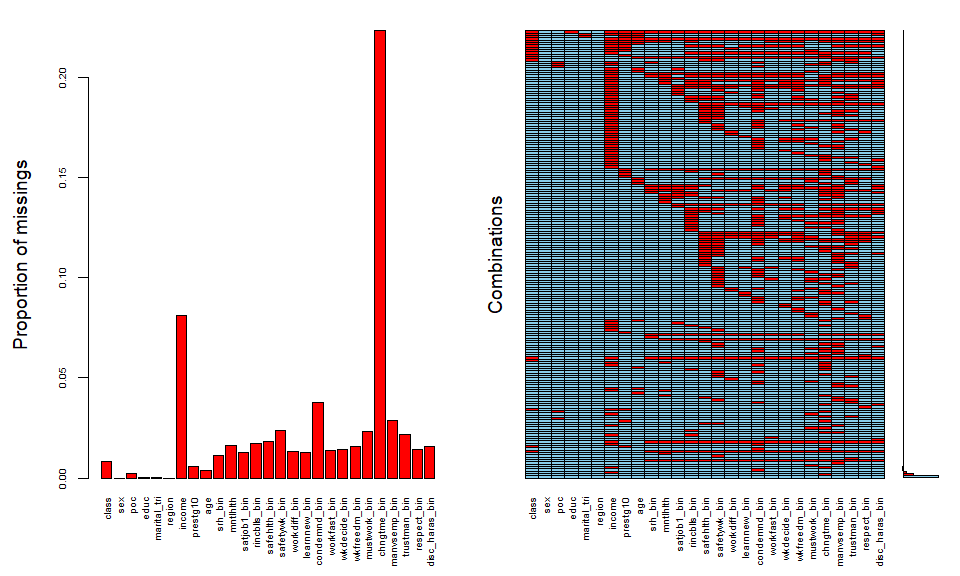<!-- -->

## Imputation convergence plots


```r
plot(imp_merged, y=c('class', 'race_h', 'educ', 'marital_tri', "prestg10", 'income', 'age', "srh_bin", "mntlhlth", "satjob1_bin", "rincblls_bin", "safehlth_bin", "safetywk_bin", "workdiff_bin", "learnnew_bin", "condemnd_bin", "workfast_bin", "wkdecide_bin", "wkfreedm_bin", "mustwork_bin", "manvsemp_bin", "trustman_bin", "respect_bin", "disc_haras_bin"), main='Convergence plots')
```

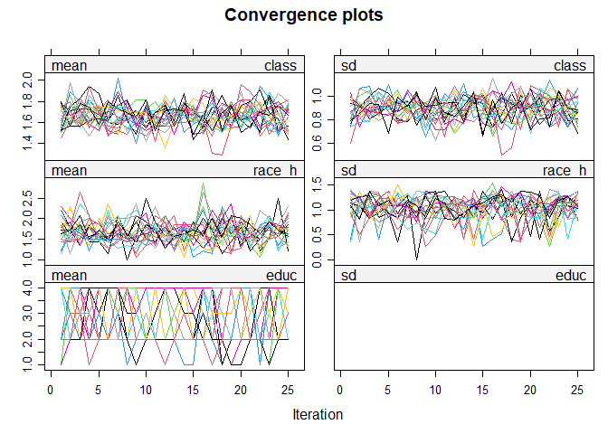<!-- -->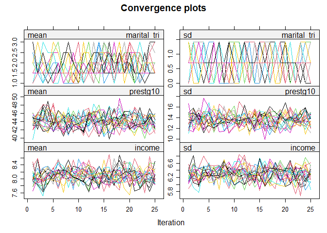<!-- -->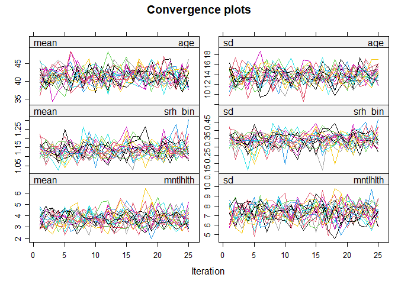<!-- -->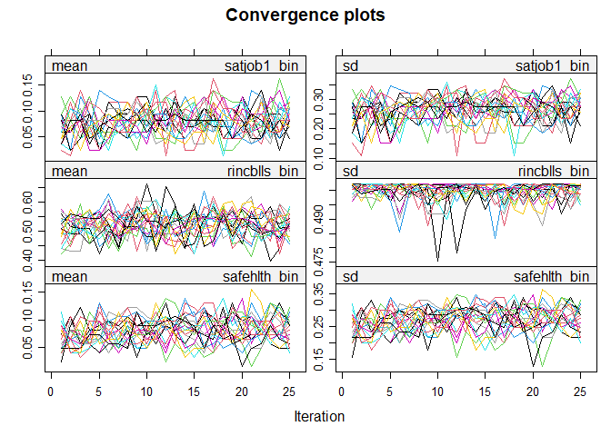<!-- -->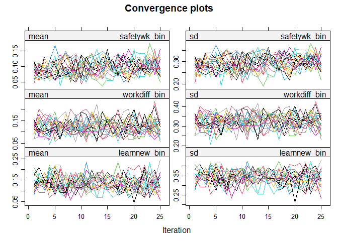<!-- -->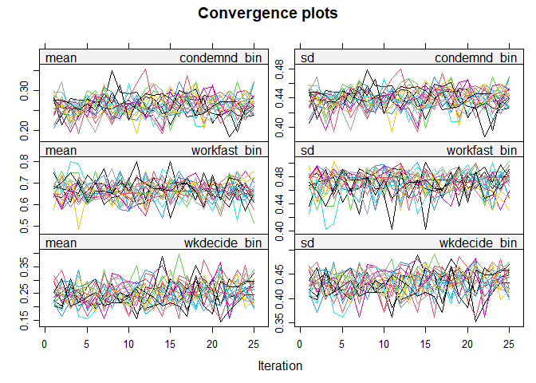<!-- -->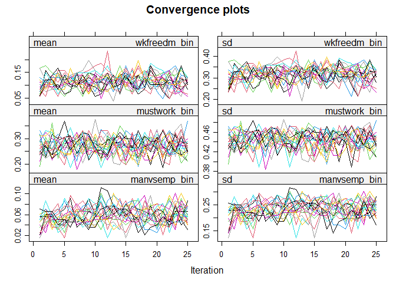<!-- -->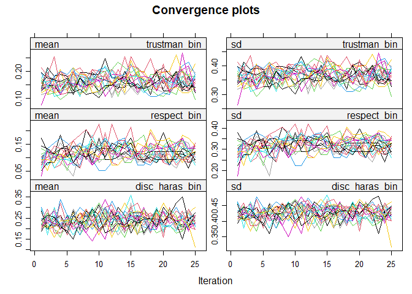<!-- -->

## Unimputed analyses

### Class, race, and gender differences in QWL 

Prevalence of bad category of each binary QWL variable among each class relative to the prevalence among workers adjusted for age and year with restricted cubic splines. Class*race estimates exclude "NH other" group from sample because they're so heterogeneous. 

#### Compensation and safety


```r
#outvars
outvars <- c("satjob1_bin_unimp", "rincblls_bin_unimp", "safehlth_bin_unimp", "safetywk_bin_unimp")

#functions
mysvy <- function(dat, columns, adjvars, ...) {
  model <- lapply(as.list(columns), function(x) {
    svyglm(as.formula(paste0(names(dat$variables)[which(names(dat$variables)==x)], adjvars)), family=poisson(), design=dat)
  })
  return(model)
}

matrix_func <- function(nums, coefs, outvars){
  regs_less = NULL
  for(i in 1:nums){
    cbind(exp(less_adj[[i]]$coefficients[2:coefs]), exp(confint(less_adj[[i]])[2:coefs,])) -> bind
    rbind(regs_less, cbind(bind, outvars[i])) -> regs_less
  }
  regs_less <- data.frame(regs_less)
  names(regs_less) <- c("PR", "Lower", "Upper", "Var")
  return(regs_less)
}

formatted <- function(classvec, rows, qwlvec){
  regs_less %>%
    mutate(Class=factor(rep(classvec, rows), levels=classvec),
           PR=as.numeric(PR), Lower=as.numeric(Lower), Upper=as.numeric(Upper),
           Var=factor(Var, levels=qwlvec),
           Cat=ifelse(Var=="satjob1_bin_unimp" | Var=="rincblls_bin_unimp" | Var=="safehlth_bin_unimp" | Var=="safetywk_bin_unimp", "Rewards/hazards",
                      ifelse(Var=="learnnew_bin_unimp" | Var=="workdiff_bin_unimp" | Var == "workfast_bin_unimp" | Var=="condemnd_bin_unimp", "Labor process",
                             ifelse(Var=="wkdecide_bin_unimp" | Var=="wkfreedm_bin_unimp" | Var == "mustwork_bin_unimp" | Var=="chngtme_bin_unimp", "Autonomy",
                                    ifelse(Var=="manvsemp_bin_unimp" | Var=="trustman_bin_unimp" | Var == "respect_bin_unimp" | Var=="disc_haras_bin_unimp", "Conflict", NA))))) -> binded
  return(binded)
}

########everyone
#run regression
less_adj <- mysvy(svy_dat, outvars, "~class + rcs(age, 3) + rcs(year, 3)")

#pull into matrix
regs_less <- matrix_func(4, 4, outvars)

#format matrix
binded_overall <- formatted(c("Managers", "Petit bourgeoisie", "Capitalists"), 4, outvars)

#######gender interaction
#run regression
less_adj <- mysvy(svy_dat, outvars, "~class_gender + rcs(age, 3) + rcs(year, 3)")

#pull into matrix
regs_less <- matrix_func(4, 8, outvars)

#format matrix
binded_gender <- formatted(c("Male managers", "Male petit bourgeoisie", "Male capitalists",
                             "Female workers", "Female managers", "Female petit bourgeoisie", "Female capitalists"), 4, outvars)

#######race interaction
#run regression
less_adj <- mysvy(subset(svy_dat, race_h!="NH other"), outvars, "~class_poc + rcs(age, 3) + rcs(year, 3)")

#pull into matrix
regs_less <- matrix_func(4, 8, outvars)

#format matrix
binded_race <- formatted(c("NH white managers", "NH white petit bourgeoisie", "NH white capitalists",
                           "POC workers", "POC managers", "POC petit bourgeoisie", "POC capitalists"), 4, outvars)
```


```r
#table 
tabled(rbind(binded_overall[1:12,1:5], binded_gender[1:28,1:5], binded_race[1:28,1:5]), "Ref: workers/male workers/white workers")
```

<div style="border: 1px solid #ddd; padding: 0px; overflow-y: scroll; height:250px; overflow-x: scroll; width:100%; "><table class="table table-striped" style="margin-left: auto; margin-right: auto;">
<caption>Ref: workers/male workers/white workers</caption>
 <thead>
  <tr>
   <th style="text-align:right;position: sticky; top:0; background-color: #FFFFFF;"> QWL variable </th>
   <th style="text-align:right;position: sticky; top:0; background-color: #FFFFFF;"> Class </th>
   <th style="text-align:right;position: sticky; top:0; background-color: #FFFFFF;"> PR </th>
   <th style="text-align:left;position: sticky; top:0; background-color: #FFFFFF;"> Lower </th>
   <th style="text-align:left;position: sticky; top:0; background-color: #FFFFFF;"> Upper </th>
  </tr>
 </thead>
<tbody>
  <tr grouplength="12"><td colspan="5" style="border-bottom: 1px solid;"><strong>Class</strong></td></tr>
<tr>
   <td style="text-align:right; padding-left:  2em;" indentlevel="1"> 0.87 </td>
   <td style="text-align:right;"> 0.69 </td>
   <td style="text-align:right;"> 1.10 </td>
   <td style="text-align:left;"> satjob1_bin_unimp </td>
   <td style="text-align:left;"> Managers </td>
  </tr>
  <tr>
   <td style="text-align:right; padding-left:  2em;" indentlevel="1"> 0.53 </td>
   <td style="text-align:right;"> 0.34 </td>
   <td style="text-align:right;"> 0.83 </td>
   <td style="text-align:left;"> satjob1_bin_unimp </td>
   <td style="text-align:left;"> Petit bourgeoisie </td>
  </tr>
  <tr>
   <td style="text-align:right; padding-left:  2em;" indentlevel="1"> 0.37 </td>
   <td style="text-align:right;"> 0.21 </td>
   <td style="text-align:right;"> 0.66 </td>
   <td style="text-align:left;"> satjob1_bin_unimp </td>
   <td style="text-align:left;"> Capitalists </td>
  </tr>
  <tr>
   <td style="text-align:right; padding-left:  2em;" indentlevel="1"> 0.79 </td>
   <td style="text-align:right;"> 0.75 </td>
   <td style="text-align:right;"> 0.84 </td>
   <td style="text-align:left;"> rincblls_bin_unimp </td>
   <td style="text-align:left;"> Managers </td>
  </tr>
  <tr>
   <td style="text-align:right; padding-left:  2em;" indentlevel="1"> 0.92 </td>
   <td style="text-align:right;"> 0.83 </td>
   <td style="text-align:right;"> 1.01 </td>
   <td style="text-align:left;"> rincblls_bin_unimp </td>
   <td style="text-align:left;"> Petit bourgeoisie </td>
  </tr>
  <tr>
   <td style="text-align:right; padding-left:  2em;" indentlevel="1"> 0.49 </td>
   <td style="text-align:right;"> 0.41 </td>
   <td style="text-align:right;"> 0.60 </td>
   <td style="text-align:left;"> rincblls_bin_unimp </td>
   <td style="text-align:left;"> Capitalists </td>
  </tr>
  <tr>
   <td style="text-align:right; padding-left:  2em;" indentlevel="1"> 0.76 </td>
   <td style="text-align:right;"> 0.59 </td>
   <td style="text-align:right;"> 0.98 </td>
   <td style="text-align:left;"> safehlth_bin_unimp </td>
   <td style="text-align:left;"> Managers </td>
  </tr>
  <tr>
   <td style="text-align:right; padding-left:  2em;" indentlevel="1"> 0.59 </td>
   <td style="text-align:right;"> 0.34 </td>
   <td style="text-align:right;"> 1.02 </td>
   <td style="text-align:left;"> safehlth_bin_unimp </td>
   <td style="text-align:left;"> Petit bourgeoisie </td>
  </tr>
  <tr>
   <td style="text-align:right; padding-left:  2em;" indentlevel="1"> 0.63 </td>
   <td style="text-align:right;"> 0.32 </td>
   <td style="text-align:right;"> 1.27 </td>
   <td style="text-align:left;"> safehlth_bin_unimp </td>
   <td style="text-align:left;"> Capitalists </td>
  </tr>
  <tr>
   <td style="text-align:right; padding-left:  2em;" indentlevel="1"> 0.83 </td>
   <td style="text-align:right;"> 0.67 </td>
   <td style="text-align:right;"> 1.02 </td>
   <td style="text-align:left;"> safetywk_bin_unimp </td>
   <td style="text-align:left;"> Managers </td>
  </tr>
  <tr>
   <td style="text-align:right; padding-left:  2em;" indentlevel="1"> 0.38 </td>
   <td style="text-align:right;"> 0.23 </td>
   <td style="text-align:right;"> 0.62 </td>
   <td style="text-align:left;"> safetywk_bin_unimp </td>
   <td style="text-align:left;"> Petit bourgeoisie </td>
  </tr>
  <tr>
   <td style="text-align:right; padding-left:  2em;" indentlevel="1"> 0.42 </td>
   <td style="text-align:right;"> 0.21 </td>
   <td style="text-align:right;"> 0.83 </td>
   <td style="text-align:left;"> safetywk_bin_unimp </td>
   <td style="text-align:left;"> Capitalists </td>
  </tr>
  <tr grouplength="28"><td colspan="5" style="border-bottom: 1px solid;"><strong>Class*gender</strong></td></tr>
<tr>
   <td style="text-align:right; padding-left:  2em;" indentlevel="1"> 0.83 </td>
   <td style="text-align:right;"> 0.61 </td>
   <td style="text-align:right;"> 1.14 </td>
   <td style="text-align:left;"> satjob1_bin_unimp </td>
   <td style="text-align:left;"> Male managers </td>
  </tr>
  <tr>
   <td style="text-align:right; padding-left:  2em;" indentlevel="1"> 0.69 </td>
   <td style="text-align:right;"> 0.40 </td>
   <td style="text-align:right;"> 1.18 </td>
   <td style="text-align:left;"> satjob1_bin_unimp </td>
   <td style="text-align:left;"> Male petit bourgeoisie </td>
  </tr>
  <tr>
   <td style="text-align:right; padding-left:  2em;" indentlevel="1"> 0.32 </td>
   <td style="text-align:right;"> 0.16 </td>
   <td style="text-align:right;"> 0.61 </td>
   <td style="text-align:left;"> satjob1_bin_unimp </td>
   <td style="text-align:left;"> Male capitalists </td>
  </tr>
  <tr>
   <td style="text-align:right; padding-left:  2em;" indentlevel="1"> 0.81 </td>
   <td style="text-align:right;"> 0.63 </td>
   <td style="text-align:right;"> 1.03 </td>
   <td style="text-align:left;"> satjob1_bin_unimp </td>
   <td style="text-align:left;"> Female workers </td>
  </tr>
  <tr>
   <td style="text-align:right; padding-left:  2em;" indentlevel="1"> 0.72 </td>
   <td style="text-align:right;"> 0.51 </td>
   <td style="text-align:right;"> 1.01 </td>
   <td style="text-align:left;"> satjob1_bin_unimp </td>
   <td style="text-align:left;"> Female managers </td>
  </tr>
  <tr>
   <td style="text-align:right; padding-left:  2em;" indentlevel="1"> 0.25 </td>
   <td style="text-align:right;"> 0.11 </td>
   <td style="text-align:right;"> 0.55 </td>
   <td style="text-align:left;"> satjob1_bin_unimp </td>
   <td style="text-align:left;"> Female petit bourgeoisie </td>
  </tr>
  <tr>
   <td style="text-align:right; padding-left:  2em;" indentlevel="1"> 0.38 </td>
   <td style="text-align:right;"> 0.13 </td>
   <td style="text-align:right;"> 1.18 </td>
   <td style="text-align:left;"> satjob1_bin_unimp </td>
   <td style="text-align:left;"> Female capitalists </td>
  </tr>
  <tr>
   <td style="text-align:right; padding-left:  2em;" indentlevel="1"> 0.79 </td>
   <td style="text-align:right;"> 0.71 </td>
   <td style="text-align:right;"> 0.87 </td>
   <td style="text-align:left;"> rincblls_bin_unimp </td>
   <td style="text-align:left;"> Male managers </td>
  </tr>
  <tr>
   <td style="text-align:right; padding-left:  2em;" indentlevel="1"> 0.80 </td>
   <td style="text-align:right;"> 0.67 </td>
   <td style="text-align:right;"> 0.96 </td>
   <td style="text-align:left;"> rincblls_bin_unimp </td>
   <td style="text-align:left;"> Male petit bourgeoisie </td>
  </tr>
  <tr>
   <td style="text-align:right; padding-left:  2em;" indentlevel="1"> 0.47 </td>
   <td style="text-align:right;"> 0.37 </td>
   <td style="text-align:right;"> 0.61 </td>
   <td style="text-align:left;"> rincblls_bin_unimp </td>
   <td style="text-align:left;"> Male capitalists </td>
  </tr>
  <tr>
   <td style="text-align:right; padding-left:  2em;" indentlevel="1"> 1.40 </td>
   <td style="text-align:right;"> 1.31 </td>
   <td style="text-align:right;"> 1.50 </td>
   <td style="text-align:left;"> rincblls_bin_unimp </td>
   <td style="text-align:left;"> Female workers </td>
  </tr>
  <tr>
   <td style="text-align:right; padding-left:  2em;" indentlevel="1"> 1.17 </td>
   <td style="text-align:right;"> 1.08 </td>
   <td style="text-align:right;"> 1.27 </td>
   <td style="text-align:left;"> rincblls_bin_unimp </td>
   <td style="text-align:left;"> Female managers </td>
  </tr>
  <tr>
   <td style="text-align:right; padding-left:  2em;" indentlevel="1"> 1.46 </td>
   <td style="text-align:right;"> 1.32 </td>
   <td style="text-align:right;"> 1.63 </td>
   <td style="text-align:left;"> rincblls_bin_unimp </td>
   <td style="text-align:left;"> Female petit bourgeoisie </td>
  </tr>
  <tr>
   <td style="text-align:right; padding-left:  2em;" indentlevel="1"> 1.03 </td>
   <td style="text-align:right;"> 0.82 </td>
   <td style="text-align:right;"> 1.29 </td>
   <td style="text-align:left;"> rincblls_bin_unimp </td>
   <td style="text-align:left;"> Female capitalists </td>
  </tr>
  <tr>
   <td style="text-align:right; padding-left:  2em;" indentlevel="1"> 0.76 </td>
   <td style="text-align:right;"> 0.54 </td>
   <td style="text-align:right;"> 1.07 </td>
   <td style="text-align:left;"> safehlth_bin_unimp </td>
   <td style="text-align:left;"> Male managers </td>
  </tr>
  <tr>
   <td style="text-align:right; padding-left:  2em;" indentlevel="1"> 0.83 </td>
   <td style="text-align:right;"> 0.43 </td>
   <td style="text-align:right;"> 1.62 </td>
   <td style="text-align:left;"> safehlth_bin_unimp </td>
   <td style="text-align:left;"> Male petit bourgeoisie </td>
  </tr>
  <tr>
   <td style="text-align:right; padding-left:  2em;" indentlevel="1"> 0.74 </td>
   <td style="text-align:right;"> 0.33 </td>
   <td style="text-align:right;"> 1.65 </td>
   <td style="text-align:left;"> safehlth_bin_unimp </td>
   <td style="text-align:left;"> Male capitalists </td>
  </tr>
  <tr>
   <td style="text-align:right; padding-left:  2em;" indentlevel="1"> 1.10 </td>
   <td style="text-align:right;"> 0.85 </td>
   <td style="text-align:right;"> 1.42 </td>
   <td style="text-align:left;"> safehlth_bin_unimp </td>
   <td style="text-align:left;"> Female workers </td>
  </tr>
  <tr>
   <td style="text-align:right; padding-left:  2em;" indentlevel="1"> 0.85 </td>
   <td style="text-align:right;"> 0.59 </td>
   <td style="text-align:right;"> 1.21 </td>
   <td style="text-align:left;"> safehlth_bin_unimp </td>
   <td style="text-align:left;"> Female managers </td>
  </tr>
  <tr>
   <td style="text-align:right; padding-left:  2em;" indentlevel="1"> 0.41 </td>
   <td style="text-align:right;"> 0.14 </td>
   <td style="text-align:right;"> 1.16 </td>
   <td style="text-align:left;"> safehlth_bin_unimp </td>
   <td style="text-align:left;"> Female petit bourgeoisie </td>
  </tr>
  <tr>
   <td style="text-align:right; padding-left:  2em;" indentlevel="1"> 0.45 </td>
   <td style="text-align:right;"> 0.13 </td>
   <td style="text-align:right;"> 1.58 </td>
   <td style="text-align:left;"> safehlth_bin_unimp </td>
   <td style="text-align:left;"> Female capitalists </td>
  </tr>
  <tr>
   <td style="text-align:right; padding-left:  2em;" indentlevel="1"> 0.75 </td>
   <td style="text-align:right;"> 0.56 </td>
   <td style="text-align:right;"> 1.01 </td>
   <td style="text-align:left;"> safetywk_bin_unimp </td>
   <td style="text-align:left;"> Male managers </td>
  </tr>
  <tr>
   <td style="text-align:right; padding-left:  2em;" indentlevel="1"> 0.53 </td>
   <td style="text-align:right;"> 0.29 </td>
   <td style="text-align:right;"> 0.99 </td>
   <td style="text-align:left;"> safetywk_bin_unimp </td>
   <td style="text-align:left;"> Male petit bourgeoisie </td>
  </tr>
  <tr>
   <td style="text-align:right; padding-left:  2em;" indentlevel="1"> 0.36 </td>
   <td style="text-align:right;"> 0.14 </td>
   <td style="text-align:right;"> 0.91 </td>
   <td style="text-align:left;"> safetywk_bin_unimp </td>
   <td style="text-align:left;"> Male capitalists </td>
  </tr>
  <tr>
   <td style="text-align:right; padding-left:  2em;" indentlevel="1"> 1.00 </td>
   <td style="text-align:right;"> 0.80 </td>
   <td style="text-align:right;"> 1.24 </td>
   <td style="text-align:left;"> safetywk_bin_unimp </td>
   <td style="text-align:left;"> Female workers </td>
  </tr>
  <tr>
   <td style="text-align:right; padding-left:  2em;" indentlevel="1"> 0.90 </td>
   <td style="text-align:right;"> 0.67 </td>
   <td style="text-align:right;"> 1.21 </td>
   <td style="text-align:left;"> safetywk_bin_unimp </td>
   <td style="text-align:left;"> Female managers </td>
  </tr>
  <tr>
   <td style="text-align:right; padding-left:  2em;" indentlevel="1"> 0.22 </td>
   <td style="text-align:right;"> 0.09 </td>
   <td style="text-align:right;"> 0.54 </td>
   <td style="text-align:left;"> safetywk_bin_unimp </td>
   <td style="text-align:left;"> Female petit bourgeoisie </td>
  </tr>
  <tr>
   <td style="text-align:right; padding-left:  2em;" indentlevel="1"> 0.61 </td>
   <td style="text-align:right;"> 0.27 </td>
   <td style="text-align:right;"> 1.37 </td>
   <td style="text-align:left;"> safetywk_bin_unimp </td>
   <td style="text-align:left;"> Female capitalists </td>
  </tr>
  <tr grouplength="28"><td colspan="5" style="border-bottom: 1px solid;"><strong>Class*POC</strong></td></tr>
<tr>
   <td style="text-align:right; padding-left:  2em;" indentlevel="1"> 0.84 </td>
   <td style="text-align:right;"> 0.62 </td>
   <td style="text-align:right;"> 1.13 </td>
   <td style="text-align:left;"> satjob1_bin_unimp </td>
   <td style="text-align:left;"> NH white managers </td>
  </tr>
  <tr>
   <td style="text-align:right; padding-left:  2em;" indentlevel="1"> 0.38 </td>
   <td style="text-align:right;"> 0.20 </td>
   <td style="text-align:right;"> 0.71 </td>
   <td style="text-align:left;"> satjob1_bin_unimp </td>
   <td style="text-align:left;"> NH white petit bourgeoisie </td>
  </tr>
  <tr>
   <td style="text-align:right; padding-left:  2em;" indentlevel="1"> 0.41 </td>
   <td style="text-align:right;"> 0.22 </td>
   <td style="text-align:right;"> 0.77 </td>
   <td style="text-align:left;"> satjob1_bin_unimp </td>
   <td style="text-align:left;"> NH white capitalists </td>
  </tr>
  <tr>
   <td style="text-align:right; padding-left:  2em;" indentlevel="1"> 1.11 </td>
   <td style="text-align:right;"> 0.83 </td>
   <td style="text-align:right;"> 1.47 </td>
   <td style="text-align:left;"> satjob1_bin_unimp </td>
   <td style="text-align:left;"> POC workers </td>
  </tr>
  <tr>
   <td style="text-align:right; padding-left:  2em;" indentlevel="1"> 1.18 </td>
   <td style="text-align:right;"> 0.81 </td>
   <td style="text-align:right;"> 1.70 </td>
   <td style="text-align:left;"> satjob1_bin_unimp </td>
   <td style="text-align:left;"> POC managers </td>
  </tr>
  <tr>
   <td style="text-align:right; padding-left:  2em;" indentlevel="1"> 0.74 </td>
   <td style="text-align:right;"> 0.32 </td>
   <td style="text-align:right;"> 1.72 </td>
   <td style="text-align:left;"> satjob1_bin_unimp </td>
   <td style="text-align:left;"> POC petit bourgeoisie </td>
  </tr>
  <tr>
   <td style="text-align:right; padding-left:  2em;" indentlevel="1"> 0.00 </td>
   <td style="text-align:right;"> 0.00 </td>
   <td style="text-align:right;"> 0.00 </td>
   <td style="text-align:left;"> satjob1_bin_unimp </td>
   <td style="text-align:left;"> POC capitalists </td>
  </tr>
  <tr>
   <td style="text-align:right; padding-left:  2em;" indentlevel="1"> 0.78 </td>
   <td style="text-align:right;"> 0.73 </td>
   <td style="text-align:right;"> 0.83 </td>
   <td style="text-align:left;"> rincblls_bin_unimp </td>
   <td style="text-align:left;"> NH white managers </td>
  </tr>
  <tr>
   <td style="text-align:right; padding-left:  2em;" indentlevel="1"> 0.88 </td>
   <td style="text-align:right;"> 0.79 </td>
   <td style="text-align:right;"> 0.99 </td>
   <td style="text-align:left;"> rincblls_bin_unimp </td>
   <td style="text-align:left;"> NH white petit bourgeoisie </td>
  </tr>
  <tr>
   <td style="text-align:right; padding-left:  2em;" indentlevel="1"> 0.49 </td>
   <td style="text-align:right;"> 0.39 </td>
   <td style="text-align:right;"> 0.61 </td>
   <td style="text-align:left;"> rincblls_bin_unimp </td>
   <td style="text-align:left;"> NH white capitalists </td>
  </tr>
  <tr>
   <td style="text-align:right; padding-left:  2em;" indentlevel="1"> 1.03 </td>
   <td style="text-align:right;"> 0.97 </td>
   <td style="text-align:right;"> 1.11 </td>
   <td style="text-align:left;"> rincblls_bin_unimp </td>
   <td style="text-align:left;"> POC workers </td>
  </tr>
  <tr>
   <td style="text-align:right; padding-left:  2em;" indentlevel="1"> 0.92 </td>
   <td style="text-align:right;"> 0.83 </td>
   <td style="text-align:right;"> 1.02 </td>
   <td style="text-align:left;"> rincblls_bin_unimp </td>
   <td style="text-align:left;"> POC managers </td>
  </tr>
  <tr>
   <td style="text-align:right; padding-left:  2em;" indentlevel="1"> 1.07 </td>
   <td style="text-align:right;"> 0.90 </td>
   <td style="text-align:right;"> 1.27 </td>
   <td style="text-align:left;"> rincblls_bin_unimp </td>
   <td style="text-align:left;"> POC petit bourgeoisie </td>
  </tr>
  <tr>
   <td style="text-align:right; padding-left:  2em;" indentlevel="1"> 0.65 </td>
   <td style="text-align:right;"> 0.45 </td>
   <td style="text-align:right;"> 0.93 </td>
   <td style="text-align:left;"> rincblls_bin_unimp </td>
   <td style="text-align:left;"> POC capitalists </td>
  </tr>
  <tr>
   <td style="text-align:right; padding-left:  2em;" indentlevel="1"> 0.78 </td>
   <td style="text-align:right;"> 0.57 </td>
   <td style="text-align:right;"> 1.06 </td>
   <td style="text-align:left;"> safehlth_bin_unimp </td>
   <td style="text-align:left;"> NH white managers </td>
  </tr>
  <tr>
   <td style="text-align:right; padding-left:  2em;" indentlevel="1"> 0.31 </td>
   <td style="text-align:right;"> 0.15 </td>
   <td style="text-align:right;"> 0.64 </td>
   <td style="text-align:left;"> safehlth_bin_unimp </td>
   <td style="text-align:left;"> NH white petit bourgeoisie </td>
  </tr>
  <tr>
   <td style="text-align:right; padding-left:  2em;" indentlevel="1"> 0.74 </td>
   <td style="text-align:right;"> 0.34 </td>
   <td style="text-align:right;"> 1.64 </td>
   <td style="text-align:left;"> safehlth_bin_unimp </td>
   <td style="text-align:left;"> NH white capitalists </td>
  </tr>
  <tr>
   <td style="text-align:right; padding-left:  2em;" indentlevel="1"> 1.38 </td>
   <td style="text-align:right;"> 1.06 </td>
   <td style="text-align:right;"> 1.81 </td>
   <td style="text-align:left;"> safehlth_bin_unimp </td>
   <td style="text-align:left;"> POC workers </td>
  </tr>
  <tr>
   <td style="text-align:right; padding-left:  2em;" indentlevel="1"> 1.09 </td>
   <td style="text-align:right;"> 0.73 </td>
   <td style="text-align:right;"> 1.64 </td>
   <td style="text-align:left;"> safehlth_bin_unimp </td>
   <td style="text-align:left;"> POC managers </td>
  </tr>
  <tr>
   <td style="text-align:right; padding-left:  2em;" indentlevel="1"> 1.69 </td>
   <td style="text-align:right;"> 0.73 </td>
   <td style="text-align:right;"> 3.89 </td>
   <td style="text-align:left;"> safehlth_bin_unimp </td>
   <td style="text-align:left;"> POC petit bourgeoisie </td>
  </tr>
  <tr>
   <td style="text-align:right; padding-left:  2em;" indentlevel="1"> 0.58 </td>
   <td style="text-align:right;"> 0.14 </td>
   <td style="text-align:right;"> 2.46 </td>
   <td style="text-align:left;"> safehlth_bin_unimp </td>
   <td style="text-align:left;"> POC capitalists </td>
  </tr>
  <tr>
   <td style="text-align:right; padding-left:  2em;" indentlevel="1"> 0.90 </td>
   <td style="text-align:right;"> 0.71 </td>
   <td style="text-align:right;"> 1.14 </td>
   <td style="text-align:left;"> safetywk_bin_unimp </td>
   <td style="text-align:left;"> NH white managers </td>
  </tr>
  <tr>
   <td style="text-align:right; padding-left:  2em;" indentlevel="1"> 0.30 </td>
   <td style="text-align:right;"> 0.17 </td>
   <td style="text-align:right;"> 0.52 </td>
   <td style="text-align:left;"> safetywk_bin_unimp </td>
   <td style="text-align:left;"> NH white petit bourgeoisie </td>
  </tr>
  <tr>
   <td style="text-align:right; padding-left:  2em;" indentlevel="1"> 0.54 </td>
   <td style="text-align:right;"> 0.27 </td>
   <td style="text-align:right;"> 1.08 </td>
   <td style="text-align:left;"> safetywk_bin_unimp </td>
   <td style="text-align:left;"> NH white capitalists </td>
  </tr>
  <tr>
   <td style="text-align:right; padding-left:  2em;" indentlevel="1"> 1.05 </td>
   <td style="text-align:right;"> 0.81 </td>
   <td style="text-align:right;"> 1.36 </td>
   <td style="text-align:left;"> safetywk_bin_unimp </td>
   <td style="text-align:left;"> POC workers </td>
  </tr>
  <tr>
   <td style="text-align:right; padding-left:  2em;" indentlevel="1"> 0.73 </td>
   <td style="text-align:right;"> 0.48 </td>
   <td style="text-align:right;"> 1.12 </td>
   <td style="text-align:left;"> safetywk_bin_unimp </td>
   <td style="text-align:left;"> POC managers </td>
  </tr>
  <tr>
   <td style="text-align:right; padding-left:  2em;" indentlevel="1"> 0.57 </td>
   <td style="text-align:right;"> 0.23 </td>
   <td style="text-align:right;"> 1.42 </td>
   <td style="text-align:left;"> safetywk_bin_unimp </td>
   <td style="text-align:left;"> POC petit bourgeoisie </td>
  </tr>
  <tr>
   <td style="text-align:right; padding-left:  2em;" indentlevel="1"> 0.00 </td>
   <td style="text-align:right;"> 0.00 </td>
   <td style="text-align:right;"> 0.00 </td>
   <td style="text-align:left;"> safetywk_bin_unimp </td>
   <td style="text-align:left;"> POC capitalists </td>
  </tr>
</tbody>
</table></div>

#### Labor process


```r
#outvars
outvars <- c("workdiff_bin_unimp", "learnnew_bin_unimp", "condemnd_bin_unimp", "workfast_bin_unimp")

########everyone
#run regression
less_adj <- mysvy(svy_dat, outvars, "~class + rcs(age, 3) + rcs(year, 3)")

#pull into matrix
regs_less <- matrix_func(4, 4, outvars)

#format matrix
binded_overall <- formatted(c("Managers", "Petit bourgeoisie", "Capitalists"), 4, outvars)

#######gender interaction
#run regression
less_adj <- mysvy(svy_dat, outvars, "~class_gender + rcs(age, 3) + rcs(year, 3)")

#pull into matrix
regs_less <- matrix_func(4, 8, outvars)

#format matrix
binded_gender <- formatted(c("Male managers", "Male petit bourgeoisie", "Male capitalists",
                             "Female workers", "Female managers", "Female petit bourgeoisie", "Female capitalists"), 4, outvars)

#######race interaction
#run regression
less_adj <- mysvy(subset(svy_dat, race_h!="NH other"), outvars, "~class_poc + rcs(age, 3) + rcs(year, 3)")

#pull into matrix
regs_less <- matrix_func(4, 8, outvars)

#format matrix
binded_race <- formatted(c("NH white managers", "NH white petit bourgeoisie", "NH white capitalists",
                           "POC workers", "POC managers", "POC petit bourgeoisie", "POC capitalists"), 4, outvars)
```


```r
#table 
tabled(rbind(binded_overall[1:12,1:5], binded_gender[1:28,1:5], binded_race[1:28,1:5]), "Ref: workers/male workers/white workers")
```

<div style="border: 1px solid #ddd; padding: 0px; overflow-y: scroll; height:250px; overflow-x: scroll; width:100%; "><table class="table table-striped" style="margin-left: auto; margin-right: auto;">
<caption>Ref: workers/male workers/white workers</caption>
 <thead>
  <tr>
   <th style="text-align:right;position: sticky; top:0; background-color: #FFFFFF;"> QWL variable </th>
   <th style="text-align:right;position: sticky; top:0; background-color: #FFFFFF;"> Class </th>
   <th style="text-align:right;position: sticky; top:0; background-color: #FFFFFF;"> PR </th>
   <th style="text-align:left;position: sticky; top:0; background-color: #FFFFFF;"> Lower </th>
   <th style="text-align:left;position: sticky; top:0; background-color: #FFFFFF;"> Upper </th>
  </tr>
 </thead>
<tbody>
  <tr grouplength="12"><td colspan="5" style="border-bottom: 1px solid;"><strong>Class</strong></td></tr>
<tr>
   <td style="text-align:right; padding-left:  2em;" indentlevel="1"> 0.39 </td>
   <td style="text-align:right;"> 0.31 </td>
   <td style="text-align:right;"> 0.49 </td>
   <td style="text-align:left;"> workdiff_bin_unimp </td>
   <td style="text-align:left;"> Managers </td>
  </tr>
  <tr>
   <td style="text-align:right; padding-left:  2em;" indentlevel="1"> 0.85 </td>
   <td style="text-align:right;"> 0.64 </td>
   <td style="text-align:right;"> 1.12 </td>
   <td style="text-align:left;"> workdiff_bin_unimp </td>
   <td style="text-align:left;"> Petit bourgeoisie </td>
  </tr>
  <tr>
   <td style="text-align:right; padding-left:  2em;" indentlevel="1"> 0.37 </td>
   <td style="text-align:right;"> 0.22 </td>
   <td style="text-align:right;"> 0.62 </td>
   <td style="text-align:left;"> workdiff_bin_unimp </td>
   <td style="text-align:left;"> Capitalists </td>
  </tr>
  <tr>
   <td style="text-align:right; padding-left:  2em;" indentlevel="1"> 0.49 </td>
   <td style="text-align:right;"> 0.40 </td>
   <td style="text-align:right;"> 0.59 </td>
   <td style="text-align:left;"> learnnew_bin_unimp </td>
   <td style="text-align:left;"> Managers </td>
  </tr>
  <tr>
   <td style="text-align:right; padding-left:  2em;" indentlevel="1"> 0.73 </td>
   <td style="text-align:right;"> 0.57 </td>
   <td style="text-align:right;"> 0.93 </td>
   <td style="text-align:left;"> learnnew_bin_unimp </td>
   <td style="text-align:left;"> Petit bourgeoisie </td>
  </tr>
  <tr>
   <td style="text-align:right; padding-left:  2em;" indentlevel="1"> 0.22 </td>
   <td style="text-align:right;"> 0.13 </td>
   <td style="text-align:right;"> 0.38 </td>
   <td style="text-align:left;"> learnnew_bin_unimp </td>
   <td style="text-align:left;"> Capitalists </td>
  </tr>
  <tr>
   <td style="text-align:right; padding-left:  2em;" indentlevel="1"> 1.24 </td>
   <td style="text-align:right;"> 1.12 </td>
   <td style="text-align:right;"> 1.36 </td>
   <td style="text-align:left;"> condemnd_bin_unimp </td>
   <td style="text-align:left;"> Managers </td>
  </tr>
  <tr>
   <td style="text-align:right; padding-left:  2em;" indentlevel="1"> 0.72 </td>
   <td style="text-align:right;"> 0.57 </td>
   <td style="text-align:right;"> 0.91 </td>
   <td style="text-align:left;"> condemnd_bin_unimp </td>
   <td style="text-align:left;"> Petit bourgeoisie </td>
  </tr>
  <tr>
   <td style="text-align:right; padding-left:  2em;" indentlevel="1"> 1.21 </td>
   <td style="text-align:right;"> 1.00 </td>
   <td style="text-align:right;"> 1.45 </td>
   <td style="text-align:left;"> condemnd_bin_unimp </td>
   <td style="text-align:left;"> Capitalists </td>
  </tr>
  <tr>
   <td style="text-align:right; padding-left:  2em;" indentlevel="1"> 1.15 </td>
   <td style="text-align:right;"> 1.11 </td>
   <td style="text-align:right;"> 1.20 </td>
   <td style="text-align:left;"> workfast_bin_unimp </td>
   <td style="text-align:left;"> Managers </td>
  </tr>
  <tr>
   <td style="text-align:right; padding-left:  2em;" indentlevel="1"> 0.87 </td>
   <td style="text-align:right;"> 0.79 </td>
   <td style="text-align:right;"> 0.96 </td>
   <td style="text-align:left;"> workfast_bin_unimp </td>
   <td style="text-align:left;"> Petit bourgeoisie </td>
  </tr>
  <tr>
   <td style="text-align:right; padding-left:  2em;" indentlevel="1"> 1.26 </td>
   <td style="text-align:right;"> 1.17 </td>
   <td style="text-align:right;"> 1.35 </td>
   <td style="text-align:left;"> workfast_bin_unimp </td>
   <td style="text-align:left;"> Capitalists </td>
  </tr>
  <tr grouplength="28"><td colspan="5" style="border-bottom: 1px solid;"><strong>Class*gender</strong></td></tr>
<tr>
   <td style="text-align:right; padding-left:  2em;" indentlevel="1"> 0.38 </td>
   <td style="text-align:right;"> 0.28 </td>
   <td style="text-align:right;"> 0.51 </td>
   <td style="text-align:left;"> workdiff_bin_unimp </td>
   <td style="text-align:left;"> Male managers </td>
  </tr>
  <tr>
   <td style="text-align:right; padding-left:  2em;" indentlevel="1"> 0.63 </td>
   <td style="text-align:right;"> 0.40 </td>
   <td style="text-align:right;"> 0.99 </td>
   <td style="text-align:left;"> workdiff_bin_unimp </td>
   <td style="text-align:left;"> Male petit bourgeoisie </td>
  </tr>
  <tr>
   <td style="text-align:right; padding-left:  2em;" indentlevel="1"> 0.34 </td>
   <td style="text-align:right;"> 0.19 </td>
   <td style="text-align:right;"> 0.63 </td>
   <td style="text-align:left;"> workdiff_bin_unimp </td>
   <td style="text-align:left;"> Male capitalists </td>
  </tr>
  <tr>
   <td style="text-align:right; padding-left:  2em;" indentlevel="1"> 0.85 </td>
   <td style="text-align:right;"> 0.71 </td>
   <td style="text-align:right;"> 1.02 </td>
   <td style="text-align:left;"> workdiff_bin_unimp </td>
   <td style="text-align:left;"> Female workers </td>
  </tr>
  <tr>
   <td style="text-align:right; padding-left:  2em;" indentlevel="1"> 0.34 </td>
   <td style="text-align:right;"> 0.25 </td>
   <td style="text-align:right;"> 0.48 </td>
   <td style="text-align:left;"> workdiff_bin_unimp </td>
   <td style="text-align:left;"> Female managers </td>
  </tr>
  <tr>
   <td style="text-align:right; padding-left:  2em;" indentlevel="1"> 0.92 </td>
   <td style="text-align:right;"> 0.65 </td>
   <td style="text-align:right;"> 1.31 </td>
   <td style="text-align:left;"> workdiff_bin_unimp </td>
   <td style="text-align:left;"> Female petit bourgeoisie </td>
  </tr>
  <tr>
   <td style="text-align:right; padding-left:  2em;" indentlevel="1"> 0.31 </td>
   <td style="text-align:right;"> 0.12 </td>
   <td style="text-align:right;"> 0.77 </td>
   <td style="text-align:left;"> workdiff_bin_unimp </td>
   <td style="text-align:left;"> Female capitalists </td>
  </tr>
  <tr>
   <td style="text-align:right; padding-left:  2em;" indentlevel="1"> 0.48 </td>
   <td style="text-align:right;"> 0.36 </td>
   <td style="text-align:right;"> 0.62 </td>
   <td style="text-align:left;"> learnnew_bin_unimp </td>
   <td style="text-align:left;"> Male managers </td>
  </tr>
  <tr>
   <td style="text-align:right; padding-left:  2em;" indentlevel="1"> 0.47 </td>
   <td style="text-align:right;"> 0.31 </td>
   <td style="text-align:right;"> 0.72 </td>
   <td style="text-align:left;"> learnnew_bin_unimp </td>
   <td style="text-align:left;"> Male petit bourgeoisie </td>
  </tr>
  <tr>
   <td style="text-align:right; padding-left:  2em;" indentlevel="1"> 0.18 </td>
   <td style="text-align:right;"> 0.09 </td>
   <td style="text-align:right;"> 0.36 </td>
   <td style="text-align:left;"> learnnew_bin_unimp </td>
   <td style="text-align:left;"> Male capitalists </td>
  </tr>
  <tr>
   <td style="text-align:right; padding-left:  2em;" indentlevel="1"> 0.91 </td>
   <td style="text-align:right;"> 0.77 </td>
   <td style="text-align:right;"> 1.09 </td>
   <td style="text-align:left;"> learnnew_bin_unimp </td>
   <td style="text-align:left;"> Female workers </td>
  </tr>
  <tr>
   <td style="text-align:right; padding-left:  2em;" indentlevel="1"> 0.45 </td>
   <td style="text-align:right;"> 0.33 </td>
   <td style="text-align:right;"> 0.60 </td>
   <td style="text-align:left;"> learnnew_bin_unimp </td>
   <td style="text-align:left;"> Female managers </td>
  </tr>
  <tr>
   <td style="text-align:right; padding-left:  2em;" indentlevel="1"> 0.93 </td>
   <td style="text-align:right;"> 0.68 </td>
   <td style="text-align:right;"> 1.29 </td>
   <td style="text-align:left;"> learnnew_bin_unimp </td>
   <td style="text-align:left;"> Female petit bourgeoisie </td>
  </tr>
  <tr>
   <td style="text-align:right; padding-left:  2em;" indentlevel="1"> 0.33 </td>
   <td style="text-align:right;"> 0.15 </td>
   <td style="text-align:right;"> 0.73 </td>
   <td style="text-align:left;"> learnnew_bin_unimp </td>
   <td style="text-align:left;"> Female capitalists </td>
  </tr>
  <tr>
   <td style="text-align:right; padding-left:  2em;" indentlevel="1"> 1.22 </td>
   <td style="text-align:right;"> 1.07 </td>
   <td style="text-align:right;"> 1.40 </td>
   <td style="text-align:left;"> condemnd_bin_unimp </td>
   <td style="text-align:left;"> Male managers </td>
  </tr>
  <tr>
   <td style="text-align:right; padding-left:  2em;" indentlevel="1"> 0.80 </td>
   <td style="text-align:right;"> 0.58 </td>
   <td style="text-align:right;"> 1.10 </td>
   <td style="text-align:left;"> condemnd_bin_unimp </td>
   <td style="text-align:left;"> Male petit bourgeoisie </td>
  </tr>
  <tr>
   <td style="text-align:right; padding-left:  2em;" indentlevel="1"> 1.36 </td>
   <td style="text-align:right;"> 1.09 </td>
   <td style="text-align:right;"> 1.69 </td>
   <td style="text-align:left;"> condemnd_bin_unimp </td>
   <td style="text-align:left;"> Male capitalists </td>
  </tr>
  <tr>
   <td style="text-align:right; padding-left:  2em;" indentlevel="1"> 1.11 </td>
   <td style="text-align:right;"> 0.98 </td>
   <td style="text-align:right;"> 1.25 </td>
   <td style="text-align:left;"> condemnd_bin_unimp </td>
   <td style="text-align:left;"> Female workers </td>
  </tr>
  <tr>
   <td style="text-align:right; padding-left:  2em;" indentlevel="1"> 1.41 </td>
   <td style="text-align:right;"> 1.22 </td>
   <td style="text-align:right;"> 1.62 </td>
   <td style="text-align:left;"> condemnd_bin_unimp </td>
   <td style="text-align:left;"> Female managers </td>
  </tr>
  <tr>
   <td style="text-align:right; padding-left:  2em;" indentlevel="1"> 0.73 </td>
   <td style="text-align:right;"> 0.53 </td>
   <td style="text-align:right;"> 1.01 </td>
   <td style="text-align:left;"> condemnd_bin_unimp </td>
   <td style="text-align:left;"> Female petit bourgeoisie </td>
  </tr>
  <tr>
   <td style="text-align:right; padding-left:  2em;" indentlevel="1"> 1.04 </td>
   <td style="text-align:right;"> 0.71 </td>
   <td style="text-align:right;"> 1.52 </td>
   <td style="text-align:left;"> condemnd_bin_unimp </td>
   <td style="text-align:left;"> Female capitalists </td>
  </tr>
  <tr>
   <td style="text-align:right; padding-left:  2em;" indentlevel="1"> 1.18 </td>
   <td style="text-align:right;"> 1.11 </td>
   <td style="text-align:right;"> 1.25 </td>
   <td style="text-align:left;"> workfast_bin_unimp </td>
   <td style="text-align:left;"> Male managers </td>
  </tr>
  <tr>
   <td style="text-align:right; padding-left:  2em;" indentlevel="1"> 0.89 </td>
   <td style="text-align:right;"> 0.77 </td>
   <td style="text-align:right;"> 1.02 </td>
   <td style="text-align:left;"> workfast_bin_unimp </td>
   <td style="text-align:left;"> Male petit bourgeoisie </td>
  </tr>
  <tr>
   <td style="text-align:right; padding-left:  2em;" indentlevel="1"> 1.27 </td>
   <td style="text-align:right;"> 1.16 </td>
   <td style="text-align:right;"> 1.39 </td>
   <td style="text-align:left;"> workfast_bin_unimp </td>
   <td style="text-align:left;"> Male capitalists </td>
  </tr>
  <tr>
   <td style="text-align:right; padding-left:  2em;" indentlevel="1"> 1.03 </td>
   <td style="text-align:right;"> 0.98 </td>
   <td style="text-align:right;"> 1.09 </td>
   <td style="text-align:left;"> workfast_bin_unimp </td>
   <td style="text-align:left;"> Female workers </td>
  </tr>
  <tr>
   <td style="text-align:right; padding-left:  2em;" indentlevel="1"> 1.18 </td>
   <td style="text-align:right;"> 1.10 </td>
   <td style="text-align:right;"> 1.25 </td>
   <td style="text-align:left;"> workfast_bin_unimp </td>
   <td style="text-align:left;"> Female managers </td>
  </tr>
  <tr>
   <td style="text-align:right; padding-left:  2em;" indentlevel="1"> 0.88 </td>
   <td style="text-align:right;"> 0.76 </td>
   <td style="text-align:right;"> 1.02 </td>
   <td style="text-align:left;"> workfast_bin_unimp </td>
   <td style="text-align:left;"> Female petit bourgeoisie </td>
  </tr>
  <tr>
   <td style="text-align:right; padding-left:  2em;" indentlevel="1"> 1.32 </td>
   <td style="text-align:right;"> 1.16 </td>
   <td style="text-align:right;"> 1.49 </td>
   <td style="text-align:left;"> workfast_bin_unimp </td>
   <td style="text-align:left;"> Female capitalists </td>
  </tr>
  <tr grouplength="28"><td colspan="5" style="border-bottom: 1px solid;"><strong>Class*POC</strong></td></tr>
<tr>
   <td style="text-align:right; padding-left:  2em;" indentlevel="1"> 0.36 </td>
   <td style="text-align:right;"> 0.27 </td>
   <td style="text-align:right;"> 0.48 </td>
   <td style="text-align:left;"> workdiff_bin_unimp </td>
   <td style="text-align:left;"> NH white managers </td>
  </tr>
  <tr>
   <td style="text-align:right; padding-left:  2em;" indentlevel="1"> 0.65 </td>
   <td style="text-align:right;"> 0.47 </td>
   <td style="text-align:right;"> 0.90 </td>
   <td style="text-align:left;"> workdiff_bin_unimp </td>
   <td style="text-align:left;"> NH white petit bourgeoisie </td>
  </tr>
  <tr>
   <td style="text-align:right; padding-left:  2em;" indentlevel="1"> 0.39 </td>
   <td style="text-align:right;"> 0.22 </td>
   <td style="text-align:right;"> 0.70 </td>
   <td style="text-align:left;"> workdiff_bin_unimp </td>
   <td style="text-align:left;"> NH white capitalists </td>
  </tr>
  <tr>
   <td style="text-align:right; padding-left:  2em;" indentlevel="1"> 1.17 </td>
   <td style="text-align:right;"> 0.96 </td>
   <td style="text-align:right;"> 1.42 </td>
   <td style="text-align:left;"> workdiff_bin_unimp </td>
   <td style="text-align:left;"> POC workers </td>
  </tr>
  <tr>
   <td style="text-align:right; padding-left:  2em;" indentlevel="1"> 0.56 </td>
   <td style="text-align:right;"> 0.38 </td>
   <td style="text-align:right;"> 0.83 </td>
   <td style="text-align:left;"> workdiff_bin_unimp </td>
   <td style="text-align:left;"> POC managers </td>
  </tr>
  <tr>
   <td style="text-align:right; padding-left:  2em;" indentlevel="1"> 1.83 </td>
   <td style="text-align:right;"> 1.17 </td>
   <td style="text-align:right;"> 2.88 </td>
   <td style="text-align:left;"> workdiff_bin_unimp </td>
   <td style="text-align:left;"> POC petit bourgeoisie </td>
  </tr>
  <tr>
   <td style="text-align:right; padding-left:  2em;" indentlevel="1"> 0.40 </td>
   <td style="text-align:right;"> 0.10 </td>
   <td style="text-align:right;"> 1.56 </td>
   <td style="text-align:left;"> workdiff_bin_unimp </td>
   <td style="text-align:left;"> POC capitalists </td>
  </tr>
  <tr>
   <td style="text-align:right; padding-left:  2em;" indentlevel="1"> 0.48 </td>
   <td style="text-align:right;"> 0.38 </td>
   <td style="text-align:right;"> 0.60 </td>
   <td style="text-align:left;"> learnnew_bin_unimp </td>
   <td style="text-align:left;"> NH white managers </td>
  </tr>
  <tr>
   <td style="text-align:right; padding-left:  2em;" indentlevel="1"> 0.65 </td>
   <td style="text-align:right;"> 0.49 </td>
   <td style="text-align:right;"> 0.86 </td>
   <td style="text-align:left;"> learnnew_bin_unimp </td>
   <td style="text-align:left;"> NH white petit bourgeoisie </td>
  </tr>
  <tr>
   <td style="text-align:right; padding-left:  2em;" indentlevel="1"> 0.23 </td>
   <td style="text-align:right;"> 0.13 </td>
   <td style="text-align:right;"> 0.42 </td>
   <td style="text-align:left;"> learnnew_bin_unimp </td>
   <td style="text-align:left;"> NH white capitalists </td>
  </tr>
  <tr>
   <td style="text-align:right; padding-left:  2em;" indentlevel="1"> 1.15 </td>
   <td style="text-align:right;"> 0.96 </td>
   <td style="text-align:right;"> 1.37 </td>
   <td style="text-align:left;"> learnnew_bin_unimp </td>
   <td style="text-align:left;"> POC workers </td>
  </tr>
  <tr>
   <td style="text-align:right; padding-left:  2em;" indentlevel="1"> 0.63 </td>
   <td style="text-align:right;"> 0.45 </td>
   <td style="text-align:right;"> 0.88 </td>
   <td style="text-align:left;"> learnnew_bin_unimp </td>
   <td style="text-align:left;"> POC managers </td>
  </tr>
  <tr>
   <td style="text-align:right; padding-left:  2em;" indentlevel="1"> 1.37 </td>
   <td style="text-align:right;"> 0.89 </td>
   <td style="text-align:right;"> 2.10 </td>
   <td style="text-align:left;"> learnnew_bin_unimp </td>
   <td style="text-align:left;"> POC petit bourgeoisie </td>
  </tr>
  <tr>
   <td style="text-align:right; padding-left:  2em;" indentlevel="1"> 0.28 </td>
   <td style="text-align:right;"> 0.09 </td>
   <td style="text-align:right;"> 0.90 </td>
   <td style="text-align:left;"> learnnew_bin_unimp </td>
   <td style="text-align:left;"> POC capitalists </td>
  </tr>
  <tr>
   <td style="text-align:right; padding-left:  2em;" indentlevel="1"> 1.34 </td>
   <td style="text-align:right;"> 1.19 </td>
   <td style="text-align:right;"> 1.50 </td>
   <td style="text-align:left;"> condemnd_bin_unimp </td>
   <td style="text-align:left;"> NH white managers </td>
  </tr>
  <tr>
   <td style="text-align:right; padding-left:  2em;" indentlevel="1"> 0.78 </td>
   <td style="text-align:right;"> 0.60 </td>
   <td style="text-align:right;"> 1.00 </td>
   <td style="text-align:left;"> condemnd_bin_unimp </td>
   <td style="text-align:left;"> NH white petit bourgeoisie </td>
  </tr>
  <tr>
   <td style="text-align:right; padding-left:  2em;" indentlevel="1"> 1.33 </td>
   <td style="text-align:right;"> 1.09 </td>
   <td style="text-align:right;"> 1.62 </td>
   <td style="text-align:left;"> condemnd_bin_unimp </td>
   <td style="text-align:left;"> NH white capitalists </td>
  </tr>
  <tr>
   <td style="text-align:right; padding-left:  2em;" indentlevel="1"> 0.90 </td>
   <td style="text-align:right;"> 0.78 </td>
   <td style="text-align:right;"> 1.04 </td>
   <td style="text-align:left;"> condemnd_bin_unimp </td>
   <td style="text-align:left;"> POC workers </td>
  </tr>
  <tr>
   <td style="text-align:right; padding-left:  2em;" indentlevel="1"> 0.95 </td>
   <td style="text-align:right;"> 0.77 </td>
   <td style="text-align:right;"> 1.17 </td>
   <td style="text-align:left;"> condemnd_bin_unimp </td>
   <td style="text-align:left;"> POC managers </td>
  </tr>
  <tr>
   <td style="text-align:right; padding-left:  2em;" indentlevel="1"> 0.49 </td>
   <td style="text-align:right;"> 0.30 </td>
   <td style="text-align:right;"> 0.82 </td>
   <td style="text-align:left;"> condemnd_bin_unimp </td>
   <td style="text-align:left;"> POC petit bourgeoisie </td>
  </tr>
  <tr>
   <td style="text-align:right; padding-left:  2em;" indentlevel="1"> 0.52 </td>
   <td style="text-align:right;"> 0.25 </td>
   <td style="text-align:right;"> 1.11 </td>
   <td style="text-align:left;"> condemnd_bin_unimp </td>
   <td style="text-align:left;"> POC capitalists </td>
  </tr>
  <tr>
   <td style="text-align:right; padding-left:  2em;" indentlevel="1"> 1.15 </td>
   <td style="text-align:right;"> 1.10 </td>
   <td style="text-align:right;"> 1.21 </td>
   <td style="text-align:left;"> workfast_bin_unimp </td>
   <td style="text-align:left;"> NH white managers </td>
  </tr>
  <tr>
   <td style="text-align:right; padding-left:  2em;" indentlevel="1"> 0.85 </td>
   <td style="text-align:right;"> 0.76 </td>
   <td style="text-align:right;"> 0.95 </td>
   <td style="text-align:left;"> workfast_bin_unimp </td>
   <td style="text-align:left;"> NH white petit bourgeoisie </td>
  </tr>
  <tr>
   <td style="text-align:right; padding-left:  2em;" indentlevel="1"> 1.24 </td>
   <td style="text-align:right;"> 1.14 </td>
   <td style="text-align:right;"> 1.34 </td>
   <td style="text-align:left;"> workfast_bin_unimp </td>
   <td style="text-align:left;"> NH white capitalists </td>
  </tr>
  <tr>
   <td style="text-align:right; padding-left:  2em;" indentlevel="1"> 0.87 </td>
   <td style="text-align:right;"> 0.82 </td>
   <td style="text-align:right;"> 0.93 </td>
   <td style="text-align:left;"> workfast_bin_unimp </td>
   <td style="text-align:left;"> POC workers </td>
  </tr>
  <tr>
   <td style="text-align:right; padding-left:  2em;" indentlevel="1"> 0.98 </td>
   <td style="text-align:right;"> 0.91 </td>
   <td style="text-align:right;"> 1.06 </td>
   <td style="text-align:left;"> workfast_bin_unimp </td>
   <td style="text-align:left;"> POC managers </td>
  </tr>
  <tr>
   <td style="text-align:right; padding-left:  2em;" indentlevel="1"> 0.69 </td>
   <td style="text-align:right;"> 0.54 </td>
   <td style="text-align:right;"> 0.88 </td>
   <td style="text-align:left;"> workfast_bin_unimp </td>
   <td style="text-align:left;"> POC petit bourgeoisie </td>
  </tr>
  <tr>
   <td style="text-align:right; padding-left:  2em;" indentlevel="1"> 1.07 </td>
   <td style="text-align:right;"> 0.87 </td>
   <td style="text-align:right;"> 1.30 </td>
   <td style="text-align:left;"> workfast_bin_unimp </td>
   <td style="text-align:left;"> POC capitalists </td>
  </tr>
</tbody>
</table></div>

#### Autonomy


```r
#outvars
outvars <- c("wkdecide_bin_unimp", "wkfreedm_bin_unimp", "mustwork_bin_unimp", "chngtme_bin_unimp")

########everyone
#run regression
less_adj <- mysvy(svy_dat, outvars, "~class + rcs(age, 3) + rcs(year, 3)")

#pull into matrix
regs_less <- matrix_func(4, 4, outvars)

#format matrix
binded_overall <- formatted(c("Managers", "Petit bourgeoisie", "Capitalists"), 4, outvars)

#######gender interaction
#run regression
less_adj <- mysvy(svy_dat, outvars, "~class_gender + rcs(age, 3) + rcs(year, 3)")

#pull into matrix
regs_less <- matrix_func(4, 8, outvars)

#format matrix
binded_gender <- formatted(c("Male managers", "Male petit bourgeoisie", "Male capitalists",
                             "Female workers", "Female managers", "Female petit bourgeoisie", "Female capitalists"), 4, outvars)

#######race interaction
#run regression
less_adj <- mysvy(subset(svy_dat, race_h!="NH other"), outvars, "~class_poc + rcs(age, 3) + rcs(year, 3)")

#pull into matrix
regs_less <- matrix_func(4, 8, outvars)

#format matrix
binded_race <- formatted(c("NH white managers", "NH white petit bourgeoisie", "NH white capitalists",
                           "POC workers", "POC managers", "POC petit bourgeoisie", "POC capitalists"), 4, outvars)
```


```r
#table 
tabled(rbind(binded_overall[1:12,1:5], binded_gender[1:28,1:5], binded_race[1:28,1:5]), "Ref: workers/male workers/white workers")
```

<div style="border: 1px solid #ddd; padding: 0px; overflow-y: scroll; height:250px; overflow-x: scroll; width:100%; "><table class="table table-striped" style="margin-left: auto; margin-right: auto;">
<caption>Ref: workers/male workers/white workers</caption>
 <thead>
  <tr>
   <th style="text-align:right;position: sticky; top:0; background-color: #FFFFFF;"> QWL variable </th>
   <th style="text-align:right;position: sticky; top:0; background-color: #FFFFFF;"> Class </th>
   <th style="text-align:right;position: sticky; top:0; background-color: #FFFFFF;"> PR </th>
   <th style="text-align:left;position: sticky; top:0; background-color: #FFFFFF;"> Lower </th>
   <th style="text-align:left;position: sticky; top:0; background-color: #FFFFFF;"> Upper </th>
  </tr>
 </thead>
<tbody>
  <tr grouplength="12"><td colspan="5" style="border-bottom: 1px solid;"><strong>Class</strong></td></tr>
<tr>
   <td style="text-align:right; padding-left:  2em;" indentlevel="1"> 0.39 </td>
   <td style="text-align:right;"> 0.33 </td>
   <td style="text-align:right;"> 0.45 </td>
   <td style="text-align:left;"> wkdecide_bin_unimp </td>
   <td style="text-align:left;"> Managers </td>
  </tr>
  <tr>
   <td style="text-align:right; padding-left:  2em;" indentlevel="1"> 1.38 </td>
   <td style="text-align:right;"> 1.19 </td>
   <td style="text-align:right;"> 1.59 </td>
   <td style="text-align:left;"> wkdecide_bin_unimp </td>
   <td style="text-align:left;"> Petit bourgeoisie </td>
  </tr>
  <tr>
   <td style="text-align:right; padding-left:  2em;" indentlevel="1"> 0.52 </td>
   <td style="text-align:right;"> 0.40 </td>
   <td style="text-align:right;"> 0.68 </td>
   <td style="text-align:left;"> wkdecide_bin_unimp </td>
   <td style="text-align:left;"> Capitalists </td>
  </tr>
  <tr>
   <td style="text-align:right; padding-left:  2em;" indentlevel="1"> 0.60 </td>
   <td style="text-align:right;"> 0.51 </td>
   <td style="text-align:right;"> 0.72 </td>
   <td style="text-align:left;"> wkfreedm_bin_unimp </td>
   <td style="text-align:left;"> Managers </td>
  </tr>
  <tr>
   <td style="text-align:right; padding-left:  2em;" indentlevel="1"> 0.25 </td>
   <td style="text-align:right;"> 0.16 </td>
   <td style="text-align:right;"> 0.40 </td>
   <td style="text-align:left;"> wkfreedm_bin_unimp </td>
   <td style="text-align:left;"> Petit bourgeoisie </td>
  </tr>
  <tr>
   <td style="text-align:right; padding-left:  2em;" indentlevel="1"> 0.11 </td>
   <td style="text-align:right;"> 0.05 </td>
   <td style="text-align:right;"> 0.24 </td>
   <td style="text-align:left;"> wkfreedm_bin_unimp </td>
   <td style="text-align:left;"> Capitalists </td>
  </tr>
  <tr>
   <td style="text-align:right; padding-left:  2em;" indentlevel="1"> 1.21 </td>
   <td style="text-align:right;"> 1.10 </td>
   <td style="text-align:right;"> 1.34 </td>
   <td style="text-align:left;"> mustwork_bin_unimp </td>
   <td style="text-align:left;"> Managers </td>
  </tr>
  <tr>
   <td style="text-align:right; padding-left:  2em;" indentlevel="1"> 0.96 </td>
   <td style="text-align:right;"> 0.79 </td>
   <td style="text-align:right;"> 1.18 </td>
   <td style="text-align:left;"> mustwork_bin_unimp </td>
   <td style="text-align:left;"> Petit bourgeoisie </td>
  </tr>
  <tr>
   <td style="text-align:right; padding-left:  2em;" indentlevel="1"> 1.37 </td>
   <td style="text-align:right;"> 1.17 </td>
   <td style="text-align:right;"> 1.59 </td>
   <td style="text-align:left;"> mustwork_bin_unimp </td>
   <td style="text-align:left;"> Capitalists </td>
  </tr>
  <tr>
   <td style="text-align:right; padding-left:  2em;" indentlevel="1"> 0.75 </td>
   <td style="text-align:right;"> 0.70 </td>
   <td style="text-align:right;"> 0.81 </td>
   <td style="text-align:left;"> chngtme_bin_unimp </td>
   <td style="text-align:left;"> Managers </td>
  </tr>
  <tr>
   <td style="text-align:right; padding-left:  2em;" indentlevel="1"> 0.23 </td>
   <td style="text-align:right;"> 0.18 </td>
   <td style="text-align:right;"> 0.30 </td>
   <td style="text-align:left;"> chngtme_bin_unimp </td>
   <td style="text-align:left;"> Petit bourgeoisie </td>
  </tr>
  <tr>
   <td style="text-align:right; padding-left:  2em;" indentlevel="1"> 0.28 </td>
   <td style="text-align:right;"> 0.20 </td>
   <td style="text-align:right;"> 0.38 </td>
   <td style="text-align:left;"> chngtme_bin_unimp </td>
   <td style="text-align:left;"> Capitalists </td>
  </tr>
  <tr grouplength="28"><td colspan="5" style="border-bottom: 1px solid;"><strong>Class*gender</strong></td></tr>
<tr>
   <td style="text-align:right; padding-left:  2em;" indentlevel="1"> 0.37 </td>
   <td style="text-align:right;"> 0.30 </td>
   <td style="text-align:right;"> 0.46 </td>
   <td style="text-align:left;"> wkdecide_bin_unimp </td>
   <td style="text-align:left;"> Male managers </td>
  </tr>
  <tr>
   <td style="text-align:right; padding-left:  2em;" indentlevel="1"> 1.14 </td>
   <td style="text-align:right;"> 0.91 </td>
   <td style="text-align:right;"> 1.43 </td>
   <td style="text-align:left;"> wkdecide_bin_unimp </td>
   <td style="text-align:left;"> Male petit bourgeoisie </td>
  </tr>
  <tr>
   <td style="text-align:right; padding-left:  2em;" indentlevel="1"> 0.55 </td>
   <td style="text-align:right;"> 0.40 </td>
   <td style="text-align:right;"> 0.76 </td>
   <td style="text-align:left;"> wkdecide_bin_unimp </td>
   <td style="text-align:left;"> Male capitalists </td>
  </tr>
  <tr>
   <td style="text-align:right; padding-left:  2em;" indentlevel="1"> 1.02 </td>
   <td style="text-align:right;"> 0.91 </td>
   <td style="text-align:right;"> 1.15 </td>
   <td style="text-align:left;"> wkdecide_bin_unimp </td>
   <td style="text-align:left;"> Female workers </td>
  </tr>
  <tr>
   <td style="text-align:right; padding-left:  2em;" indentlevel="1"> 0.41 </td>
   <td style="text-align:right;"> 0.33 </td>
   <td style="text-align:right;"> 0.52 </td>
   <td style="text-align:left;"> wkdecide_bin_unimp </td>
   <td style="text-align:left;"> Female managers </td>
  </tr>
  <tr>
   <td style="text-align:right; padding-left:  2em;" indentlevel="1"> 1.65 </td>
   <td style="text-align:right;"> 1.38 </td>
   <td style="text-align:right;"> 1.98 </td>
   <td style="text-align:left;"> wkdecide_bin_unimp </td>
   <td style="text-align:left;"> Female petit bourgeoisie </td>
  </tr>
  <tr>
   <td style="text-align:right; padding-left:  2em;" indentlevel="1"> 0.46 </td>
   <td style="text-align:right;"> 0.27 </td>
   <td style="text-align:right;"> 0.78 </td>
   <td style="text-align:left;"> wkdecide_bin_unimp </td>
   <td style="text-align:left;"> Female capitalists </td>
  </tr>
  <tr>
   <td style="text-align:right; padding-left:  2em;" indentlevel="1"> 0.59 </td>
   <td style="text-align:right;"> 0.46 </td>
   <td style="text-align:right;"> 0.76 </td>
   <td style="text-align:left;"> wkfreedm_bin_unimp </td>
   <td style="text-align:left;"> Male managers </td>
  </tr>
  <tr>
   <td style="text-align:right; padding-left:  2em;" indentlevel="1"> 0.24 </td>
   <td style="text-align:right;"> 0.13 </td>
   <td style="text-align:right;"> 0.43 </td>
   <td style="text-align:left;"> wkfreedm_bin_unimp </td>
   <td style="text-align:left;"> Male petit bourgeoisie </td>
  </tr>
  <tr>
   <td style="text-align:right; padding-left:  2em;" indentlevel="1"> 0.11 </td>
   <td style="text-align:right;"> 0.04 </td>
   <td style="text-align:right;"> 0.27 </td>
   <td style="text-align:left;"> wkfreedm_bin_unimp </td>
   <td style="text-align:left;"> Male capitalists </td>
  </tr>
  <tr>
   <td style="text-align:right; padding-left:  2em;" indentlevel="1"> 0.99 </td>
   <td style="text-align:right;"> 0.85 </td>
   <td style="text-align:right;"> 1.16 </td>
   <td style="text-align:left;"> wkfreedm_bin_unimp </td>
   <td style="text-align:left;"> Female workers </td>
  </tr>
  <tr>
   <td style="text-align:right; padding-left:  2em;" indentlevel="1"> 0.62 </td>
   <td style="text-align:right;"> 0.48 </td>
   <td style="text-align:right;"> 0.79 </td>
   <td style="text-align:left;"> wkfreedm_bin_unimp </td>
   <td style="text-align:left;"> Female managers </td>
  </tr>
  <tr>
   <td style="text-align:right; padding-left:  2em;" indentlevel="1"> 0.27 </td>
   <td style="text-align:right;"> 0.14 </td>
   <td style="text-align:right;"> 0.52 </td>
   <td style="text-align:left;"> wkfreedm_bin_unimp </td>
   <td style="text-align:left;"> Female petit bourgeoisie </td>
  </tr>
  <tr>
   <td style="text-align:right; padding-left:  2em;" indentlevel="1"> 0.11 </td>
   <td style="text-align:right;"> 0.03 </td>
   <td style="text-align:right;"> 0.51 </td>
   <td style="text-align:left;"> wkfreedm_bin_unimp </td>
   <td style="text-align:left;"> Female capitalists </td>
  </tr>
  <tr>
   <td style="text-align:right; padding-left:  2em;" indentlevel="1"> 1.16 </td>
   <td style="text-align:right;"> 1.02 </td>
   <td style="text-align:right;"> 1.32 </td>
   <td style="text-align:left;"> mustwork_bin_unimp </td>
   <td style="text-align:left;"> Male managers </td>
  </tr>
  <tr>
   <td style="text-align:right; padding-left:  2em;" indentlevel="1"> 1.08 </td>
   <td style="text-align:right;"> 0.85 </td>
   <td style="text-align:right;"> 1.37 </td>
   <td style="text-align:left;"> mustwork_bin_unimp </td>
   <td style="text-align:left;"> Male petit bourgeoisie </td>
  </tr>
  <tr>
   <td style="text-align:right; padding-left:  2em;" indentlevel="1"> 1.27 </td>
   <td style="text-align:right;"> 1.07 </td>
   <td style="text-align:right;"> 1.52 </td>
   <td style="text-align:left;"> mustwork_bin_unimp </td>
   <td style="text-align:left;"> Male capitalists </td>
  </tr>
  <tr>
   <td style="text-align:right; padding-left:  2em;" indentlevel="1"> 0.76 </td>
   <td style="text-align:right;"> 0.67 </td>
   <td style="text-align:right;"> 0.86 </td>
   <td style="text-align:left;"> mustwork_bin_unimp </td>
   <td style="text-align:left;"> Female workers </td>
  </tr>
  <tr>
   <td style="text-align:right; padding-left:  2em;" indentlevel="1"> 0.93 </td>
   <td style="text-align:right;"> 0.81 </td>
   <td style="text-align:right;"> 1.07 </td>
   <td style="text-align:left;"> mustwork_bin_unimp </td>
   <td style="text-align:left;"> Female managers </td>
  </tr>
  <tr>
   <td style="text-align:right; padding-left:  2em;" indentlevel="1"> 0.58 </td>
   <td style="text-align:right;"> 0.42 </td>
   <td style="text-align:right;"> 0.80 </td>
   <td style="text-align:left;"> mustwork_bin_unimp </td>
   <td style="text-align:left;"> Female petit bourgeoisie </td>
  </tr>
  <tr>
   <td style="text-align:right; padding-left:  2em;" indentlevel="1"> 0.90 </td>
   <td style="text-align:right;"> 0.62 </td>
   <td style="text-align:right;"> 1.29 </td>
   <td style="text-align:left;"> mustwork_bin_unimp </td>
   <td style="text-align:left;"> Female capitalists </td>
  </tr>
  <tr>
   <td style="text-align:right; padding-left:  2em;" indentlevel="1"> 0.75 </td>
   <td style="text-align:right;"> 0.67 </td>
   <td style="text-align:right;"> 0.84 </td>
   <td style="text-align:left;"> chngtme_bin_unimp </td>
   <td style="text-align:left;"> Male managers </td>
  </tr>
  <tr>
   <td style="text-align:right; padding-left:  2em;" indentlevel="1"> 0.16 </td>
   <td style="text-align:right;"> 0.10 </td>
   <td style="text-align:right;"> 0.26 </td>
   <td style="text-align:left;"> chngtme_bin_unimp </td>
   <td style="text-align:left;"> Male petit bourgeoisie </td>
  </tr>
  <tr>
   <td style="text-align:right; padding-left:  2em;" indentlevel="1"> 0.29 </td>
   <td style="text-align:right;"> 0.20 </td>
   <td style="text-align:right;"> 0.42 </td>
   <td style="text-align:left;"> chngtme_bin_unimp </td>
   <td style="text-align:left;"> Male capitalists </td>
  </tr>
  <tr>
   <td style="text-align:right; padding-left:  2em;" indentlevel="1"> 1.05 </td>
   <td style="text-align:right;"> 0.97 </td>
   <td style="text-align:right;"> 1.13 </td>
   <td style="text-align:left;"> chngtme_bin_unimp </td>
   <td style="text-align:left;"> Female workers </td>
  </tr>
  <tr>
   <td style="text-align:right; padding-left:  2em;" indentlevel="1"> 0.79 </td>
   <td style="text-align:right;"> 0.71 </td>
   <td style="text-align:right;"> 0.88 </td>
   <td style="text-align:left;"> chngtme_bin_unimp </td>
   <td style="text-align:left;"> Female managers </td>
  </tr>
  <tr>
   <td style="text-align:right; padding-left:  2em;" indentlevel="1"> 0.31 </td>
   <td style="text-align:right;"> 0.23 </td>
   <td style="text-align:right;"> 0.43 </td>
   <td style="text-align:left;"> chngtme_bin_unimp </td>
   <td style="text-align:left;"> Female petit bourgeoisie </td>
  </tr>
  <tr>
   <td style="text-align:right; padding-left:  2em;" indentlevel="1"> 0.27 </td>
   <td style="text-align:right;"> 0.14 </td>
   <td style="text-align:right;"> 0.49 </td>
   <td style="text-align:left;"> chngtme_bin_unimp </td>
   <td style="text-align:left;"> Female capitalists </td>
  </tr>
  <tr grouplength="28"><td colspan="5" style="border-bottom: 1px solid;"><strong>Class*POC</strong></td></tr>
<tr>
   <td style="text-align:right; padding-left:  2em;" indentlevel="1"> 0.38 </td>
   <td style="text-align:right;"> 0.31 </td>
   <td style="text-align:right;"> 0.47 </td>
   <td style="text-align:left;"> wkdecide_bin_unimp </td>
   <td style="text-align:left;"> NH white managers </td>
  </tr>
  <tr>
   <td style="text-align:right; padding-left:  2em;" indentlevel="1"> 1.34 </td>
   <td style="text-align:right;"> 1.12 </td>
   <td style="text-align:right;"> 1.62 </td>
   <td style="text-align:left;"> wkdecide_bin_unimp </td>
   <td style="text-align:left;"> NH white petit bourgeoisie </td>
  </tr>
  <tr>
   <td style="text-align:right; padding-left:  2em;" indentlevel="1"> 0.59 </td>
   <td style="text-align:right;"> 0.44 </td>
   <td style="text-align:right;"> 0.80 </td>
   <td style="text-align:left;"> wkdecide_bin_unimp </td>
   <td style="text-align:left;"> NH white capitalists </td>
  </tr>
  <tr>
   <td style="text-align:right; padding-left:  2em;" indentlevel="1"> 1.48 </td>
   <td style="text-align:right;"> 1.31 </td>
   <td style="text-align:right;"> 1.69 </td>
   <td style="text-align:left;"> wkdecide_bin_unimp </td>
   <td style="text-align:left;"> POC workers </td>
  </tr>
  <tr>
   <td style="text-align:right; padding-left:  2em;" indentlevel="1"> 0.67 </td>
   <td style="text-align:right;"> 0.53 </td>
   <td style="text-align:right;"> 0.86 </td>
   <td style="text-align:left;"> wkdecide_bin_unimp </td>
   <td style="text-align:left;"> POC managers </td>
  </tr>
  <tr>
   <td style="text-align:right; padding-left:  2em;" indentlevel="1"> 2.18 </td>
   <td style="text-align:right;"> 1.75 </td>
   <td style="text-align:right;"> 2.72 </td>
   <td style="text-align:left;"> wkdecide_bin_unimp </td>
   <td style="text-align:left;"> POC petit bourgeoisie </td>
  </tr>
  <tr>
   <td style="text-align:right; padding-left:  2em;" indentlevel="1"> 0.73 </td>
   <td style="text-align:right;"> 0.41 </td>
   <td style="text-align:right;"> 1.32 </td>
   <td style="text-align:left;"> wkdecide_bin_unimp </td>
   <td style="text-align:left;"> POC capitalists </td>
  </tr>
  <tr>
   <td style="text-align:right; padding-left:  2em;" indentlevel="1"> 0.59 </td>
   <td style="text-align:right;"> 0.47 </td>
   <td style="text-align:right;"> 0.73 </td>
   <td style="text-align:left;"> wkfreedm_bin_unimp </td>
   <td style="text-align:left;"> NH white managers </td>
  </tr>
  <tr>
   <td style="text-align:right; padding-left:  2em;" indentlevel="1"> 0.23 </td>
   <td style="text-align:right;"> 0.14 </td>
   <td style="text-align:right;"> 0.40 </td>
   <td style="text-align:left;"> wkfreedm_bin_unimp </td>
   <td style="text-align:left;"> NH white petit bourgeoisie </td>
  </tr>
  <tr>
   <td style="text-align:right; padding-left:  2em;" indentlevel="1"> 0.11 </td>
   <td style="text-align:right;"> 0.05 </td>
   <td style="text-align:right;"> 0.26 </td>
   <td style="text-align:left;"> wkfreedm_bin_unimp </td>
   <td style="text-align:left;"> NH white capitalists </td>
  </tr>
  <tr>
   <td style="text-align:right; padding-left:  2em;" indentlevel="1"> 1.11 </td>
   <td style="text-align:right;"> 0.93 </td>
   <td style="text-align:right;"> 1.33 </td>
   <td style="text-align:left;"> wkfreedm_bin_unimp </td>
   <td style="text-align:left;"> POC workers </td>
  </tr>
  <tr>
   <td style="text-align:right; padding-left:  2em;" indentlevel="1"> 0.67 </td>
   <td style="text-align:right;"> 0.48 </td>
   <td style="text-align:right;"> 0.93 </td>
   <td style="text-align:left;"> wkfreedm_bin_unimp </td>
   <td style="text-align:left;"> POC managers </td>
  </tr>
  <tr>
   <td style="text-align:right; padding-left:  2em;" indentlevel="1"> 0.29 </td>
   <td style="text-align:right;"> 0.12 </td>
   <td style="text-align:right;"> 0.73 </td>
   <td style="text-align:left;"> wkfreedm_bin_unimp </td>
   <td style="text-align:left;"> POC petit bourgeoisie </td>
  </tr>
  <tr>
   <td style="text-align:right; padding-left:  2em;" indentlevel="1"> 0.18 </td>
   <td style="text-align:right;"> 0.03 </td>
   <td style="text-align:right;"> 1.20 </td>
   <td style="text-align:left;"> wkfreedm_bin_unimp </td>
   <td style="text-align:left;"> POC capitalists </td>
  </tr>
  <tr>
   <td style="text-align:right; padding-left:  2em;" indentlevel="1"> 1.22 </td>
   <td style="text-align:right;"> 1.10 </td>
   <td style="text-align:right;"> 1.37 </td>
   <td style="text-align:left;"> mustwork_bin_unimp </td>
   <td style="text-align:left;"> NH white managers </td>
  </tr>
  <tr>
   <td style="text-align:right; padding-left:  2em;" indentlevel="1"> 1.00 </td>
   <td style="text-align:right;"> 0.79 </td>
   <td style="text-align:right;"> 1.26 </td>
   <td style="text-align:left;"> mustwork_bin_unimp </td>
   <td style="text-align:left;"> NH white petit bourgeoisie </td>
  </tr>
  <tr>
   <td style="text-align:right; padding-left:  2em;" indentlevel="1"> 1.45 </td>
   <td style="text-align:right;"> 1.22 </td>
   <td style="text-align:right;"> 1.72 </td>
   <td style="text-align:left;"> mustwork_bin_unimp </td>
   <td style="text-align:left;"> NH white capitalists </td>
  </tr>
  <tr>
   <td style="text-align:right; padding-left:  2em;" indentlevel="1"> 1.09 </td>
   <td style="text-align:right;"> 0.95 </td>
   <td style="text-align:right;"> 1.24 </td>
   <td style="text-align:left;"> mustwork_bin_unimp </td>
   <td style="text-align:left;"> POC workers </td>
  </tr>
  <tr>
   <td style="text-align:right; padding-left:  2em;" indentlevel="1"> 1.27 </td>
   <td style="text-align:right;"> 1.08 </td>
   <td style="text-align:right;"> 1.51 </td>
   <td style="text-align:left;"> mustwork_bin_unimp </td>
   <td style="text-align:left;"> POC managers </td>
  </tr>
  <tr>
   <td style="text-align:right; padding-left:  2em;" indentlevel="1"> 0.86 </td>
   <td style="text-align:right;"> 0.52 </td>
   <td style="text-align:right;"> 1.41 </td>
   <td style="text-align:left;"> mustwork_bin_unimp </td>
   <td style="text-align:left;"> POC petit bourgeoisie </td>
  </tr>
  <tr>
   <td style="text-align:right; padding-left:  2em;" indentlevel="1"> 1.01 </td>
   <td style="text-align:right;"> 0.61 </td>
   <td style="text-align:right;"> 1.68 </td>
   <td style="text-align:left;"> mustwork_bin_unimp </td>
   <td style="text-align:left;"> POC capitalists </td>
  </tr>
  <tr>
   <td style="text-align:right; padding-left:  2em;" indentlevel="1"> 0.69 </td>
   <td style="text-align:right;"> 0.63 </td>
   <td style="text-align:right;"> 0.76 </td>
   <td style="text-align:left;"> chngtme_bin_unimp </td>
   <td style="text-align:left;"> NH white managers </td>
  </tr>
  <tr>
   <td style="text-align:right; padding-left:  2em;" indentlevel="1"> 0.25 </td>
   <td style="text-align:right;"> 0.19 </td>
   <td style="text-align:right;"> 0.33 </td>
   <td style="text-align:left;"> chngtme_bin_unimp </td>
   <td style="text-align:left;"> NH white petit bourgeoisie </td>
  </tr>
  <tr>
   <td style="text-align:right; padding-left:  2em;" indentlevel="1"> 0.24 </td>
   <td style="text-align:right;"> 0.16 </td>
   <td style="text-align:right;"> 0.35 </td>
   <td style="text-align:left;"> chngtme_bin_unimp </td>
   <td style="text-align:left;"> NH white capitalists </td>
  </tr>
  <tr>
   <td style="text-align:right; padding-left:  2em;" indentlevel="1"> 1.17 </td>
   <td style="text-align:right;"> 1.08 </td>
   <td style="text-align:right;"> 1.27 </td>
   <td style="text-align:left;"> chngtme_bin_unimp </td>
   <td style="text-align:left;"> POC workers </td>
  </tr>
  <tr>
   <td style="text-align:right; padding-left:  2em;" indentlevel="1"> 1.12 </td>
   <td style="text-align:right;"> 1.00 </td>
   <td style="text-align:right;"> 1.25 </td>
   <td style="text-align:left;"> chngtme_bin_unimp </td>
   <td style="text-align:left;"> POC managers </td>
  </tr>
  <tr>
   <td style="text-align:right; padding-left:  2em;" indentlevel="1"> 0.27 </td>
   <td style="text-align:right;"> 0.15 </td>
   <td style="text-align:right;"> 0.46 </td>
   <td style="text-align:left;"> chngtme_bin_unimp </td>
   <td style="text-align:left;"> POC petit bourgeoisie </td>
  </tr>
  <tr>
   <td style="text-align:right; padding-left:  2em;" indentlevel="1"> 0.37 </td>
   <td style="text-align:right;"> 0.17 </td>
   <td style="text-align:right;"> 0.78 </td>
   <td style="text-align:left;"> chngtme_bin_unimp </td>
   <td style="text-align:left;"> POC capitalists </td>
  </tr>
</tbody>
</table></div>

#### Conflict


```r
#outvars
outvars <- c("manvsemp_bin_unimp", "trustman_bin_unimp", "respect_bin_unimp", "disc_haras_bin_unimp")

########everyone
#run regression
less_adj <- mysvy(svy_dat, outvars, "~class + rcs(age, 3) + rcs(year, 3)")

#pull into matrix
regs_less <- matrix_func(4, 4, outvars)

#format matrix
binded_overall <- formatted(c("Managers", "Petit bourgeoisie", "Capitalists"), 4, outvars)

#######gender interaction
#run regression
less_adj <- mysvy(svy_dat, outvars, "~class_gender + rcs(age, 3) + rcs(year, 3)")

#pull into matrix
regs_less <- matrix_func(4, 8, outvars)

#format matrix
binded_gender <- formatted(c("Male managers", "Male petit bourgeoisie", "Male capitalists",
                             "Female workers", "Female managers", "Female petit bourgeoisie", "Female capitalists"), 4, outvars)

#######race interaction
#run regression
less_adj <- mysvy(subset(svy_dat, race_h!="NH other"), outvars, "~class_poc + rcs(age, 3) + rcs(year, 3)")

#pull into matrix
regs_less <- matrix_func(4, 8, outvars)

#format matrix
binded_race <- formatted(c("NH white managers", "NH white petit bourgeoisie", "NH white capitalists",
                           "POC workers", "POC managers", "POC petit bourgeoisie", "POC capitalists"), 4, outvars)
```


```r
#table 
tabled(rbind(binded_overall[1:12,1:5], binded_gender[1:28,1:5], binded_race[1:28,1:5]), "Ref: workers/male workers/white workers")
```

<div style="border: 1px solid #ddd; padding: 0px; overflow-y: scroll; height:250px; overflow-x: scroll; width:100%; "><table class="table table-striped" style="margin-left: auto; margin-right: auto;">
<caption>Ref: workers/male workers/white workers</caption>
 <thead>
  <tr>
   <th style="text-align:right;position: sticky; top:0; background-color: #FFFFFF;"> QWL variable </th>
   <th style="text-align:right;position: sticky; top:0; background-color: #FFFFFF;"> Class </th>
   <th style="text-align:right;position: sticky; top:0; background-color: #FFFFFF;"> PR </th>
   <th style="text-align:left;position: sticky; top:0; background-color: #FFFFFF;"> Lower </th>
   <th style="text-align:left;position: sticky; top:0; background-color: #FFFFFF;"> Upper </th>
  </tr>
 </thead>
<tbody>
  <tr grouplength="12"><td colspan="5" style="border-bottom: 1px solid;"><strong>Class</strong></td></tr>
<tr>
   <td style="text-align:right; padding-left:  2em;" indentlevel="1"> 0.77 </td>
   <td style="text-align:right;"> 0.62 </td>
   <td style="text-align:right;"> 0.95 </td>
   <td style="text-align:left;"> manvsemp_bin_unimp </td>
   <td style="text-align:left;"> Managers </td>
  </tr>
  <tr>
   <td style="text-align:right; padding-left:  2em;" indentlevel="1"> 0.28 </td>
   <td style="text-align:right;"> 0.15 </td>
   <td style="text-align:right;"> 0.54 </td>
   <td style="text-align:left;"> manvsemp_bin_unimp </td>
   <td style="text-align:left;"> Petit bourgeoisie </td>
  </tr>
  <tr>
   <td style="text-align:right; padding-left:  2em;" indentlevel="1"> 0.23 </td>
   <td style="text-align:right;"> 0.11 </td>
   <td style="text-align:right;"> 0.51 </td>
   <td style="text-align:left;"> manvsemp_bin_unimp </td>
   <td style="text-align:left;"> Capitalists </td>
  </tr>
  <tr>
   <td style="text-align:right; padding-left:  2em;" indentlevel="1"> 0.85 </td>
   <td style="text-align:right;"> 0.75 </td>
   <td style="text-align:right;"> 0.96 </td>
   <td style="text-align:left;"> trustman_bin_unimp </td>
   <td style="text-align:left;"> Managers </td>
  </tr>
  <tr>
   <td style="text-align:right; padding-left:  2em;" indentlevel="1"> 0.25 </td>
   <td style="text-align:right;"> 0.16 </td>
   <td style="text-align:right;"> 0.37 </td>
   <td style="text-align:left;"> trustman_bin_unimp </td>
   <td style="text-align:left;"> Petit bourgeoisie </td>
  </tr>
  <tr>
   <td style="text-align:right; padding-left:  2em;" indentlevel="1"> 0.23 </td>
   <td style="text-align:right;"> 0.14 </td>
   <td style="text-align:right;"> 0.36 </td>
   <td style="text-align:left;"> trustman_bin_unimp </td>
   <td style="text-align:left;"> Capitalists </td>
  </tr>
  <tr>
   <td style="text-align:right; padding-left:  2em;" indentlevel="1"> 0.71 </td>
   <td style="text-align:right;"> 0.56 </td>
   <td style="text-align:right;"> 0.91 </td>
   <td style="text-align:left;"> respect_bin_unimp </td>
   <td style="text-align:left;"> Managers </td>
  </tr>
  <tr>
   <td style="text-align:right; padding-left:  2em;" indentlevel="1"> 0.52 </td>
   <td style="text-align:right;"> 0.32 </td>
   <td style="text-align:right;"> 0.83 </td>
   <td style="text-align:left;"> respect_bin_unimp </td>
   <td style="text-align:left;"> Petit bourgeoisie </td>
  </tr>
  <tr>
   <td style="text-align:right; padding-left:  2em;" indentlevel="1"> 0.35 </td>
   <td style="text-align:right;"> 0.19 </td>
   <td style="text-align:right;"> 0.65 </td>
   <td style="text-align:left;"> respect_bin_unimp </td>
   <td style="text-align:left;"> Capitalists </td>
  </tr>
  <tr>
   <td style="text-align:right; padding-left:  2em;" indentlevel="1"> 1.17 </td>
   <td style="text-align:right;"> 1.04 </td>
   <td style="text-align:right;"> 1.31 </td>
   <td style="text-align:left;"> disc_haras_bin_unimp </td>
   <td style="text-align:left;"> Managers </td>
  </tr>
  <tr>
   <td style="text-align:right; padding-left:  2em;" indentlevel="1"> 0.72 </td>
   <td style="text-align:right;"> 0.56 </td>
   <td style="text-align:right;"> 0.93 </td>
   <td style="text-align:left;"> disc_haras_bin_unimp </td>
   <td style="text-align:left;"> Petit bourgeoisie </td>
  </tr>
  <tr>
   <td style="text-align:right; padding-left:  2em;" indentlevel="1"> 0.88 </td>
   <td style="text-align:right;"> 0.68 </td>
   <td style="text-align:right;"> 1.15 </td>
   <td style="text-align:left;"> disc_haras_bin_unimp </td>
   <td style="text-align:left;"> Capitalists </td>
  </tr>
  <tr grouplength="28"><td colspan="5" style="border-bottom: 1px solid;"><strong>Class*gender</strong></td></tr>
<tr>
   <td style="text-align:right; padding-left:  2em;" indentlevel="1"> 0.73 </td>
   <td style="text-align:right;"> 0.53 </td>
   <td style="text-align:right;"> 1.02 </td>
   <td style="text-align:left;"> manvsemp_bin_unimp </td>
   <td style="text-align:left;"> Male managers </td>
  </tr>
  <tr>
   <td style="text-align:right; padding-left:  2em;" indentlevel="1"> 0.37 </td>
   <td style="text-align:right;"> 0.15 </td>
   <td style="text-align:right;"> 0.88 </td>
   <td style="text-align:left;"> manvsemp_bin_unimp </td>
   <td style="text-align:left;"> Male petit bourgeoisie </td>
  </tr>
  <tr>
   <td style="text-align:right; padding-left:  2em;" indentlevel="1"> 0.28 </td>
   <td style="text-align:right;"> 0.12 </td>
   <td style="text-align:right;"> 0.67 </td>
   <td style="text-align:left;"> manvsemp_bin_unimp </td>
   <td style="text-align:left;"> Male capitalists </td>
  </tr>
  <tr>
   <td style="text-align:right; padding-left:  2em;" indentlevel="1"> 1.09 </td>
   <td style="text-align:right;"> 0.84 </td>
   <td style="text-align:right;"> 1.40 </td>
   <td style="text-align:left;"> manvsemp_bin_unimp </td>
   <td style="text-align:left;"> Female workers </td>
  </tr>
  <tr>
   <td style="text-align:right; padding-left:  2em;" indentlevel="1"> 0.88 </td>
   <td style="text-align:right;"> 0.64 </td>
   <td style="text-align:right;"> 1.19 </td>
   <td style="text-align:left;"> manvsemp_bin_unimp </td>
   <td style="text-align:left;"> Female managers </td>
  </tr>
  <tr>
   <td style="text-align:right; padding-left:  2em;" indentlevel="1"> 0.23 </td>
   <td style="text-align:right;"> 0.08 </td>
   <td style="text-align:right;"> 0.63 </td>
   <td style="text-align:left;"> manvsemp_bin_unimp </td>
   <td style="text-align:left;"> Female petit bourgeoisie </td>
  </tr>
  <tr>
   <td style="text-align:right; padding-left:  2em;" indentlevel="1"> 0.12 </td>
   <td style="text-align:right;"> 0.02 </td>
   <td style="text-align:right;"> 0.83 </td>
   <td style="text-align:left;"> manvsemp_bin_unimp </td>
   <td style="text-align:left;"> Female capitalists </td>
  </tr>
  <tr>
   <td style="text-align:right; padding-left:  2em;" indentlevel="1"> 0.83 </td>
   <td style="text-align:right;"> 0.69 </td>
   <td style="text-align:right;"> 1.00 </td>
   <td style="text-align:left;"> trustman_bin_unimp </td>
   <td style="text-align:left;"> Male managers </td>
  </tr>
  <tr>
   <td style="text-align:right; padding-left:  2em;" indentlevel="1"> 0.27 </td>
   <td style="text-align:right;"> 0.16 </td>
   <td style="text-align:right;"> 0.46 </td>
   <td style="text-align:left;"> trustman_bin_unimp </td>
   <td style="text-align:left;"> Male petit bourgeoisie </td>
  </tr>
  <tr>
   <td style="text-align:right; padding-left:  2em;" indentlevel="1"> 0.23 </td>
   <td style="text-align:right;"> 0.13 </td>
   <td style="text-align:right;"> 0.39 </td>
   <td style="text-align:left;"> trustman_bin_unimp </td>
   <td style="text-align:left;"> Male capitalists </td>
  </tr>
  <tr>
   <td style="text-align:right; padding-left:  2em;" indentlevel="1"> 0.98 </td>
   <td style="text-align:right;"> 0.86 </td>
   <td style="text-align:right;"> 1.13 </td>
   <td style="text-align:left;"> trustman_bin_unimp </td>
   <td style="text-align:left;"> Female workers </td>
  </tr>
  <tr>
   <td style="text-align:right; padding-left:  2em;" indentlevel="1"> 0.85 </td>
   <td style="text-align:right;"> 0.72 </td>
   <td style="text-align:right;"> 1.02 </td>
   <td style="text-align:left;"> trustman_bin_unimp </td>
   <td style="text-align:left;"> Female managers </td>
  </tr>
  <tr>
   <td style="text-align:right; padding-left:  2em;" indentlevel="1"> 0.21 </td>
   <td style="text-align:right;"> 0.11 </td>
   <td style="text-align:right;"> 0.43 </td>
   <td style="text-align:left;"> trustman_bin_unimp </td>
   <td style="text-align:left;"> Female petit bourgeoisie </td>
  </tr>
  <tr>
   <td style="text-align:right; padding-left:  2em;" indentlevel="1"> 0.21 </td>
   <td style="text-align:right;"> 0.07 </td>
   <td style="text-align:right;"> 0.60 </td>
   <td style="text-align:left;"> trustman_bin_unimp </td>
   <td style="text-align:left;"> Female capitalists </td>
  </tr>
  <tr>
   <td style="text-align:right; padding-left:  2em;" indentlevel="1"> 0.58 </td>
   <td style="text-align:right;"> 0.39 </td>
   <td style="text-align:right;"> 0.85 </td>
   <td style="text-align:left;"> respect_bin_unimp </td>
   <td style="text-align:left;"> Male managers </td>
  </tr>
  <tr>
   <td style="text-align:right; padding-left:  2em;" indentlevel="1"> 0.59 </td>
   <td style="text-align:right;"> 0.30 </td>
   <td style="text-align:right;"> 1.13 </td>
   <td style="text-align:left;"> respect_bin_unimp </td>
   <td style="text-align:left;"> Male petit bourgeoisie </td>
  </tr>
  <tr>
   <td style="text-align:right; padding-left:  2em;" indentlevel="1"> 0.38 </td>
   <td style="text-align:right;"> 0.19 </td>
   <td style="text-align:right;"> 0.77 </td>
   <td style="text-align:left;"> respect_bin_unimp </td>
   <td style="text-align:left;"> Male capitalists </td>
  </tr>
  <tr>
   <td style="text-align:right; padding-left:  2em;" indentlevel="1"> 1.14 </td>
   <td style="text-align:right;"> 0.90 </td>
   <td style="text-align:right;"> 1.43 </td>
   <td style="text-align:left;"> respect_bin_unimp </td>
   <td style="text-align:left;"> Female workers </td>
  </tr>
  <tr>
   <td style="text-align:right; padding-left:  2em;" indentlevel="1"> 0.97 </td>
   <td style="text-align:right;"> 0.71 </td>
   <td style="text-align:right;"> 1.32 </td>
   <td style="text-align:left;"> respect_bin_unimp </td>
   <td style="text-align:left;"> Female managers </td>
  </tr>
  <tr>
   <td style="text-align:right; padding-left:  2em;" indentlevel="1"> 0.53 </td>
   <td style="text-align:right;"> 0.27 </td>
   <td style="text-align:right;"> 1.04 </td>
   <td style="text-align:left;"> respect_bin_unimp </td>
   <td style="text-align:left;"> Female petit bourgeoisie </td>
  </tr>
  <tr>
   <td style="text-align:right; padding-left:  2em;" indentlevel="1"> 0.35 </td>
   <td style="text-align:right;"> 0.09 </td>
   <td style="text-align:right;"> 1.40 </td>
   <td style="text-align:left;"> respect_bin_unimp </td>
   <td style="text-align:left;"> Female capitalists </td>
  </tr>
  <tr>
   <td style="text-align:right; padding-left:  2em;" indentlevel="1"> 1.17 </td>
   <td style="text-align:right;"> 0.98 </td>
   <td style="text-align:right;"> 1.38 </td>
   <td style="text-align:left;"> disc_haras_bin_unimp </td>
   <td style="text-align:left;"> Male managers </td>
  </tr>
  <tr>
   <td style="text-align:right; padding-left:  2em;" indentlevel="1"> 1.00 </td>
   <td style="text-align:right;"> 0.71 </td>
   <td style="text-align:right;"> 1.40 </td>
   <td style="text-align:left;"> disc_haras_bin_unimp </td>
   <td style="text-align:left;"> Male petit bourgeoisie </td>
  </tr>
  <tr>
   <td style="text-align:right; padding-left:  2em;" indentlevel="1"> 1.03 </td>
   <td style="text-align:right;"> 0.73 </td>
   <td style="text-align:right;"> 1.44 </td>
   <td style="text-align:left;"> disc_haras_bin_unimp </td>
   <td style="text-align:left;"> Male capitalists </td>
  </tr>
  <tr>
   <td style="text-align:right; padding-left:  2em;" indentlevel="1"> 1.38 </td>
   <td style="text-align:right;"> 1.20 </td>
   <td style="text-align:right;"> 1.59 </td>
   <td style="text-align:left;"> disc_haras_bin_unimp </td>
   <td style="text-align:left;"> Female workers </td>
  </tr>
  <tr>
   <td style="text-align:right; padding-left:  2em;" indentlevel="1"> 1.69 </td>
   <td style="text-align:right;"> 1.44 </td>
   <td style="text-align:right;"> 1.99 </td>
   <td style="text-align:left;"> disc_haras_bin_unimp </td>
   <td style="text-align:left;"> Female managers </td>
  </tr>
  <tr>
   <td style="text-align:right; padding-left:  2em;" indentlevel="1"> 0.76 </td>
   <td style="text-align:right;"> 0.51 </td>
   <td style="text-align:right;"> 1.13 </td>
   <td style="text-align:left;"> disc_haras_bin_unimp </td>
   <td style="text-align:left;"> Female petit bourgeoisie </td>
  </tr>
  <tr>
   <td style="text-align:right; padding-left:  2em;" indentlevel="1"> 1.21 </td>
   <td style="text-align:right;"> 0.78 </td>
   <td style="text-align:right;"> 1.87 </td>
   <td style="text-align:left;"> disc_haras_bin_unimp </td>
   <td style="text-align:left;"> Female capitalists </td>
  </tr>
  <tr grouplength="28"><td colspan="5" style="border-bottom: 1px solid;"><strong>Class*POC</strong></td></tr>
<tr>
   <td style="text-align:right; padding-left:  2em;" indentlevel="1"> 0.86 </td>
   <td style="text-align:right;"> 0.67 </td>
   <td style="text-align:right;"> 1.11 </td>
   <td style="text-align:left;"> manvsemp_bin_unimp </td>
   <td style="text-align:left;"> NH white managers </td>
  </tr>
  <tr>
   <td style="text-align:right; padding-left:  2em;" indentlevel="1"> 0.26 </td>
   <td style="text-align:right;"> 0.12 </td>
   <td style="text-align:right;"> 0.57 </td>
   <td style="text-align:left;"> manvsemp_bin_unimp </td>
   <td style="text-align:left;"> NH white petit bourgeoisie </td>
  </tr>
  <tr>
   <td style="text-align:right; padding-left:  2em;" indentlevel="1"> 0.26 </td>
   <td style="text-align:right;"> 0.11 </td>
   <td style="text-align:right;"> 0.61 </td>
   <td style="text-align:left;"> manvsemp_bin_unimp </td>
   <td style="text-align:left;"> NH white capitalists </td>
  </tr>
  <tr>
   <td style="text-align:right; padding-left:  2em;" indentlevel="1"> 1.04 </td>
   <td style="text-align:right;"> 0.80 </td>
   <td style="text-align:right;"> 1.34 </td>
   <td style="text-align:left;"> manvsemp_bin_unimp </td>
   <td style="text-align:left;"> POC workers </td>
  </tr>
  <tr>
   <td style="text-align:right; padding-left:  2em;" indentlevel="1"> 0.64 </td>
   <td style="text-align:right;"> 0.41 </td>
   <td style="text-align:right;"> 0.98 </td>
   <td style="text-align:left;"> manvsemp_bin_unimp </td>
   <td style="text-align:left;"> POC managers </td>
  </tr>
  <tr>
   <td style="text-align:right; padding-left:  2em;" indentlevel="1"> 0.35 </td>
   <td style="text-align:right;"> 0.08 </td>
   <td style="text-align:right;"> 1.47 </td>
   <td style="text-align:left;"> manvsemp_bin_unimp </td>
   <td style="text-align:left;"> POC petit bourgeoisie </td>
  </tr>
  <tr>
   <td style="text-align:right; padding-left:  2em;" indentlevel="1"> 0.00 </td>
   <td style="text-align:right;"> 0.00 </td>
   <td style="text-align:right;"> 0.00 </td>
   <td style="text-align:left;"> manvsemp_bin_unimp </td>
   <td style="text-align:left;"> POC capitalists </td>
  </tr>
  <tr>
   <td style="text-align:right; padding-left:  2em;" indentlevel="1"> 0.87 </td>
   <td style="text-align:right;"> 0.75 </td>
   <td style="text-align:right;"> 1.00 </td>
   <td style="text-align:left;"> trustman_bin_unimp </td>
   <td style="text-align:left;"> NH white managers </td>
  </tr>
  <tr>
   <td style="text-align:right; padding-left:  2em;" indentlevel="1"> 0.19 </td>
   <td style="text-align:right;"> 0.11 </td>
   <td style="text-align:right;"> 0.31 </td>
   <td style="text-align:left;"> trustman_bin_unimp </td>
   <td style="text-align:left;"> NH white petit bourgeoisie </td>
  </tr>
  <tr>
   <td style="text-align:right; padding-left:  2em;" indentlevel="1"> 0.21 </td>
   <td style="text-align:right;"> 0.12 </td>
   <td style="text-align:right;"> 0.38 </td>
   <td style="text-align:left;"> trustman_bin_unimp </td>
   <td style="text-align:left;"> NH white capitalists </td>
  </tr>
  <tr>
   <td style="text-align:right; padding-left:  2em;" indentlevel="1"> 1.10 </td>
   <td style="text-align:right;"> 0.95 </td>
   <td style="text-align:right;"> 1.28 </td>
   <td style="text-align:left;"> trustman_bin_unimp </td>
   <td style="text-align:left;"> POC workers </td>
  </tr>
  <tr>
   <td style="text-align:right; padding-left:  2em;" indentlevel="1"> 0.90 </td>
   <td style="text-align:right;"> 0.71 </td>
   <td style="text-align:right;"> 1.14 </td>
   <td style="text-align:left;"> trustman_bin_unimp </td>
   <td style="text-align:left;"> POC managers </td>
  </tr>
  <tr>
   <td style="text-align:right; padding-left:  2em;" indentlevel="1"> 0.42 </td>
   <td style="text-align:right;"> 0.19 </td>
   <td style="text-align:right;"> 0.90 </td>
   <td style="text-align:left;"> trustman_bin_unimp </td>
   <td style="text-align:left;"> POC petit bourgeoisie </td>
  </tr>
  <tr>
   <td style="text-align:right; padding-left:  2em;" indentlevel="1"> 0.26 </td>
   <td style="text-align:right;"> 0.06 </td>
   <td style="text-align:right;"> 1.24 </td>
   <td style="text-align:left;"> trustman_bin_unimp </td>
   <td style="text-align:left;"> POC capitalists </td>
  </tr>
  <tr>
   <td style="text-align:right; padding-left:  2em;" indentlevel="1"> 0.74 </td>
   <td style="text-align:right;"> 0.56 </td>
   <td style="text-align:right;"> 0.96 </td>
   <td style="text-align:left;"> respect_bin_unimp </td>
   <td style="text-align:left;"> NH white managers </td>
  </tr>
  <tr>
   <td style="text-align:right; padding-left:  2em;" indentlevel="1"> 0.46 </td>
   <td style="text-align:right;"> 0.26 </td>
   <td style="text-align:right;"> 0.80 </td>
   <td style="text-align:left;"> respect_bin_unimp </td>
   <td style="text-align:left;"> NH white petit bourgeoisie </td>
  </tr>
  <tr>
   <td style="text-align:right; padding-left:  2em;" indentlevel="1"> 0.33 </td>
   <td style="text-align:right;"> 0.16 </td>
   <td style="text-align:right;"> 0.68 </td>
   <td style="text-align:left;"> respect_bin_unimp </td>
   <td style="text-align:left;"> NH white capitalists </td>
  </tr>
  <tr>
   <td style="text-align:right; padding-left:  2em;" indentlevel="1"> 0.98 </td>
   <td style="text-align:right;"> 0.76 </td>
   <td style="text-align:right;"> 1.27 </td>
   <td style="text-align:left;"> respect_bin_unimp </td>
   <td style="text-align:left;"> POC workers </td>
  </tr>
  <tr>
   <td style="text-align:right; padding-left:  2em;" indentlevel="1"> 0.69 </td>
   <td style="text-align:right;"> 0.42 </td>
   <td style="text-align:right;"> 1.14 </td>
   <td style="text-align:left;"> respect_bin_unimp </td>
   <td style="text-align:left;"> POC managers </td>
  </tr>
  <tr>
   <td style="text-align:right; padding-left:  2em;" indentlevel="1"> 0.54 </td>
   <td style="text-align:right;"> 0.21 </td>
   <td style="text-align:right;"> 1.38 </td>
   <td style="text-align:left;"> respect_bin_unimp </td>
   <td style="text-align:left;"> POC petit bourgeoisie </td>
  </tr>
  <tr>
   <td style="text-align:right; padding-left:  2em;" indentlevel="1"> 0.44 </td>
   <td style="text-align:right;"> 0.10 </td>
   <td style="text-align:right;"> 1.98 </td>
   <td style="text-align:left;"> respect_bin_unimp </td>
   <td style="text-align:left;"> POC capitalists </td>
  </tr>
  <tr>
   <td style="text-align:right; padding-left:  2em;" indentlevel="1"> 1.20 </td>
   <td style="text-align:right;"> 1.05 </td>
   <td style="text-align:right;"> 1.38 </td>
   <td style="text-align:left;"> disc_haras_bin_unimp </td>
   <td style="text-align:left;"> NH white managers </td>
  </tr>
  <tr>
   <td style="text-align:right; padding-left:  2em;" indentlevel="1"> 0.61 </td>
   <td style="text-align:right;"> 0.44 </td>
   <td style="text-align:right;"> 0.87 </td>
   <td style="text-align:left;"> disc_haras_bin_unimp </td>
   <td style="text-align:left;"> NH white petit bourgeoisie </td>
  </tr>
  <tr>
   <td style="text-align:right; padding-left:  2em;" indentlevel="1"> 0.81 </td>
   <td style="text-align:right;"> 0.59 </td>
   <td style="text-align:right;"> 1.12 </td>
   <td style="text-align:left;"> disc_haras_bin_unimp </td>
   <td style="text-align:left;"> NH white capitalists </td>
  </tr>
  <tr>
   <td style="text-align:right; padding-left:  2em;" indentlevel="1"> 1.23 </td>
   <td style="text-align:right;"> 1.06 </td>
   <td style="text-align:right;"> 1.43 </td>
   <td style="text-align:left;"> disc_haras_bin_unimp </td>
   <td style="text-align:left;"> POC workers </td>
  </tr>
  <tr>
   <td style="text-align:right; padding-left:  2em;" indentlevel="1"> 1.39 </td>
   <td style="text-align:right;"> 1.15 </td>
   <td style="text-align:right;"> 1.67 </td>
   <td style="text-align:left;"> disc_haras_bin_unimp </td>
   <td style="text-align:left;"> POC managers </td>
  </tr>
  <tr>
   <td style="text-align:right; padding-left:  2em;" indentlevel="1"> 1.17 </td>
   <td style="text-align:right;"> 0.76 </td>
   <td style="text-align:right;"> 1.79 </td>
   <td style="text-align:left;"> disc_haras_bin_unimp </td>
   <td style="text-align:left;"> POC petit bourgeoisie </td>
  </tr>
  <tr>
   <td style="text-align:right; padding-left:  2em;" indentlevel="1"> 1.42 </td>
   <td style="text-align:right;"> 0.91 </td>
   <td style="text-align:right;"> 2.19 </td>
   <td style="text-align:left;"> disc_haras_bin_unimp </td>
   <td style="text-align:left;"> POC capitalists </td>
  </tr>
</tbody>
</table></div>

### Gender-race differences in QWL among workers

Prevalence of bad category of each binary QWL variable among each gender-racial group of workers relative to the prevalence among white male workers adjusted for age and year with restricted cubic splines. Estimates exclude "NH other" group from sample because they're so heterogeneous. 


```r
#outvars
outvars <-  c("satjob1_bin_unimp", "rincblls_bin_unimp", "safehlth_bin_unimp", "safetywk_bin_unimp",
              "workdiff_bin_unimp", "learnnew_bin_unimp", "condemnd_bin_unimp", "workfast_bin_unimp",
              "wkdecide_bin_unimp", "wkfreedm_bin_unimp", "mustwork_bin_unimp", "chngtme_bin_unimp",
              "manvsemp_bin_unimp", "trustman_bin_unimp", "respect_bin_unimp", "disc_haras_bin_unimp")

#run regression
less_adj <- mysvy(subset(svy_dat, class=="Workers" & race_h!="NH other"), outvars, "~poc_gender + rcs(age, 3) + rcs(year, 3)")

#pull into matrix
regs_less <- matrix_func(16, 4, outvars)

#format matrix
binded <- formatted(c("NH white women", "POC men", "POC women"), 16, outvars)
```


```r
#table
kable(binded[1:48,], caption="Ref: NH white men", digits=2) %>%
  kable_styling("striped") %>%
    scroll_box(width = "100%", height = "250px")
```

<div style="border: 1px solid #ddd; padding: 0px; overflow-y: scroll; height:250px; overflow-x: scroll; width:100%; "><table class="table table-striped" style="margin-left: auto; margin-right: auto;">
<caption>Ref: NH white men</caption>
 <thead>
  <tr>
   <th style="text-align:left;position: sticky; top:0; background-color: #FFFFFF;">   </th>
   <th style="text-align:right;position: sticky; top:0; background-color: #FFFFFF;"> PR </th>
   <th style="text-align:right;position: sticky; top:0; background-color: #FFFFFF;"> Lower </th>
   <th style="text-align:right;position: sticky; top:0; background-color: #FFFFFF;"> Upper </th>
   <th style="text-align:left;position: sticky; top:0; background-color: #FFFFFF;"> Var </th>
   <th style="text-align:left;position: sticky; top:0; background-color: #FFFFFF;"> Class </th>
   <th style="text-align:left;position: sticky; top:0; background-color: #FFFFFF;"> Cat </th>
  </tr>
 </thead>
<tbody>
  <tr>
   <td style="text-align:left;"> poc_genderNH.white.women </td>
   <td style="text-align:right;"> 0.75 </td>
   <td style="text-align:right;"> 0.56 </td>
   <td style="text-align:right;"> 1.02 </td>
   <td style="text-align:left;"> satjob1_bin_unimp </td>
   <td style="text-align:left;"> NH white women </td>
   <td style="text-align:left;"> Rewards/hazards </td>
  </tr>
  <tr>
   <td style="text-align:left;"> poc_genderPOC.men </td>
   <td style="text-align:right;"> 1.03 </td>
   <td style="text-align:right;"> 0.68 </td>
   <td style="text-align:right;"> 1.54 </td>
   <td style="text-align:left;"> satjob1_bin_unimp </td>
   <td style="text-align:left;"> POC men </td>
   <td style="text-align:left;"> Rewards/hazards </td>
  </tr>
  <tr>
   <td style="text-align:left;"> poc_genderPOC.women </td>
   <td style="text-align:right;"> 0.92 </td>
   <td style="text-align:right;"> 0.63 </td>
   <td style="text-align:right;"> 1.33 </td>
   <td style="text-align:left;"> satjob1_bin_unimp </td>
   <td style="text-align:left;"> POC women </td>
   <td style="text-align:left;"> Rewards/hazards </td>
  </tr>
  <tr>
   <td style="text-align:left;"> poc_genderNH.white.women.1 </td>
   <td style="text-align:right;"> 1.43 </td>
   <td style="text-align:right;"> 1.31 </td>
   <td style="text-align:right;"> 1.55 </td>
   <td style="text-align:left;"> rincblls_bin_unimp </td>
   <td style="text-align:left;"> NH white women </td>
   <td style="text-align:left;"> Rewards/hazards </td>
  </tr>
  <tr>
   <td style="text-align:left;"> poc_genderPOC.men.1 </td>
   <td style="text-align:right;"> 1.07 </td>
   <td style="text-align:right;"> 0.94 </td>
   <td style="text-align:right;"> 1.22 </td>
   <td style="text-align:left;"> rincblls_bin_unimp </td>
   <td style="text-align:left;"> POC men </td>
   <td style="text-align:left;"> Rewards/hazards </td>
  </tr>
  <tr>
   <td style="text-align:left;"> poc_genderPOC.women.1 </td>
   <td style="text-align:right;"> 1.45 </td>
   <td style="text-align:right;"> 1.32 </td>
   <td style="text-align:right;"> 1.60 </td>
   <td style="text-align:left;"> rincblls_bin_unimp </td>
   <td style="text-align:left;"> POC women </td>
   <td style="text-align:left;"> Rewards/hazards </td>
  </tr>
  <tr>
   <td style="text-align:left;"> poc_genderNH.white.women.2 </td>
   <td style="text-align:right;"> 1.06 </td>
   <td style="text-align:right;"> 0.76 </td>
   <td style="text-align:right;"> 1.49 </td>
   <td style="text-align:left;"> safehlth_bin_unimp </td>
   <td style="text-align:left;"> NH white women </td>
   <td style="text-align:left;"> Rewards/hazards </td>
  </tr>
  <tr>
   <td style="text-align:left;"> poc_genderPOC.men.2 </td>
   <td style="text-align:right;"> 1.43 </td>
   <td style="text-align:right;"> 0.94 </td>
   <td style="text-align:right;"> 2.18 </td>
   <td style="text-align:left;"> safehlth_bin_unimp </td>
   <td style="text-align:left;"> POC men </td>
   <td style="text-align:left;"> Rewards/hazards </td>
  </tr>
  <tr>
   <td style="text-align:left;"> poc_genderPOC.women.2 </td>
   <td style="text-align:right;"> 1.51 </td>
   <td style="text-align:right;"> 1.06 </td>
   <td style="text-align:right;"> 2.17 </td>
   <td style="text-align:left;"> safehlth_bin_unimp </td>
   <td style="text-align:left;"> POC women </td>
   <td style="text-align:left;"> Rewards/hazards </td>
  </tr>
  <tr>
   <td style="text-align:left;"> poc_genderNH.white.women.3 </td>
   <td style="text-align:right;"> 0.87 </td>
   <td style="text-align:right;"> 0.66 </td>
   <td style="text-align:right;"> 1.15 </td>
   <td style="text-align:left;"> safetywk_bin_unimp </td>
   <td style="text-align:left;"> NH white women </td>
   <td style="text-align:left;"> Rewards/hazards </td>
  </tr>
  <tr>
   <td style="text-align:left;"> poc_genderPOC.men.3 </td>
   <td style="text-align:right;"> 0.89 </td>
   <td style="text-align:right;"> 0.60 </td>
   <td style="text-align:right;"> 1.32 </td>
   <td style="text-align:left;"> safetywk_bin_unimp </td>
   <td style="text-align:left;"> POC men </td>
   <td style="text-align:left;"> Rewards/hazards </td>
  </tr>
  <tr>
   <td style="text-align:left;"> poc_genderPOC.women.3 </td>
   <td style="text-align:right;"> 1.09 </td>
   <td style="text-align:right;"> 0.79 </td>
   <td style="text-align:right;"> 1.50 </td>
   <td style="text-align:left;"> safetywk_bin_unimp </td>
   <td style="text-align:left;"> POC women </td>
   <td style="text-align:left;"> Rewards/hazards </td>
  </tr>
  <tr>
   <td style="text-align:left;"> poc_genderNH.white.women.4 </td>
   <td style="text-align:right;"> 0.77 </td>
   <td style="text-align:right;"> 0.61 </td>
   <td style="text-align:right;"> 0.99 </td>
   <td style="text-align:left;"> workdiff_bin_unimp </td>
   <td style="text-align:left;"> NH white women </td>
   <td style="text-align:left;"> Labor process </td>
  </tr>
  <tr>
   <td style="text-align:left;"> poc_genderPOC.men.4 </td>
   <td style="text-align:right;"> 1.06 </td>
   <td style="text-align:right;"> 0.82 </td>
   <td style="text-align:right;"> 1.37 </td>
   <td style="text-align:left;"> workdiff_bin_unimp </td>
   <td style="text-align:left;"> POC men </td>
   <td style="text-align:left;"> Labor process </td>
  </tr>
  <tr>
   <td style="text-align:left;"> poc_genderPOC.women.4 </td>
   <td style="text-align:right;"> 0.99 </td>
   <td style="text-align:right;"> 0.76 </td>
   <td style="text-align:right;"> 1.29 </td>
   <td style="text-align:left;"> workdiff_bin_unimp </td>
   <td style="text-align:left;"> POC women </td>
   <td style="text-align:left;"> Labor process </td>
  </tr>
  <tr>
   <td style="text-align:left;"> poc_genderNH.white.women.5 </td>
   <td style="text-align:right;"> 0.92 </td>
   <td style="text-align:right;"> 0.75 </td>
   <td style="text-align:right;"> 1.14 </td>
   <td style="text-align:left;"> learnnew_bin_unimp </td>
   <td style="text-align:left;"> NH white women </td>
   <td style="text-align:left;"> Labor process </td>
  </tr>
  <tr>
   <td style="text-align:left;"> poc_genderPOC.men.5 </td>
   <td style="text-align:right;"> 1.18 </td>
   <td style="text-align:right;"> 0.91 </td>
   <td style="text-align:right;"> 1.52 </td>
   <td style="text-align:left;"> learnnew_bin_unimp </td>
   <td style="text-align:left;"> POC men </td>
   <td style="text-align:left;"> Labor process </td>
  </tr>
  <tr>
   <td style="text-align:left;"> poc_genderPOC.women.5 </td>
   <td style="text-align:right;"> 1.03 </td>
   <td style="text-align:right;"> 0.81 </td>
   <td style="text-align:right;"> 1.31 </td>
   <td style="text-align:left;"> learnnew_bin_unimp </td>
   <td style="text-align:left;"> POC women </td>
   <td style="text-align:left;"> Labor process </td>
  </tr>
  <tr>
   <td style="text-align:left;"> poc_genderNH.white.women.6 </td>
   <td style="text-align:right;"> 1.09 </td>
   <td style="text-align:right;"> 0.93 </td>
   <td style="text-align:right;"> 1.28 </td>
   <td style="text-align:left;"> condemnd_bin_unimp </td>
   <td style="text-align:left;"> NH white women </td>
   <td style="text-align:left;"> Labor process </td>
  </tr>
  <tr>
   <td style="text-align:left;"> poc_genderPOC.men.6 </td>
   <td style="text-align:right;"> 0.89 </td>
   <td style="text-align:right;"> 0.69 </td>
   <td style="text-align:right;"> 1.14 </td>
   <td style="text-align:left;"> condemnd_bin_unimp </td>
   <td style="text-align:left;"> POC men </td>
   <td style="text-align:left;"> Labor process </td>
  </tr>
  <tr>
   <td style="text-align:left;"> poc_genderPOC.women.6 </td>
   <td style="text-align:right;"> 1.00 </td>
   <td style="text-align:right;"> 0.83 </td>
   <td style="text-align:right;"> 1.21 </td>
   <td style="text-align:left;"> condemnd_bin_unimp </td>
   <td style="text-align:left;"> POC women </td>
   <td style="text-align:left;"> Labor process </td>
  </tr>
  <tr>
   <td style="text-align:left;"> poc_genderNH.white.women.7 </td>
   <td style="text-align:right;"> 1.05 </td>
   <td style="text-align:right;"> 0.99 </td>
   <td style="text-align:right;"> 1.12 </td>
   <td style="text-align:left;"> workfast_bin_unimp </td>
   <td style="text-align:left;"> NH white women </td>
   <td style="text-align:left;"> Labor process </td>
  </tr>
  <tr>
   <td style="text-align:left;"> poc_genderPOC.men.7 </td>
   <td style="text-align:right;"> 0.89 </td>
   <td style="text-align:right;"> 0.81 </td>
   <td style="text-align:right;"> 0.99 </td>
   <td style="text-align:left;"> workfast_bin_unimp </td>
   <td style="text-align:left;"> POC men </td>
   <td style="text-align:left;"> Labor process </td>
  </tr>
  <tr>
   <td style="text-align:left;"> poc_genderPOC.women.7 </td>
   <td style="text-align:right;"> 0.89 </td>
   <td style="text-align:right;"> 0.82 </td>
   <td style="text-align:right;"> 0.97 </td>
   <td style="text-align:left;"> workfast_bin_unimp </td>
   <td style="text-align:left;"> POC women </td>
   <td style="text-align:left;"> Labor process </td>
  </tr>
  <tr>
   <td style="text-align:left;"> poc_genderNH.white.women.8 </td>
   <td style="text-align:right;"> 0.94 </td>
   <td style="text-align:right;"> 0.80 </td>
   <td style="text-align:right;"> 1.10 </td>
   <td style="text-align:left;"> wkdecide_bin_unimp </td>
   <td style="text-align:left;"> NH white women </td>
   <td style="text-align:left;"> Autonomy </td>
  </tr>
  <tr>
   <td style="text-align:left;"> poc_genderPOC.men.8 </td>
   <td style="text-align:right;"> 1.42 </td>
   <td style="text-align:right;"> 1.17 </td>
   <td style="text-align:right;"> 1.72 </td>
   <td style="text-align:left;"> wkdecide_bin_unimp </td>
   <td style="text-align:left;"> POC men </td>
   <td style="text-align:left;"> Autonomy </td>
  </tr>
  <tr>
   <td style="text-align:left;"> poc_genderPOC.women.8 </td>
   <td style="text-align:right;"> 1.46 </td>
   <td style="text-align:right;"> 1.23 </td>
   <td style="text-align:right;"> 1.73 </td>
   <td style="text-align:left;"> wkdecide_bin_unimp </td>
   <td style="text-align:left;"> POC women </td>
   <td style="text-align:left;"> Autonomy </td>
  </tr>
  <tr>
   <td style="text-align:left;"> poc_genderNH.white.women.9 </td>
   <td style="text-align:right;"> 0.94 </td>
   <td style="text-align:right;"> 0.77 </td>
   <td style="text-align:right;"> 1.14 </td>
   <td style="text-align:left;"> wkfreedm_bin_unimp </td>
   <td style="text-align:left;"> NH white women </td>
   <td style="text-align:left;"> Autonomy </td>
  </tr>
  <tr>
   <td style="text-align:left;"> poc_genderPOC.men.9 </td>
   <td style="text-align:right;"> 1.11 </td>
   <td style="text-align:right;"> 0.85 </td>
   <td style="text-align:right;"> 1.45 </td>
   <td style="text-align:left;"> wkfreedm_bin_unimp </td>
   <td style="text-align:left;"> POC men </td>
   <td style="text-align:left;"> Autonomy </td>
  </tr>
  <tr>
   <td style="text-align:left;"> poc_genderPOC.women.9 </td>
   <td style="text-align:right;"> 1.09 </td>
   <td style="text-align:right;"> 0.86 </td>
   <td style="text-align:right;"> 1.38 </td>
   <td style="text-align:left;"> wkfreedm_bin_unimp </td>
   <td style="text-align:left;"> POC women </td>
   <td style="text-align:left;"> Autonomy </td>
  </tr>
  <tr>
   <td style="text-align:left;"> poc_genderNH.white.women.10 </td>
   <td style="text-align:right;"> 0.71 </td>
   <td style="text-align:right;"> 0.60 </td>
   <td style="text-align:right;"> 0.84 </td>
   <td style="text-align:left;"> mustwork_bin_unimp </td>
   <td style="text-align:left;"> NH white women </td>
   <td style="text-align:left;"> Autonomy </td>
  </tr>
  <tr>
   <td style="text-align:left;"> poc_genderPOC.men.10 </td>
   <td style="text-align:right;"> 1.05 </td>
   <td style="text-align:right;"> 0.87 </td>
   <td style="text-align:right;"> 1.27 </td>
   <td style="text-align:left;"> mustwork_bin_unimp </td>
   <td style="text-align:left;"> POC men </td>
   <td style="text-align:left;"> Autonomy </td>
  </tr>
  <tr>
   <td style="text-align:left;"> poc_genderPOC.women.10 </td>
   <td style="text-align:right;"> 0.80 </td>
   <td style="text-align:right;"> 0.67 </td>
   <td style="text-align:right;"> 0.97 </td>
   <td style="text-align:left;"> mustwork_bin_unimp </td>
   <td style="text-align:left;"> POC women </td>
   <td style="text-align:left;"> Autonomy </td>
  </tr>
  <tr>
   <td style="text-align:left;"> poc_genderNH.white.women.11 </td>
   <td style="text-align:right;"> 1.08 </td>
   <td style="text-align:right;"> 0.99 </td>
   <td style="text-align:right;"> 1.19 </td>
   <td style="text-align:left;"> chngtme_bin_unimp </td>
   <td style="text-align:left;"> NH white women </td>
   <td style="text-align:left;"> Autonomy </td>
  </tr>
  <tr>
   <td style="text-align:left;"> poc_genderPOC.men.11 </td>
   <td style="text-align:right;"> 1.24 </td>
   <td style="text-align:right;"> 1.10 </td>
   <td style="text-align:right;"> 1.40 </td>
   <td style="text-align:left;"> chngtme_bin_unimp </td>
   <td style="text-align:left;"> POC men </td>
   <td style="text-align:left;"> Autonomy </td>
  </tr>
  <tr>
   <td style="text-align:left;"> poc_genderPOC.women.11 </td>
   <td style="text-align:right;"> 1.22 </td>
   <td style="text-align:right;"> 1.09 </td>
   <td style="text-align:right;"> 1.36 </td>
   <td style="text-align:left;"> chngtme_bin_unimp </td>
   <td style="text-align:left;"> POC women </td>
   <td style="text-align:left;"> Autonomy </td>
  </tr>
  <tr>
   <td style="text-align:left;"> poc_genderNH.white.women.12 </td>
   <td style="text-align:right;"> 0.81 </td>
   <td style="text-align:right;"> 0.60 </td>
   <td style="text-align:right;"> 1.08 </td>
   <td style="text-align:left;"> manvsemp_bin_unimp </td>
   <td style="text-align:left;"> NH white women </td>
   <td style="text-align:left;"> Conflict </td>
  </tr>
  <tr>
   <td style="text-align:left;"> poc_genderPOC.men.12 </td>
   <td style="text-align:right;"> 0.64 </td>
   <td style="text-align:right;"> 0.41 </td>
   <td style="text-align:right;"> 1.00 </td>
   <td style="text-align:left;"> manvsemp_bin_unimp </td>
   <td style="text-align:left;"> POC men </td>
   <td style="text-align:left;"> Conflict </td>
  </tr>
  <tr>
   <td style="text-align:left;"> poc_genderPOC.women.12 </td>
   <td style="text-align:right;"> 1.17 </td>
   <td style="text-align:right;"> 0.84 </td>
   <td style="text-align:right;"> 1.63 </td>
   <td style="text-align:left;"> manvsemp_bin_unimp </td>
   <td style="text-align:left;"> POC women </td>
   <td style="text-align:left;"> Conflict </td>
  </tr>
  <tr>
   <td style="text-align:left;"> poc_genderNH.white.women.13 </td>
   <td style="text-align:right;"> 0.83 </td>
   <td style="text-align:right;"> 0.71 </td>
   <td style="text-align:right;"> 0.98 </td>
   <td style="text-align:left;"> trustman_bin_unimp </td>
   <td style="text-align:left;"> NH white women </td>
   <td style="text-align:left;"> Conflict </td>
  </tr>
  <tr>
   <td style="text-align:left;"> poc_genderPOC.men.13 </td>
   <td style="text-align:right;"> 0.82 </td>
   <td style="text-align:right;"> 0.65 </td>
   <td style="text-align:right;"> 1.05 </td>
   <td style="text-align:left;"> trustman_bin_unimp </td>
   <td style="text-align:left;"> POC men </td>
   <td style="text-align:left;"> Conflict </td>
  </tr>
  <tr>
   <td style="text-align:left;"> poc_genderPOC.women.13 </td>
   <td style="text-align:right;"> 1.15 </td>
   <td style="text-align:right;"> 0.96 </td>
   <td style="text-align:right;"> 1.38 </td>
   <td style="text-align:left;"> trustman_bin_unimp </td>
   <td style="text-align:left;"> POC women </td>
   <td style="text-align:left;"> Conflict </td>
  </tr>
  <tr>
   <td style="text-align:left;"> poc_genderNH.white.women.14 </td>
   <td style="text-align:right;"> 0.89 </td>
   <td style="text-align:right;"> 0.67 </td>
   <td style="text-align:right;"> 1.17 </td>
   <td style="text-align:left;"> respect_bin_unimp </td>
   <td style="text-align:left;"> NH white women </td>
   <td style="text-align:left;"> Conflict </td>
  </tr>
  <tr>
   <td style="text-align:left;"> poc_genderPOC.men.14 </td>
   <td style="text-align:right;"> 0.72 </td>
   <td style="text-align:right;"> 0.49 </td>
   <td style="text-align:right;"> 1.08 </td>
   <td style="text-align:left;"> respect_bin_unimp </td>
   <td style="text-align:left;"> POC men </td>
   <td style="text-align:left;"> Conflict </td>
  </tr>
  <tr>
   <td style="text-align:left;"> poc_genderPOC.women.14 </td>
   <td style="text-align:right;"> 1.12 </td>
   <td style="text-align:right;"> 0.81 </td>
   <td style="text-align:right;"> 1.56 </td>
   <td style="text-align:left;"> respect_bin_unimp </td>
   <td style="text-align:left;"> POC women </td>
   <td style="text-align:left;"> Conflict </td>
  </tr>
  <tr>
   <td style="text-align:left;"> poc_genderNH.white.women.15 </td>
   <td style="text-align:right;"> 1.68 </td>
   <td style="text-align:right;"> 1.41 </td>
   <td style="text-align:right;"> 2.01 </td>
   <td style="text-align:left;"> disc_haras_bin_unimp </td>
   <td style="text-align:left;"> NH white women </td>
   <td style="text-align:left;"> Conflict </td>
  </tr>
  <tr>
   <td style="text-align:left;"> poc_genderPOC.men.15 </td>
   <td style="text-align:right;"> 1.72 </td>
   <td style="text-align:right;"> 1.36 </td>
   <td style="text-align:right;"> 2.19 </td>
   <td style="text-align:left;"> disc_haras_bin_unimp </td>
   <td style="text-align:left;"> POC men </td>
   <td style="text-align:left;"> Conflict </td>
  </tr>
  <tr>
   <td style="text-align:left;"> poc_genderPOC.women.15 </td>
   <td style="text-align:right;"> 1.72 </td>
   <td style="text-align:right;"> 1.37 </td>
   <td style="text-align:right;"> 2.17 </td>
   <td style="text-align:left;"> disc_haras_bin_unimp </td>
   <td style="text-align:left;"> POC women </td>
   <td style="text-align:left;"> Conflict </td>
  </tr>
</tbody>
</table></div>
