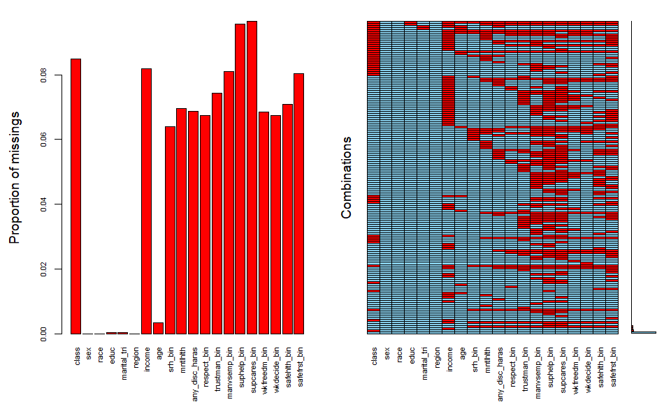
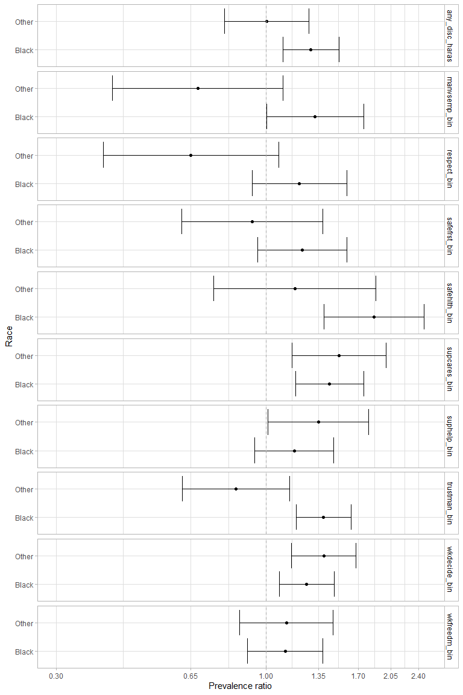
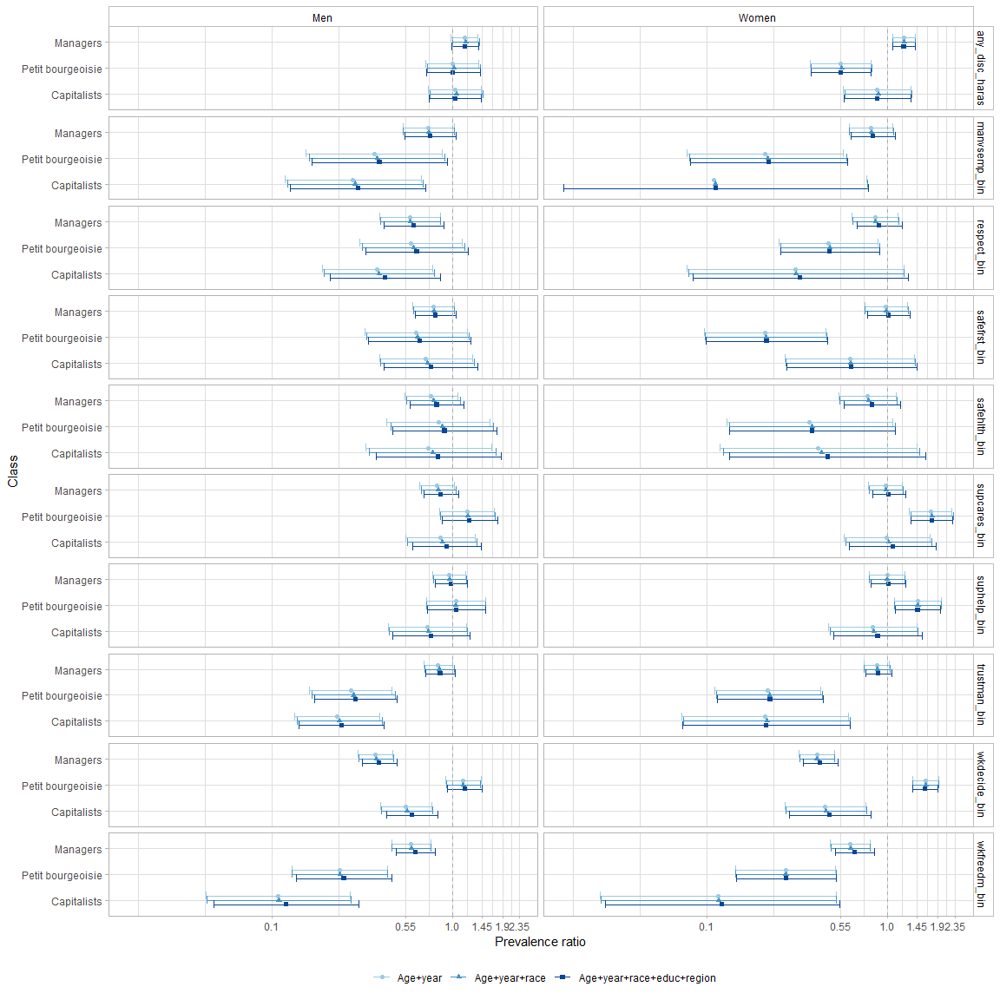
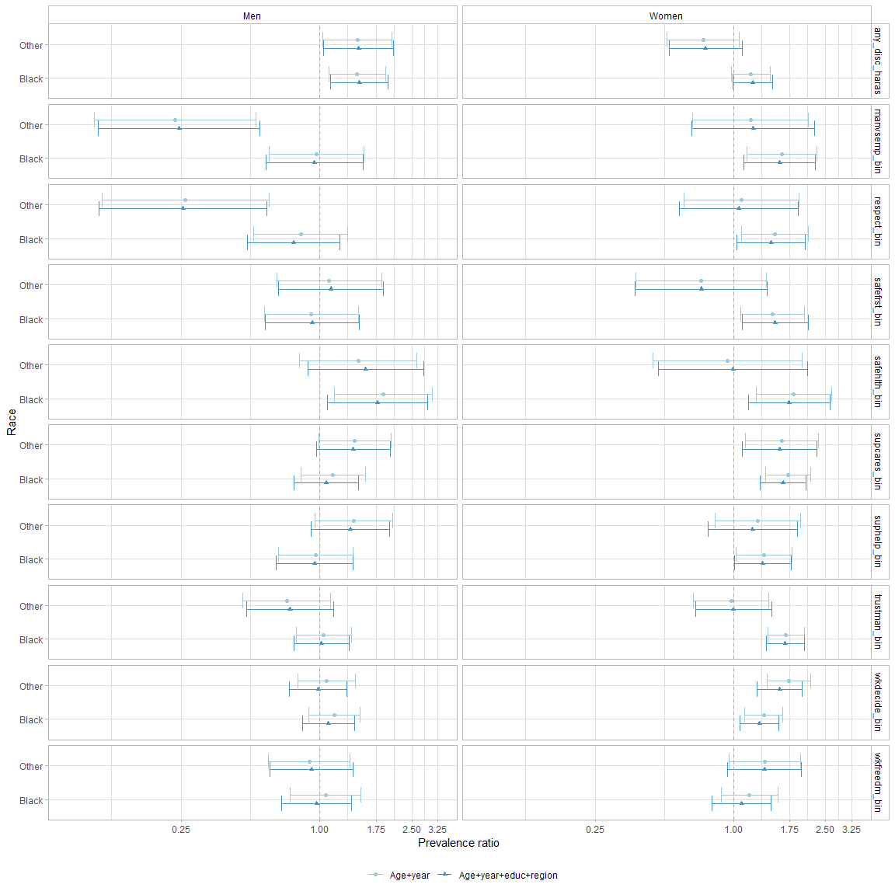

**General notes**

* Note that "mntlhlth" wasn't asked of ballot A in 2018.

* I made the QWL variables binary for the regression analyses for simplicity and stability.

* I remove analyses of the detailed class variable because cell sizes get pretty small (there are only 268 small capitalists and 215 large capitalists) and we already have a lot going on. 

**Codebook for non-self-explanatory variables**

* Class variables:
    + explained in IJHS (2020) paper

* Health variables:
    + srh_bin: poor/fair vs good/vgood/excellent self-rated health
    + depress: whether respondent has ever been diagnosed by a healthcare professional with depression
    + mntlhlth: days of poor mental health in past 30 days

* Relevant QWL variables, with most interesting variables (at least at first glance) bolded:
    + mustwork: Mandatory to work extra hours
    + chngtme: How often r allowed change schedule
    + famwkoff: How hard to take time off
    + wkvsfam: How often job interferes fam life
    + secondwk: R has job other than main
    + learnnew: Job requires r to learn new things
    + workfast: Job requires r to work fast
    + wrktime: R has enough time to get the job done
    + workdiff: R does numerous things on job
    + toofewwk: How often not enough staff
    + overwork: R has too much work to do well
    + myskills: Job allows r use of skills
    + trainops: R have the training opportunities
    + opdevel: Opportunity to develop my abilities
    + respect: R treated with respect at work
    + trustman: R trust management at work
    + manvsemp: Relations bw management and employees
    + suphelp: Supervisor helpful to r in getting job done
    + supcares: Supervisor concerned about welfare
    + wkfreedm: A lot of freedom to decide how to do job
    + lotofsay: R has lot of say in job
    + wkdecide: How often r take part in decisions
    + satjob1: 	Job satisfaction in general
    + fairearn: How fair is what r earn on the job
    + fringeok: Fringe benefits are good
    + rincblls: Income alone is enough
    + laidoff: R was laid off main job last year
    + jobsecok: The job security is good
    + any_disc_haras: Any discrimination or harassment on job (created by me from several more specific variables focused separately on racism, sexism, etc.)
    + safetywk: Worker safety priority at work
    + safehlth: Safety and health condition good at work
    + safefrst: No shortcuts on worker safety
    


# Missingness patterns

<!-- -->

# Survey-weighted, unimputed descriptives

## Demographics and health stratifed by class 

<table class="table table-striped table-condensed" style="margin-left: auto; margin-right: auto;">
<caption>Simple</caption>
 <thead>
  <tr>
   <th style="text-align:left;">   </th>
   <th style="text-align:left;"> Workers </th>
   <th style="text-align:left;"> Managers </th>
   <th style="text-align:left;"> Petit bourgeoisie </th>
   <th style="text-align:left;"> Capitalists </th>
  </tr>
 </thead>
<tbody>
  <tr>
   <td style="text-align:left;"> n </td>
   <td style="text-align:left;"> 4082.3 </td>
   <td style="text-align:left;"> 2253.3 </td>
   <td style="text-align:left;"> 579.9 </td>
   <td style="text-align:left;"> 451.8 </td>
  </tr>
  <tr>
   <td style="text-align:left;"> sex = female (%) </td>
   <td style="text-align:left;"> 2241.4 (54.9) </td>
   <td style="text-align:left;"> 1075.1 (47.7) </td>
   <td style="text-align:left;"> 283.4 (48.9) </td>
   <td style="text-align:left;"> 114.2 (25.3) </td>
  </tr>
  <tr>
   <td style="text-align:left;"> race (%) </td>
   <td style="text-align:left;">  </td>
   <td style="text-align:left;">  </td>
   <td style="text-align:left;">  </td>
   <td style="text-align:left;">  </td>
  </tr>
  <tr>
   <td style="text-align:left;"> white </td>
   <td style="text-align:left;"> 2920.1 (71.5) </td>
   <td style="text-align:left;"> 1714.5 (76.1) </td>
   <td style="text-align:left;"> 455.0 (78.5) </td>
   <td style="text-align:left;"> 376.6 (83.4) </td>
  </tr>
  <tr>
   <td style="text-align:left;"> black </td>
   <td style="text-align:left;"> 645.4 (15.8) </td>
   <td style="text-align:left;"> 275.3 (12.2) </td>
   <td style="text-align:left;"> 41.7 (7.2) </td>
   <td style="text-align:left;"> 27.7 (6.1) </td>
  </tr>
  <tr>
   <td style="text-align:left;"> other </td>
   <td style="text-align:left;"> 516.8 (12.7) </td>
   <td style="text-align:left;"> 263.5 (11.7) </td>
   <td style="text-align:left;"> 83.3 (14.4) </td>
   <td style="text-align:left;"> 47.5 (10.5) </td>
  </tr>
  <tr>
   <td style="text-align:left;"> educ (%) </td>
   <td style="text-align:left;">  </td>
   <td style="text-align:left;">  </td>
   <td style="text-align:left;">  </td>
   <td style="text-align:left;">  </td>
  </tr>
  <tr>
   <td style="text-align:left;"> &lt;HS </td>
   <td style="text-align:left;"> 432.6 (10.6) </td>
   <td style="text-align:left;"> 177.8 (7.9) </td>
   <td style="text-align:left;"> 75.0 (12.9) </td>
   <td style="text-align:left;"> 33.4 (7.4) </td>
  </tr>
  <tr>
   <td style="text-align:left;"> HS </td>
   <td style="text-align:left;"> 2225.1 (54.5) </td>
   <td style="text-align:left;"> 985.0 (43.7) </td>
   <td style="text-align:left;"> 274.9 (47.4) </td>
   <td style="text-align:left;"> 180.9 (40.0) </td>
  </tr>
  <tr>
   <td style="text-align:left;"> JuCo </td>
   <td style="text-align:left;"> 357.3 (8.8) </td>
   <td style="text-align:left;"> 234.4 (10.4) </td>
   <td style="text-align:left;"> 51.1 (8.8) </td>
   <td style="text-align:left;"> 33.3 (7.4) </td>
  </tr>
  <tr>
   <td style="text-align:left;"> College + </td>
   <td style="text-align:left;"> 1067.3 (26.1) </td>
   <td style="text-align:left;"> 856.0 (38.0) </td>
   <td style="text-align:left;"> 178.9 (30.9) </td>
   <td style="text-align:left;"> 204.2 (45.2) </td>
  </tr>
  <tr>
   <td style="text-align:left;"> marital_tri (%) </td>
   <td style="text-align:left;">  </td>
   <td style="text-align:left;">  </td>
   <td style="text-align:left;">  </td>
   <td style="text-align:left;">  </td>
  </tr>
  <tr>
   <td style="text-align:left;"> married </td>
   <td style="text-align:left;"> 2086.4 (51.1) </td>
   <td style="text-align:left;"> 1279.4 (56.8) </td>
   <td style="text-align:left;"> 355.9 (61.4) </td>
   <td style="text-align:left;"> 322.6 (71.4) </td>
  </tr>
  <tr>
   <td style="text-align:left;"> never married </td>
   <td style="text-align:left;"> 1273.3 (31.2) </td>
   <td style="text-align:left;"> 591.4 (26.2) </td>
   <td style="text-align:left;"> 107.0 (18.4) </td>
   <td style="text-align:left;"> 46.7 (10.3) </td>
  </tr>
  <tr>
   <td style="text-align:left;"> wid/div/sep </td>
   <td style="text-align:left;"> 722.6 (17.7) </td>
   <td style="text-align:left;"> 382.6 (17.0) </td>
   <td style="text-align:left;"> 117.0 (20.2) </td>
   <td style="text-align:left;"> 82.5 (18.3) </td>
  </tr>
  <tr>
   <td style="text-align:left;"> region (%) </td>
   <td style="text-align:left;">  </td>
   <td style="text-align:left;">  </td>
   <td style="text-align:left;">  </td>
   <td style="text-align:left;">  </td>
  </tr>
  <tr>
   <td style="text-align:left;"> Midwest </td>
   <td style="text-align:left;"> 976.4 (23.9) </td>
   <td style="text-align:left;"> 493.7 (21.9) </td>
   <td style="text-align:left;"> 106.4 (18.3) </td>
   <td style="text-align:left;"> 92.9 (20.6) </td>
  </tr>
  <tr>
   <td style="text-align:left;"> Northeast </td>
   <td style="text-align:left;"> 661.8 (16.2) </td>
   <td style="text-align:left;"> 420.8 (18.7) </td>
   <td style="text-align:left;"> 91.5 (15.8) </td>
   <td style="text-align:left;"> 66.9 (14.8) </td>
  </tr>
  <tr>
   <td style="text-align:left;"> South </td>
   <td style="text-align:left;"> 1611.6 (39.5) </td>
   <td style="text-align:left;"> 797.0 (35.4) </td>
   <td style="text-align:left;"> 217.7 (37.5) </td>
   <td style="text-align:left;"> 156.5 (34.6) </td>
  </tr>
  <tr>
   <td style="text-align:left;"> West </td>
   <td style="text-align:left;"> 832.5 (20.4) </td>
   <td style="text-align:left;"> 541.9 (24.0) </td>
   <td style="text-align:left;"> 164.3 (28.3) </td>
   <td style="text-align:left;"> 135.4 (30.0) </td>
  </tr>
  <tr>
   <td style="text-align:left;"> income (median [IQR]) </td>
   <td style="text-align:left;"> 63838.02 [35022.03, 102218.99] </td>
   <td style="text-align:left;"> 84330.67 [48492.05, 128628.24] </td>
   <td style="text-align:left;"> 63838.02 [32196.43, 122662.79] </td>
   <td style="text-align:left;"> 122662.79 [69361.24, 233597.37] </td>
  </tr>
  <tr>
   <td style="text-align:left;"> age (median [IQR]) </td>
   <td style="text-align:left;"> 40.00 [29.00, 51.00] </td>
   <td style="text-align:left;"> 41.00 [31.00, 51.00] </td>
   <td style="text-align:left;"> 50.00 [37.00, 58.00] </td>
   <td style="text-align:left;"> 50.00 [40.00, 57.00] </td>
  </tr>
  <tr>
   <td style="text-align:left;"> srh_bin = poor/fair (%) </td>
   <td style="text-align:left;"> 579.3 (15.2) </td>
   <td style="text-align:left;"> 271.1 (12.9) </td>
   <td style="text-align:left;"> 83.4 (15.6) </td>
   <td style="text-align:left;"> 43.4 (10.4) </td>
  </tr>
  <tr>
   <td style="text-align:left;"> mntlhlth (mean (SD)) </td>
   <td style="text-align:left;"> 3.55 (7.14) </td>
   <td style="text-align:left;"> 3.34 (6.83) </td>
   <td style="text-align:left;"> 2.55 (6.13) </td>
   <td style="text-align:left;"> 2.98 (6.99) </td>
  </tr>
</tbody>
</table>

## QWL variables stratified by class 

<table class="table table-striped table-condensed" style="margin-left: auto; margin-right: auto;">
<caption>Simple</caption>
 <thead>
  <tr>
   <th style="text-align:left;">   </th>
   <th style="text-align:left;"> Workers </th>
   <th style="text-align:left;"> Managers </th>
   <th style="text-align:left;"> Petit bourgeoisie </th>
   <th style="text-align:left;"> Capitalists </th>
  </tr>
 </thead>
<tbody>
  <tr>
   <td style="text-align:left;"> n </td>
   <td style="text-align:left;"> 4082.3 </td>
   <td style="text-align:left;"> 2253.3 </td>
   <td style="text-align:left;"> 579.9 </td>
   <td style="text-align:left;"> 451.8 </td>
  </tr>
  <tr>
   <td style="text-align:left;"> any_disc_haras = 1 (%) </td>
   <td style="text-align:left;"> 789.4 (20.8) </td>
   <td style="text-align:left;"> 499.3 (23.8) </td>
   <td style="text-align:left;"> 72.6 (13.8) </td>
   <td style="text-align:left;"> 67.9 (16.6) </td>
  </tr>
  <tr>
   <td style="text-align:left;"> respect_bin = 1 (%) </td>
   <td style="text-align:left;"> 334.9 (8.8) </td>
   <td style="text-align:left;"> 131.3 (6.2) </td>
   <td style="text-align:left;"> 22.4 (4.2) </td>
   <td style="text-align:left;"> 11.6 (2.8) </td>
  </tr>
  <tr>
   <td style="text-align:left;"> trustman_bin = 1 (%) </td>
   <td style="text-align:left;"> 833.9 (22.0) </td>
   <td style="text-align:left;"> 398.0 (19.0) </td>
   <td style="text-align:left;"> 26.4 (5.1) </td>
   <td style="text-align:left;"> 18.9 (4.7) </td>
  </tr>
  <tr>
   <td style="text-align:left;"> manvsemp_bin = 1 (%) </td>
   <td style="text-align:left;"> 318.6 (8.4) </td>
   <td style="text-align:left;"> 138.5 (6.6) </td>
   <td style="text-align:left;"> 10.2 (2.3) </td>
   <td style="text-align:left;"> 7.6 (1.9) </td>
  </tr>
  <tr>
   <td style="text-align:left;"> suphelp_bin = 1 (%) </td>
   <td style="text-align:left;"> 548.2 (14.5) </td>
   <td style="text-align:left;"> 302.3 (14.5) </td>
   <td style="text-align:left;"> 77.6 (18.1) </td>
   <td style="text-align:left;"> 36.9 (11.1) </td>
  </tr>
  <tr>
   <td style="text-align:left;"> supcares_bin = 1 (%) </td>
   <td style="text-align:left;"> 609.7 (16.2) </td>
   <td style="text-align:left;"> 297.0 (14.2) </td>
   <td style="text-align:left;"> 90.8 (21.6) </td>
   <td style="text-align:left;"> 45.0 (13.2) </td>
  </tr>
  <tr>
   <td style="text-align:left;"> wkfreedm_bin = 1 (%) </td>
   <td style="text-align:left;"> 613.8 (16.2) </td>
   <td style="text-align:left;"> 201.3 (9.6) </td>
   <td style="text-align:left;"> 19.5 (3.7) </td>
   <td style="text-align:left;"> 6.4 (1.6) </td>
  </tr>
  <tr>
   <td style="text-align:left;"> wkdecide_bin = 1 (%) </td>
   <td style="text-align:left;"> 1081.6 (28.5) </td>
   <td style="text-align:left;"> 231.1 (11.0) </td>
   <td style="text-align:left;"> 211.6 (40.2) </td>
   <td style="text-align:left;"> 62.7 (15.4) </td>
  </tr>
  <tr>
   <td style="text-align:left;"> safehlth_bin = 1 (%) </td>
   <td style="text-align:left;"> 258.2 (6.8) </td>
   <td style="text-align:left;"> 110.3 (5.2) </td>
   <td style="text-align:left;"> 19.7 (3.8) </td>
   <td style="text-align:left;"> 17.0 (4.2) </td>
  </tr>
  <tr>
   <td style="text-align:left;"> safefrst_bin = 1 (%) </td>
   <td style="text-align:left;"> 387.8 (10.3) </td>
   <td style="text-align:left;"> 188.7 (9.0) </td>
   <td style="text-align:left;"> 20.4 (4.1) </td>
   <td style="text-align:left;"> 27.0 (6.7) </td>
  </tr>
</tbody>
</table>

# Survey-weighted associations between QWL variables and class from Poisson regressions

Restricted to intrinsically relational variables with potentially interesting differences across classes or races

## Class and QWL 

Prevalence of bad category of each binary QWL variable among each class relative to the prevalence among workers w/ various levels of adjustment

### No gender interaction

<!-- -->

### Gender interaction

<!-- -->

## Race and QWL among workers

Prevalence of bad category of each binary QWL variable among Black or "other" workers relative to the prevalence among white workers w/ various levels of adjustment

### No gender interaction

<!-- -->

### Gender interaction

<!-- -->

# Appendix

## How many employees do PBs and capitalists typically identify as having? Note that the numemps variable wasn't asked in 2002, which is why we aren't using it for our primary analyses.


```
## # A tibble: 2 x 2
##   class             `round(mean(numemps, na.rm = T), 2)`
##   <fct>                                            <dbl>
## 1 Petit bourgeoisie                                 0.22
## 2 Capitalists                                       6.04
```
